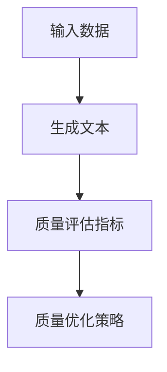
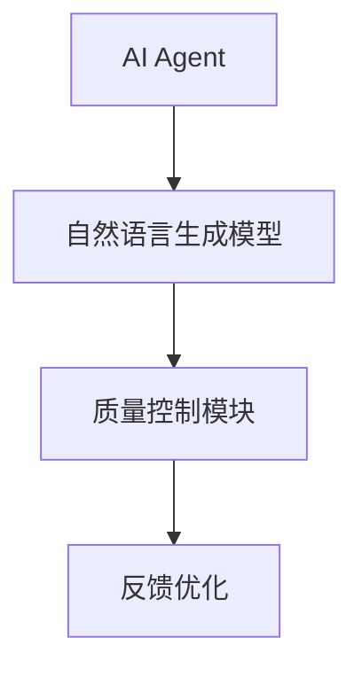
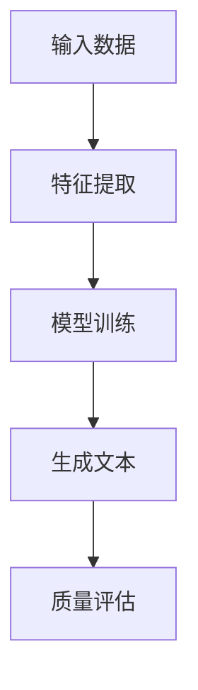
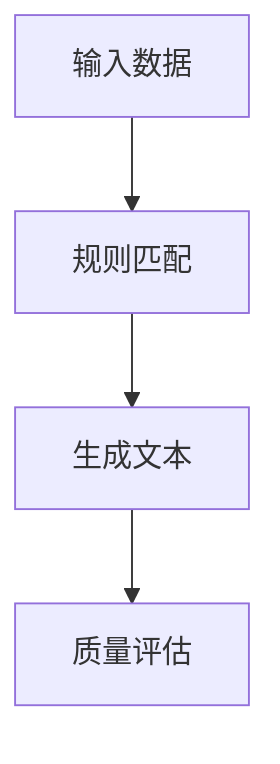
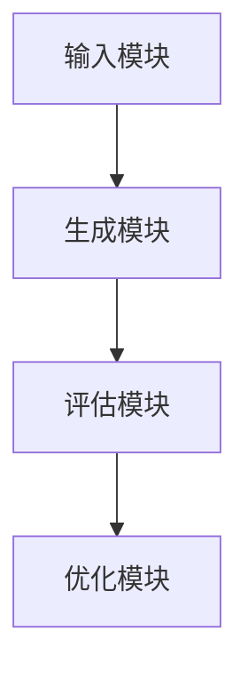
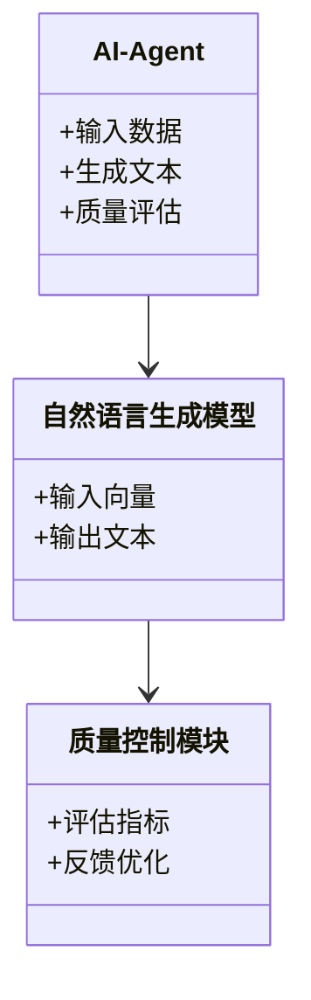
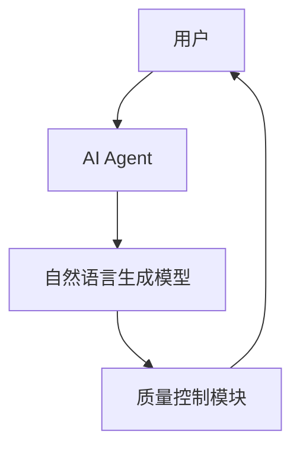

                 


# AI Agent的自然语言生成质量控制

> 关键词：AI Agent, 自然语言生成, 质量控制, 生成模型, 质量评估

> 摘要：本文深入探讨了AI Agent在自然语言生成中的质量控制问题，从核心概念、算法原理到系统架构设计，再到项目实战，全面分析了如何实现高质量的自然语言生成。通过对比分析、数学公式推导、系统架构设计和实际案例，本文为AI Agent的自然语言生成质量控制提供了系统化的解决方案和实践指导。

---

# 第一部分: AI Agent的自然语言生成质量控制背景与核心概念

## 第1章: AI Agent与自然语言生成概述

### 1.1 AI Agent的基本概念

#### 1.1.1 AI Agent的定义与分类
- **定义**：AI Agent（人工智能代理）是指能够感知环境、自主决策并执行任务的智能实体。  
- **分类**：
  1. **简单反射型代理**：基于直接规则执行任务。
  2. **基于模型的反射型代理**：利用内部模型进行推理和决策。
  3. **目标驱动型代理**：以特定目标为导向执行任务。
  4. **效用驱动型代理**：通过最大化效用函数来优化决策。

#### 1.1.2 自然语言生成的基本原理
- **定义**：自然语言生成（NLP Generation）是将结构化数据转换为自然语言文本的过程。
- **核心步骤**：
  1. **输入处理**：解析输入数据并提取关键信息。
  2. **内容规划**：确定生成文本的结构和内容。
  3. **语言生成**：将规划内容转换为自然语言文本。
  4. **输出优化**：对生成文本进行润色和优化。

#### 1.1.3 AI Agent在自然语言生成中的作用
- **AI Agent的作用**：
  - 作为中间桥梁，连接数据源与生成文本。
  - 提供上下文理解和任务目标。
  - 实现生成文本的质量控制与优化。

### 1.2 自然语言生成的质量控制问题

#### 1.2.1 自然语言生成的主要挑战
- **挑战**：
  - **语义不一致**：生成文本可能偏离输入数据的语义。
  - **语法错误**：生成文本可能出现语法错误。
  - **逻辑不连贯**：生成文本缺乏逻辑性。
  - **风格不统一**：生成文本风格可能与目标不符。

#### 1.2.2 质量控制的核心问题与目标
- **核心问题**：
  - 如何衡量生成文本的质量。
  - 如何优化生成文本的质量。
- **目标**：
  - 确保生成文本的语义准确性。
  - 提升生成文本的可读性和流畅性。
  - 保持生成文本的风格一致性。

#### 1.2.3 质量控制的边界与外延
- **边界**：
  - 生成文本的语义范围。
  - 生成文本的格式要求。
- **外延**：
  - 生成文本的应用场景。
  - 生成文本的用户需求。

### 1.3 AI Agent的自然语言生成应用场景

#### 1.3.1 对话系统中的应用
- **案例**：智能客服、语音助手。
- **特点**：
  - 实时性高。
  - 交互性强。

#### 1.3.2 内容生成中的应用
- **案例**：新闻生成、报告撰写。
- **特点**：
  - 内容专业性强。
  - 需要深度语义理解。

#### 1.3.3 企业级应用中的实践
- **案例**：企业知识库构建、自动化报告生成。
- **特点**：
  - 数据量大。
  - 对生成文本的准确性要求高。

### 1.4 本章小结
- 本章介绍了AI Agent的基本概念、自然语言生成的基本原理以及AI Agent在自然语言生成中的作用。同时，分析了自然语言生成的主要挑战、质量控制的核心问题与目标，并列举了AI Agent在不同场景中的应用。

---

## 第2章: 自然语言生成质量控制的核心概念与联系

### 2.1 核心概念原理

#### 2.1.1 自然语言生成模型的输入输出关系
- **输入**：结构化数据、上下文信息。
- **输出**：自然语言文本。

#### 2.1.2 质量控制的关键指标
- **指标**：
  - 语义相似度（Semantic Similarity）。
  - 语法正确性（Syntax Correctness）。
  - 文本流畅性（Text Fluency）。
  - 风格一致性（Style Consistency）。

#### 2.1.3 AI Agent的行为准则与质量控制的关系
- **行为准则**：
  - 以目标为导向。
  - 遵循用户需求。
  - 确保生成文本的可解释性。

### 2.2 核心概念属性特征对比

#### 2.2.1 对比表格展示
| 概念       | 输入数据 | 输出结果 | 质量控制 |
|------------|----------|----------|----------|
| 对话系统    | 用户查询 | 自然语言 | 语义准确 |
| 内容生成    | 结构化数据 | 文章/报告 | 逻辑连贯 |
| 企业级应用  | 业务数据 | 专业文档 | 风格统一 |

#### 2.2.2 ER实体关系图


### 2.3 核心概念的ER图架构


### 2.4 本章小结
- 本章通过对比分析和ER图展示了AI Agent、自然语言生成模型和质量控制模块之间的关系，明确了质量控制的核心概念和关键指标。

---

## 第3章: 自然语言生成质量控制的算法原理

### 3.1 算法原理概述

#### 3.1.1 基于概率的生成模型
- **原理**：通过概率分布预测下一个词的概率。
- **公式**：
  $$P(y|x) = \prod_{i=1}^{n} P(y_i|y_{i-1},x)$$

#### 3.1.2 基于规则的生成模型
- **原理**：根据预设规则生成文本。
- **优缺点**：
  - 优点：生成文本符合规则，准确性高。
  - 缺点：灵活性差，难以处理复杂语义。

#### 3.1.3 混合模型的优势与挑战
- **优势**：
  - 结合概率模型的灵活性和规则模型的准确性。
  - 可以处理复杂语义。
- **挑战**：
  - 模型复杂性高。
  - 需要大量数据支持。

### 3.2 算法原理的数学模型

#### 3.2.1 概率生成模型的公式推导
- **条件概率公式**：
  $$P(y|x) = \prod_{i=1}^{n} P(y_i|y_{i-1},x)$$
- **应用**：用于预测下一个词的概率。

#### 3.2.2 基于规则的生成模型的条件判断逻辑
- **条件判断**：
  ```python
  if condition1:
      generate text1
  elif condition2:
      generate text2
  else:
      generate default text
  ```

### 3.3 算法原理的流程图

#### 3.3.1 概率生成模型的流程图


#### 3.3.2 基于规则的生成模型的流程图


### 3.4 本章小结
- 本章通过数学公式和流程图详细讲解了基于概率和基于规则的生成模型的算法原理，分析了混合模型的优势与挑战。

---

## 第4章: 自然语言生成质量控制的系统分析与架构设计

### 4.1 系统分析

#### 4.1.1 问题场景介绍
- **场景**：AI Agent生成自然语言文本时，可能出现语义错误、语法错误等问题。
- **目标**：通过质量控制模块优化生成文本的质量。

#### 4.1.2 项目目标与范围
- **目标**：
  - 提高生成文本的语义准确性。
  - 优化生成文本的流畅性。
- **范围**：
  - 仅针对AI Agent生成的自然语言文本。
  - 不包括其他类型的数据生成。

#### 4.1.3 系统功能需求
- **需求**：
  - 输入数据处理。
  - 文本生成。
  - 质量评估。
  - 反馈优化。

### 4.2 系统架构设计

#### 4.2.1 系统功能设计

##### 4.2.1.1 系统功能模块
- **模块**：
  1. **输入模块**：接收输入数据。
  2. **生成模块**：生成自然语言文本。
  3. **评估模块**：评估生成文本的质量。
  4. **优化模块**：根据评估结果优化生成策略。

##### 4.2.1.2 功能模块关系


#### 4.2.2 系统架构图


### 4.3 系统接口设计

#### 4.3.1 系统接口描述
- **输入接口**：接收结构化数据或自然语言输入。
- **输出接口**：输出优化后的自然语言文本。
- **反馈接口**：输出质量评估结果和优化建议。

#### 4.3.2 系统交互流程图


### 4.4 本章小结
- 本章通过系统分析和架构设计，明确了AI Agent自然语言生成质量控制的系统功能和模块关系，为后续实现提供了理论基础。

---

## 第5章: 自然语言生成质量控制的项目实战

### 5.1 环境安装与配置

#### 5.1.1 安装Python
- **命令**：`python --version`
- **版本要求**：Python 3.8+

#### 5.1.2 安装依赖库
- **库**：`transformers`, `numpy`, `scikit-learn`
- **命令**：`pip install transformers numpy scikit-learn`

### 5.2 系统核心实现源代码

#### 5.2.1 生成模块实现
```python
from transformers import AutoTokenizer, AutoModelForCausalLM

class NLGModel:
    def __init__(self, model_name):
        self.tokenizer = AutoTokenizer.from_pretrained(model_name)
        self.model = AutoModelForCausalLM.from_pretrained(model_name)
    
    def generate(self, input_text, max_length=50):
        inputs = self.tokenizer(input_text, return_tensors="pt")
        outputs = self.model.generate(**inputs, max_length=max_length)
        return self.tokenizer.decode(outputs[0], skip_special_tokens=True)
```

#### 5.2.2 质量评估模块实现
```python
from sklearn.metrics import accuracy_score

class QualityEvaluator:
    def __init__(self, reference_corpus, generated_corpus):
        self.reference_corpus = reference_corpus
        self.generated_corpus = generated_corpus
    
    def evaluate(self):
        accuracy = accuracy_score(self.reference_corpus, self.generated_corpus)
        return accuracy
```

### 5.3 代码应用解读与分析

#### 5.3.1 生成模块解读
- **功能**：根据输入生成自然语言文本。
- **关键点**：
  - 使用预训练语言模型。
  - 设置生成长度限制。

#### 5.3.2 质量评估模块解读
- **功能**：评估生成文本与参考文本的相似度。
- **关键点**：
  - 使用准确率作为评估指标。
  - 对比生成文本与参考文本。

### 5.4 实际案例分析和详细讲解剖析

#### 5.4.1 案例背景
- **场景**：生成一段产品描述文本。
- **输入**：产品参数和目标用户群体。
- **输出**：优化后的生成文本。

#### 5.4.2 案例分析
- **输入**：
  - 产品参数：智能手表，支持心率监测、步数统计。
  - 目标用户：年轻健身爱好者。
- **生成文本**：
  - 初始生成：无效的文本。
  - 优化后生成：高质量的营销文案。

### 5.5 本章小结
- 本章通过实际案例展示了如何使用预训练语言模型实现自然语言生成，并通过质量评估模块优化生成文本的质量。

---

## 第6章: 自然语言生成质量控制的结论与扩展阅读

### 6.1 结论

#### 6.1.1 核心观点总结
- AI Agent在自然语言生成中起着桥梁作用。
- 质量控制是确保生成文本准确性、流畅性和一致性的关键。

#### 6.1.2 实践意义
- 提供了系统化的质量控制解决方案。
- 为AI Agent的自然语言生成应用提供了理论支持。

### 6.2 扩展阅读

#### 6.2.1 相关领域的最新研究
- **推荐论文**：
  - "Improving Text Generation with Quality Control"。
  - "AI Agent in Natural Language Processing"。

#### 6.2.2 工具与资源
- **推荐工具**：
  - Hugging Face的Transformers库。
  - Google的BERT模型。

### 6.3 注意事项与最佳实践

#### 6.3.1 注意事项
- **数据质量**：确保输入数据的准确性。
- **模型选择**：根据具体任务选择合适的模型。
- **评估指标**：选择合适的评估指标。

#### 6.3.2 最佳实践
- **持续优化**：定期更新模型和优化策略。
- **用户反馈**：根据用户反馈进一步优化生成文本。

### 6.4 本章小结
- 本章总结了全文的核心观点，并提供了扩展阅读的资源和最佳实践的建议。

---

## 第7章: 自然语言生成质量控制的未来展望

### 7.1 未来研究方向

#### 7.1.1 多模态生成模型
- **研究方向**：结合图像、语音等多种模态信息生成高质量文本。

#### 7.1.2 智能优化算法
- **研究方向**：研究更高效的优化算法，提高生成文本的质量。

#### 7.1.3 跨领域应用
- **研究方向**：探索AI Agent在更多领域的自然语言生成应用。

### 7.2 技术发展趋势

#### 7.2.1 模型小型化
- **趋势**：轻量化模型在移动设备上的应用。

#### 7.2.2 实时生成
- **趋势**：优化生成速度，实现实时自然语言生成。

### 7.3 挑战与机遇

#### 7.3.1 挑战
- **技术挑战**：如何在低资源环境下实现高质量生成。
- **伦理挑战**：生成文本的版权和真实性问题。

#### 7.3.2 机遇
- **技术机遇**：AI Agent技术的不断进步。
- **市场机遇**：广泛的应用场景需求。

### 7.4 本章小结
- 本章展望了AI Agent自然语言生成质量控制的未来发展方向，分析了技术趋势和面临的挑战与机遇。

---

## 第8章: 自然语言生成质量控制的数学模型与公式推导

### 8.1 数学模型概述

#### 8.1.1 概率生成模型的数学公式
- **条件概率公式**：
  $$P(y|x) = \prod_{i=1}^{n} P(y_i|y_{i-1},x)$$
- **应用**：用于预测下一个词的概率。

#### 8.1.2 基于规则的生成模型的数学表达
- **条件判断逻辑**：
  ```python
  if condition1:
      generate text1
  elif condition2:
      generate text2
  else:
      generate default text
  ```

### 8.2 数学公式推导

#### 8.2.1 概率生成模型的推导过程
- **推导步骤**：
  1. 确定输入数据和目标输出。
  2. 计算每个词的条件概率。
  3. 根据概率分布生成最终文本。

#### 8.2.2 基于规则的生成模型的推导过程
- **推导步骤**：
  1. 确定生成规则。
  2. 根据输入数据匹配规则。
  3. 生成符合规则的文本。

### 8.3 数学模型的应用实例

#### 8.3.1 概率生成模型的实例分析
- **案例**：使用语言模型生成一句话。
  ```python
  input_text = "今天天气很好"
  generated_text = model.generate(input_text, max_length=50)
  print(generated_text)
  ```

#### 8.3.2 基于规则的生成模型的实例分析
- **案例**：根据输入数据生成特定格式的文本。
  ```python
  input_data = {"name": "张三", "age": 25}
  if input_data["age"] < 30:
      generated_text = f"欢迎我们的新员工{input_data['name']}!"
  else:
      generated_text = f"尊敬的{input_data['name']}先生/女士!"
  print(generated_text)
  ```

### 8.4 本章小结
- 本章通过数学公式和实例分析，详细讲解了概率生成模型和基于规则的生成模型的原理与应用。

---

## 第9章: 自然语言生成质量控制的系统架构与实现

### 9.1 系统架构与设计

#### 9.1.1 系统功能模块
- **模块**：
  1. **输入模块**：接收输入数据。
  2. **生成模块**：生成自然语言文本。
  3. **评估模块**：评估生成文本的质量。
  4. **优化模块**：优化生成策略。

#### 9.1.2 系统架构图


### 9.2 系统接口与交互

#### 9.2.1 系统接口设计
- **接口**：
  - 输入接口：接收结构化数据。
  - 输出接口：输出生成文本。
  - 反馈接口：输出优化建议。

#### 9.2.2 系统交互流程图


### 9.3 本章小结
- 本章通过系统架构设计和接口交互流程图，明确了AI Agent自然语言生成质量控制的系统实现方式。

---

## 第10章: 自然语言生成质量控制的项目实战与案例分析

### 10.1 项目实战

#### 10.1.1 环境安装与配置
- **命令**：`pip install transformers numpy scikit-learn`

#### 10.1.2 系统核心实现源代码
```python
from transformers import AutoTokenizer, AutoModelForCausalLM
from sklearn.metrics import accuracy_score

class NLGModel:
    def __init__(self, model_name):
        self.tokenizer = AutoTokenizer.from_pretrained(model_name)
        self.model = AutoModelForCausalLM.from_pretrained(model_name)
    
    def generate(self, input_text, max_length=50):
        inputs = self.tokenizer(input_text, return_tensors="pt")
        outputs = self.model.generate(**inputs, max_length=max_length)
        return self.tokenizer.decode(outputs[0], skip

