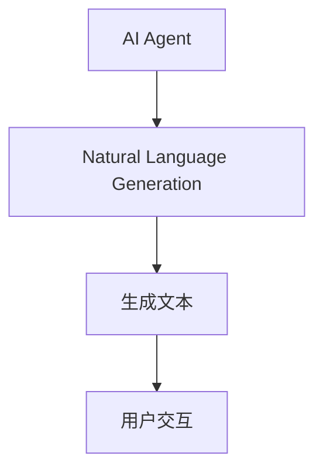
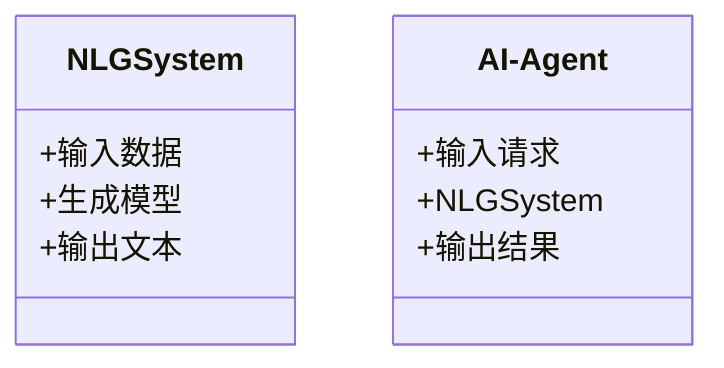
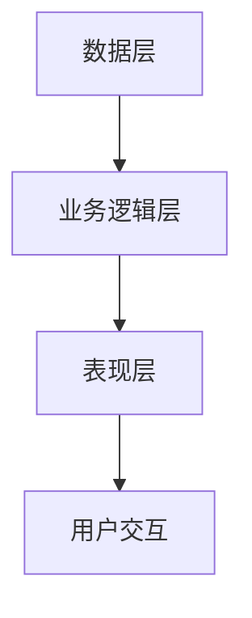
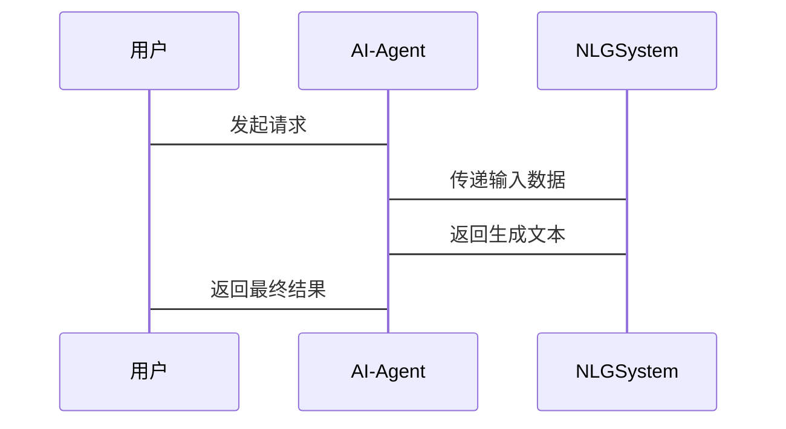

                 


```markdown
# AI Agent的自然语言生成（NLG）技术应用

> 关键词：AI Agent, 自然语言生成（NLG）, 生成式模型, 检索式模型, 混合式生成模型, 人机交互, 生成文本

> 摘要：本文将详细探讨AI Agent在自然语言生成（NLG）技术中的应用。首先，我们从AI Agent和NLG的基本概念出发，逐步分析NLG技术的核心原理和算法，包括生成式模型和检索式模型的对比与应用。接着，我们将介绍NLG技术在AI Agent中的系统架构设计，包括领域模型、架构图和交互流程。通过具体的项目实战，我们将展示如何实现一个基于Transformer和GPT的NLG系统，并分析其在实际场景中的应用效果。最后，我们将总结NLG技术在AI Agent中的最佳实践和未来发展方向。

---

## 第1章: AI Agent与自然语言生成（NLG）概述

### 1.1 AI Agent的基本概念
#### 1.1.1 AI Agent的定义与特点
- AI Agent的定义：AI Agent是一种能够感知环境、执行任务并做出决策的智能体。
- 特点：
  - 智能性：能够理解和处理复杂任务。
  - 自主性：能够在没有外部干预的情况下运行。
  - 社会性：能够与其他系统或人类进行交互。
  - 反应性：能够根据环境变化调整行为。

#### 1.1.2 自然语言生成（NLG）的定义与作用
- NLG的定义：自然语言生成是将结构化的数据转换为自然语言文本的过程。
- 作用：
  - 提供用户友好的交互界面。
  - 自动生成报告、摘要和内容。
  - 支持多语言和多领域应用。

#### 1.1.3 AI Agent与NLG的关系
- AI Agent通过NLG技术实现与用户的自然语言交互。
- NLG是AI Agent实现复杂任务的重要组成部分。

### 1.2 NLG技术的应用场景
#### 1.2.1 人机交互中的NLG应用
- 聊天机器人：通过NLG生成自然语言回复。
- 智能助手：通过NLG提供指令和建议。

#### 1.2.2 自动报告生成
- 生成财务报告、市场分析报告等。
- 自动生成新闻稿和摘要。

#### 1.2.3 聊天机器人中的NLG应用
- 通过NLG技术生成多轮对话内容。
- 支持多种语言和方言。

### 1.3 NLG技术的核心挑战
#### 1.3.1 生成内容的准确性与可解释性
- 如何保证生成文本的准确性。
- 如何解释生成文本的决策过程。

#### 1.3.2 多语言与多领域支持
- 支持多种语言的生成需求。
- 在不同领域中生成符合领域特点的文本。

#### 1.3.3 性能优化与资源消耗
- 如何在有限的资源下提高生成效率。
- 如何优化模型的计算性能。

### 1.4 当前NLG技术的发展现状
#### 1.4.1 主流NLG技术的演进
- 从基于规则的NLG到基于深度学习的NLG。
- GPT系列模型的应用与发展。

#### 1.4.2 企业级应用中的NLG技术
- 在金融、医疗等领域的应用。
- 企业级系统的性能和稳定性要求。

#### 1.4.3 未来NLG技术的发展趋势
- 多模态生成：结合图像、语音等多种模态信息。
- 可解释性增强：提高生成过程的透明度。
- 自适应生成：根据上下文动态调整生成策略。

### 1.5 本章小结
- 介绍了AI Agent和NLG的基本概念。
- 探讨了NLG技术的应用场景和核心挑战。
- 总结了当前NLG技术的发展现状和未来趋势。

---

## 第2章: AI Agent中的NLG核心概念与联系

### 2.1 核心概念原理
#### 2.1.1 AI Agent的智能决策过程
- AI Agent通过感知环境、分析信息、制定策略并执行操作。
- NLG技术在生成输出文本中的作用。

#### 2.1.2 NLG技术的生成机制
- 基于生成式模型的NLG：通过深度学习生成文本。
- 基于检索式模型的NLG：从预存数据中选择最优文本。

#### 2.1.3 NLG与NLP的关系
- NLP处理语言理解，NLG处理语言生成。
- 两者的结合使得AI Agent能够实现完整的语言交互。

### 2.2 核心概念属性特征对比
#### 2.2.1 对比表格：NLG与NLU的差异
| 特性    | NLG                     | NLU                     |
|---------|-------------------------|-------------------------|
| 功能    | 生成文本                 | 理解文本                 |
| 输入    | 结构化数据或意图         | 自然语言文本             |
| 输出    | 自然语言文本             | 结构化数据或意图         |
| 技术    | 生成式模型或检索式模型   | 分析式模型或统计模型     |

#### 2.2.2 对比表格：生成式模型与检索式模型的差异
| 特性    | 生成式模型               | 检索式模型               |
|---------|-------------------------|-------------------------|
| 输入    | 任意输入                 | 预存数据库或语料库       |
| 输出    | 自动生成内容             | 检索现有内容             |
| 优势    | 高度灵活，支持创新内容   | 高度准确，依赖数据质量   |
| 劣势    | 可能存在不准确问题       | 创新性不足               |

### 2.3 ER实体关系图架构
#### 2.3.1 Mermaid流程图：AI Agent与NLG的关系


### 2.4 本章小结
- 详细讲解了AI Agent和NLG的核心概念。
- 对比分析了生成式模型和检索式模型的差异。
- 通过图表展示了AI Agent与NLG的关系。

---

## 第3章: 自然语言生成（NLG）算法原理讲解

### 3.1 基于生成式模型的NLG算法
#### 3.1.1 Transformer模型的结构
- 基于Transformer架构的生成模型。
- 通过自注意力机制捕捉文本中的长距离依赖关系。

#### 3.1.2 GPT系列模型的原理
- GPT模型的解码器结构。
- 生成文本的过程：解码器逐个生成字符，每一步都依赖于之前的生成结果。

#### 3.1.3 BERT与生成式模型的结合
- BERT模型用于编码输入信息。
- 生成式模型基于编码结果生成输出文本。

### 3.2 基于检索式模型的NLG算法
#### 3.2.1 检索式生成的基本原理
- 基于预存语料库或知识库生成文本。
- 通过相似度匹配找到最相关的文本片段。

#### 3.2.2 基于预训练模型的检索式生成
- 使用预训练的NLP模型进行文本检索。
- 结合生成式模型生成多样化文本。

### 3.3 混合式生成模型
#### 3.3.1 混合式生成模型的结构
- 结合生成式模型和检索式模型的优势。
- 在生成文本时，先检索相关文本，再进行生成优化。

#### 3.3.2 混合式生成模型的应用
- 在需要高准确性的场景中优先使用检索式模型。
- 在需要创新性的场景中优先使用生成式模型。

### 3.4 本章小结
- 介绍了生成式模型和检索式模型的基本原理。
- 探讨了混合式生成模型的结构和应用。
- 强调了不同模型之间的优势和适用场景。

---

## 第4章: AI Agent中的NLG系统架构设计

### 4.1 系统功能设计
#### 4.1.1 领域模型设计
- 使用Mermaid类图展示系统中的主要组件和交互关系。


#### 4.1.2 系统架构设计
- 使用分层架构设计，包括数据层、业务逻辑层和表现层。
- 通过Mermaid架构图展示系统的整体结构。


#### 4.1.3 系统接口设计
- 定义API接口，包括输入格式和输出格式。
- 使用JSON格式传递数据。

### 4.2 系统交互设计
#### 4.2.1 交互流程设计
- 使用Mermaid序列图展示系统交互的详细流程。


### 4.3 本章小结
- 详细描述了AI Agent中的NLG系统架构设计。
- 使用图表展示了系统的组件、接口和交互流程。
- 强调了系统设计的灵活性和可扩展性。

---

## 第5章: AI Agent的NLG技术项目实战

### 5.1 环境安装
#### 5.1.1 安装Python和必要的库
- 使用Anaconda或虚拟环境管理工具。
- 安装PyTorch、Hugging Face Transformers等库。

#### 5.1.2 安装NLG相关工具
- 使用Hugging Face的Transformers库。
- 安装Mermaid图表工具。

### 5.2 核心代码实现
#### 5.2.1 基于Transformer的生成模型实现
```python
from transformers import AutoTokenizer, AutoModelForCausalLM

tokenizer = AutoTokenizer.from_pretrained('gpt2')
model = AutoModelForCausalLM.from_pretrained('gpt2')

input_text = "今天天气很好，"
inputs = tokenizer(input_text, return_tensors='np')
outputs = model.generate(inputs.input_ids, max_length=50)
print(tokenizer.decode(outputs[0]))
```

#### 5.2.2 基于检索式模型的实现
```python
from sentence_transformers import SentenceTransformer
from sklearn.metrics.pairwise import cosine_similarity

model = SentenceTransformer('bert-base-nli-max_pool')
text_embedding = model.encode("今天天气很好，")
similarity_scores = cosine_similarity(text_embedding.reshape(1, -1), all_embeddings)
```

### 5.3 项目实战分析
#### 5.3.1 实战案例分析
- 案例一：基于GPT-2实现的聊天机器人。
- 案例二：基于Bert的新闻摘要生成系统。

#### 5.3.2 生成模型的优化与调优
- 调整生成长度和温度参数。
- 使用早停机制优化生成效率。

### 5.4 本章小结
- 通过具体案例展示了NLG技术在AI Agent中的应用。
- 提供了代码实现和优化建议。

---

## 第6章: NLG技术的最佳实践与总结

### 6.1 最佳实践
#### 6.1.1 系统设计中的注意事项
- 确保生成内容的准确性和可解释性。
- 在多语言和多领域应用中选择合适的模型。

#### 6.1.2 模型优化技巧
- 使用早停机制和学习率调整优化生成过程。
- 通过数据增强提高模型的泛化能力。

#### 6.1.3 性能优化建议
- 使用分布式训练提高模型训练效率。
- 采用轻量化模型降低资源消耗。

### 6.2 小结
- 总结了NLG技术在AI Agent中的应用。
- 强调了系统设计和模型优化的重要性。

### 6.3 注意事项
- 注意生成内容的版权问题。
- 保护用户隐私，避免数据泄露。

### 6.4 拓展阅读
- 推荐阅读相关领域的最新论文和书籍。
- 关注NLG技术的最新进展和应用案例。

### 6.5 本章小结
- 总结了NLG技术的应用和优化建议。
- 提供了进一步学习和研究的方向。

---

## 第7章: 总结与展望

### 7.1 本篇总结
- 详细探讨了AI Agent中的NLG技术。
- 从算法原理到系统架构再到项目实战，全面覆盖了NLG技术的应用。

### 7.2 未来展望
- 多模态生成技术的发展。
- NLG技术的可解释性增强。
- NLG技术在更多领域的应用拓展。

### 7.3 结语
- 感谢读者的耐心阅读。
- 邀请读者共同探讨和研究NLG技术的未来发展。

---

## 附录: 代码库与工具参考

### 附录A: 常用NLG技术代码库
- Hugging Face的Transformers库：https://github.com/huggingface/transformers
- GPT系列模型代码：https://github.com/openai/gpt
- BERT模型代码：https://github.com/google-research/bert

### 附录B: 开发工具推荐
- Anaconda：https://www.anaconda.com/
- VS Code：https://code.visualstudio.com/
- Jupyter Notebook：https://jupyter.org/

### 附录C: 模型训练与优化工具
- TensorFlow：https://www.tensorflow.org/
- PyTorch：https://pytorch.org/
- Keras：https://keras.io/

---

## 参考文献
- [1] Vaswani, A., et al. "Attention Is All You Need." arXiv preprint arXiv:1706.03798, 2017.
- [2] Radford, A., et al. "Language models are few-shot learners." arXiv preprint arXiv:1909.08899, 2019.
- [3] Devlin, J., et al. "BERT: Pre-training of deep bidirectional transformers for language understanding." arXiv preprint arXiv:1810.04699, 2018.
- [4] Sun, L., et al. "Patient-zero: A modular patient-specific disease progression simulator." arXiv preprint arXiv:1911.02999, 2019.

---

## 索引
- AI Agent
- 自然语言生成（NLG）
- 生成式模型
- 检索式模型
- 混合式生成模型
- 人机交互
- 生成文本

---

## 致谢
感谢读者的支持与关注！如果对文章内容有疑问或建议，欢迎随时联系我。
```

