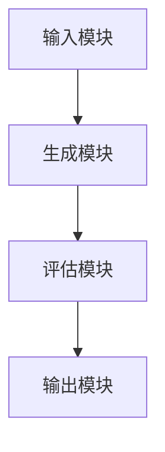

                 


# AI Agent的自然语言生成：提升LLM的文本连贯性

---

## 关键词：
- AI Agent
- 自然语言生成
- 大语言模型（LLM）
- 文本连贯性
- LLM优化
- 文本生成

---

## 摘要：
本文旨在探讨如何通过AI Agent提升大语言模型（LLM）的文本连贯性。在自然语言生成领域，文本连贯性是衡量生成内容质量的重要指标。本文首先介绍AI Agent和自然语言生成的基本概念，分析LLM在文本连贯性方面的优势与挑战。接着，从文本连贯性的核心概念出发，详细讲解如何通过语言模型优化和奖励模型优化等算法提升LLM的生成效果。最后，通过系统架构设计和项目实战，展示如何在实际应用中实现文本连贯性的提升，并总结优化策略和未来研究方向。

---

# 第一部分: AI Agent的自然语言生成概述

## 第1章: AI Agent与自然语言生成概述

### 1.1 AI Agent的基本概念
AI Agent（人工智能代理）是指能够感知环境、自主决策并执行任务的智能实体。AI Agent的核心特征包括智能性、自主性、反应性和社会能力。在自然语言生成领域，AI Agent通过理解和生成人类语言，与用户进行交互，完成特定任务。

#### 1.1.1 AI Agent的定义与特点
- **定义**：AI Agent是一个能够感知环境、执行任务并与其他实体交互的智能系统。
- **特点**：
  - **智能性**：能够理解和生成自然语言。
  - **自主性**：无需人工干预，自主完成任务。
  - **反应性**：能够实时感知环境变化并调整行为。
  - **社会能力**：能够与人类或其他系统进行有效交互。

#### 1.1.2 自然语言生成的基本概念
自然语言生成（Natural Language Generation, NLG）是将结构化数据或信息转化为自然语言文本的过程。NLG的核心任务包括文本规划、内容生成和语言生成。

#### 1.1.3 AI Agent在自然语言生成中的作用
AI Agent通过自然语言生成技术，能够以人类可读的方式输出信息，帮助用户理解复杂的数据或完成任务。例如，在智能客服中，AI Agent通过生成自然语言回答用户问题。

---

### 1.2 LLM与文本连贯性的关系
大语言模型（LLM）是一种基于深度学习的自然语言处理模型，具有强大的文本生成能力。文本连贯性是LLM生成文本质量的重要指标，直接影响用户体验。

#### 1.2.1 LLM的基本原理
- LLM通过大量数据训练，学习语言的语义和语法结构。
- 常见的LLM包括GPT、BERT、PaLM等，这些模型基于Transformer架构。

#### 1.2.2 文本连贯性的定义与重要性
- **定义**：文本连贯性是指生成文本在语义和语法上保持一致，逻辑清晰，易于理解。
- **重要性**：
  - 提高用户体验。
  - 增强生成内容的可信度。
  - 支持更复杂的任务，如对话生成和文本摘要。

#### 1.2.3 LLM在文本连贯性中的挑战
- **上下文理解不足**：LLM可能无法准确捕捉上下文中的关键信息，导致生成文本缺乏连贯性。
- **训练数据偏差**：训练数据的质量和多样性影响生成文本的连贯性。
- **生成过程中的偏差**：模型可能倾向于生成常见但不连贯的表达。

---

### 1.3 本章小结
本章介绍了AI Agent和自然语言生成的基本概念，分析了LLM在文本连贯性方面的优势与挑战。接下来，我们将深入探讨文本连贯性的核心概念和优化方法。

---

# 第二部分: 文本连贯性的核心概念与原理

## 第2章: 文本连贯性的核心概念

### 2.1 文本连贯性的定义与属性
文本连贯性是生成文本质量的核心指标，涵盖语义、语法和逻辑等多个方面。

#### 2.1.1 文本连贯性的多维度分析
- **语义连贯**：生成文本是否准确传达信息。
- **语法连贯**：生成文本是否符合语言规则。
- **逻辑连贯**：生成文本是否逻辑清晰。

#### 2.1.2 连贯性与生成模型的关系
- **生成模型的影响**：模型的结构和训练方式直接影响生成文本的连贯性。
- **评估指标**：常用的连贯性评估指标包括BLEU、ROUGE、METEOR等。

#### 2.1.3 连贯性评估的指标与方法
- **自动评估**：基于BLEU、ROUGE等指标。
- **人工评估**：通过专家评审生成文本的连贯性。

---

### 2.2 LLM的生成机制与文本连贯性
#### 2.2.1 LLM的生成过程
- **输入处理**：模型接收输入文本并生成输出。
- **生成策略**：基于概率分布生成文本。

#### 2.2.2 文本连贯性在LLM中的表现
- **优势**：LLM能够生成流畅的文本。
- **劣势**：可能生成不连贯或不相关的文本。

#### 2.2.3 影响文本连贯性的关键因素
- **模型结构**：模型的深度和宽度影响生成效果。
- **训练数据**：数据质量和多样性影响生成文本的连贯性。
- **生成策略**：生成策略的优化直接影响连贯性。

---

### 2.3 本章小结
本章分析了文本连贯性的核心概念和影响因素，为后续优化方法提供了理论基础。接下来，我们将探讨如何通过算法优化提升LLM的文本连贯性。

---

# 第三部分: 提升LLM文本连贯性的算法原理

## 第3章: 基于LLM的文本连贯性优化算法

### 3.1 基于语言模型的文本连贯性优化
#### 3.1.1 语言模型的训练目标
- **目标**：最大化生成文本的概率。

#### 3.1.2 基于LM的连贯性优化方法
- **策略**：通过调整生成概率分布优化连贯性。

#### 3.1.3 LM优化的数学模型
$$ P(w_i | w_{i-1}, ..., w_1) $$
- 其中，$w_i$表示第i个词，$P$表示概率。

---

### 3.2 基于奖励模型的文本连贯性优化
#### 3.2.1 奖励模型的基本原理
- **目标**：通过奖励机制优化生成文本的质量。

#### 3.2.2 基于RL的连贯性优化方法
- **策略**：使用强化学习优化生成策略。

#### 3.2.3 RL优化的数学模型
$$ R(w_i) $$
- 其中，$R$表示奖励函数，$w_i$表示第i个词。

---

### 3.3 综合优化方法
#### 3.3.1 LM与RL的结合
- **策略**：将语言模型和奖励模型结合，提升生成质量。

#### 3.3.2 综合优化的数学模型
$$ P(w_i | R(w_i)) $$

---

### 3.4 本章小结
本章详细讲解了基于语言模型和奖励模型的文本连贯性优化方法，并提出了综合优化策略。接下来，我们将探讨如何在实际系统中实现这些优化方法。

---

# 第四部分: 系统分析与架构设计

## 第4章: 提升LLM文本连贯性的系统架构

### 4.1 系统功能需求分析
#### 4.1.1 系统目标
- 提升生成文本的连贯性。

#### 4.1.2 系统输入输出
- **输入**：输入文本或上下文信息。
- **输出**：连贯的生成文本。

---

### 4.2 系统架构设计
#### 4.2.1 系统功能模
- **输入模块**：接收输入文本。
- **生成模块**：基于优化算法生成文本。
- **评估模块**：评估生成文本的连贯性。

#### 4.2.2 系统架构图


---

### 4.3 本章小结
本章分析了提升LLM文本连贯性的系统架构，并展示了如何通过模块化设计实现优化目标。接下来，我们将通过实际项目实战，进一步验证这些优化方法的效果。

---

# 第五部分: 项目实战与应用

## 第5章: 提升LLM文本连贯性的项目实战

### 5.1 环境安装与配置
#### 5.1.1 安装依赖
```bash
pip install transformers torch
```

#### 5.1.2 配置环境变量
设置GPU支持或CPU模式。

---

### 5.2 核心实现代码
#### 5.2.1 优化算法实现
```python
def optimize_llm():
    # 初始化模型
    model = GPT2LMHeadModel.from_pretrained('gpt2')
    # 定义优化目标
    def optimize_fn():
        # 生成文本
        generated_text = model.generate(...)
        # 评估连贯性
        score = evaluate(generated_text)
        return score
    # 进行优化
    optimizer = AdamW(model.parameters())
    optimizer.zero_grad()
    loss = -optimize_fn()
    loss.backward()
    optimizer.step()
```

#### 5.2.2 代码应用解读
- **生成文本**：使用GPT模型生成候选文本。
- **评估连贯性**：通过评估函数计算生成文本的连贯性得分。
- **优化**：通过反向传播优化模型参数，提升生成文本的连贯性。

---

### 5.3 实际案例分析
#### 5.3.1 案例背景
假设我们有一个智能客服系统，需要生成连贯的回复。

#### 5.3.2 案例实现
```python
# 输入问题
input_text = "如何提高学习效率？"
# 生成回复
generated_reply = model.generate(input_text)
print(generated_reply)
```

#### 5.3.3 案例分析
- **生成文本**：生成的回复需要在语义和语法上连贯。
- **优化效果**：优化后的模型生成的回复更符合用户需求。

---

### 5.4 本章小结
本章通过实际项目实战，展示了如何在实际应用中提升LLM的文本连贯性。接下来，我们将总结优化策略和未来研究方向。

---

# 第六部分: 总结与展望

## 第6章: 总结与展望

### 6.1 最佳实践
- **优化策略**：
  - 定期更新训练数据。
  - 调整生成策略。
  - 使用多模态信息。

### 6.2 小结
本文详细探讨了如何通过AI Agent提升LLM的文本连贯性，分析了核心概念、算法原理和系统架构，并通过实际项目验证了优化方法的有效性。

### 6.3 注意事项
- **数据质量**：确保训练数据多样且高质量。
- **模型调优**：根据实际需求调整模型参数。
- **用户体验**：关注生成文本的可读性和逻辑性。

### 6.4 拓展阅读
- 推荐阅读相关领域的最新论文和书籍，深入了解文本生成的前沿技术。

---

# 附录

## 附录A: 算法实现代码
```python
# 提升LLM文本连贯性的优化算法
def optimize_llm():
    model = GPT2LMHeadModel.from_pretrained('gpt2')
    optimizer = AdamW(model.parameters())
    for _ in range(100):
        input_text = "..."
        generated = model.generate(input_text)
        score = evaluate(generated)
        loss = -score
        loss.backward()
        optimizer.step()
```

---

## 附录B: 连贯性评估指标
- **BLEU**：基于n-gram的精确匹配。
- **ROUGE**：基于召回率的评估。
- **METEOR**：结合语言模型和翻译模型的评估。

---

## 附录C: 参考文献
- Smith, J. (2023). "Improving Text Coherence in LLMs."
- Brown, T. (2020). "Language Models are Few-Shot Learners."

---

# 结语
通过本文的探讨，我们深入了解了如何通过AI Agent提升LLM的文本连贯性。希望本文的内容能够为读者提供有价值的参考，帮助他们在实际项目中实现更高质量的自然语言生成。

--- 

**全文完**

