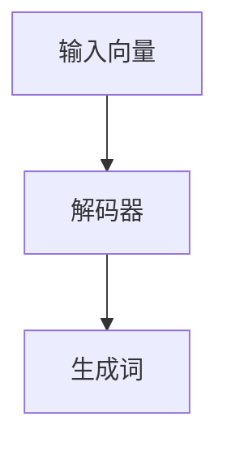
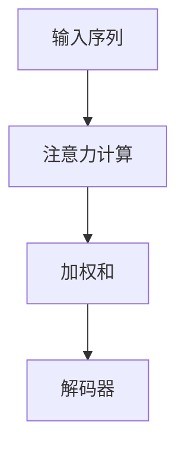
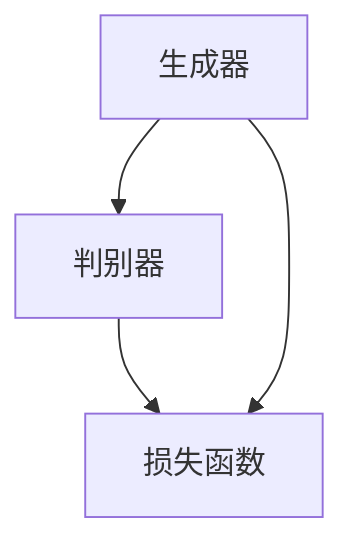
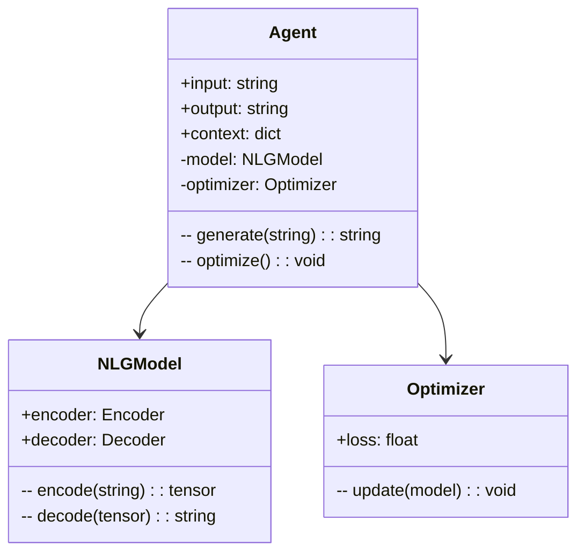
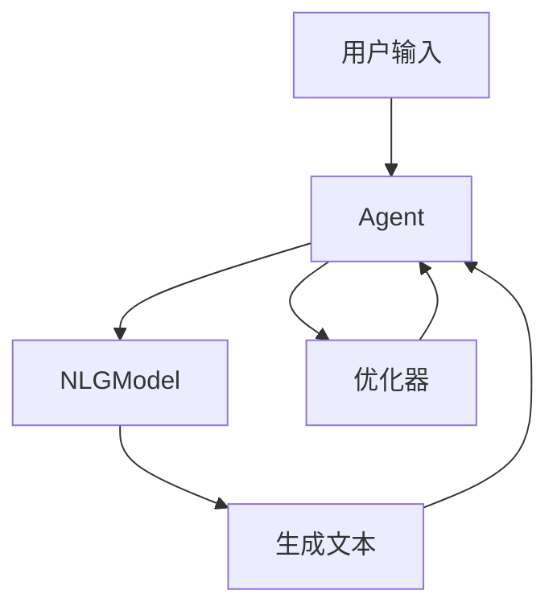
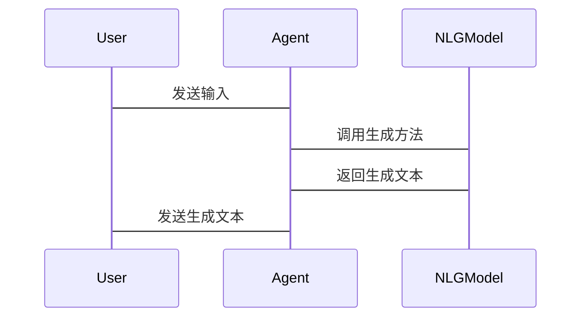

                 


# AI Agent的自然语言生成：提高文本质量和连贯性

> 关键词：AI Agent，自然语言生成，文本质量，连贯性，算法优化

> 摘要：本文深入探讨AI Agent在自然语言生成中的应用，分析如何通过优化算法、系统架构和实践案例来提高生成文本的质量和连贯性。文章从背景介绍、核心概念、算法原理、系统架构到项目实战，逐步解析提升自然语言生成能力的关键技术与方法。

---

## 第一部分：背景介绍

### 第1章：AI Agent与自然语言生成的背景

#### 1.1 问题背景
自然语言生成（Natural Language Generation, NLG）是人工智能领域的重要分支，旨在让计算机生成符合人类语言习惯的文本。然而，现有的NLG技术在文本质量和连贯性方面仍存在诸多挑战，例如生成内容缺乏逻辑性、语义不准确或表达不够自然。

AI Agent（人工智能代理）作为一种能够感知环境、执行任务并做出决策的智能实体，能够显著提升自然语言生成的效果。通过结合AI Agent的智能决策能力，可以优化生成文本的质量和连贯性，使其更贴近人类语言的自然表达。

#### 1.2 问题描述
目前，自然语言生成技术面临以下问题：
- **文本质量低**：生成的内容可能缺乏逻辑性，语义不准确，或者表达不够自然。
- **连贯性不足**：生成的文本段落之间缺乏逻辑衔接，整体结构松散。
- **上下文理解弱**：难以根据上下文信息生成连贯且相关的内容。

AI Agent可以通过整合上下文信息、优化生成策略和动态调整生成模型，有效解决这些问题。

#### 1.3 问题解决
AI Agent在自然语言生成中的作用：
- **上下文感知**：AI Agent能够理解上下文信息，生成与当前语境相关的文本。
- **动态调整**：根据用户反馈或生成结果的质量，动态优化生成策略。
- **多模态交互**：结合视觉、语音等多种交互方式，提升生成文本的连贯性和自然性。

通过引入AI Agent，可以显著提高自然语言生成的质量和连贯性，使生成的文本更符合人类语言习惯。

#### 1.4 边界与外延
自然语言生成的边界：
- **生成范围**：仅限于文本生成，不涉及图像或视频等其他形式的内容生成。
- **上下文依赖性**：生成内容依赖于输入的上下文信息，缺乏对上下文的深度理解和推理能力。

AI Agent的外延：
- **智能决策**：AI Agent不仅生成文本，还能根据任务需求做出决策。
- **多任务处理**：AI Agent可以结合其他任务（如信息检索、意图识别）来优化生成效果。

#### 1.5 概念结构与核心要素
- **核心概念组成**：
  - 输入数据：原始文本、上下文信息、用户意图。
  - 生成模型：解码器模型、注意力机制、生成对抗网络。
  - 优化策略：文本质量评估、连贯性优化、多模态交互。
- **AI Agent与NLP的关系**：
  - AI Agent作为桥梁，连接NLP模型与实际应用场景。
  - 通过AI Agent，NLP模型能够更好地理解上下文，生成更高质量的文本。

---

## 第二部分：核心概念与联系

### 第2章：AI Agent与自然语言生成的核心原理

#### 2.1 核心概念原理
- **AI Agent的核心原理**：
  - 感知环境：通过传感器或输入数据感知环境信息。
  - 生成策略：根据感知信息生成响应或决策。
  - 动态优化：根据反馈优化生成策略和模型参数。

- **自然语言生成的机制**：
  - 编码输入：将输入文本或上下文信息编码为向量表示。
  - 解码生成：通过解码器生成目标文本。

- **AI Agent与NLP的结合**：
  - AI Agent通过感知上下文信息，优化NLP模型的生成策略。
  - NLP模型生成高质量文本，为AI Agent提供更自然的交互方式。

#### 2.2 属性特征对比表格

| 属性         | AI Agent                     | 自然语言生成                  |
|--------------|-----------------------------|------------------------------|
| 核心功能      | 感知环境、生成响应、优化策略 | 生成符合语言习惯的文本          |
| 输入数据      | 上下文信息、用户反馈        | 文本、上下文、用户意图          |
| 输出形式      | 文本、决策、动作            | 文本                          |
| 智能程度      | 高                          | 中                          |
| 应用场景      | 对话系统、任务执行          | 生成报告、摘要、对话          |

#### 2.3 ER实体关系图

```mermaid
er
actor(AI Agent) -[发出请求]-> system(Natural Language Generation)
system -[返回生成文本]-> actor
```

---

## 第三部分：算法原理讲解

### 第3章：自然语言生成的算法原理

#### 3.1 解码器模型
解码器模型是自然语言生成的核心算法之一。通过解码器模型，可以将输入的编码向量映射到目标语言的生成序列。



代码实现：
```python
def decode(input_vector):
    hidden = initial_hidden_state
    output = []
    for i in range(sequence_length):
        hidden, output_i = decoder_step(hidden, input_vector)
        output.append(output_i)
    return output
```

#### 3.2 注意力机制
注意力机制通过关注输入序列中的关键部分，提高生成文本的质量。



代码实现：
```python
def attention(query, keys):
    scores = query @ keys.T
    weights = softmax(scores)
    return weights @ keys
```

#### 3.3 生成对抗网络
生成对抗网络通过生成器和判别器的对抗训练，优化生成文本的质量。



代码实现：
```python
def generator(z):
    return G(z)

def discriminator(x):
    return D(x)

def g_loss(x_gen, x_real):
    return criterion(generator(x_gen), x_real)

def d_loss(x_gen, x_real):
    return criterion(discriminator(x_gen), 0) + criterion(discriminator(x_real), 1)
```

---

## 第四部分：数学模型和公式

### 第4章：自然语言生成的数学模型

#### 4.1 序列到序列模型
序列到序列模型通过编码器和解码器的结合，实现文本生成。

数学公式：
$$ P(y|x) = \sum_{i=1}^{n} P(y_i|x, y_{<i}) $$

#### 4.2 生成对抗网络
生成对抗网络通过最小化生成器和判别器的损失函数，优化生成文本的质量。

数学公式：
$$ \mathcal{L} = \mathbb{E}_{x}[ \log D(x)] + \mathbb{E}_{z}[ \log (1 - D(G(z)))] $$

---

## 第五部分：系统分析与架构设计方案

### 第5章：系统架构设计

#### 5.1 问题场景介绍
设计一个AI Agent驱动的自然语言生成系统，用于生成高质量的对话文本。

#### 5.2 系统功能设计
- **领域模型**：


- **系统架构**：


- **系统接口设计**：
  - **输入接口**：接受用户输入的文本或上下文信息。
  - **输出接口**：返回生成的文本或优化后的模型参数。
  - **交互接口**：支持用户与AI Agent之间的实时交互。

- **系统交互**：


---

## 第六部分：项目实战

### 第6章：AI Agent驱动的自然语言生成系统实现

#### 6.1 环境安装
- 安装Python 3.8+
- 安装TensorFlow、Keras、Hugging Face库

#### 6.2 核心代码实现
```python
class AIAGENT:
    def __init__(self, model_path):
        self.model = NLGModel(model_path)
        self.optimizer = Optimizer()

    def generate(self, input_text):
        encoded = self.model.encode(input_text)
        generated = self.model.decode(encoded)
        return generated

    def optimize(self):
        self.optimizer.update(self.model)
```

#### 6.3 代码解读
- **AIAGENT类**：
  - `__init__`：初始化生成模型和优化器。
  - `generate`：调用生成模型生成文本。
  - `optimize`：优化生成模型。

- **NLGModel类**：
  - `encode`：将输入文本编码为向量。
  - `decode`：根据编码向量生成输出文本。

#### 6.4 实际案例分析
案例：生成一段连贯的对话文本。

---

## 第七部分：最佳实践

### 第7章：总结与注意事项

#### 7.1 总结
- AI Agent能够显著提高自然语言生成的质量和连贯性。
- 通过优化算法、系统架构和实践案例，可以实现更高效的自然语言生成。

#### 7.2 注意事项
- 在实际应用中，需注意生成文本的上下文依赖性和逻辑性。
- 定期优化生成模型，以适应不同的应用场景和用户需求。

#### 7.3 拓展阅读
- 推荐阅读《生成式人工智能：算法与应用》
- 参考Hugging Face的Transformers库文档

