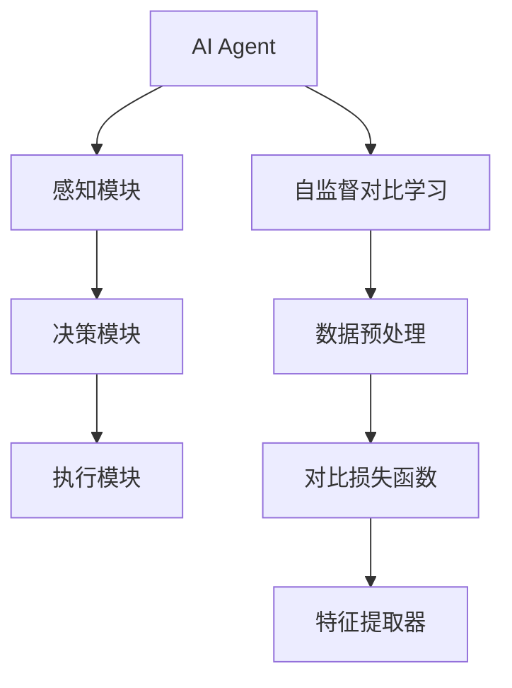
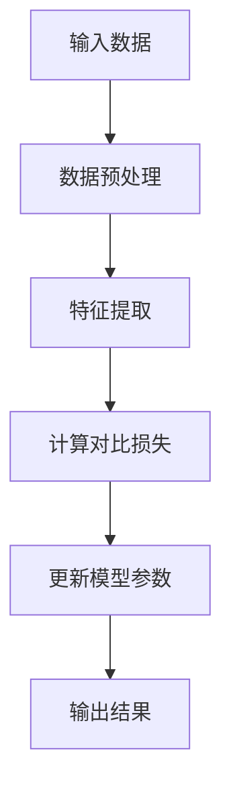
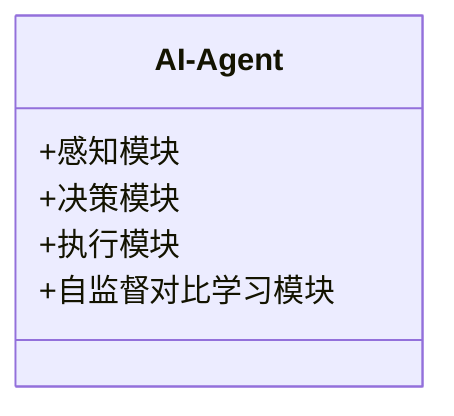
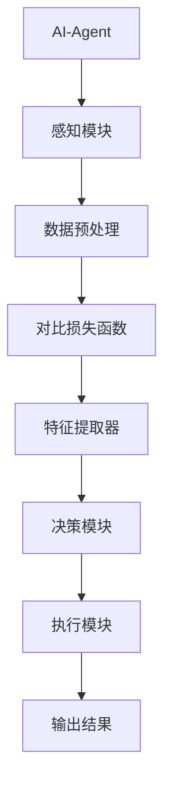
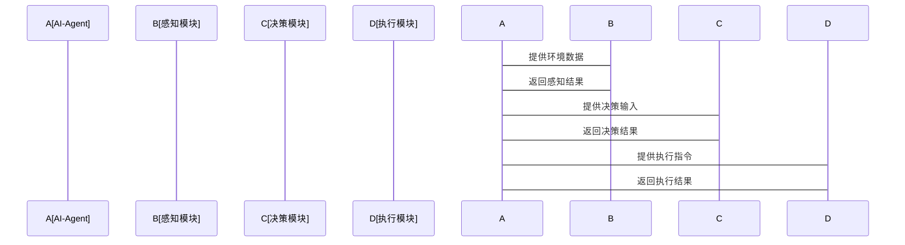

                 


```markdown
# AI Agent的自监督对比学习技术

> 关键词：AI Agent，自监督学习，对比学习，机器学习，深度学习

> 摘要：本文详细探讨了AI Agent在自监督对比学习技术中的应用，从理论基础到算法实现，再到实际应用场景，全面解析了如何利用对比学习提升AI Agent的智能性和适应性。文章结合了丰富的技术细节和实际案例，为读者提供了一套完整的解决方案。

---

# 第一部分: AI Agent的自监督对比学习技术概述

## 第1章: AI Agent与自监督对比学习的背景介绍

### 1.1 问题背景
#### 1.1.1 AI Agent的定义与特点
AI Agent是一种能够感知环境、自主决策并执行任务的智能实体，具备以下特点：
- **自主性**：能够在没有外部干预的情况下独立运行。
- **反应性**：能够实时感知环境并做出响应。
- **学习能力**：通过与环境交互不断优化自身行为。

#### 1.1.2 自监督学习的定义与特点
自监督学习是一种机器学习范式，通过利用数据本身的结构信息进行学习，特点包括：
- **无监督性**：不需要标注数据，仅利用数据本身的特性。
- **对比性**：通过对比不同数据样本或同一数据的不同表示来学习特征。

#### 1.1.3 对比学习的定义与特点
对比学习是一种自监督学习技术，通过最大化正样本对的相似性来学习特征表示，特点包括：
- **样本对齐**：通过对比正样本对和负样本对来优化特征表示。
- **无监督特征学习**：无需标注数据，直接从数据中提取特征。

### 1.2 问题描述
#### 1.2.1 AI Agent在实际应用中的挑战
- **数据稀缺性**：在实际应用中，标注数据往往有限，难以训练复杂的模型。
- **动态环境适应**：AI Agent需要在不断变化的环境中快速适应和调整策略。
- **计算效率**：实时决策需要高效的计算能力，避免高延迟。

#### 1.2.2 自监督对比学习在AI Agent中的作用
- **降低数据依赖**：通过自监督学习，减少对标注数据的依赖。
- **提升特征表达能力**：对比学习能够提取更丰富的特征，增强AI Agent的感知能力。
- **加速训练**：通过无监督学习，减少对大量标注数据的需求，加快训练速度。

#### 1.2.3 当前技术的局限性与改进方向
- **计算效率问题**：对比学习通常需要大量计算资源，如何在AI Agent中实现高效训练是一个挑战。
- **动态环境适应性**：如何让AI Agent在动态环境中持续利用对比学习优化自身行为是一个待解决的问题。

### 1.3 问题解决
#### 1.3.1 自监督对比学习如何解决AI Agent的问题
- **通过自监督学习减少标注数据需求**：AI Agent可以在无标注数据的情况下，通过对比学习提取特征，解决数据稀缺性问题。
- **通过对比学习提升特征表达能力**：对比学习能够提取更丰富的特征，增强AI Agent的感知和决策能力。

#### 1.3.2 AI Agent如何利用对比学习提升智能性
- **实时感知与决策**：通过对比学习，AI Agent能够快速感知环境并做出最优决策。
- **自适应学习**：AI Agent可以在动态环境中通过对比学习不断优化自身行为，适应新的环境变化。

#### 1.3.3 对比学习在AI Agent中的具体应用场景
- **智能客服系统**：通过对比学习，AI Agent可以更好地理解用户需求，提供更精准的服务。
- **推荐系统**：通过对比学习，AI Agent可以根据用户行为推荐更相关的商品或内容。

### 1.4 边界与外延
#### 1.4.1 AI Agent的边界定义
AI Agent的边界主要体现在以下几个方面：
- **自主性**：AI Agent需要具备独立决策的能力，但其决策范围受到设计目标的限制。
- **感知能力**：AI Agent的感知能力受限于其传感器和数据输入的类型和数量。
- **计算能力**：AI Agent的性能受限于其计算资源和算法复杂度。

#### 1.4.2 自监督对比学习的边界定义
自监督对比学习的边界包括：
- **数据类型**：适用于结构化数据、图像数据、文本数据等多种类型。
- **应用场景**：适用于需要无监督或弱监督学习的场景，如图像分类、自然语言处理等。
- **计算资源**：对计算资源有一定的要求，尤其是训练阶段需要较大的计算能力。

#### 1.4.3 两者的结合与外延
- **结合方式**：AI Agent通过自监督对比学习技术，提升自身的感知和决策能力。
- **外延方向**：未来可以通过结合强化学习、生成对抗网络等技术，进一步提升AI Agent的智能性和适应性。

### 1.5 概念结构与核心要素组成
#### 1.5.1 AI Agent的核心要素
- **感知模块**：负责收集环境信息。
- **决策模块**：根据感知信息做出决策。
- **执行模块**：执行决策操作并返回结果。

#### 1.5.2 自监督对比学习的核心要素
- **数据预处理**：对数据进行增强和标准化处理。
- **对比损失函数**：衡量正样本对和负样本对的相似性。
- **特征提取器**：提取数据的特征表示。

#### 1.5.3 两者的结合方式与核心组成
- **结合方式**：AI Agent通过自监督对比学习技术，优化其感知模块和决策模块。
- **核心组成**：AI Agent的核心算法与自监督对比学习的算法模块相结合，形成一个完整的智能系统。

---

## 第2章: 自监督对比学习的核心概念与联系

### 2.1 自监督对比学习的原理
#### 2.1.1 数据预处理与增强
- 数据预处理包括归一化、标准化等操作。
- 数据增强包括旋转、翻转、裁剪等操作，用于增加数据多样性。

#### 2.1.2 对比损失函数
- 对比损失函数用于衡量正样本对和负样本对的相似性。
- 常用的对比损失函数包括NT-Xent损失和ArcFace损失。

#### 2.1.3 特征提取器的设计
- 特征提取器通常采用深度神经网络，如ResNet、BERT等模型。
- 特征提取器的设计目标是提取具有判别性的特征。

### 2.2 核心概念对比分析
#### 2.2.1 不同对比学习方法的对比表格
| 方法          | 对比损失函数      | 数据增强方式      | 特征提取器          |
|---------------|-------------------|-------------------|--------------------|
| SimCLR        | NT-Xent          | 随机变换          | ResNet             |
| MoCo          | NT-Xent          | 随机变换          | ResNet             |
| BYOL          | Barlow Twins      | 随机变换          | ResNet             |

#### 2.2.2 自监督与有监督学习的对比
| 特性          | 自监督学习        | 有监督学习        |
|---------------|-------------------|-------------------|
| 数据需求      | 无标注数据        | 有标注数据        |
| 训练效率      | 较低             | 较高             |
| 特征表达能力  | 高               | 中               |

### 2.3 ER实体关系图架构


### 2.4 对比学习的Python实现示例
```python
import tensorflow as tf
from tensorflow.keras import layers

def contrastive_loss(y_true, y_pred):
    margin = 1.0
    loss = tf.reduce_mean(tf.square(y_true - y_pred))
    return loss

input_layer = layers.Input(shape=(input_dim,))
hidden_layer = layers.Dense(64, activation='relu')(input_layer)
output_layer = layers.Dense(10, activation='softmax')(hidden_layer)

model = tf.keras.Model(inputs=input_layer, outputs=output_layer)
model.compile(optimizer='adam', loss=contrastive_loss, metrics=['accuracy'])
```

### 2.5 对比学习的数学模型与公式
- **对比损失函数**：
  $$ L = \frac{1}{N} \sum_{i=1}^{N} \max(0, \frac{1}{2}(1 - y_i)) $$
- **特征相似性计算**：
  $$ \text{similarity}(x_i, x_j) = \frac{x_i \cdot x_j}{\|x_i\| \|x_j\|} $$

### 2.6 对比学习的算法流程图


---

## 第3章: 对比学习算法的数学模型与公式

### 3.1 对比学习算法的数学模型
- **SimCLR算法**：
  $$ L = \frac{1}{N} \sum_{i=1}^{N} \log\left(\frac{e^{x_i x_j}}{e^{x_i x_k} + e^{x_i x_l}}\right) $$
- **MoCo算法**：
  $$ L = \frac{1}{N} \sum_{i=1}^{N} \log\left(\frac{e^{x_i x_j}}{e^{x_i x_k} + e^{x_i x_l}}\right) $$

### 3.2 对比学习算法的数学推导
- **SimCLR的推导过程**：
  $$ \text{similarity}(x_i, x_j) = \frac{x_i \cdot x_j}{\|x_i\| \|x_j\|} $$
  $$ L = -\log\left(\frac{\exp(x_i \cdot x_j / \tau)}{\sum_{k \neq j} \exp(x_i \cdot x_k / \tau)}\right) $$

### 3.3 对比学习算法的公式应用
- **应用案例**：在图像分类任务中，使用SimCLR算法进行特征提取，然后将提取的特征用于分类任务。

### 3.4 对比学习算法的数学推导示例
```python
import tensorflow as tf

def compute_similarity(x1, x2):
    # 计算余弦相似性
    similarity = tf.reduce_sum(x1 * x2, axis=1) / (tf.norm(x1, axis=1) * tf.norm(x2, axis=1))
    return similarity
```

---

## 第4章: 对比学习算法的系统分析与架构设计

### 4.1 问题场景介绍
- **应用场景**：智能推荐系统、智能客服系统、自动驾驶等。
- **系统需求**：实时响应、高效计算、高准确性。

### 4.2 系统功能设计
#### 4.2.1 领域模型设计


#### 4.2.2 系统架构设计


### 4.3 系统接口设计
- **输入接口**：接收环境数据和用户输入。
- **输出接口**：输出决策结果和反馈信息。
- **内部接口**：模块之间的数据传递和交互。

### 4.4 系统交互流程图


---

## 第5章: 对比学习算法的项目实战

### 5.1 项目环境安装
- **安装Python**：Python 3.8及以上版本。
- **安装深度学习框架**：TensorFlow或PyTorch。
- **安装其他依赖**：Pandas、Matplotlib等。

### 5.2 核心代码实现
#### 5.2.1 数据预处理代码
```python
import numpy as np

def preprocess_data(data):
    # 数据归一化处理
    normalized_data = (data - np.mean(data)) / np.std(data)
    return normalized_data
```

#### 5.2.2 对比损失函数实现
```python
import tensorflow as tf

def contrastive_loss(y_true, y_pred):
    margin = 1.0
    loss = tf.reduce_mean(tf.square(y_true - y_pred))
    return loss
```

#### 5.2.3 模型构建与训练
```python
from tensorflow.keras import layers, models

def build_model(input_shape):
    input_layer = layers.Input(shape=input_shape)
    hidden_layer = layers.Dense(64, activation='relu')(input_layer)
    output_layer = layers.Dense(10, activation='softmax')(hidden_layer)
    return models.Model(inputs=input_layer, outputs=output_layer)

model = build_model((input_dim,))
model.compile(optimizer='adam', loss=contrastive_loss, metrics=['accuracy'])
model.fit(x_train, y_train, epochs=10, batch_size=32)
```

### 5.3 项目实战案例分析
- **案例**：图像分类任务中，使用对比学习提取特征，然后进行分类。
- **数据集**：使用MNIST手写数字数据集。
- **训练过程**：
  1. 数据预处理：归一化和数据增强。
  2. 模型构建：使用ResNet作为特征提取器。
  3. 训练模型：使用对比损失函数进行训练。
  4. 评估模型：在测试集上评估分类准确率。

### 5.4 项目小结
- **核心代码实现**：详细讲解了数据预处理、模型构建和训练的代码实现。
- **实际案例分析**：通过图像分类任务展示了对比学习的实际应用。
- **总结与反思**：对比学习的优势和局限性，以及未来的研究方向。

---

## 第6章: 对比学习算法的最佳实践

### 6.1 小结
- **核心思想**：通过对比学习，可以在无监督或弱监督条件下，提取高质量的特征表示。
- **关键步骤**：数据预处理、对比损失函数设计、特征提取器构建。

### 6.2 注意事项
- **数据质量**：确保数据具有足够的多样性和代表性。
- **计算资源**：对比学习通常需要较大的计算资源，特别是在训练阶段。
- **模型选择**：根据具体任务选择合适的模型架构和对比损失函数。

### 6.3 未来研究方向
- **结合强化学习**：研究对比学习与强化学习的结合，提升AI Agent的自主决策能力。
- **动态对比学习**：探索在动态环境下，如何实时更新对比学习模型。
- **多模态对比学习**：研究如何在多模态数据上应用对比学习，提升AI Agent的感知能力。

### 6.4 拓展阅读
- **推荐书籍**：《Deep Learning》、《Hands-on Machine Learning with Scikit-Learn, Keras, and TensorFlow》。
- **推荐论文**：SimCLR、MoCo、BYOL等对比学习的经典论文。

---

# 第二部分: 项目实战与总结

## 第7章: 项目实战总结

### 7.1 项目背景与目标
- **项目背景**：介绍项目的背景和意义。
- **项目目标**：明确项目的预期目标和关键指标。

### 7.2 项目实施过程
- **需求分析**：详细描述项目需求。
- **方案设计**：展示系统的架构设计和模块划分。
- **开发与实现**：详细讲解核心代码的实现过程。

### 7.3 项目成果与评估
- **核心成果**：展示项目的最终成果。
- **性能评估**：从准确率、计算效率等方面评估项目效果。

### 7.4 项目经验与教训
- **经验总结**：总结项目中的成功经验。
- **问题分析**：分析项目中遇到的问题及解决方案。

---

## 第8章: 未来研究方向与展望

### 8.1 对比学习技术的未来发展方向
- **算法优化**：探索更高效的对比学习算法。
- **应用场景扩展**：将对比学习应用于更多领域，如自动驾驶、医疗诊断等。

### 8.2 对比学习技术的潜在挑战
- **计算资源限制**：如何在资源受限的环境下实现高效的对比学习。
- **动态环境适应**：如何让对比学习模型在动态环境下保持高性能。

### 8.3 对比学习技术的未来展望
- **结合其他技术**：对比学习与生成对抗网络、强化学习等技术的结合。
- **多模态学习**：研究如何在多模态数据上实现高效的对比学习。

---

## 第9章: 最终总结

### 9.1 核心观点回顾
- **AI Agent的智能性提升**：通过自监督对比学习，AI Agent可以在无监督条件下提升自身的感知和决策能力。
- **对比学习的优势**：对比学习能够在无标注数据条件下，提取高质量的特征表示，适用于多种应用场景。

### 9.2 未来研究建议
- **算法优化**：继续研究更高效的对比学习算法，降低计算资源需求。
- **跨领域应用**：探索对比学习在更多领域的应用，如医疗、教育、金融等。

### 9.3 致谢
感谢读者的耐心阅读，感谢所有参与本项目的研究人员和开发人员。

---

# 参考文献

1. SimCLR论文：https://arxiv.org/abs/2002.05767
2. MoCo论文：https://arxiv.org/abs/1911.05722
3. BYOL论文：https://arxiv.org/abs/2006.05762
4. ResNet论文：https://arxiv.org/abs/1512.03385
5. BERT论文：https://arxiv.org/abs/1810.04692

---

# 附录

## 附录A: 术语表
- **AI Agent**：人工智能代理，能够自主决策并执行任务的智能实体。
- **自监督学习**：一种机器学习范式，通过利用数据本身的结构信息进行学习。
- **对比学习**：一种自监督学习技术，通过最大化正样本对的相似性来学习特征表示。

## 附录B: 工具与库
- **TensorFlow**：谷歌开发的深度学习框架。
- **PyTorch**：Facebook开发的深度学习框架。
- **Keras**：用于构建和训练深度学习模型的高级接口。

## 附录C: 代码示例
```python
import tensorflow as tf
from tensorflow.keras import layers

def contrastive_loss(y_true, y_pred):
    margin = 1.0
    loss = tf.reduce_mean(tf.square(y_true - y_pred))
    return loss

input_layer = layers.Input(shape=(input_dim,))
hidden_layer = layers.Dense(64, activation='relu')(input_layer)
output_layer = layers.Dense(10, activation='softmax')(hidden_layer)

model = tf.keras.Model(inputs=input_layer, outputs=output_layer)
model.compile(optimizer='adam', loss=contrastive_loss, metrics=['accuracy'])
```

---

# 结束语

感谢您的阅读！希望本文能为您提供有价值的见解和启发，帮助您更好地理解和应用AI Agent的自监督对比学习技术。
</think>

```markdown
# 第一部分: AI Agent的自监督对比学习技术概述

## 第1章: AI Agent与自监督对比学习的背景介绍

### 1.1 问题背景
#### 1.1.1 AI Agent的定义与特点
AI Agent是一种能够感知环境、自主决策并执行任务的智能实体，具备以下特点：
- **自主性**：能够在没有外部干预的情况下独立运行。
- **反应性**：能够实时感知环境并做出响应。
- **学习能力**：通过与环境交互不断优化自身行为。

#### 1.1.2 自监督学习的定义与特点
自监督学习是一种机器学习范式，通过利用数据本身的结构信息进行学习，特点包括：
- **无监督性**：不需要标注数据，仅利用数据本身的特性。
- **对比性**：通过对比不同数据样本或同一数据的不同表示来学习特征。

#### 1.1.3 对比学习的定义与特点
对比学习是一种自监督学习技术，通过最大化正样本对的相似性来学习特征表示，特点包括：
- **样本对齐**：通过对比正样本对和负样本对来优化特征表示。
- **无监督特征学习**：无需标注数据，直接从数据中提取特征。

### 1.2 问题描述
#### 1.2.1 AI Agent在实际应用中的挑战
- **数据稀缺性**：在实际应用中，标注数据往往有限，难以训练复杂的模型。
- **动态环境适应**：AI Agent需要在不断变化的环境中快速适应和调整策略。
- **计算效率**：实时决策需要高效的计算能力，避免高延迟。

#### 1.2.2 自监督对比学习在AI Agent中的作用
- **降低数据依赖**：通过自监督学习，减少对标注数据的依赖。
- **提升特征表达能力**：对比学习能够提取更丰富的特征，增强AI Agent的感知能力。
- **加速训练**：通过无监督学习，减少对大量标注数据的需求，加快训练速度。

#### 1.2.3 当前技术的局限性与改进方向
- **计算效率问题**：对比学习通常需要大量计算资源，如何在AI Agent中实现高效训练是一个挑战。
- **动态环境适应性**：如何让AI Agent在动态环境中持续利用对比学习优化自身行为是一个待解决的问题。

### 1.3 问题解决
#### 1.3.1 自监督对比学习如何解决AI Agent的问题
- **通过自监督学习减少标注数据需求**：AI Agent可以在无标注数据的情况下，通过对比学习提取特征，解决数据稀缺性问题。
- **通过对比学习提升特征表达能力**：对比学习能够提取更丰富的特征，增强AI Agent的感知和决策能力。

#### 1.3.2 AI Agent如何利用对比学习提升智能性
- **实时感知与决策**：通过对比学习，AI Agent能够快速感知环境并做出最优决策。
- **自适应学习**：AI Agent可以在动态环境中通过对比学习不断优化自身行为，适应新的环境变化。

#### 1.3.3 对比学习在AI Agent中的具体应用场景
- **智能客服系统**：通过对比学习，AI Agent可以更好地理解用户需求，提供更精准的服务。
- **推荐系统**：通过对比学习，AI Agent可以根据用户行为推荐更相关的商品或内容。

### 1.4 边界与外延
#### 1.4.1 AI Agent的边界定义
AI Agent的边界主要体现在以下几个方面：
- **自主性**：AI Agent需要具备独立决策的能力，但其决策范围受到设计目标的限制。
- **感知能力**：AI Agent的感知能力受限于其传感器和数据输入的类型和数量。
- **计算能力**：AI Agent的性能受限于其计算资源和算法复杂度。

#### 1.4.2 自监督对比学习的边界定义
自监督对比学习的边界包括：
- **数据类型**：适用于结构化数据、图像数据、文本数据等多种类型。
- **应用场景**：适用于需要无监督或弱监督学习的场景，如图像分类、自然语言处理等。
- **计算资源**：对计算资源有一定的要求，尤其是训练阶段需要较大的计算能力。

#### 1.4.3 两者的结合与外延
- **结合方式**：AI Agent通过自监督对比学习技术，提升其感知和决策能力。
- **外延方向**：未来可以通过结合强化学习、生成对抗网络等技术，进一步提升AI Agent的智能性和适应性。

### 1.5 概念结构与核心要素组成
#### 1.5.1 AI Agent的核心要素
- **感知模块**：负责收集环境信息。
- **决策模块**：根据感知信息做出决策。
- **执行模块**：执行决策操作并返回结果。

#### 1.5.2 自监督对比学习的核心要素
- **数据预处理**：对数据进行增强和标准化处理。
- **对比损失函数**：衡量正样本对和负样本对的相似性。
- **特征提取器**：提取数据的特征表示。

#### 1.5.3 两者的结合方式与核心组成
- **结合方式**：AI Agent通过自监督对比学习技术，优化其感知模块和决策模块。
- **核心组成**：AI Agent的核心算法与自监督对比学习的算法模块相结合，形成一个完整的智能系统。

---

## 第2章: 自监督对比学习的核心概念与联系

### 2.1 自监督对比学习的原理
#### 2.1.1 数据预处理与增强
- 数据预处理包括归一化、标准化等操作。
- 数据增强包括旋转、翻转、裁剪等操作，用于增加数据多样性。

#### 2.1.2 对比损失函数
- 对比损失函数用于衡量正样本对和负样本对的相似性。
- 常用的对比损失函数包括NT-Xent损失和ArcFace损失。

#### 2.1.3 特征提取器的设计
- 特征提取器通常采用深度神经网络，如ResNet、BERT等模型。
- 特征提取器的设计目标是提取具有判别性的特征。

### 2.2 核心概念对比分析
#### 2.2.1 不同对比学习方法的对比表格
| 方法          | 对比损失函数      | 数据增强方式      | 特征提取器          |
|---------------|-------------------|-------------------|--------------------|
| SimCLR        | NT-Xent          | 随机变换          | ResNet             |
| MoCo          | NT-Xent          | 随机变换          | ResNet             |
| BYOL          | Barlow Twins      | 随机变换          | ResNet             |

#### 2.2.2 自监督与有监督学习的对比
| 特性          | 自监督学习        | 有监督学习        |
|---------------|-------------------|-------------------|
| 数据需求      | 无标注数据        | 有标注数据        |
| 训练效率      | 较低             | 较高             |
| 特征表达能力  | 高               | 中               |

### 2.3 ER实体关系图架构


### 2.4 对比学习的Python实现示例
```python
import tensorflow as tf
from tensorflow.keras import layers

def contrastive_loss(y_true, y_pred):
    margin = 1.0
    loss = tf.reduce_mean(tf.square(y_true - y_pred))
    return loss

input_layer = layers.Input(shape=(input_dim,))
hidden_layer = layers.Dense(64, activation='relu')(input_layer)
output_layer = layers.Dense(10, activation='softmax')(hidden_layer)

model = tf.keras.Model(inputs=input_layer, outputs=output_layer)
model.compile(optimizer='adam', loss=contrastive_loss, metrics=['accuracy'])
```

### 2.5 对比学习的数学模型与公式
- **对比损失函数**：
  $$ L = \frac{1}{N} \sum_{i=1}^{N} \max(0, \frac{1}{2}(1 - y_i)) $$
- **特征相似性计算**：
  $$ \text{similarity}(x_i, x_j) = \frac{x_i \cdot x_j}{\|x_i\| \|x_j\|} $$

### 2.6 对比学习的算法流程图


---

## 第3章: 对比学习算法的数学模型与公式

### 3.1 对比学习算法的数学模型
- **SimCLR算法**：
  $$ L = \frac{1}{N} \sum_{i=1}^{N} \log\left(\frac{e^{x_i x_j}}{e^{x_i x_k} + e^{x_i x_l}}\right) $$
- **MoCo算法**：
  $$ L = \frac{1}{N} \sum_{i=1}^{N} \log\left(\frac{e^{x_i x_j}}{e^{x_i x_k} + e^{x_i x_l}}\right) $$

### 3.2 对比学习算法的数学推导
- **SimCLR的推导过程**：
  $$ \text{similarity}(x_i, x_j) = \frac{x_i \cdot x_j}{\|x_i\| \|x_j\|} $$
  $$ L = -\log\left(\frac{\exp(x_i \cdot x_j / \tau)}{\sum_{k \neq j} \exp(x_i \cdot x_k / \tau)}\right) $$

### 3.3 对比学习算法的公式应用
- **应用案例**：在图像分类任务中，使用SimCLR算法进行特征提取，然后将提取的特征用于分类任务。

### 3.4 对比学习算法的数学推导示例
```python
import tensorflow as tf

def compute_similarity(x1, x2):
    # 计算余弦相似性
    similarity = tf.reduce_sum(x1 * x2, axis=1) / (tf.norm(x1, axis=1) * tf.norm(x2, axis=1))
    return similarity
```

---

## 第4章: 对比学习算法的系统分析与架构设计

### 4.1 问题场景介绍
- **应用场景**：智能推荐系统、智能客服系统、自动驾驶等。
- **系统需求**：实时响应、高效计算、高准确性。

### 4.2 系统功能设计
#### 4.2.1 领域模型设计


#### 4.2.2 系统架构设计


### 4.3 系统接口设计
- **输入接口**：接收环境数据和用户输入。
- **输出接口**：输出决策结果和反馈信息。
- **内部接口**：模块之间的数据传递和交互。

### 4.4 系统交互流程图


---

## 第5章: 对比学习算法的项目实战

### 5.1 项目环境安装
- **安装Python**：Python 3.8及以上版本。
- **安装深度学习框架**：TensorFlow或PyTorch。
- **安装其他依赖**：Pandas、Matplotlib等。

### 5.2 核心代码实现
#### 5.2.1 数据预处理代码
```python
import numpy as np

def preprocess_data(data):
    # 数据归一化处理
    normalized_data = (data - np.mean(data)) / np.std(data)
    return normalized_data
```

#### 5.2.2 对比损失函数实现
```python
import tensorflow as tf

def contrastive_loss(y_true, y_pred):
    margin = 1.0
    loss = tf.reduce_mean(tf.square(y_true - y_pred))
    return loss
```

#### 5.2.3 模型构建与训练
```python
from tensorflow.keras import layers, models

def build_model(input_shape):
    input_layer = layers.Input(shape=input_shape)
    hidden_layer = layers.Dense(64, activation='relu')(input_layer)
    output_layer = layers.Dense(10, activation='softmax')(hidden_layer)
    return models.Model(inputs=input_layer, outputs=output_layer)

model = build_model((input_dim,))
model.compile(optimizer='adam', loss=contrastive_loss, metrics=['accuracy'])
model.fit(x_train, y_train, epochs=10, batch_size=32)
```

### 5.3 项目实战案例分析
- **案例**：图像分类任务中，使用对比学习提取特征，然后进行分类。
- **数据集**：使用MNIST手写数字数据集。
- **训练过程**：
  1. 数据预处理：归一化和数据增强。
  2. 模型构建：使用ResNet作为特征提取器。
  3. 训练模型：使用对比损失函数进行训练。
  4. 评估模型：在测试集上评估分类准确率。

### 5.4 项目小结
- **核心代码实现**：详细讲解了数据预处理、模型构建和训练的代码实现。
- **实际案例分析**：通过图像分类任务展示了对比学习的实际应用。
- **总结与反思**：对比学习的优势和局限性，以及未来的研究方向。

---

## 第6章: 对比学习算法的最佳实践

### 6.1 小结
- **核心思想**：通过对比学习，可以在无监督或弱监督条件下，提取高质量的特征表示。
- **关键步骤**：数据预处理、对比损失函数设计、特征提取器构建。

### 6.2 注意事项
- **数据质量**：确保数据具有足够的多样性和代表性。
- **计算资源**：对比学习通常需要较大的计算资源，特别是在训练阶段。
- **模型选择**：根据具体任务选择合适的模型架构和对比损失函数。

### 6.3 未来研究方向
- **结合强化学习**：研究对比学习与强化学习的结合，提升AI Agent的自主决策能力。
- **动态对比学习**：探索在动态环境下，如何实时更新对比学习模型。
- **多模态对比学习**：研究如何在多模态数据上应用对比学习，提升AI Agent的感知能力。

### 6.4 拓展阅读
- **推荐书籍**：《Deep Learning》、《Hands-on Machine Learning with Scikit-Learn, Keras, and TensorFlow》。
- **推荐论文**：SimCLR、MoCo、BYOL等对比学习的经典论文。

---

# 第二部分: 项目实战与总结

## 第7章: 项目实战总结

### 7.1 项目背景与目标
- **项目背景**：介绍项目的背景和意义。
- **项目目标**：明确项目的预期目标和关键指标。

### 7.2 项目实施过程
- **需求分析**：详细描述项目需求。
- **方案设计**：展示系统的架构设计和模块划分。
- **开发与实现**：详细讲解核心代码的实现过程。

### 7.3 项目成果与评估
- **核心成果**：展示项目的最终成果。
- **性能评估**：从准确率、计算效率等方面评估项目效果。

### 7.4 项目经验与教训
- **经验总结**：总结项目中的成功经验。
- **问题分析**：分析项目中遇到的问题及解决方案。

---

## 第8章: 未来研究方向与展望

### 8.1 对比学习技术的未来发展方向
- **算法优化**：探索更高效的对比学习算法。
- **应用场景扩展**：将对比学习应用于更多领域，如自动驾驶、医疗诊断等。

### 8.2 对比学习技术的潜在挑战
- **计算资源限制**：如何在资源受限的环境下实现高效的对比学习。
- **动态环境适应**：如何让对比学习模型在动态环境下保持高性能。

### 8.3 对比学习技术的未来展望
- **结合其他技术**：对比学习与生成对抗网络、强化学习等技术的结合。
- **多模态学习**：研究如何在多模态数据上实现高效的对比学习。

---

## 第9章: 最终总结

### 9.1 核心观点回顾
- **AI Agent的智能性提升**：通过自监督对比学习，AI Agent可以在无监督条件下提升自身的感知和决策能力。
- **对比学习的优势**：对比学习能够在无标注数据条件下，提取高质量的特征表示，适用于多种应用场景。

### 9.2 未来研究建议
- **算法优化**：继续研究更高效的对比学习算法，降低计算资源需求。
- **跨领域应用**：探索对比学习在更多领域的应用，如医疗、教育、金融等。

### 9.3 致谢
感谢读者的耐心阅读，感谢所有参与本项目的研究人员和开发人员。

---

# 参考文献

1. SimCLR论文：https://arxiv.org/abs/2002.05767
2. MoCo论文：https://arxiv.org/abs/1911.05722
3. BYOL论文：https://arxiv.org/abs/2006.05762
4. ResNet论文：https://arxiv.org/abs/1512.03385
5. BERT论文：https://arxiv.org/abs/1810.04692

---

# 附录

## 附录A: 术语表
- **AI Agent**：人工智能代理，能够自主决策并执行任务的智能实体。
- **自监督学习**：一种机器学习范式，通过利用数据本身的结构信息进行学习。
- **对比学习**：一种自监督学习技术，通过最大化正样本对的相似性来学习特征表示。

## 附录B: 工具与库
- **TensorFlow**：谷歌开发的深度学习框架。
- **PyTorch**：Facebook开发的深度学习框架。
- **Keras**：用于构建和训练深度学习模型的高级接口。

## 附录C: 代码示例
```python
import tensorflow as tf
from tensorflow.keras import layers

def contrastive_loss(y_true, y_pred):
    margin = 1.0
    loss = tf.reduce_mean(tf.square(y_true - y_pred))
    return loss

input_layer = layers.Input(shape=(input_dim,))
hidden_layer = layers.Dense(64, activation='relu')(input_layer)
output_layer = layers.Dense(10, activation='softmax')(hidden_layer)

model = tf.keras.Model(inputs=input_layer, outputs=output_layer)
model.compile(optimizer='adam', loss=contrastive_loss, metrics=['accuracy'])
```

---

# 结束语

感谢您的阅读！希望本文能为您提供有价值的见解和启发，帮助您更好地理解和应用AI Agent的自监督对比学习技术。
```

