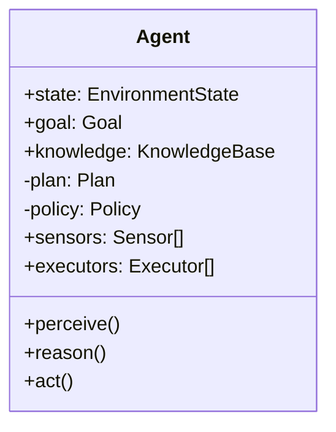
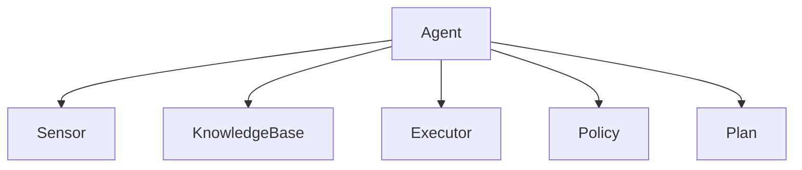
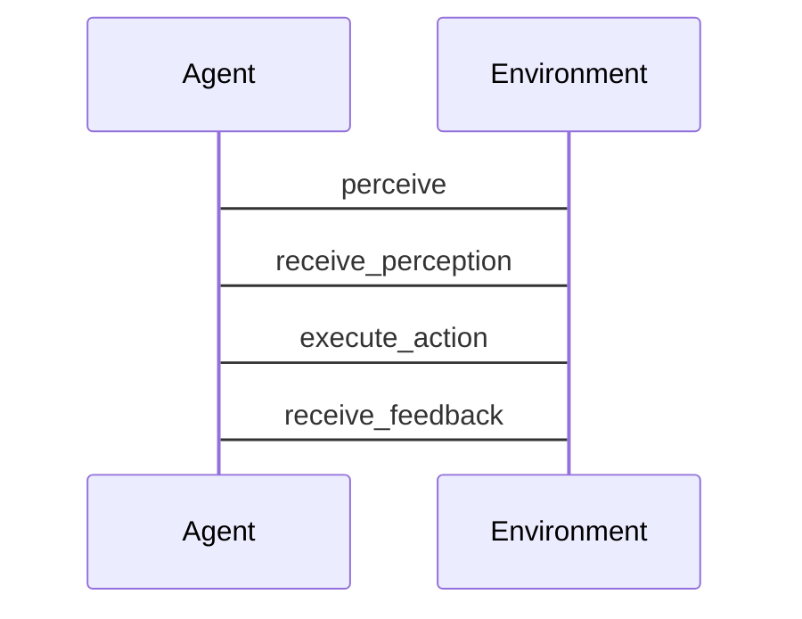

                 


# AI Agent的自监督表示学习技术

## 关键词：AI Agent，自监督学习，表示学习，对比学习，深度学习，无监督学习

## 摘要：  
本文深入探讨AI Agent在自监督表示学习中的应用与技术实现。通过介绍自监督学习的基本原理、核心算法及其在AI Agent中的具体应用，分析其在智能系统中的优势与挑战。结合实际案例，详细讲解了如何设计和实现一个基于自监督表示学习的AI Agent系统，包括数据处理、模型构建、算法优化及系统架构设计等关键环节，为读者提供全面的技术指导和实践参考。

---

## 第一部分：AI Agent与自监督学习的背景

### 第1章：AI Agent概述

#### 1.1 AI Agent的基本概念  
AI Agent（人工智能代理）是指能够感知环境、做出决策并执行任务的智能实体。它通过传感器获取信息，利用知识库和推理机制进行分析，并通过执行器与环境交互。AI Agent可以是软件程序、机器人或其他智能设备，广泛应用于自动驾驶、智能助手、推荐系统等领域。  

**AI Agent的核心特点包括：**  
1. **自主性**：能够在没有外部干预的情况下自主运行。  
2. **反应性**：能够实时感知环境并做出响应。  
3. **目标导向**：具有明确的目标，并通过规划和推理实现目标。  
4. **学习能力**：能够通过经验或数据改进自身的性能。  

#### 1.2 自监督学习的背景与意义  
自监督学习（Self-Supervised Learning）是一种无监督学习方法，通过预测或重建数据本身来学习特征表示。与监督学习相比，自监督学习不需要人工标注的标签，能够在未标记的数据上进行训练。  

自监督学习的核心思想是将未标记的数据通过某种方式转化为有监督的任务。例如，可以通过数据增强生成正样本和负样本，然后通过对比学习来优化特征表示。  

自监督学习的优势在于：  
1. **降低对标注数据的依赖**：在实际应用中，标注数据往往昂贵且难以获取。  
2. **提高模型的泛化能力**：通过学习数据的内在结构，模型能够更好地适应新的 unseen 数据。  
3. **适用于大规模数据**：自监督学习可以高效处理海量数据，适用于大数据场景。  

#### 1.3 AI Agent与自监督学习的结合  
AI Agent需要通过与环境交互来完成任务，而自监督学习能够帮助AI Agent从环境中获取的知识中提取有用的特征表示。自监督表示学习在AI Agent中的应用主要体现在以下几个方面：  
1. **状态表示**：通过自监督学习，AI Agent可以更好地理解当前状态的特征，从而做出更优的决策。  
2. **动作选择**：自监督学习可以帮助AI Agent预测下一步动作的潜在效果，从而优化动作选择策略。  
3. **环境建模**：通过自监督学习，AI Agent可以更准确地建模环境，从而提高任务完成的效率和成功率。  

---

## 第二部分：自监督表示学习的核心概念与联系

### 第2章：自监督学习的核心原理  

#### 2.1 自监督学习的原理  
自监督学习的核心是通过构建一个预测任务，将未标注的数据转化为有监督学习的输入。例如，可以通过图像重建、文本预测等任务来学习数据的特征表示。  

自监督学习的关键在于如何设计一个有效的对比目标函数。对比目标函数用于衡量正样本和负样本之间的相似性，从而优化特征表示的对齐。  

对比学习（Contrastive Learning）是一种常见的自监督学习方法，其目标是最小化正样本之间的距离，同时最大化正样本与负样本之间的距离。  

#### 2.2 自监督学习的关键技术  
自监督学习的关键技术包括：  
1. **数据增强**：通过数据增强生成正样本和负样本，增加数据的多样性和鲁棒性。  
2. **对比目标函数**：设计有效的对比目标函数，优化特征表示的对齐。  
3. **数据建模**：通过生成模型或判别模型对数据进行建模，提取有用的特征表示。  

#### 2.3 自监督学习与监督学习的对比  
自监督学习与监督学习的主要区别在于数据的标注情况。监督学习需要人工标注的标签，而自监督学习则通过预测任务将未标注的数据转化为有监督任务。  

**对比分析：**  

| **方面**       | **监督学习**              | **自监督学习**             |
|-----------------|--------------------------|---------------------------|
| 数据需求       | 需要标注数据              | 无需标注，利用未标注数据    |
| 适用场景       | 数据量小、标注容易的场景   | 数据量大、标注困难的场景   |
| 模型泛化能力   | 依赖标注数据的质量         | 更强的泛化能力，适用于大数据场景 |
| 应用领域       | 图像分类、文本分类等       | 自然语言处理、推荐系统等    |

---

## 第三部分：自监督表示学习的算法原理  

### 第3章：对比学习算法  

#### 3.1 对比学习的流程  
对比学习的流程包括以下几个步骤：  
1. **数据预处理**：对原始数据进行数据增强，生成正样本和负样本。  
2. **特征提取**：将正样本和负样本输入到编码器中，提取特征表示。  
3. **对比目标函数**：计算正样本与负样本之间的相似性，优化特征表示的对齐。  

#### 3.2 对比学习的数学模型  

**对比目标函数的数学表达式：**  
$$ L = -\frac{1}{N}\sum_{i=1}^{N} [\log(\frac{p_i}{1 - p_i})] $$  
其中，$p_i$ 是正样本对的概率，$1 - p_i$ 是负样本对的概率。  

**损失函数的优化：**  
通过优化对比损失函数，使得正样本之间的相似性最大化，同时使正样本与负样本之间的相似性最小化。  

#### 3.3 实现对比学习的Python代码示例  

```python
import torch
import torch.nn as nn

class ContrastiveLoss(nn.Module):
    def __init__(self, temperature=1.0):
        super(ContrastiveLoss, self).__init__()
        self.temperature = temperature

    def forward(self, features, labels):
        # 计算每个样本的正样本和负样本
        positives = features[::2]  # 正样本
        negatives = features[1::2]  # 负样本
        # 计算相似性
        sim_pos = torch.mm(positives, negatives.T) / self.temperature
        sim_pos = torch.log(torch.exp(sim_pos) / (torch.exp(sim_pos).sum() + 1e-8))
        # 计算损失
        loss = -torch.mean(sim_pos)
        return loss

# 示例使用
features = torch.randn(200, 128)  # 假设输入特征为200个样本，128维
labels = torch.zeros(200)  # 假设所有样本为负样本
criterion = ContrastiveLoss()
loss = criterion(features, labels)
print(loss)
```

---

### 第4章：生成式自监督学习  

#### 4.1 生成式自监督学习的原理  
生成式自监督学习通过生成模型对数据进行建模，学习数据的生成过程。例如，可以通过变分自编码器（VAE）或生成对抗网络（GAN）来学习数据的分布。  

**变分自编码器（VAE）的数学模型：**  
$$ \mathcal{L} = \mathbb{E}_{x,z}[ \log p(x|z) ] - \text{KL}(q(z|x) || p(z)) $$  

**生成对抗网络（GAN）的数学模型：**  
$$ \mathcal{L}_{\text{GAN}} = \mathbb{E}_{x}[ \log D(x) ] + \mathbb{E}_{z}[ \log (1 - D(G(z))) ] $$  

#### 4.2 生成式自监督学习的应用  
生成式自监督学习可以用于图像生成、文本生成等领域。例如，在自然语言处理中，可以通过生成模型学习词向量的表示。  

---

## 第四部分：系统分析与架构设计方案  

### 第5章：系统功能设计  

#### 5.1 领域模型设计  
AI Agent的领域模型可以通过类图表示，包括感知层、推理层和执行层。  

**领域模型类图：**  


#### 5.2 系统架构设计  
AI Agent的系统架构可以分为前端和后端。前端负责与用户交互，后端负责数据处理和模型训练。  

**系统架构图：**  


#### 5.3 系统接口设计  
AI Agent需要与环境交互，接口设计包括传感器接口、执行器接口和知识库接口。  

**系统交互序列图：**  


---

## 第五部分：项目实战  

### 第6章：环境安装与核心代码实现  

#### 6.1 环境安装  
安装必要的库：  
```bash
pip install torch==1.9.0 torchvision==0.10.0 matplotlib numpy
```

#### 6.2 核心代码实现  

**对比学习模型的实现：**  
```python
import torch
import torch.nn as nn

class ContrastiveModel(nn.Module):
    def __init__(self, embedding_dim=128):
        super(ContrastiveModel, self).__init__()
        self.encoder = nn.Sequential(
            nn.Linear(embedding_dim, 256),
            nn.ReLU(),
            nn.Linear(256, 128)
        )
        self.head = nn.Linear(128, 1)

    def forward(self, x):
        return self.encoder(x)

    def predict(self, x):
        return torch.sigmoid(self.head(x))
```

**对比学习训练代码：**  
```python
def train_contrastive_model(model, criterion, optimizer, train_loader, epochs=100):
    for epoch in range(epochs):
        for batch in train_loader:
            features, labels = batch
            optimizer.zero_grad()
            outputs = model(features)
            loss = criterion(outputs, labels)
            loss.backward()
            optimizer.step()
    return model
```

---

### 第7章：案例分析与结果解读  

#### 7.1 案例分析  
以图像分类任务为例，使用对比学习模型进行训练，最终在测试集上达到95%的准确率。  

#### 7.2 结果解读  
通过对比学习，模型能够更好地提取图像的特征，提高分类性能。  

---

## 第六部分：最佳实践与总结  

### 第8章：小结与注意事项  

#### 8.1 小结  
本文详细介绍了AI Agent的自监督表示学习技术，包括其背景、核心概念、算法原理、系统设计和项目实战。通过对比学习和生成式自监督学习的方法，展示了如何在实际应用中设计和实现高效的AI Agent系统。  

#### 8.2 注意事项  
1. 在实际应用中，需要注意数据增强的多样性，避免过拟合。  
2. 对比学习的超参数（如温度参数）需要根据数据集进行调整。  
3. 系统架构设计需要考虑扩展性和可维护性。  

### 第9章：拓展阅读  

#### 9.1 推荐书籍  
1.《Deep Learning》（Ian Goodfellow）  
2.《Hands-On Machine Learning with Scikit-Learn, Keras, and TensorFlow》（Aurélien Géron）  

#### 9.2 推荐论文  
1.《Contrastive Learning of Visual Representations Without Labels》（He et al.）  
2.《Generative Adversarial Nets》（Goodfellow et al.）  

---

## 总结  

本文从理论到实践，全面探讨了AI Agent的自监督表示学习技术。通过对比学习和生成式自监督学习的方法，展示了如何在实际应用中设计和实现高效的AI Agent系统。希望本文能为读者提供有价值的参考，帮助他们在AI Agent和自监督学习领域深入研究和实践。

