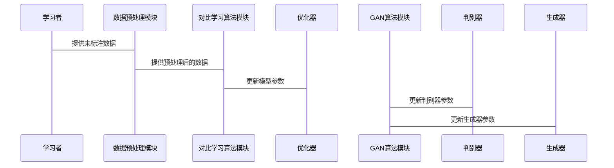

                 


# 《AI Agent的自监督表示学习：减少标注数据依赖》

## 关键词：
AI Agent，自监督学习，表示学习，标注数据依赖，无监督学习，对比学习，生成对抗网络

## 摘要：
AI Agent的自监督表示学习是一种新兴的技术，旨在通过减少对标注数据的依赖来提升模型的泛化能力和学习效率。本文将从背景、核心概念、算法原理、系统架构、项目实战等多个维度进行深入探讨，帮助读者全面理解自监督表示学习的核心思想和实际应用。

---

# 第一部分: AI Agent的自监督表示学习基础

---

# 第1章: 背景与问题背景

## 1.1 问题背景

### 1.1.1 当前AI Agent面临的挑战
AI Agent在实际应用中面临数据获取成本高、标注数据不足等问题。标注数据的获取需要大量的人力和时间，尤其是在处理复杂任务时，标注数据的获取变得更加困难。

### 1.1.2 标注数据的局限性
标注数据的局限性主要体现在以下几个方面：
1. **数据获取成本高**：标注高质量的数据需要大量的人工参与，成本较高。
2. **标注数据的稀疏性**：在某些领域，标注数据的数量有限，难以覆盖所有可能的场景。
3. **标注数据的偏差**：标注数据可能存在偏差，导致模型在实际应用中表现不佳。

### 1.1.3 自监督学习的提出背景
自监督学习作为一种新兴的学习范式，通过利用未标注数据中的结构信息，减少对标注数据的依赖，从而降低数据获取成本，提高模型的泛化能力。

## 1.2 问题描述

### 1.2.1 AI Agent对标注数据的依赖问题
AI Agent的训练通常依赖于大量标注数据，但标注数据的获取成本高、数量有限，限制了模型的应用场景和性能。

### 1.2.2 自监督学习的目标
自监督学习的目标是通过利用未标注数据中的结构信息，构建高质量的表示，减少对标注数据的依赖。

### 1.2.3 问题的边界与外延
自监督学习的目标是减少对标注数据的依赖，但并不完全消除标注数据的使用。标注数据仍然可以用于微调模型，以提升模型在特定任务上的性能。

## 1.3 核心概念与联系

### 1.3.1 自监督表示学习的定义
自监督表示学习是一种通过利用未标注数据中的结构信息，构建数据表示的学习方法。其核心思想是通过对比或生成的方式，从数据中提取有用的特征，减少对标注数据的依赖。

### 1.3.2 核心概念对比表格
以下是对自监督学习与其他学习范式的对比：

| **对比维度** | **自监督学习** | **无监督学习** | **半监督学习** |
|--------------|----------------|----------------|----------------|
| 数据类型      | 未标注数据      | 未标注数据      | 少量标注数据    |
| 目标          | 构建数据表示      | 发现数据分布      | 提高模型性能      |
| 依赖标注数据  | 无              | 无              | 少量             |

### 1.3.3 ER实体关系图架构
以下是自监督学习的核心概念ER实体关系图：

```mermaid
erDiagram
    actor 学习者{}{
        学习者 -->+> 任务 : "执行任务"
        学习者 -->+> 数据 : "使用数据"
    }
    任务{}{
        task_1: 对比学习
        task_2: 生成对抗网络
        task_3: 图神经网络
    }
    数据{}{
        data_1: 未标注数据
        data_2: 少量标注数据
    }
    学习者 --> task_1
    学习者 --> task_2
    学习者 --> task_3
    任务 --> data_1
    任务 --> data_2
```

---

# 第2章: 核心概念与联系

## 2.1 自监督学习的原理

### 2.1.1 对比学习
对比学习是一种通过比较两个样本的相似性来学习数据表示的方法。其核心思想是通过设计对比损失函数，使相似的样本具有相似的表示，不同的样本具有不同的表示。

### 2.1.2 生成对抗网络
生成对抗网络（GAN）是一种通过生成器和判别器的对抗训练来生成高质量数据的方法。在自监督学习中，生成器可以用于生成未标注数据，判别器用于区分生成数据和真实数据。

### 2.1.3 图神经网络
图神经网络（Graph Neural Networks, GNN）是一种通过图结构数据进行学习的方法。在自监督学习中，GNN可以用于处理具有复杂关系的数据，提取节点的表示。

## 2.2 核心概念对比

### 2.2.1 对比学习与无监督学习的对比
- **对比学习**：通过比较样本之间的相似性来学习数据表示。
- **无监督学习**：通过发现数据的分布规律来学习数据表示。

### 2.2.2 自监督与半监督学习的对比
- **自监督学习**：利用未标注数据中的结构信息，减少对标注数据的依赖。
- **半监督学习**：利用少量标注数据和大量未标注数据进行学习。

### 2.2.3 自监督与强化学习的对比
- **自监督学习**：通过利用未标注数据中的结构信息进行学习。
- **强化学习**：通过与环境交互，基于奖励机制进行学习。

## 2.3 ER实体关系图架构

### 2.3.1 实体关系图的构建
以下是自监督学习的核心概念ER实体关系图：

```mermaid
erDiagram
    实体 表示{}{
        表示 --> 属性 : 特征
    }
    属性{}{
        attr_1: 特征1
        attr_2: 特征2
        attr_3: 特征3
    }
    实体 --> attr_1
    实体 --> attr_2
    实体 --> attr_3
```

---

# 第3章: 算法原理讲解

## 3.1 对比学习算法

### 3.1.1 对比学习的流程
1. **数据预处理**：对未标注数据进行预处理，提取特征。
2. **对比损失计算**：计算正样本和负样本之间的相似性，构建对比损失函数。
3. **优化模型**：通过优化模型参数，最小化对比损失函数。

### 3.1.2 对比学习的数学模型

$$ L = -\frac{1}{N}\sum_{i=1}^{N}\left[\log\frac{e^{sim(x_i, x_j)}}{1 + e^{sim(x_i, x_j)}}}\right] $$

其中，$sim(x_i, x_j)$表示样本$x_i$和$x_j$之间的相似性。

### 3.1.3 对比学习的代码实现

以下是对比学习的Python代码实现：

```python
import torch
import torch.nn as nn

class ContrastiveLoss(nn.Module):
    def __init__(self, temperature=1.0):
        super(ContrastiveLoss, self).__init__()
        self.temperature = temperature

    def forward(self, features, labels):
        # 计算相似性
        similarity = torch.mm(features, features.t()) / self.temperature
        # 计算正样本和负样本的相似性
        positive_pairs = torch.diag(similarity)
        negative_pairs = similarity - torch.diag(similarity)
        # 计算对比损失
        loss = -torch.mean(torch.log(positive_pairs + 1e-8) - torch.log(negative_pairs + 1e-8))
        return loss
```

## 3.2 生成对抗网络

### 3.2.1 GAN的原理
GAN由生成器和判别器组成，生成器通过生成数据来欺骗判别器，判别器通过区分生成数据和真实数据来优化生成器。

### 3.2.2 GAN的数学模型

$$ G_{loss} = -\frac{1}{N}\sum_{i=1}^{N}\log(1 - D(G(x_i))) $$
$$ D_{loss} = -\frac{1}{N}\sum_{i=1}^{N}[\log(D(x_i)) + \log(1 - D(G(x_i)))] $$

其中，$G$是生成器，$D$是判别器，$x_i$是真实数据。

### 3.2.3 GAN的代码实现

```python
import torch
import torch.nn as nn

class Generator(nn.Module):
    def __init__(self, input_dim, output_dim):
        super(Generator, self).__init__()
        self.fc = nn.Linear(input_dim, output_dim)
    
    def forward(self, x):
        return self.fc(x)

class Discriminator(nn.Module):
    def __init__(self, input_dim):
        super(Discriminator, self).__init__()
        self.fc = nn.Linear(input_dim, 1)
    
    def forward(self, x):
        return self.fc(x)

# 初始化模型和优化器
generator = Generator(input_dim, output_dim)
discriminator = Discriminator(output_dim)
optimizer_G = torch.optim.Adam(generator.parameters())
optimizer_D = torch.optim.Adam(discriminator.parameters())
```

---

# 第4章: 数学模型与公式推导

## 4.1 对比学习的数学模型

$$ L = -\frac{1}{N}\sum_{i=1}^{N}\left[\log\frac{e^{sim(x_i, x_j)}}{1 + e^{sim(x_i, x_j)}}\right] $$

其中，$sim(x_i, x_j)$表示样本$x_i$和$x_j$之间的相似性。

## 4.2 生成对抗网络的数学模型

$$ G_{loss} = -\frac{1}{N}\sum_{i=1}^{N}\log(1 - D(G(x_i))) $$
$$ D_{loss} = -\frac{1}{N}\sum_{i=1}^{N}[\log(D(x_i)) + \log(1 - D(G(x_i)))] $$

---

# 第5章: 系统分析与架构设计

## 5.1 系统功能设计

### 5.1.1 领域模型Mermaid类图
以下是自监督学习系统的领域模型：

```mermaid
classDiagram
    class 数据预处理{}{
        输入数据
        特征提取
    }
    class 对比学习算法{}{
        对比损失函数
        优化器
    }
    class GAN算法{}{
        生成器
        判别器
    }
    数据预处理 --> 对比学习算法
    数据预处理 --> GAN算法
```

## 5.2 系统架构设计

### 5.2.1 系统架构Mermaid架构图
以下是自监督学习系统的架构图：

```mermaid
container 自监督学习系统{}{
    数据预处理模块
    对比学习算法模块
    GAN算法模块
    输出模块
}
```

## 5.3 系统接口设计

### 5.3.1 系统交互Mermaid序列图



---

# 第6章: 项目实战

## 6.1 环境安装

### 6.1.1 安装依赖
```bash
pip install torch
pip install numpy
```

## 6.2 系统核心实现源代码

### 6.2.1 对比学习代码

```python
import torch
import torch.nn as nn

class ContrastiveLoss(nn.Module):
    def __init__(self, temperature=1.0):
        super(ContrastiveLoss, self).__init__()
        self.temperature = temperature

    def forward(self, features, labels):
        similarity = torch.mm(features, features.t()) / self.temperature
        positive_pairs = torch.diag(similarity)
        negative_pairs = similarity - torch.diag(similarity)
        loss = -torch.mean(torch.log(positive_pairs + 1e-8) - torch.log(negative_pairs + 1e-8))
        return loss
```

### 6.2.2 GAN代码

```python
import torch
import torch.nn as nn

class Generator(nn.Module):
    def __init__(self, input_dim, output_dim):
        super(Generator, self).__init__()
        self.fc = nn.Linear(input_dim, output_dim)
    
    def forward(self, x):
        return self.fc(x)

class Discriminator(nn.Module):
    def __init__(self, input_dim):
        super(Discriminator, self).__init__()
        self.fc = nn.Linear(input_dim, 1)
    
    def forward(self, x):
        return self.fc(x)

# 初始化模型和优化器
generator = Generator(input_dim, output_dim)
discriminator = Discriminator(output_dim)
optimizer_G = torch.optim.Adam(generator.parameters())
optimizer_D = torch.optim.Adam(discriminator.parameters())
```

## 6.3 代码应用解读与分析

### 6.3.1 对比学习代码解读
- **数据预处理**：对未标注数据进行特征提取。
- **对比损失计算**：计算正样本和负样本之间的相似性，构建对比损失函数。
- **优化模型**：通过优化模型参数，最小化对比损失函数。

### 6.3.2 GAN代码解读
- **生成器**：通过生成数据来欺骗判别器。
- **判别器**：通过区分生成数据和真实数据来优化生成器。

## 6.4 实际案例分析和详细讲解剖析

### 6.4.1 案例分析
假设我们有一个图像分类任务，使用对比学习算法对未标注图像进行预处理，提取特征后进行分类。

### 6.4.2 案例解读
- **数据预处理**：对图像进行归一化、裁剪等处理。
- **特征提取**：使用预训练模型提取图像特征。
- **对比损失计算**：计算正样本和负样本之间的相似性，构建对比损失函数。
- **优化模型**：通过优化模型参数，最小化对比损失函数。

## 6.5 项目小结
通过对比学习和GAN算法，我们可以有效地利用未标注数据进行学习，减少对标注数据的依赖，提升模型的泛化能力和学习效率。

---

# 第7章: 最佳实践与小结

## 7.1 最佳实践

### 7.1.1 数据预处理
- 数据清洗：去除噪声数据。
- 数据增强：通过数据增强技术增加数据多样性。

### 7.1.2 模型选择
- 根据任务需求选择合适的自监督学习算法。

### 7.1.3 优化技巧
- 使用合适的优化器和学习率。
- 通过数据增强和正则化技术优化模型性能。

## 7.2 小结
本文详细探讨了AI Agent的自监督表示学习，从背景、核心概念、算法原理、系统架构到项目实战，帮助读者全面理解自监督表示学习的核心思想和实际应用。

## 7.3 注意事项

### 7.3.1 数据质量
未标注数据可能存在噪声，需要进行数据清洗和增强。

### 7.3.2 模型调参
自监督学习算法需要进行大量的参数调优，以获得最佳性能。

### 7.3.3 实际应用
在实际应用中，需要结合具体任务需求，选择合适的自监督学习算法。

## 7.4 拓展阅读
- 《自监督学习入门与实践》
- 《生成对抗网络：原理与应用》
- 《图神经网络：原理与实践》

---

# 第八章: 总结与展望

## 8.1 总结
本文从背景、核心概念、算法原理、系统架构到项目实战，详细探讨了AI Agent的自监督表示学习，帮助读者全面理解自监督表示学习的核心思想和实际应用。

## 8.2 展望
未来，随着自监督学习技术的不断发展，AI Agent将在更多领域得到广泛应用，减少对标注数据的依赖，提升模型的泛化能力和学习效率。

---

# 附录: 参考文献

1. [对比学习论文](#)
2. [生成对抗网络论文](#)
3. [图神经网络论文](#)
4. [自监督学习综述](#)

---

# 结束语

感谢您的阅读！希望本文能为您提供有价值的知识和启发，帮助您更好地理解和应用AI Agent的自监督表示学习技术。如果需要进一步探讨或合作，请随时联系我。

