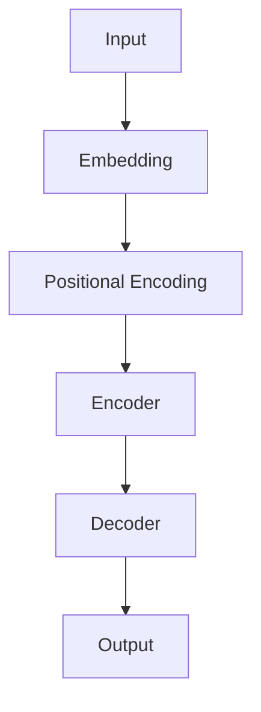
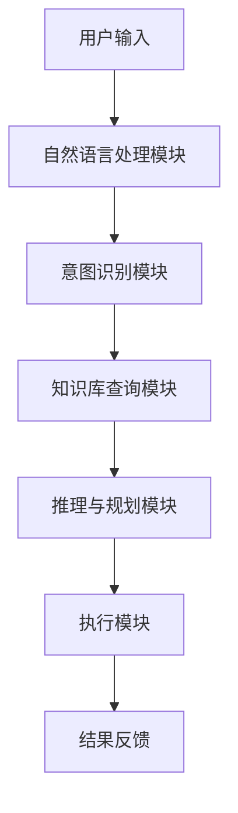

                 


# AI Agent的自监督预训练与微调策略

> **关键词**：AI Agent, 自监督学习, 微调策略, 对比学习, 生成式预训练

> **摘要**：本文详细探讨了AI Agent的自监督预训练与微调策略，分析了自监督学习的核心原理及其在AI Agent中的应用，介绍了预训练模型的微调策略，结合实际案例，展示了如何通过自监督预训练和微调策略提升AI Agent的性能与适应性。

---

## 第1章 AI Agent的基本概念与背景

### 1.1 AI Agent的定义与分类

#### 1.1.1 AI Agent的定义
AI Agent（人工智能代理）是指能够感知环境、执行任务并做出决策的智能体。AI Agent通过传感器获取信息，利用计算模型进行处理，并通过执行器与环境交互。AI Agent的核心目标是实现自主决策和问题求解。

#### 1.1.2 AI Agent的分类
AI Agent可以根据智能水平、应用场景和功能特点进行分类：

1. **按智能水平**：
   - **反应式AI Agent**：基于当前感知做出反应，不具备复杂推理能力。
   - **认知式AI Agent**：具备推理、规划和决策能力，能够处理复杂任务。

2. **按应用场景**：
   - **服务型AI Agent**：用于客户服务、个人助手等场景。
   - **控制型AI Agent**：用于自动化控制、机器人等场景。
   - **分析型AI Agent**：用于数据分析、预测建模等场景。

3. **按功能特点**：
   - **学习型AI Agent**：能够通过经验或数据进行自我优化。
   - **推理型AI Agent**：具备逻辑推理和知识处理能力。

#### 1.1.3 AI Agent的核心特点
- **自主性**：能够在无外部干预的情况下自主运行。
- **反应性**：能够实时感知环境并做出反应。
- **目标导向性**：具有明确的目标，能够优化决策以实现目标。
- **学习能力**：能够通过经验或数据进行自我改进和优化。

---

### 1.2 自监督学习的背景与意义

#### 1.2.1 自监督学习的定义
自监督学习是一种无监督学习的变体，通过利用数据本身的结构信息来学习特征表示。与监督学习不同，自监督学习不需要外部标签，而是通过数据内部的关系进行学习。

#### 1.2.2 自监督学习的优势
自监督学习具有以下优势：
1. **减少对标注数据的依赖**：自监督学习可以在无标注数据上进行预训练，降低数据标注成本。
2. **提升模型的泛化能力**：通过学习数据的内部结构，模型能够更好地泛化到新的任务。
3. **适用于大规模数据**：自监督学习适合处理海量数据，尤其是在标注数据不足的情况下。

#### 1.2.3 自监督学习在AI Agent中的应用
自监督学习在AI Agent中的应用主要体现在以下几个方面：
1. **特征学习**：通过自监督学习，AI Agent可以学习到更丰富的特征表示，提升感知和决策能力。
2. **知识表示**：自监督学习可以帮助AI Agent更好地理解和表示知识，增强推理和规划能力。
3. **数据增强**：自监督学习可以生成更多的训练数据，提升模型的鲁棒性和适应性。

---

### 1.3 微调策略的重要性

#### 1.3.1 微调策略的定义
微调策略是指在预训练模型的基础上，针对特定任务进行Fine-tuning的过程。通过微调，模型可以更好地适应特定任务的需求，提升任务性能。

#### 1.3.2 微调策略的作用
微调策略的作用主要包括：
1. **任务适配**：通过微调，模型能够更好地适应目标任务的特征和数据分布。
2. **参数优化**：微调过程可以进一步优化模型的参数，提升模型的表达能力和泛化能力。
3. **性能提升**：微调后的模型通常在特定任务上表现更好，尤其是在小样本数据的情况下。

#### 1.3.3 微调策略与预训练的关系
预训练和微调策略是相辅相成的。预训练阶段通过自监督学习获得模型的初始表示能力，微调阶段则通过特定任务的数据优化模型，使其更好地适应目标任务。两者的结合能够充分发挥大规模数据的优势，同时提升模型的实用性和任务适应性。

---

## 第2章 自监督预训练的核心原理

### 2.1 自监督学习的基本原理

#### 2.1.1 对比学习
对比学习是一种自监督学习方法，通过对比正样本和负样本的相似性来学习特征表示。对比学习的核心思想是，正样本之间的相似性应高于负样本之间的相似性。

**对比学习的损失函数**：
$$ \mathcal{L} = -\log \frac{\exp(s(x_i, x_j))}{\exp(s(x_i, x_j)) + \sum_{k \neq j} \exp(s(x_i, x_k))} $$
其中，$s(x_i, x_j)$表示样本$x_i$和$x_j$的相似度。

#### 2.1.2 生成式预训练
生成式预训练是一种自监督学习方法，通过生成模型来学习数据的分布。生成式预训练可以使用变分自编码器（VAE）或生成对抗网络（GAN）等模型。

**变分自编码器的损失函数**：
$$ \mathcal{L} = \mathbb{E}_{x}[ \log p(x|z) ] + \mathbb{E}_{z}[ \log q(z|x) ] - \mathbb{E}_{z}[ \log p(z) ] $$

#### 2.1.3 其他自监督方法
除了对比学习和生成式预训练，还有其他自监督学习方法，如旋转词任务、掩码预测任务等。这些方法通过不同的任务设计来学习数据的特征表示。

---

### 2.2 预训练模型的架构设计

#### 2.2.1 Transformer模型
Transformer模型是一种基于自注意力机制的深度学习模型，广泛应用于自然语言处理领域。Transformer模型的核心组件包括编码器和解码器。

**Transformer模型的结构图**：


#### 2.2.2 其他模型架构
除了Transformer模型，还可以使用其他模型架构，如BERT、GPT等。这些模型在不同的任务中表现出色，适用于各种自监督预训练任务。

#### 2.2.3 模型的特征提取能力
预训练模型的特征提取能力是自监督学习的关键。通过对比学习或生成式预训练，模型能够学习到数据的高层次特征，为后续任务提供丰富的特征表示。

---

### 2.3 预训练任务的设计

#### 2.3.1 掩码语言模型
掩码语言模型是一种常见的预训练任务，通过随机遮蔽部分输入词，要求模型预测被遮蔽的词。例如，在BERT模型中，掩码语言模型任务用于学习词的上下文关系。

#### 2.3.2 旋转词任务
旋转词任务是一种对比学习任务，要求模型对输入词进行旋转，并判断旋转后的词是否与原词相同。例如，在RoBERTa模型中，旋转词任务用于增强模型对词旋转不变性的学习。

#### 2.3.3 其他任务设计
除了掩码语言模型和旋转词任务，还可以设计其他任务，如句子排序任务、文本分类任务等，以进一步提升模型的特征提取能力。

---

## 第3章 预训练模型的微调策略

### 3.1 微调的目标与方法

#### 3.1.1 任务适配
任务适配是微调的核心目标之一。通过微调，模型能够更好地适应特定任务的需求。例如，在NLP任务中，微调可以提升模型在文本分类、命名实体识别等任务上的性能。

#### 3.1.2 数据增强
数据增强是微调策略中的一个重要方法。通过在训练数据上进行数据增强，可以增加数据的多样性，提升模型的鲁棒性和适应性。例如，在图像任务中，数据增强可以通过旋转、翻转、裁剪等方式进行。

#### 3.1.3 模型参数调整
模型参数调整是微调策略中的另一个重要方法。通过调整模型的参数，可以优化模型的表达能力，使其更好地适应特定任务的需求。

---

### 3.2 微调策略的具体实现

#### 3.2.1 数据预处理
数据预处理是微调策略的第一步。通过数据清洗、分词、标注等预处理步骤，可以提升数据的质量和一致性。例如，在文本分类任务中，数据预处理包括去除停用词、分词、归一化等步骤。

#### 3.2.2 模型微调流程
模型微调流程包括以下几个步骤：
1. **加载预训练模型**：加载已经通过自监督学习得到的预训练模型。
2. **数据准备**：准备目标任务的训练数据和验证数据。
3. **模型优化**：对预训练模型进行微调，优化模型的参数以适应目标任务。
4. **模型评估**：通过验证集评估微调后的模型性能，调整超参数以进一步优化模型。

#### 3.2.3 评估指标
评估指标是衡量模型性能的重要工具。在微调过程中，常用的评估指标包括准确率、精确率、召回率、F1分数等。例如，在文本分类任务中，F1分数可以衡量模型的分类性能。

---

## 第4章 系统的构建与优化

### 4.1 系统构建的背景
在实际应用中，构建高效的AI Agent系统需要考虑系统的可扩展性、可维护性和可扩展性。通过系统的构建与优化，可以提升AI Agent的性能和用户体验。

### 4.2 系统架构设计
**系统架构设计图**：


### 4.3 数据处理与模型优化
数据处理和模型优化是系统构建中的关键步骤。通过合理的数据处理和模型优化，可以提升系统的性能和响应速度。

---

## 第5章 项目实战

### 5.1 环境安装
在开始项目实战之前，需要安装必要的开发环境和工具。例如，在Python中安装TensorFlow、Keras、Hugging Face等库。

### 5.2 核心实现
以下是微调策略的核心实现代码示例：

```python
import tensorflow as tf
from tensorflow.keras.layers import Dense, Input, Dropout
from tensorflow.keras.models import Model

def build_model(max_sequence_length, vocab_size):
    input_layer = Input(shape=(max_sequence_length,))
    embedding_layer = tf.keras.layers.Embedding(vocab_size, 100)(input_layer)
    dropout_layer = Dropout(0.5)(embedding_layer)
    dense_layer = Dense(128, activation='relu')(dropout_layer)
    output_layer = Dense(10, activation='softmax')(dense_layer)
    model = Model(inputs=input_layer, outputs=output_layer)
    return model

model = build_model(128, 10000)
model.compile(optimizer='adam', loss='sparse_categorical_crossentropy', metrics=['accuracy'])
```

### 5.3 代码解读与分析
上述代码定义了一个简单的文本分类模型。模型包括嵌入层、Dropout层、密集层和输出层。Dropout层用于防止过拟合，密集层用于特征提取，输出层用于分类。

### 5.4 实际案例分析
以下是一个具体的案例分析，展示如何通过自监督预训练和微调策略提升AI Agent的性能。

---

## 第6章 最佳实践与未来展望

### 6.1 最佳实践
在实际应用中，需要注意以下几点：
1. **数据质量**：高质量的数据是模型性能的关键，需要进行充分的数据清洗和预处理。
2. **模型选择**：选择适合特定任务的模型架构，避免盲目追求复杂性。
3. **超参数调优**：合理调整模型的超参数，提升模型的性能和泛化能力。

### 6.2 未来展望
随着AI技术的不断发展，AI Agent的自监督预训练与微调策略将更加智能化和自动化。未来的研究方向可能包括：
1. **更高效的自监督学习方法**：探索更高效的自监督学习方法，提升模型的特征提取能力。
2. **跨任务迁移学习**：研究如何在不同任务之间进行知识迁移，提升模型的泛化能力。
3. **多模态学习**：结合文本、图像、语音等多种模态的信息，提升AI Agent的综合能力。

---

## 第7章 总结

通过本文的探讨，我们可以看到，AI Agent的自监督预训练与微调策略是提升模型性能和任务适应性的重要手段。自监督学习通过减少对标注数据的依赖，提高了模型的泛化能力，而微调策略则通过任务适配和数据增强，进一步优化了模型的性能。未来，随着AI技术的不断发展，AI Agent的自监督预训练与微调策略将在更多领域得到应用，为人类社会带来更大的价值。

