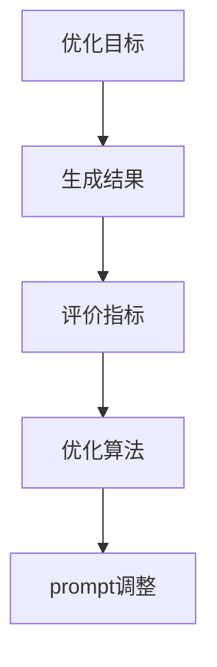
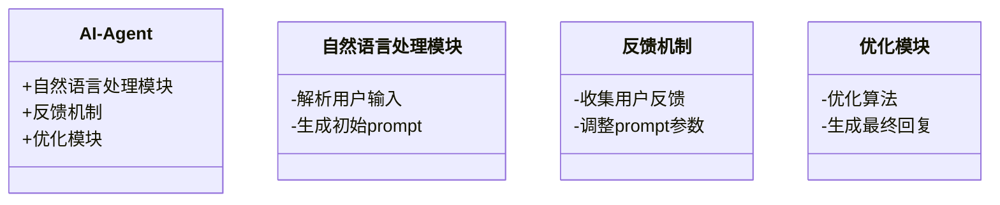
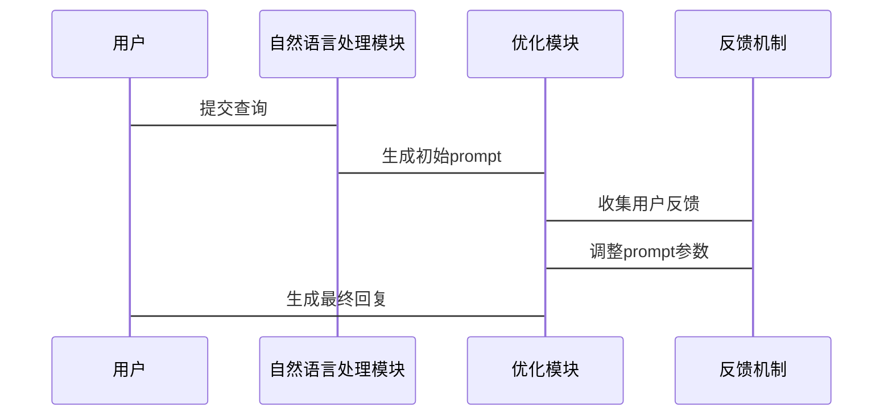

                 


# AI Agent的自适应prompt优化策略

> 关键词：AI Agent, 自适应prompt优化, 自然语言处理, 优化算法, 系统架构设计

> 摘要：本文深入探讨了AI Agent的自适应prompt优化策略，从核心概念、算法原理到系统架构设计，再到实际项目案例，全面解析了如何通过优化prompt来提升AI Agent的性能和效率。文章首先介绍了AI Agent的基本概念与应用场景，然后详细阐述了自适应prompt优化的核心概念与实现方法，接着从数学模型和算法原理的角度分析了优化策略，最后通过具体案例展示了如何将这些优化策略应用于实际项目中。

---

## 第1章: AI Agent的基本概念与背景

### 1.1 AI Agent的定义与分类

#### 1.1.1 AI Agent的定义
AI Agent（人工智能代理）是指能够感知环境、执行任务并做出决策的智能实体。它可以是一个软件程序、机器人或其他智能系统，通过与环境交互来实现特定目标。

#### 1.1.2 AI Agent的分类
AI Agent可以根据多种标准进行分类，常见的分类方式包括：
- **基于智能水平**：
  - 单智能体（Single-Agent）
  - 多智能体（Multi-Agent）
- **基于任务类型**：
  - 问题求解型
  - 管理控制型
  - 人机交互型
- **基于应用领域**：
  - 电子商务
  - 游戏开发
  - 医疗健康

#### 1.1.3 AI Agent的应用场景
AI Agent广泛应用于多个领域，包括：
- **智能助手**：如Siri、Alexa等。
- **推荐系统**：根据用户行为推荐商品或内容。
- **自动化交易**：在金融市场上自动执行交易策略。
- **智能客服**：通过自然语言处理技术为用户提供支持。

---

### 1.2 自适应prompt优化的背景与意义

#### 1.2.1 自然语言处理中的prompt作用
在自然语言处理中，prompt（提示）是指导AI Agent生成特定输出的关键输入。例如，在文本生成任务中，提供一个合适的prompt可以显著影响生成结果的质量和相关性。

#### 1.2.2 自适应优化的必要性
传统的固定prompt方法在面对多样化和动态变化的场景时，往往难以满足需求。自适应优化能够根据任务目标和上下文环境动态调整prompt，从而提升生成结果的准确性和适用性。

#### 1.2.3 自适应prompt优化的行业应用
- **教育领域**：根据学生的学习情况动态生成个性化学习建议。
- **医疗领域**：根据患者的具体病情生成定制化的诊断建议。
- **企业服务**：根据企业的业务需求动态优化运营策略。

---

## 第2章: 自适应prompt优化的核心概念

### 2.1 自适应prompt优化的定义
自适应prompt优化是一种动态调整prompt参数和内容的技术，旨在通过优化过程最大化生成结果的质量和相关性。

### 2.2 自适应prompt优化的特点
- **动态性**：能够根据输入数据和环境变化实时调整。
- **智能性**：结合上下文理解和任务目标进行优化。
- **高效性**：通过优化算法快速找到最优解。

### 2.3 自适应prompt优化与其他优化方法的对比

| **优化方法** | **特点** | **适用场景** |
|--------------|----------|--------------|
| 静态prompt优化 | 参数固定，无法动态调整 | 简单任务，环境变化小 |
| 基于规则的优化 | 依赖预定义规则，缺乏灵活性 | 知识库完善，规则明确 |
| 自适应优化 | 动态调整，高度灵活 | 复杂任务，环境变化大 |

---

## 第3章: 自适应prompt优化的目标与边界

### 3.1 优化目标
自适应prompt优化的核心目标是通过动态调整prompt，最大化生成结果的相关性、准确性和可解释性。

### 3.2 优化边界
- **输入限制**：优化范围仅限于prompt，不涉及模型的结构和参数。
- **上下文限制**：优化基于当前任务的上下文，无法超出已有数据范围。

### 3.3 核心要素与概念结构

图3-1：自适应prompt优化的概念结构图



---

## 第4章: 自适应prompt优化的算法原理

### 4.1 基于梯度的优化算法

#### 4.1.1 梯度下降法
梯度下降法是一种常用的一阶优化算法，通过不断调整参数方向来最小化损失函数。

**数学公式：**
$$ x_{n+1} = x_n - \eta \cdot \nabla f(x_n) $$

其中，$\eta$ 是学习率，$\nabla f(x_n)$ 是当前点的梯度。

#### 4.1.2 动量优化法
动量优化法通过引入动量项加速收敛，减少振荡。

**数学公式：**
$$ m_t = \beta m_{t-1} + (1-\beta)g_t $$
$$ x_{t+1} = x_t - \eta m_t $$

#### 4.1.3 Adam优化器
Adam结合了动量和自适应学习率的优点，是一种高效的优化算法。

**数学公式：**
$$ m_t = \beta_1 m_{t-1} + (1-\beta_1)g_t $$
$$ v_t = \beta_2 v_{t-1} + (1-\beta_2)g_t^2 $$
$$ \hat{m}_t = \frac{m_t}{1-\beta_1^t} $$
$$ \hat{v}_t = \frac{v_t}{1-\beta_2^t} $$
$$ x_{t+1} = x_t - \eta \frac{\hat{m}_t}{\sqrt{\hat{v}_t} + \epsilon} $$

---

### 4.2 基于策略的优化算法

#### 4.2.1 REINFORCE算法
REINFORCE是一种基于策略梯度的方法，通过最大化期望回报来优化策略。

**数学公式：**
$$ \nabla \theta \log \pi(a|s) \cdot Q(s,a) $$

#### 4.2.2 PPO算法
PPO（Proximal Policy Optimization）是一种改进的策略梯度方法，通过限制策略更新的幅度来保证稳定性。

**数学公式：**
$$ L^{CL} = -\frac{1}{T}\sum_{t=1}^T \min\left( r_t \hat{p}_t, r_t p_t \right) $$

#### 4.2.3 A2C算法
A2C（Advantage Actor-Critic）结合了Actor-Critic方法和异策略优化，通过同时优化价值函数和策略函数来提升性能。

---

## 第5章: 自适应prompt优化的数学模型

### 5.1 自适应prompt优化的数学表达
自适应prompt优化的目标是最小化生成结果与预期结果之间的差距。通常，我们可以定义一个损失函数 $L$，并通过对prompt参数 $x$ 进行优化来最小化 $L$。

**数学公式：**
$$ \min_x L(x) $$

### 5.2 常用优化算法的数学公式

#### 5.2.1 梯度下降法
$$ f(x) = x^2 $$
$$ x_{n+1} = x_n - \eta \cdot f'(x_n) $$

#### 5.2.2 Adam优化器
$$ m_t = \beta_1 m_{t-1} + (1-\beta_1)g_t $$
$$ v_t = \beta_2 v_{t-1} + (1-\beta_2)g_t^2 $$
$$ \theta_{t+1} = \theta_t - \eta \frac{m_t}{\sqrt{v_t} + \epsilon} $$

---

## 第6章: 自适应prompt优化的系统架构设计

### 6.1 问题场景介绍
在电商客服场景中，AI Agent需要根据用户的查询生成合适的回复。为了提高回复的准确性和相关性，我们需要动态优化prompt。

### 6.2 系统功能设计

#### 6.2.1 自然语言处理模块
负责解析用户输入并生成初始prompt。

#### 6.2.2 反馈机制
收集用户反馈并调整prompt参数。

#### 6.2.3 优化模块
根据反馈和优化目标调整prompt，生成最终的回复。

### 6.3 系统架构设计

图6-1：系统架构类图



### 6.4 系统交互设计

图6-2：系统交互序列图



---

## 第7章: 项目实战

### 7.1 环境配置
- **编程语言**：Python
- **框架**：TensorFlow或PyTorch
- **NLP库**：spaCy或NLTK

### 7.2 核心代码实现

#### 7.2.1 自然语言处理模块

```python
def parse_user_input(user_input):
    # 使用NLP库解析用户输入
    return parsed_prompt
```

#### 7.2.2 优化模块

```python
def optimize_prompt(prompt, feedback):
    # 使用优化算法调整prompt
    return optimized_prompt
```

#### 7.2.3 反馈机制

```python
def collect_feedback(user_feedback):
    # 收集用户反馈并调整prompt参数
    return updated_prompt
```

### 7.3 代码功能解读
- **parse_user_input**：解析用户输入并生成初始prompt。
- **optimize_prompt**：根据反馈优化prompt，生成最终回复。
- **collect_feedback**：收集用户反馈并调整prompt参数。

### 7.4 实际案例分析
在电商客服场景中，用户输入“我需要取消订单”，系统生成初始回复：“您可以通过订单详情页面取消订单。” 如果用户反馈不满意，系统将优化prompt，生成更具体的回复：“您可以在订单详情页面找到取消选项。”

---

## 第8章: 总结与展望

### 8.1 全文总结
本文详细探讨了AI Agent的自适应prompt优化策略，从核心概念、算法原理到系统架构设计，再到实际项目案例，全面解析了如何通过优化prompt来提升生成结果的质量和相关性。

### 8.2 未来展望
随着自然语言处理技术的不断发展，自适应prompt优化将更加智能化和个性化。未来的研究方向包括：
- **多模态优化**：结合视觉、听觉等多种信息进行prompt优化。
- **实时反馈机制**：实现更快速的动态调整。
- **跨领域应用**：探索在更多领域的应用潜力。

### 8.3 最佳实践 tips
- **持续优化**：定期收集用户反馈并调整prompt。
- **选择合适的算法**：根据具体场景选择合适的优化算法。
- **关注可解释性**：确保生成结果的可解释性和透明性。

---

通过本文的系统解析和实际案例分析，读者可以深入了解AI Agent的自适应prompt优化策略，并将其应用于实际项目中。希望本文能为相关领域的研究和实践提供有价值的参考和启发。

