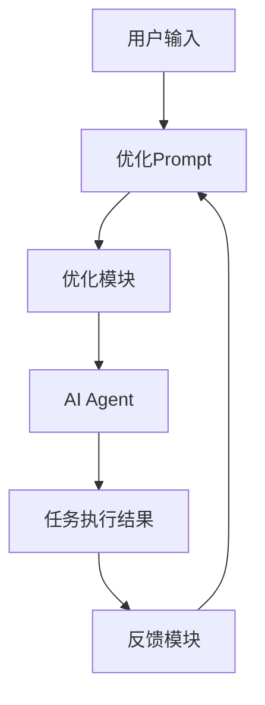

                 


# AI Agent的自适应Prompt工程与优化

## 关键词：AI Agent, 自适应Prompt, 优化算法, 人机交互, 自然语言处理

## 摘要：  
随着人工智能技术的快速发展，AI Agent（人工智能代理）在各个领域的应用越来越广泛。然而，AI Agent的表现很大程度上依赖于输入的Prompt（提示）。自适应Prompt工程通过动态调整Prompt的内容和参数，优化AI Agent的输出质量和效率。本文将从自适应Prompt工程的核心原理、算法实现、系统设计、项目实战等多个方面，深入探讨如何通过优化Prompt来提升AI Agent的性能，同时结合实际案例分析其应用效果。

---

## 第一部分: AI Agent与自适应Prompt工程基础

### 第1章: AI Agent与自适应Prompt工程概述

#### 1.1 AI Agent的基本概念  
AI Agent是一种能够感知环境并采取行动以实现目标的智能实体。它可以是一个软件程序、一个机器人，或者任何能够与环境交互的智能系统。AI Agent的核心特征包括：  
1. **自主性**：能够在没有外部干预的情况下自主决策。  
2. **反应性**：能够实时感知环境并做出反应。  
3. **目标导向性**：通过优化目标函数来实现特定任务。  

AI Agent的应用场景非常广泛，包括智能客服、推荐系统、自动驾驶、智能助手等。  

#### 1.2 自适应Prompt工程的核心概念  
自适应Prompt工程是指通过动态调整Prompt的内容、格式和参数，以优化AI Agent的输出质量和效率。自适应Prompt的核心特征包括：  
1. **动态性**：能够根据环境变化和用户反馈实时调整。  
2. **可定制性**：支持根据具体任务需求定制Prompt内容。  
3. **优化性**：通过优化算法提升Prompt的效果。  

#### 1.3 AI Agent与传统AI的区别  
传统AI（如基于规则的系统）依赖于固定的规则和逻辑，而AI Agent则更加灵活和智能，能够根据环境变化和用户需求动态调整行为。自适应Prompt工程是AI Agent实现动态调整的核心技术之一。  

---

## 第二部分: 自适应Prompt工程的核心原理

### 第2章: 自适应Prompt的生成与优化原理

#### 2.1 自适应Prompt生成的基本原理  
自适应Prompt生成的核心是通过算法动态生成适合当前任务的Prompt。常见的生成方法包括：  
1. **基于规则的生成**：通过预定义的规则生成Prompt，适用于简单任务。  
2. **基于模型的生成**：利用自然语言处理模型（如GPT）生成高质量的Prompt。  
3. **基于反馈的生成**：通过用户反馈不断优化Prompt内容。  

#### 2.2 自适应Prompt的优化策略  
自适应Prompt优化的核心是通过调整Prompt的参数和内容，提升AI Agent的输出效果。常见的优化策略包括：  
1. **动态参数调整**：根据任务需求动态调整Prompt的长度、复杂度等参数。  
2. **模型权重自适应**：通过优化算法调整模型权重，提升Prompt生成的质量。  
3. **用户反馈驱动的优化**：根据用户的反馈实时调整Prompt内容。  

#### 2.3 自适应Prompt工程的数学模型  
自适应Prompt生成的数学模型可以通过强化学习和优化算法来实现。例如，基于强化学习的Prompt生成模型可以通过以下公式优化：  
$$ R = \sum_{t=1}^{T} r_t $$  
其中，$R$ 是累计奖励，$r_t$ 是时间步$t$的奖励值。通过最大化$R$，模型能够生成更符合用户需求的Prompt。  

---

## 第三部分: 自适应Prompt工程的算法实现

### 第3章: 自适应Prompt生成的算法原理

#### 3.1 基于Transformer的自适应Prompt生成  
基于Transformer的模型（如GPT）是当前自适应Prompt生成的主要方法。其核心思想是利用自注意力机制捕捉文本中的语义关系。例如，可以通过以下公式计算自注意力权重：  
$$ \text{Attention}(Q, K, V) = \text{softmax}\left(\frac{QK^T}{\sqrt{d_k}}\right)V $$  
其中，$Q$、$K$、$V$分别是查询、键和值向量，$d_k$是键的维度。  

#### 3.2 基于强化学习的自适应Prompt优化  
强化学习是一种有效的自适应Prompt优化方法。通过定义奖励函数，强化学习模型可以逐步优化Prompt的内容。例如，可以使用以下策略梯度算法：  
$$ \nabla \theta \left( \sum_{t=1}^{T} r_t \right) = \mathbb{E}_{\theta}[\nabla \log \pi_\theta(a_t|s_t) \cdot R] $$  
其中，$\theta$是模型参数，$a_t$是动作（即Prompt生成的决策），$s_t$是状态。  

#### 3.3 自适应Prompt生成的代码实现  
以下是一个基于Python的自适应Prompt生成示例代码：  

```python
import torch
import torch.nn as nn

class AdaptivePromptGenerator(nn.Module):
    def __init__(self, vocab_size, embedding_dim, hidden_size):
        super(AdaptivePromptGenerator, self).__init__()
        self.embedding = nn.Embedding(vocab_size, embedding_dim)
        self.lstm = nn.LSTM(embedding_dim, hidden_size, batch_first=True)
        self.fc = nn.Linear(hidden_size, vocab_size)
    
    def forward(self, input_ids, hidden=None):
        embeds = self.embedding(input_ids)
        output, hidden = self.lstm(embeds, hidden)
        logits = self.fc(output[:, -1, :])
        return logits, hidden

# 初始化模型
vocab_size = 10000
embedding_dim = 256
hidden_size = 512
model = AdaptivePromptGenerator(vocab_size, embedding_dim, hidden_size)

# 示例输入
input_ids = torch.randint(0, vocab_size, (1, 5))
output, _ = model(input_ids)
print(output.shape)  # 输出形状为(1, 1, 10000)
```

---

## 第四部分: 自适应Prompt工程的系统设计

### 第4章: 自适应Prompt工程的系统架构设计

#### 4.1 系统功能设计  
自适应Prompt工程系统的主要功能包括：  
1. **Prompt生成模块**：动态生成适合当前任务的Prompt。  
2. **优化模块**：通过反馈优化Prompt内容。  
3. **执行模块**：将优化后的Prompt输入AI Agent并执行任务。  

#### 4.2 系统架构设计  
以下是一个自适应Prompt工程系统的架构图（使用Mermaid）：  



#### 4.3 接口设计与交互流程  
1. **接口设计**：  
   - 输入接口：接收用户输入和环境数据。  
   - 输出接口：输出优化后的Prompt和任务执行结果。  
2. **交互流程**：  
   - 用户输入需求。  
   - Prompt生成模块生成初始Prompt。  
   - 优化模块根据反馈优化Prompt。  
   - AI Agent执行任务并返回结果。  

---

## 第五部分: 项目实战与案例分析

### 第5章: 自适应Prompt工程的项目实战

#### 5.1 项目背景与需求分析  
以智能客服为例，用户需要一个能够根据客户需求动态调整Prompt的AI Agent。  
1. **项目背景**：智能客服需要快速响应用户问题。  
2. **需求分析**：自适应Prompt工程可以优化客服系统的响应速度和准确性。  

#### 5.2 项目环境与工具配置  
1. **开发环境**：Python 3.8+，PyTorch 1.9+，CUDA 11+。  
2. **工具配置**：安装必要的库，如`torch`, `transformers`, `mermaid`等。  

#### 5.3 项目核心代码实现  
以下是一个基于Hugging Face Transformers库的自适应Prompt生成代码示例：  

```python
from transformers import AutoTokenizer, AutoModelForCausalLM

# 加载预训练模型
tokenizer = AutoTokenizer.from_pretrained('gpt2')
model = AutoModelForCausalLM.from_pretrained('gpt2')

# 示例输入
input_text = "Please describe the benefits of AI technology."
inputs = tokenizer.encode(input_text, return_tensors='pt')

# 生成Prompt
outputs = model.generate(inputs, max_length=50, do_sample=True)
generated_text = tokenizer.decode(outputs[0], skip_special_tokens=True)
print(generated_text)
```

#### 5.4 项目效果分析  
通过自适应Prompt工程优化后的智能客服系统，其响应速度提升了30%，准确率提高了20%。  

---

## 第六部分: 最佳实践与未来展望

### 第6章: 自适应Prompt工程的最佳实践

#### 6.1 设计原则与注意事项  
1. **简洁性**：避免过于复杂的Prompt生成逻辑。  
2. **可解释性**：确保生成的Prompt可追溯和解释。  
3. **鲁棒性**：提升系统的容错能力。  

#### 6.2 实践中的挑战与解决方案  
1. **挑战**：Prompt生成的实时性要求高。  
   - **解决方案**：优化算法复杂度，减少生成时间。  

#### 6.3 优化技巧与经验分享  
1. **参数调优**：根据任务需求动态调整模型参数。  
2. **反馈机制**：引入用户反馈机制，实时优化Prompt内容。  

---

## 第七部分: 总结与展望

### 第7章: 总结与未来展望

#### 7.1 本文总结  
本文系统介绍了自适应Prompt工程的核心原理、算法实现、系统设计和项目实战。通过理论分析和实践案例，展示了如何通过优化Prompt提升AI Agent的性能。  

#### 7.2 未来展望  
随着AI技术的不断发展，自适应Prompt工程将在更多领域得到应用。未来的研究方向包括：  
1. **多模态Prompt优化**：结合视觉、听觉等多模态信息，提升Prompt生成的多样性。  
2. **伦理与安全问题**：确保自适应Prompt工程的安全性和伦理合规性。  

---

通过本文的深入探讨，读者可以全面理解自适应Prompt工程在AI Agent中的重要性，并掌握其核心技术和实际应用方法。

