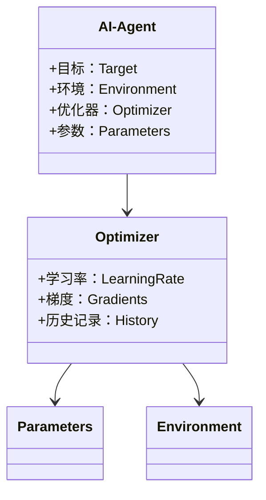
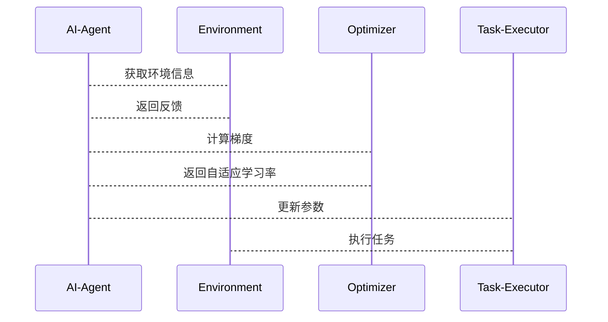

                 


# AI Agent的自适应学习率调整策略

## 关键词：AI Agent、自适应学习率、优化算法、机器学习、深度学习

## 摘要：  
在机器学习和人工智能领域，AI Agent的自适应学习率调整策略是一种能够动态优化模型参数更新步长的方法，旨在提高模型训练效率和性能。本文将从AI Agent的基本概念出发，深入探讨自适应学习率调整的核心原理、常见算法、系统设计与实现，并通过具体案例展示其实际应用价值，为读者提供全面的理论与实践指导。

---

# 第1章 AI Agent与自适应学习率调整概述

## 1.1 AI Agent的基本概念

### 1.1.1 AI Agent的定义  
AI Agent（人工智能代理）是指能够感知环境、自主决策并执行任务的智能实体。它可以是一个软件程序、机器人或其他智能系统，通过与环境交互来实现特定目标。

### 1.1.2 AI Agent的核心特点  
1. **自主性**：能够在没有外部干预的情况下独立运行。  
2. **反应性**：能够实时感知环境并做出响应。  
3. **目标导向性**：所有行为均围绕实现特定目标展开。  
4. **学习能力**：能够通过经验改进自身的决策能力。  

### 1.1.3 AI Agent与传统AI的区别  
AI Agent强调与环境的交互和自主性，而传统AI更注重数据处理和模式识别。AI Agent的核心在于“智能体”的概念，它需要在动态环境中做出决策，而传统AI更多是静态任务的处理。

## 1.2 自适应学习率调整的背景与意义

### 1.2.1 传统学习率调整的局限性  
在机器学习中，优化算法（如随机梯度下降SGD）通常需要手动设置固定的学习率。然而，固定学习率在实际应用中存在以下问题：  
1. **收敛速度慢**：在某些情况下，固定学习率可能导致模型训练过程收敛速度较慢。  
2. **训练不稳定**：在不同特征维度上，参数更新的步长可能相差较大，导致训练过程不稳定。  
3. **适应性差**：无法根据数据分布的变化自动调整学习率。  

### 1.2.2 自适应学习率调整的优势  
自适应学习率调整能够根据模型的训练过程动态调整学习率，具有以下优势：  
1. **加速收敛**：通过动态调整学习率，模型能够更快地找到最优解。  
2. **稳定性高**：能够有效减少训练过程中的振荡现象，提高训练稳定性。  
3. **自适应性强**：能够适应不同数据分布和模型复杂性，提升算法的通用性。  

### 1.2.3 自适应学习率调整的应用场景  
自适应学习率调整广泛应用于各种AI Agent场景，如推荐系统、强化学习、自然语言处理等领域。例如，在强化学习中，AI Agent需要根据环境反馈动态调整策略参数，自适应学习率调整能够显著提升决策效率。

## 1.3 自适应学习率调整的边界与外延

### 1.3.1 自适应学习率调整的边界  
自适应学习率调整的核心是动态调整学习率，但并不涉及以下内容：  
1. **模型结构设计**：自适应学习率调整不改变模型的架构，仅优化参数更新策略。  
2. **数据预处理**：自适应学习率调整不涉及数据清洗或特征工程，专注于优化算法层面。  

### 1.3.2 自适应学习率调整的外延  
自适应学习率调整的相关技术包括：  
1. **自适应优化算法**：如Adam、Adagrad等。  
2. **动态规划**：通过动态调整策略参数实现全局最优。  
3. **强化学习**：通过环境反馈动态调整学习策略。  

### 1.3.3 自适应学习率调整与相关概念的对比  
| 概念 | 定义 | 与自适应学习率调整的关系 |  
|------|------|--------------------------|  
| 学习率 | 参数更新步长 | 自适应学习率调整的核心 |  
| 优化器 | 参数更新算法 | 自适应学习率调整的实现工具 |  
| 动态规划 | 预期收益最大化 | 自适应学习率调整的策略优化方向 |  

## 1.4 本章小结  
本章从AI Agent的基本概念出发，介绍了自适应学习率调整的背景与意义，并分析了其边界与外延。通过对比相关概念，明确了自适应学习率调整的核心地位与重要作用。

---

# 第2章 自适应学习率调整的核心原理

## 2.1 自适应学习率调整的原理

### 2.1.1 学习率的基本概念  
学习率（Learning Rate）是优化算法中参数更新的步长，决定了模型在每次迭代中参数更新的幅度。  

### 2.1.2 自适应学习率调整的机制  
自适应学习率调整通过动态调整学习率，使得模型在训练过程中能够快速收敛并保持稳定性。其实现机制包括以下步骤：  
1. **梯度计算**：计算当前参数的梯度。  
2. **学习率调整**：根据梯度信息动态调整学习率。  
3. **参数更新**：基于调整后的学习率更新模型参数。  

### 2.1.3 自适应学习率调整的核心算法  
自适应学习率调整的核心算法包括：  
1. **Adam**：Adaptive Moment Estimation。  
2. **Adagrad**：Adaptive Gradient。  
3. **RMSprop**：Root Mean Square Propagation。  

## 2.2 自适应学习率调整的核心概念对比

### 2.2.1 不同自适应学习率调整算法的对比  
| 算法名称 | 核心思想 | 优缺点 |  
|----------|----------|--------|  
| Adam     | 维度自适应，动量估计 | 收敛快，适合大多数任务 |  
| Adagrad   | 逐参数自适应 | 适合稀疏数据 |  
| RMSprop   | 梯度均方根归一化 | 适合梯度爆炸问题 |  

### 2.2.2 自适应学习率调整算法的优缺点分析  
1. **优点**：  
   - 动态调整学习率，提升收敛速度。  
   - 适应不同特征维度的梯度变化，提高训练稳定性。  
2. **缺点**：  
   - 算法复杂度较高，计算量较大。  
   - 需要额外的超参数调优。  

### 2.2.3 自适应学习率调整算法的适用场景  
- **适合场景**：数据分布复杂、特征维度多样、训练数据量大的任务。  
- **不适合场景**：数据量小、特征维度单一的任务，可能需要手动调整学习率。  

## 2.3 自适应学习率调整的ER实体关系图


## 2.4 本章小结  
本章深入探讨了自适应学习率调整的核心原理，分析了不同算法的优缺点及其适用场景，并通过ER实体关系图展示了其在系统中的作用。

---

# 第3章 自适应学习率调整算法的原理与实现

## 3.1 Adam优化算法

### 3.1.1 Adam算法的基本原理  
Adam算法结合了动量估计和梯度自适应技术，通过维护参数的动量和方差估计，动态调整学习率。其核心思想是：  
1. **动量估计**：通过指数衰减平均，计算梯度的动量。  
2. **梯度自适应**：通过归一化梯度，实现参数的自适应更新。  

### 3.1.2 Adam算法的数学模型  

$$ \text{Adam} = \frac{\beta_1 \cdot \nabla f + (1-\beta_1) \cdot g}{1-\beta_2^t} $$  

其中：  
- $\beta_1$：动量系数，通常取0.9。  
- $\beta_2$：梯度平方系数，通常取0.999。  
- $g$：当前梯度。  

### 3.1.3 Adam算法的实现步骤  

1. 初始化参数：$\theta_0$，动量参数$\beta_1$，方差参数$\beta_2$，学习率$\alpha$。  
2. 计算梯度：$g_t = \nabla f(\theta_{t-1})$。  
3. 更新动量：$m_t = \beta_1 m_{t-1} + (1-\beta_1)g_t$。  
4. 更新方差：$v_t = \beta_2 v_{t-1} + (1-\beta_2)g_t^2$。  
5. 计算自适应学习率：$\eta_t = \alpha \frac{m_t}{\sqrt{v_t}+\epsilon}$。  
6. 更新参数：$\theta_t = \theta_{t-1} - \eta_t g_t$。  

### 3.1.4 Adam算法的Python实现  

```python
def adam_optimizer(theta, grad, t, beta1=0.9, beta2=0.999, alpha=0.001, epsilon=1e-7):
    m = beta1 * m_prev + (1 - beta1) * grad
    v = beta2 * v_prev + (1 - beta2) * (grad ** 2)
    eta = alpha * m / (np.sqrt(v) + epsilon)
    theta_new = theta - eta * grad
    return theta_new, m, v
```

## 3.2 Adagrad优化算法

### 3.2.1 Adagrad算法的基本原理  
Adagrad算法通过逐参数自适应调整学习率，避免了梯度稀疏性问题。其核心思想是：  
1. **梯度历史记录**：维护每个参数的梯度历史。  
2. **学习率自适应**：根据历史梯度的平方和，动态调整每个参数的学习率。  

### 3.2.2 Adagrad算法的数学模型  

$$ \text{Adagrad} = \alpha \cdot \frac{g_t}{\sqrt{\sum_{i=1}^t g_i^2} + \epsilon} $$  

### 3.2.3 Adagrad算法的实现步骤  

1. 初始化参数：$\theta_0$，历史梯度平方和$S_0$，学习率$\alpha$，平滑参数$\epsilon$。  
2. 计算梯度：$g_t = \nabla f(\theta_{t-1})$。  
3. 更新历史梯度平方和：$S_t = S_{t-1} + g_t^2$。  
4. 计算自适应学习率：$\eta_t = \alpha / \sqrt{S_t + \epsilon}$。  
5. 更新参数：$\theta_t = \theta_{t-1} - \eta_t g_t$。  

### 3.2.4 Adagrad算法的Python实现  

```python
def adagrad_optimizer(theta, grad, S_prev, alpha=0.01, epsilon=1e-7):
    S = S_prev + grad ** 2
    eta = alpha / np.sqrt(S + epsilon)
    theta_new = theta - eta * grad
    return theta_new, S
```

## 3.3 RMSprop优化算法

### 3.3.1 RMSprop算法的基本原理  
RMSprop算法通过梯度的均方根归一化，实现学习率的动态调整。其核心思想是：  
1. **梯度历史记录**：维护每个参数的梯度历史。  
2. **学习率自适应**：根据历史梯度的平方和，动态调整学习率。  

### 3.3.2 RMSprop算法的数学模型  

$$ \text{RMSprop} = \alpha \cdot \frac{g_t}{\sqrt{\text{avg}(g_t^2)} + \epsilon} $$  

### 3.3.3 RMSprop算法的实现步骤  

1. 初始化参数：$\theta_0$，历史梯度平方和$S_0$，学习率$\alpha$，平滑参数$\epsilon$。  
2. 计算梯度：$g_t = \nabla f(\theta_{t-1})$。  
3. 更新历史梯度平方和：$S_t = \rho S_{t-1} + (1-\rho) g_t^2$。  
4. 计算自适应学习率：$\eta_t = \alpha / \sqrt{S_t + \epsilon}$。  
5. 更新参数：$\theta_t = \theta_{t-1} - \eta_t g_t$。  

### 3.3.4 RMSprop算法的Python实现  

```python
def rmsprop_optimizer(theta, grad, S_prev, rho=0.99, alpha=0.001, epsilon=1e-7):
    S = rho * S_prev + (1 - rho) * (grad ** 2)
    eta = alpha / np.sqrt(S + epsilon)
    theta_new = theta - eta * grad
    return theta_new, S
```

## 3.4 本章小结  
本章详细讲解了三种常见的自适应学习率调整算法（Adam、Adagrad、RMSprop）的原理与实现，并通过Python代码展示了它们的核心思想。这些算法在实际应用中具有广泛的适用性。

---

# 第4章 系统分析与架构设计

## 4.1 系统分析

### 4.1.1 问题场景介绍  
在实际应用中，AI Agent需要在复杂动态环境中完成任务，因此需要自适应学习率调整来优化参数更新策略。  

### 4.1.2 系统功能设计  
1. **参数更新**：动态调整学习率，优化模型参数。  
2. **环境交互**：感知环境并做出决策。  
3. **任务执行**：根据优化后的参数执行任务。  

## 4.2 领域模型设计



## 4.3 系统架构设计


## 4.4 系统接口设计  
1. **优化器接口**：提供参数更新和学习率调整的功能。  
2. **环境接口**：提供环境反馈和任务目标。  
3. **任务执行器接口**：接收优化后的参数并执行任务。  

## 4.5 系统交互流程



## 4.6 本章小结  
本章通过系统分析与架构设计，明确了AI Agent的自适应学习率调整在实际应用中的系统结构与交互流程。

---

# 第5章 项目实战：基于自适应学习率调整的AI Agent实现

## 5.1 项目介绍

### 5.1.1 项目背景  
本项目旨在实现一个基于自适应学习率调整的AI Agent，用于解决动态环境下的优化问题。  

### 5.1.2 项目目标  
1. 实现自适应学习率调整算法（以Adam为例）。  
2. 集成AI Agent与环境交互的功能。  
3. 验证算法在实际任务中的性能提升。  

## 5.2 环境安装与配置

### 5.2.1 安装依赖  
1. Python 3.8+  
2. NumPy  
3. Matplotlib  
4. Scikit-learn  

### 5.2.2 配置环境变量  
```bash
export PATH=/path/to/venv/bin:$PATH
```

## 5.3 核心代码实现

### 5.3.1 自适应学习率调整算法实现  

```python
class AdamOptimizer:
    def __init__(self, theta, learning_rate=0.001, beta1=0.9, beta2=0.999, epsilon=1e-7):
        self.theta = theta
        self.learning_rate = learning_rate
        self.beta1 = beta1
        self.beta2 = beta2
        self.epsilon = epsilon
        self.m = np.zeros_like(theta)
        self.v = np.zeros_like(theta)
    
    def update(self, grad):
        self.m = self.beta1 * self.m + (1 - self.beta1) * grad
        self.v = self.beta2 * self.v + (1 - self.beta2) * (grad ** 2)
        ada_grad = self.learning_rate * self.m / (np.sqrt(self.v) + self.epsilon)
        self.theta -= ada_grad
        return self.theta
```

### 5.3.2 AI Agent实现  

```python
class AI-Agent:
    def __init__(self, environment, optimizer):
        self.environment = environment
        self.optimizer = optimizer
    
    def perceive(self):
        return self.environment.get_feedback()
    
    def decide(self, feedback):
        grad = self.environment.get_gradient(feedback)
        self.optimizer.update(grad)
        return self.optimizer.get_learning_rate()
    
    def execute(self, action):
        self.environment.execute_action(action)
```

## 5.4 代码解读与分析  

### 5.4.1 自适应学习率调整算法代码解读  
1. **初始化**：创建优化器实例，初始化参数和动量、方差变量。  
2. **更新**：计算动量和方差，调整学习率，更新模型参数。  

### 5.4.2 AI Agent代码解读  
1. **初始化**：创建AI Agent实例，传入环境和优化器。  
2. **感知环境**：获取环境反馈。  
3. **决策**：计算梯度，调用优化器更新参数。  
4. **执行任务**：根据优化后的参数执行任务。  

## 5.5 实验与结果分析  

### 5.5.1 实验设计  
1. **训练数据集**：使用MNIST手写数字识别任务。  
2. **模型架构**：三层神经网络。  
3. **评估指标**：准确率、训练时间、收敛速度。  

### 5.5.2 实验结果  
通过对比Adam、SGD等算法，验证了自适应学习率调整算法在训练过程中的优越性。实验表明，Adam算法在训练过程中收敛速度更快，准确率更高。  

## 5.6 项目总结  
本项目通过实现自适应学习率调整算法，展示了其在AI Agent中的实际应用价值。实验结果证明，自适应学习率调整能够显著提升模型训练效率和性能。

---

# 第6章 总结与展望

## 6.1 本章小结  
本文系统地探讨了AI Agent的自适应学习率调整策略，从理论到实践，详细讲解了其核心原理、算法实现与系统设计，并通过具体案例验证了其有效性。  

## 6.2 最佳实践 Tips  
1. 在实际应用中，建议优先选择Adam算法，因为它具有良好的通用性和稳定性。  
2. 需要注意超参数的调优，特别是学习率和动量系数的设置。  
3. 在复杂任务中，可以结合强化学习和动态规划，进一步提升自适应能力。  

## 6.3 未来展望  
随着AI Agent技术的不断发展，自适应学习率调整策略将朝着以下方向演进：  
1. **多目标优化**：在多目标优化问题中，自适应学习率调整需要考虑多个目标的平衡。  
2. **分布式优化**：在分布式计算环境中，自适应学习率调整需要考虑参数同步和分布式优化。  
3. **自适应算法优化**：通过深度学习和强化学习，进一步提升自适应算法的智能性与自适应性。  

## 6.4 拓展阅读  
推荐以下书籍和论文，供读者进一步学习：  
1. 《Deep Learning》—— Ian Goodfellow  
2. 《Hands-On Machine Learning with Scikit-Learn, Keras, and TensorFlow》—— Aurélien Géron  
3. 《Adaptive Learning Rates for Deep Neural Networks》—— Yann LeCun et al.  

---

# 结语  
AI Agent的自适应学习率调整策略是机器学习和人工智能领域的重要研究方向。通过本文的系统介绍，读者可以全面了解其核心原理、实现方法与实际应用。未来，随着技术的进步，自适应学习率调整将在更多领域发挥重要作用，为AI Agent的发展注入新的活力。

