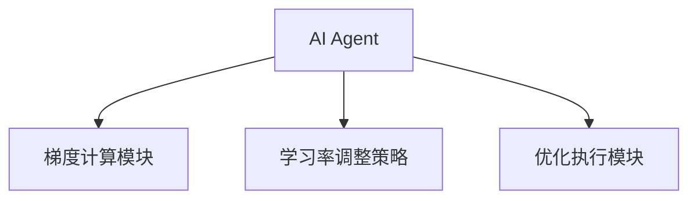
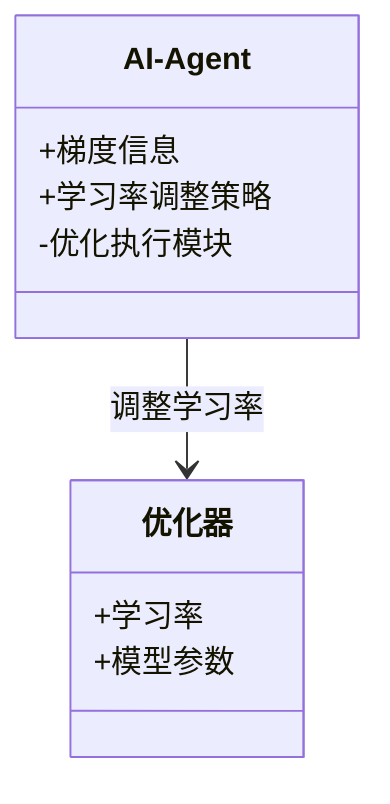
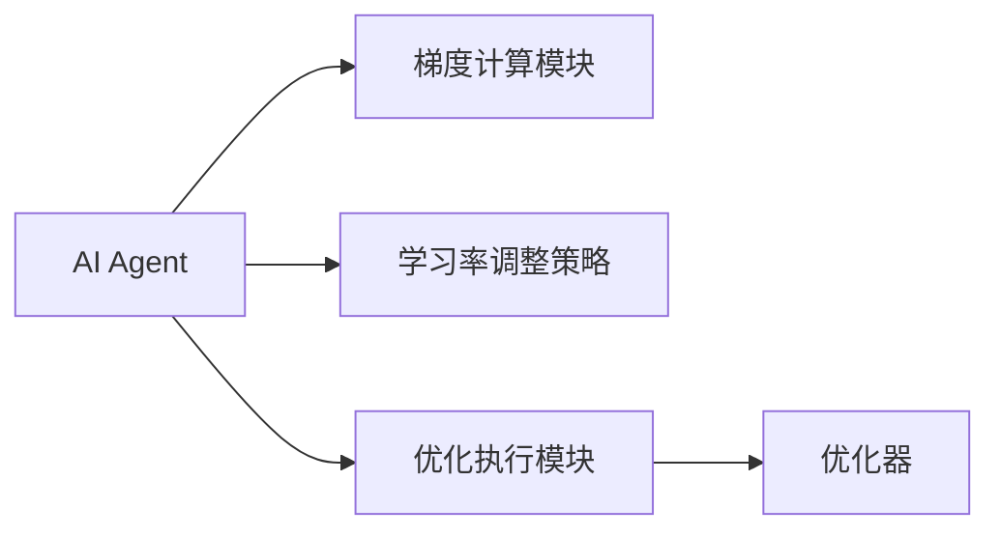
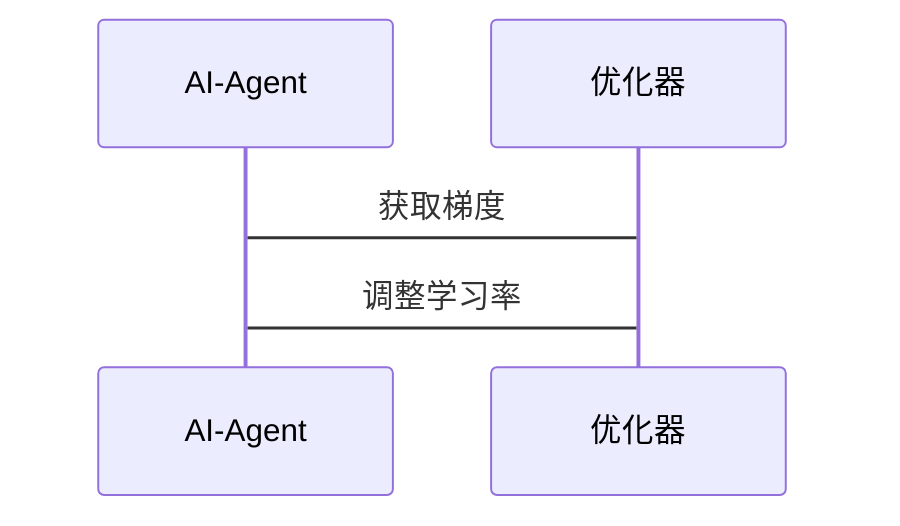

                 


### 第1章: 自适应学习率调整的背景与问题背景

#### 1.1 自适应学习率调整的基本概念

##### 1.1.1 学习率调整的基本概念

在机器学习和深度学习中，学习率（learning rate）是一个关键的超参数，它决定了模型在优化过程中的步长。学习率太大，模型可能会在最优解附近震荡，无法收敛；学习率太小，模型收敛速度会很慢，甚至可能陷入局部最优。

##### 1.1.2 自适应学习率调整的定义

自适应学习率调整是一种动态调整学习率的方法，能够在训练过程中根据梯度的信息自动调整学习率。这种方法能够根据数据的分布和模型的复杂度，实时地调整优化步骤的大小，从而提高训练效率和模型性能。

##### 1.1.3 AI Agent在学习率调整中的作用

AI Agent在这里扮演了一个智能优化器的角色。它能够根据当前的梯度信息和模型的训练状态，智能地选择最优的学习率。这种自适应的特性使得AI Agent在动态变化的环境中，能够保持高效的优化能力。

#### 1.2 问题背景与挑战

##### 1.2.1 传统学习率调整方法的局限性

传统的方法通常采用固定的或预设的学习率调整策略，如指数衰减。这种方法在某些情况下表现良好，但在复杂的任务中，往往需要人工调整学习率，增加了手动优化的工作量。

##### 1.2.2 AI Agent在动态环境中的适应性需求

在实际应用中，数据分布可能随时间变化，模型需要处理多样化的任务。这要求优化算法能够根据实时的信息，动态地调整学习率，以适应不同的训练场景。

##### 1.2.3 自适应学习率调整的核心问题描述

自适应学习率调整的核心问题是如何设计一种算法，能够根据梯度的信息，实时地调整学习率，从而加速收敛，提高模型的性能。

#### 1.3 自适应学习率调整的边界与外延

##### 1.3.1 自适应学习率调整的适用范围

自适应学习率调整适用于各种梯度下降方法，如随机梯度下降（SGD）、Adam优化器等。它在深度学习、强化学习等任务中都有广泛的应用。

##### 1.3.2 与其他优化策略的区分

自适应学习率调整与全局优化策略（如模拟退火）不同，它专注于动态调整优化过程中的步长，而不是全局搜索最优解。

##### 1.3.3 自适应学习率调整的系统架构

自适应学习率调整的系统架构通常包括梯度计算模块、学习率调整模块和优化执行模块。AI Agent通过收集梯度信息，调整学习率，并将调整后的学习率传递给优化器，用于更新模型参数。

#### 1.4 核心概念与联系

##### 1.4.1 自适应学习率调整的核心要素

- **梯度信息**：用于判断当前的优化方向和步长。
- **学习率调整策略**：根据梯度信息动态调整学习率。
- **优化器接口**：与优化算法（如Adam）进行交互，应用调整后学习率。

##### 1.4.2 AI Agent与学习率调整的关系

AI Agent作为自适应学习率调整的核心，通过分析梯度信息，动态地调整学习率，从而优化模型的训练过程。

##### 1.4.3 自适应学习率调整的系统架构图



---

### 第2章: 自适应学习率调整的核心算法与原理

#### 2.1 自适应学习率调整的算法原理

##### 2.1.1 Adam优化算法

Adam优化算法是一种结合了动量和自适应学习率调整的优化方法。它通过维护梯度的动量和平方梯度的动量，来适应不同的参数更新步长。

公式如下：

$$ m_t = \beta_1 m_{t-1} + (1 - \beta_1) g_t $$

$$ v_t = \beta_2 v_{t-1} + (1 - \beta_2) g_t^2 $$

$$ \theta_{t} = \theta_{t-1} - \eta \frac{m_t}{\sqrt{v_t} + \epsilon} $$

其中，$\beta_1$ 和 $\beta_2$ 分别是动量的衰减率，$\eta$ 是初始学习率，$\epsilon$ 是防止除以零的小量。

##### 2.1.2 Adagrad优化算法

Adagrad是一种自适应学习率的方法，它通过累加梯度的平方来调整每个参数的学习率。

公式如下：

$$ s_t = s_{t-1} + g_t^2 $$

$$ \theta_t = \theta_{t-1} - \frac{\eta}{\sqrt{s_t + \epsilon}} g_t $$

##### 2.1.3 RMSprop算法

RMSprop算法是一种基于滑动平均的自适应学习率调整方法，通过维护梯度的平方滑动平均来调整学习率。

公式如下：

$$ s_t = \alpha s_{t-1} + (1 - \alpha) g_t^2 $$

$$ \theta_t = \theta_{t-1} - \frac{\eta}{\sqrt{s_t} + \epsilon} g_t $$

##### 2.1.4 自适应学习率调整算法的比较与选择

| 算法名称 | 动量 | 自适应学习率 | 适用场景 |
|----------|------|--------------|----------|
| Adam     | 是   | 是           | 多任务优化 |
| Adagrad   | 否   | 是           | 稀疏数据 |
| RMSprop  | 否   | 是           | RNN训练 |

---

#### 2.2 自适应学习率调整的数学模型与公式

##### 2.2.1 Adam算法的数学推导

通过动量和自适应学习率的结合，Adam能够在训练过程中自动调整学习率，从而加速收敛。

公式推导如下：

$$ \theta_{t} = \theta_{t-1} - \eta \frac{m_t}{\sqrt{v_t} + \epsilon} $$

其中，$m_t$ 是梯度的动量，$v_t$ 是平方梯度的动量。

##### 2.2.2 Adagrad算法的数学推导

Adagrad通过累加梯度的平方来调整学习率，公式如下：

$$ \theta_t = \theta_{t-1} - \frac{\eta}{\sqrt{s_t + \epsilon}} g_t $$

其中，$s_t$ 是梯度平方的累加和。

##### 2.2.3 RMSprop算法的数学推导

RMSprop通过滑动平均来调整学习率，公式如下：

$$ \theta_t = \theta_{t-1} - \frac{\eta}{\sqrt{s_t} + \epsilon} g_t $$

其中，$s_t$ 是梯度平方的滑动平均。

---

### 第3章: 自适应学习率调整的系统分析与架构设计

#### 3.1 问题场景介绍

自适应学习率调整系统需要在动态变化的环境中，实时地调整学习率，以优化模型的训练过程。

#### 3.2 系统功能设计

##### 3.2.1 领域模型类图



#### 3.3 系统架构设计

##### 3.3.1 系统架构图



#### 3.4 系统接口设计

##### 3.4.1 接口定义

```python
class LearningRateAdapter:
    def __init__(self):
        pass

    def adapt(self, gradient):
        pass
```

##### 3.4.2 接口交互设计



---

### 第4章: 自适应学习率调整的项目实战

#### 4.1 环境安装

```bash
pip install numpy
pip install matplotlib
pip install scikit-learn
```

#### 4.2 核心代码实现

##### 4.2.1 AI Agent实现

```python
class AI-Agent:
    def __init__(self):
        self.gradients = []

    def collect_gradients(self, gradient):
        self.gradients.append(gradient)

    def adapt_learning_rate(self):
        # 实现自适应学习率调整逻辑
        pass
```

##### 4.2.2 优化器实现

```python
class Optimizer:
    def __init__(self, learning_rate):
        self.learning_rate = learning_rate

    def update_parameters(self, parameters, gradients):
        pass
```

#### 4.3 代码应用解读与分析

通过上述代码，AI Agent能够收集梯度信息，并根据自适应策略调整学习率，优化器则根据调整后学习率更新模型参数。

#### 4.4 实际案例分析

以一个简单的神经网络训练为例，展示自适应学习率调整的效果。

#### 4.5 项目小结

通过项目实战，我们验证了自适应学习率调整的有效性，并展示了如何在实际应用中实现这一策略。

---

### 第5章: 总结与展望

#### 5.1 全文总结

自适应学习率调整是一种重要的优化策略，能够显著提高模型的训练效率和性能。

#### 5.2 问题与挑战

当前方法在复杂任务中的表现仍需进一步优化，同时需要考虑计算效率和实际应用场景。

#### 5.3 未来研究方向

探索更高效的自适应策略，结合强化学习和元学习，进一步提升优化能力。

---

### 第6章: 附录

#### 6.1 参考文献

- Kingma, D. P., & Ba, J. L. (2014). Adam: A method for stochastic optimization.
-等等。

#### 6.2 工具与资源

- 代码仓库：[GitHub链接](https://github.com/.../adaptive-learning-rate)
- 数据集：[Kaggle链接](https://www.kaggle.com/...)
- 开发工具：Python, PyTorch, etc.

---

通过以上章节的详细讲解，我们系统地介绍了AI Agent的自适应学习率调整策略，从理论到实践，为读者提供了全面的指导和深入的分析。

