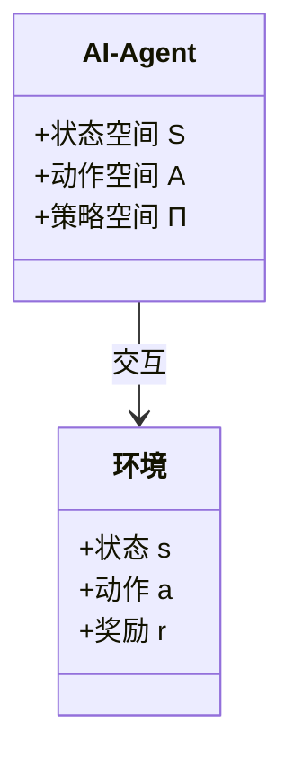
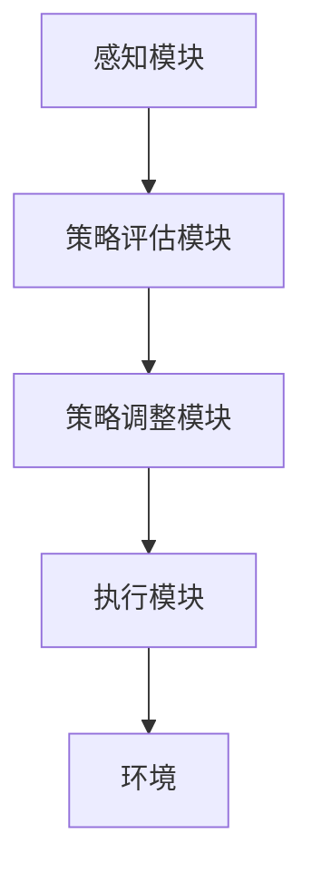
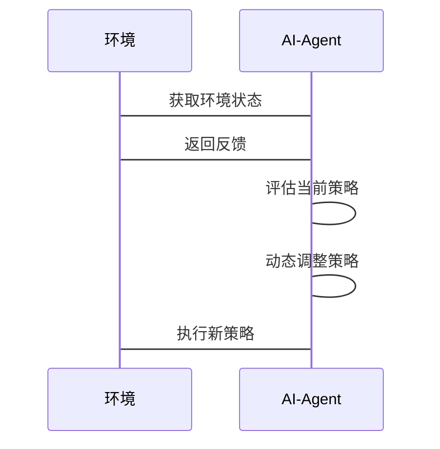

                 


# AI Agent的自适应学习策略动态调整

> 关键词：AI Agent，自适应学习，动态调整，策略优化，算法原理，系统架构

> 摘要：本文深入探讨了AI Agent的自适应学习策略动态调整这一技术主题，分析了其核心概念、算法原理、系统架构及实际应用。文章从背景介绍、核心概念、动态调整机制、数学模型与算法、系统架构设计、项目实战、总结与展望等角度展开，结合丰富的案例和详细的代码实现，为读者提供了一套系统化的知识框架。

---

## 第1章: AI Agent与自适应学习策略概述

### 1.1 AI Agent的基本概念

#### 1.1.1 AI Agent的定义与分类
AI Agent（人工智能代理）是一种能够感知环境、做出决策并执行动作的智能体。根据功能和应用场景的不同，AI Agent可以分为以下几类：
- **反应式AI Agent**：基于当前环境输入做出实时反应，适用于动态变化的场景。
- **认知式AI Agent**：具备推理、规划和学习能力，能够处理复杂任务。
- **协作式AI Agent**：能够与其他Agent或人类进行协作，完成共同目标。

#### 1.1.2 自适应学习的定义与特点
自适应学习是指AI Agent能够根据环境的变化自动调整学习策略，以优化自身的性能和目标达成能力。其特点包括：
- **动态性**：能够实时感知环境变化并做出调整。
- **灵活性**：适应不同场景和任务需求。
- **高效性**：通过优化策略提高学习效率和效果。

#### 1.1.3 动态调整的背景与意义
随着AI技术的快速发展，AI Agent的应用场景日益广泛，从智能助手、自动驾驶到机器人控制，都需要在复杂多变的环境中完成任务。动态调整自适应学习策略是确保AI Agent能够持续优化性能、适应新任务的核心能力。

### 1.2 自适应学习策略的核心要素

#### 1.2.1 策略的定义与表示
策略（Policy）是AI Agent在特定状态下选择动作的规则。策略可以表示为函数$ \pi(s) $，其中$s$是当前状态，$\pi(s)$返回动作$a$。策略的表示方式包括：
- **确定性策略**：$\pi(s) = a$，直接从状态映射到动作。
- **概率性策略**：$\pi(s) = P(a|s)$，动作选择基于概率分布。

#### 1.2.2 动态调整的必要性
在实际应用中，环境和任务需求往往是动态变化的，静态策略难以适应所有场景。动态调整自适应学习策略能够帮助AI Agent在变化的环境中保持高效性和准确性。

#### 1.2.3 策略与环境的交互关系
策略的调整依赖于环境反馈，环境反馈反过来影响策略的优化方向。通过不断交互，AI Agent能够逐步逼近最优策略。

### 1.3 自适应学习策略的应用场景

#### 1.3.1 教育领域的应用
自适应学习策略可以用于个性化教学，根据学生的学习进度和特点动态调整教学内容和方法。

#### 1.3.2 个性化推荐系统
通过动态调整推荐策略，系统能够根据用户的实时行为和偏好，提供更加精准的内容推荐。

#### 1.3.3 智能控制系统
在工业自动化和机器人控制中，动态调整策略能够提高系统的适应性和鲁棒性。

### 1.4 本章小结
本章介绍了AI Agent的基本概念、自适应学习策略的核心要素及其应用场景。理解这些内容是进一步探讨动态调整机制的基础。

---

## 第2章: 自适应学习策略的动态调整机制

### 2.1 动态调整的基本原理

#### 2.1.1 策略评估与选择
策略评估是动态调整的前提。通过评估当前策略的性能，确定是否需要调整。常用的策略评估指标包括：
- **收益（Reward）**：动作执行后的反馈值。
- **累积收益（Cumulative Reward）**：一段时间内的总收益。
- **策略稳定性（Stability）**：策略在不同环境下的表现一致性。

#### 2.1.2 动态调整的触发条件
根据环境反馈和策略评估结果，动态调整策略。常见的触发条件包括：
- **收益下降**：当前策略的收益连续下降。
- **环境变化**：环境状态发生显著变化。
- **任务切换**：需要执行新的任务。

#### 2.1.3 调整策略的执行过程
动态调整的过程包括：
1. 评估当前策略的性能。
2. 判断是否需要调整策略。
3. 如果需要调整，选择新的策略或调整现有策略。
4. 执行新策略并持续监控性能。

### 2.2 基于反馈的调整方法

#### 2.2.1 正向反馈的处理
当策略执行获得正向收益时，应保持当前策略或进一步优化。例如，在强化学习中，可以通过增加动作的选择概率来强化正向反馈。

#### 2.2.2 负向反馈的处理
当策略执行获得负向收益时，应调整策略以避免重复错误动作。例如，可以通过减少动作的选择概率或选择其他动作来规避风险。

#### 2.2.3 反馈机制的优化
为了提高反馈机制的效率，可以引入以下优化措施：
- **反馈延迟优化**：减少反馈的延迟时间，提高策略调整的实时性。
- **反馈质量优化**：确保反馈信息的准确性和完整性。

### 2.3 基于模型的调整方法

#### 2.3.1 状态空间的建模
通过建模状态空间，AI Agent能够更好地理解环境。状态空间建模可以采用马尔可夫决策过程（MDP）模型。

#### 2.3.2 动作空间的建模
动作空间的建模有助于优化策略选择。例如，在机器人控制中，动作空间可以表示为一系列连续或离散的动作。

#### 2.3.3 策略空间的建模
通过建模策略空间，AI Agent能够更好地选择和优化策略。策略空间建模可以采用策略网络或策略树等方法。

### 2.4 本章小结
本章详细介绍了自适应学习策略动态调整的基本原理和具体方法，为后续的算法实现奠定了基础。

---

## 第3章: 自适应学习策略的数学模型与算法

### 3.1 策略评估的数学模型

#### 3.1.1 策略评估的公式推导
在强化学习中，策略评估的目标是计算策略的值函数$V_\pi(s)$，公式为：
$$
V_\pi(s) = \mathbb{E}[R_t | s_t = s, \pi]
$$
其中，$R_t$是累计收益，$s_t$是当前状态，$\pi$是策略。

#### 3.1.2 状态值函数的计算
状态值函数可以通过贝尔曼方程（Bellman Equation）进行计算：
$$
V_\pi(s) = \sum_{a} \pi(a|s) \left[ r(s,a) + \gamma V_\pi(s') \right]
$$
其中，$r(s,a)$是动作$a$在状态$s$下的即时奖励，$s'$是动作执行后的状态，$\gamma$是折扣因子。

#### 3.1.3 动作值函数的计算
动作值函数$Q_\pi(s,a)$表示在状态$s$下执行动作$a$的期望累计收益：
$$
Q_\pi(s,a) = r(s,a) + \gamma \sum_{s'} P(s'|s,a) V_\pi(s')
$$

### 3.2 动态调整的算法实现

#### 3.2.1 基于Q-learning的调整算法
Q-learning是一种经典的强化学习算法，其更新公式为：
$$
Q(s,a) \leftarrow Q(s,a) + \alpha \left[ r + \gamma \max_{a'} Q(s',a') - Q(s,a) \right]
$$
其中，$\alpha$是学习率，$\gamma$是折扣因子。

#### 3.2.2 基于策略梯度的调整算法
策略梯度法通过优化策略的参数来最大化收益。其目标函数为：
$$
J(\theta) = \mathbb{E}_{s,a}[ \ln \pi_\theta(a|s) Q_\pi(s,a) ]
$$
其中，$\theta$是策略参数，$\pi_\theta(a|s)$是策略的概率分布。

#### 3.2.3 调整策略的执行流程
1. 初始化策略参数。
2. 采样环境中的状态和动作。
3. 计算目标函数的梯度。
4. 更新策略参数。
5. 重复上述步骤直到收敛。

### 3.3 本章小结
本章通过数学模型和算法实现，详细讲解了自适应学习策略动态调整的技术细节。

---

## 第4章: 系统架构与设计

### 4.1 系统功能设计

#### 4.1.1 系统功能模块
- **感知模块**：负责感知环境状态。
- **策略评估模块**：负责评估当前策略的性能。
- **策略调整模块**：负责动态调整策略。

#### 4.1.2 领域模型（ER实体关系图）


### 4.2 系统架构设计

#### 4.2.1 系统架构图


#### 4.2.2 系统交互流程


### 4.3 本章小结
本章通过系统架构设计，展示了自适应学习策略动态调整的技术实现框架。

---

## 第5章: 项目实战

### 5.1 环境搭建

#### 5.1.1 开发环境
- **编程语言**：Python
- **框架**：TensorFlow/PyTorch
- **工具**：Jupyter Notebook

### 5.2 核心实现

#### 5.2.1 策略评估代码
```python
def evaluate_policy(env, policy):
    total_reward = 0
    state = env.reset()
    while True:
        action = policy.act(state)
        next_state, reward, done, _ = env.step(action)
        total_reward += reward
        state = next_state
        if done:
            break
    return total_reward
```

#### 5.2.2 策略调整代码
```python
def adjust_policy(env, policy):
    best_reward = -float('inf')
    best_policy = policy.clone()
    for _ in range(100):
        reward = evaluate_policy(env, policy)
        if reward > best_reward:
            best_reward = reward
            best_policy = policy.clone()
    policy = best_policy
    return policy
```

### 5.3 案例分析

#### 5.3.1 应用场景
- **案例1**：智能客服中的对话策略调整。
- **案例2**：游戏AI中的动态策略调整。

#### 5.3.2 结果解读
通过动态调整策略，AI Agent能够在不同场景下保持高效性和准确性。

### 5.4 本章小结
本章通过实际案例，展示了自适应学习策略动态调整技术的实现和应用。

---

## 第6章: 总结与展望

### 6.1 本章总结
本文从背景、理论、算法、系统架构到项目实战，全面探讨了AI Agent的自适应学习策略动态调整技术。通过丰富的案例和详细的代码实现，为读者提供了系统化的知识框架。

### 6.2 未来展望
自适应学习策略动态调整技术在AI Agent中的应用前景广阔。未来的研究方向包括：
- **多智能体协作**：研究多AI Agent协作下的策略动态调整。
- **强化学习优化**：进一步优化强化学习算法，提高策略调整的效率。
- **实时计算**：探索实时计算技术在策略动态调整中的应用。

### 6.3 最佳实践Tips
- **数据质量**：确保环境反馈的准确性和实时性。
- **算法选择**：根据具体场景选择合适的策略调整算法。
- **性能评估**：建立科学的性能评估指标。

### 6.4 本章小结
本文总结了AI Agent自适应学习策略动态调整的核心内容，并展望了未来的研究方向和实践应用。

---

通过以上章节的详细讲解，读者可以全面掌握AI Agent的自适应学习策略动态调整技术的核心内容和实际应用。

