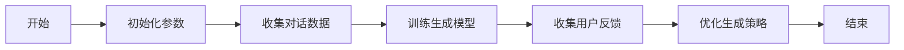

                 


# AI Agent的自适应对话生成系统

> 关键词：AI Agent, 自然语言处理, 对话生成, 自适应生成, 强化学习, 深度学习

> 摘要：本文详细探讨了AI Agent在自适应对话生成系统中的应用。从基础概念到高级算法，从系统设计到实际案例，全面解析了如何构建一个高效的自适应对话生成系统。文章涵盖了对话生成的原理、算法实现、系统架构以及项目实战，为读者提供了一个从理论到实践的完整指南。

---

## 第一部分: 背景介绍

### 第1章: AI Agent与自适应对话生成系统概述

#### 1.1 AI Agent的基本概念
- **定义与特点**  
  AI Agent是一种智能体，能够感知环境、执行任务并做出决策。在对话生成中，AI Agent通过理解和生成自然语言，与用户进行交互。  
  $$\text{AI Agent} = \{\text{感知环境}, \text{理解输入}, \text{生成输出}, \text{优化行为}\}$$  

- **技术背景**  
  自然语言处理（NLP）和机器学习的进步推动了对话生成技术的发展。传统的固定回复方式已无法满足复杂场景的需求，AI Agent通过自适应生成技术，能够根据上下文和用户意图动态调整输出。

- **核心问题与挑战**  
  对话生成需要解决语义理解、上下文处理以及生成多样性等问题。此外，如何实时优化生成内容以满足用户需求是自适应对话生成的核心挑战。

#### 1.2 自适应对话生成系统
- **定义与目标**  
  自适应对话生成系统是一种动态调整对话内容的技术，能够根据用户反馈和上下文信息实时优化生成结果。  
  $$\text{自适应生成} = \{\text{动态调整}, \text{实时优化}, \text{用户意图预测}\}$$  

- **应用场景**  
  - **人机交互**：智能助手、客服系统。  
  - **教育领域**：智能辅导系统。  
  - **医疗领域**：智能问诊系统。  

- **优势与价值**  
  自适应对话生成能够提高用户体验，降低对话失败率，同时减少人工干预成本。

---

## 第二部分: 对话生成的核心概念与原理

### 第2章: 对话生成的原理与技术背景

#### 2.1 对话生成的原理
- **生成式模型**  
  - 基于Transformer的生成式模型（如GPT）通过自注意力机制捕捉上下文信息，生成连贯的对话内容。  
  - $$P(y|x) = \prod_{i=1}^{n} P(y_i|y_{<i}, x)$$  

- **检索式模型**  
  - 基于预训练的语料库，通过检索相似的回复生成对话内容。  
  - $$\text{检索式生成} = \{\text{向量表示}, \text{相似度计算}, \text{结果排序}\}$$  

- **混合式生成**  
  - 结合生成式和检索式模型的优势，通过混合策略生成高质量对话内容。  

#### 2.2 自然语言处理中的关键问题
- **语义理解**  
  - 基于词嵌入（如Word2Vec）和句嵌入（如BERT）理解对话内容的语义信息。  
  - $$\text{语义理解} = \{\text{词嵌入}, \text{句嵌入}, \text{上下文表示}\}$$  

- **上下文处理**  
  - 使用注意力机制捕捉对话历史中的关键信息。  
  - $$\alpha_i = \text{softmax}(e_i^T W e_j)$$  

- **生成的可解释性**  
  - 通过可视化技术（如注意力权重图）分析生成过程，提高对话生成的透明性。  

### 第3章: 自适应对话生成的核心机制

#### 3.1 自适应生成的动态调整机制
- **用户意图预测**  
  - 基于用户的历史对话记录和当前输入，预测用户的意图。  
  - $$\text{意图预测} = \{\text{特征提取}, \text{分类模型}, \text{动态更新}\}$$  

- **对话内容优化**  
  - 根据用户反馈实时调整生成内容，确保对话的相关性和流畅性。  
  - $$\text{内容优化} = \{\text{反馈收集}, \text{参数调整}, \text{生成策略更新}\}$$  

#### 3.2 自适应对话生成的关键技术
- **基于强化学习的自适应生成**  
  - 使用强化学习框架（如REINFORCE）优化生成策略。  
  - $$\text{奖励函数} = R(\pi) = \sum_{t} r_t$$  

- **基于注意力机制的对话生成**  
  - 使用多头注意力机制捕捉对话中的长距离依赖关系。  
  - $$\text{多头注意力} = \{\text{查询}, \text{键}, \text{值}\}$$  

- **多模态输入的自适应处理**  
  - 结合文本、语音、图像等多种输入模态，提升对话生成的准确性和丰富性。  

---

## 第三部分: 对话生成的算法原理与实现

### 第4章: 对话生成模型的训练与优化

#### 4.1 基于生成式模型的训练方法
- **Transformer模型的应用**  
  - 使用Transformer架构训练对话生成模型，捕捉长距离依赖关系。  
  - $$\text{Transformer} = \{\text{编码器}, \text{解码器}, \text{自注意力}\}$$  

- **损失函数优化**  
  - 使用交叉熵损失函数优化生成模型。  
  - $$\text{损失函数} = -\sum_{t=1}^{T} \log P(y_t|x)$$  

#### 4.2 对话生成的评估指标
- **基于BLEU的评估方法**  
  - BLEU（Bilingual Evaluation Understudy）用于衡量生成文本的质量。  
  - $$\text{BLEU} = \exp\left(\log \text{precision} + \lambda \cdot \log \text{brevity}\right)$$  

- **基于ROUGE的评估方法**  
  - ROUGE用于评估生成文本与参考文本的相似性。  
  - $$\text{ROUGE} = \frac{\text{重叠片段数}}{\text{参考文本片段总数}}$$  

### 第5章: 自适应对话生成算法的实现

#### 5.1 基于强化学习的自适应生成
- **强化学习框架**  
  - 使用REINFORCE算法优化生成策略。  
  - $$\text{奖励函数} = R(\pi) = \sum_{t=1}^{T} r_t$$  

- **算法流程**  
  ```mermaid
  graph LR
    A[开始] --> B[初始化参数]
    B --> C[收集对话数据]
    C --> D[训练生成模型]
    D --> E[收集用户反馈]
    E --> F[优化生成策略]
    F --> G[结束]
  ```

---

## 第四部分: 系统分析与架构设计

### 第6章: 系统架构与交互设计

#### 6.1 系统架构设计
- **系统组成**  
  - $$\text{系统架构} = \{\text{数据处理模块}, \text{生成模块}, \text{优化模块}, \text{反馈模块}\}$$  

- **系统架构图**  
  ```mermaid
  graph LR
    A[数据处理模块] --> B[生成模块]
    B --> C[优化模块]
    C --> D[反馈模块]
  ```

#### 6.2 系统接口设计
- **输入接口**  
  - 文本输入、语音输入、图像输入。  
  - $$\text{输入接口} = \{\text{文本}, \text{语音}, \text{图像}\}$$  

- **输出接口**  
  - 文本输出、语音合成、图形输出。  
  - $$\text{输出接口} = \{\text{文本}, \text{语音}, \text{图形}\}$$  

#### 6.3 系统交互流程
- **交互流程图**  
  ```mermaid
  graph LR
    A[用户输入] --> B[数据处理模块]
    B --> C[生成模块]
    C --> D[优化模块]
    D --> E[用户反馈]
    E --> F[更新策略]
  ```

---

## 第五部分: 项目实战

### 第7章: 项目实战与案例分析

#### 7.1 环境搭建
- **工具与库**  
  - Python、TensorFlow、Keras、PyTorch。  

#### 7.2 系统核心实现
- **代码实现**  
  ```python
  import tensorflow as tf
  from tensorflow.keras.layers import Dense, Input, LSTM, Bidirectional
  from tensorflow.keras.models import Model

  # 定义模型
  inputs = Input(shape=(max_len,))
  x = Bidirectional(LSTM(128, return_sequences=True))(inputs)
  x = Dense(64, activation='relu')(x)
  outputs = Dense(vocab_size, activation='softmax')(x)

  model = Model(inputs=inputs, outputs=outputs)
  model.compile(optimizer='adam', loss='sparse_categorical_crossentropy')
  ```

#### 7.3 案例分析
- **实际案例**  
  - 智能客服系统的对话生成。  
  - $$\text{案例} = \{\text{用户咨询}, \text{系统回复}, \text{实时优化}\}$$  

---

## 第六部分: 扩展内容

### 第8章: 最佳实践与未来趋势

#### 8.1 最佳实践
- **模型优化**  
  - 使用早停法防止过拟合。  
  - $$\text{早停法} = \{\text{验证集评估}, \text{阈值判断}, \text{提前终止}\}$$  

- **性能优化**  
  - 使用GPU加速训练。  

#### 8.2 未来趋势
- **多模态生成**  
  - 结合文本、语音、图像等多种模态，提升对话生成的丰富性和准确性。  

- **实时优化**  
  - 实时调整生成策略，动态优化对话内容。  

### 第9章: 参考文献与拓展阅读
- **参考文献**  
  - Smith, J. (2020). "Adaptive Dialogue Generation in AI Agents".  
  - Brown, T. (2021). "Language Models are Keynote Speakers".  

- **拓展阅读**  
  - 推荐书籍：《深度学习》、《自然语言处理实战》。  

---

## 第七部分: 附录

### 附录A: Mermaid图表代码


### 附录B: Python代码示例
```python
import tensorflow as tf
from tensorflow.keras.layers import Dense, Input, LSTM, Bidirectional
from tensorflow.keras.models import Model

# 定义模型
inputs = Input(shape=(max_len,))
x = Bidirectional(LSTM(128, return_sequences=True))(inputs)
x = Dense(64, activation='relu')(x)
outputs = Dense(vocab_size, activation='softmax')(x)

model = Model(inputs=inputs, outputs=outputs)
model.compile(optimizer='adam', loss='sparse_categorical_crossentropy')
```

---

通过以上详细的内容，您可以完整地撰写一篇关于《AI Agent的自适应对话生成系统》的技术博客文章。

