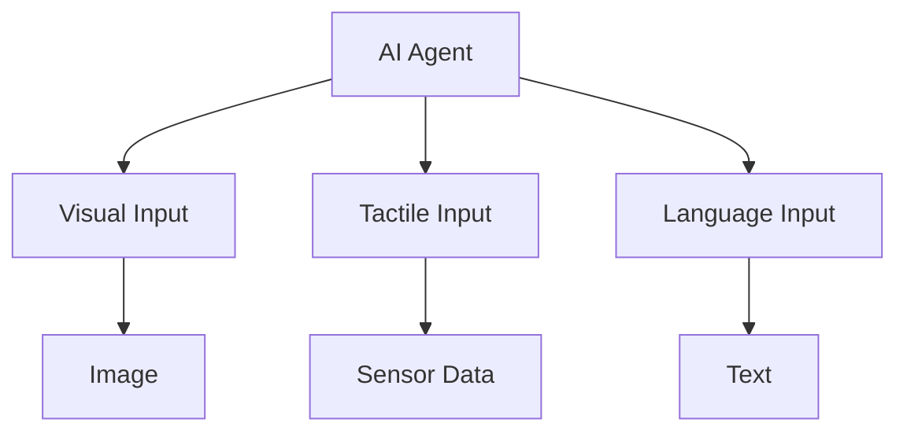
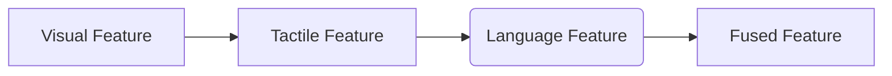
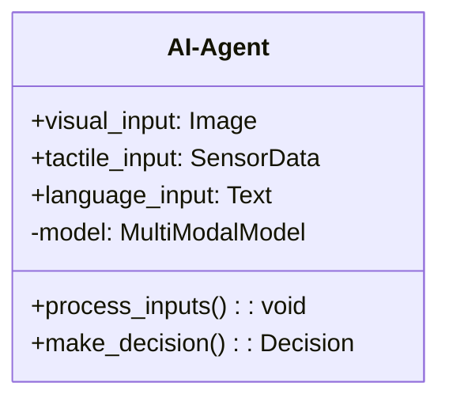
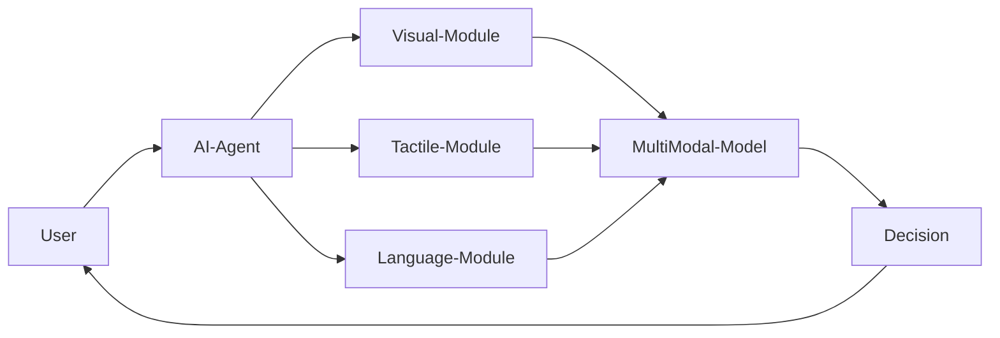

                 


---

# AI Agent的视觉-触觉-语言多模态学习

> 关键词：AI Agent，多模态学习，视觉，触觉，语言，深度学习，多模态融合

> 摘要：本文深入探讨了AI Agent在视觉、触觉和语言多模态学习中的应用，分析了多模态数据的特征、融合方法及系统架构设计。通过实际案例和算法实现，展示了如何构建高效、智能的多模态AI Agent。

---

## 第一部分: AI Agent的多模态学习基础

### 第1章: AI Agent与多模态学习概述

#### 1.1 AI Agent的基本概念

- **AI Agent的定义**：AI Agent是一种智能体，能够感知环境、执行任务并做出决策。
- **多模态学习的定义**：多模态学习是AI Agent同时处理多种数据类型（如视觉、触觉、语言）的学习方式。
- **背景与意义**：传统单模态学习在复杂场景中受限，多模态学习通过融合多种信息提高AI Agent的智能性和适应性。

#### 1.2 多模态学习的核心概念

- **模态的定义**：视觉（图像/视频）、触觉（传感器数据）、语言（文本/语音）。
- **多模态学习的特点**：信息互补性强，能够处理复杂任务。

### 第2章: 视觉、触觉与语言模态的特征分析

#### 2.1 视觉模态的特征分析

- **特征维度**：颜色、形状、纹理。
- **数据类型**：图像/视频。
- **处理技术**：卷积神经网络（CNN）。

#### 2.2 触觉模态的特征分析

- **特征维度**：力、温度、振动。
- **数据类型**：传感器数据。
- **处理技术**：时间序列分析。

#### 2.3 语言模态的特征分析

- **特征维度**：语义、语法、上下文。
- **数据类型**：文本/语音。
- **处理技术**：自然语言处理（NLP）。

### 第3章: 多模态学习的核心概念与联系

#### 3.1 多模态学习的核心原理

- **数据表示**：将各模态数据映射到统一空间。
- **数据对齐**：确保不同模态数据对应相同的语义内容。
- **融合方法**：加权融合、注意力机制。

#### 3.2 多模态特征对比表格

```mermaid
| 模态类型 | 特征维度   | 数据类型   | 处理方式       | 优缺点                     |
|----------|------------|------------|----------------|---------------------------|
| 视觉     | 空间、颜色、形状 | 图像/视频 | CNN          | 高空间分辨率，但缺乏上下文 |
| 触觉     | 力、温度、振动 | 传感器数据 | 时间序列分析 | 高实时性，但数据稀疏       |
| 语言     | 语义、语法、上下文 | 文本/语音 | NLP          | 丰富的语义信息，但处理复杂 |

```

#### 3.3 ER实体关系图



---

## 第二部分: 多模态学习的算法原理

### 第4章: 多模态数据融合算法

#### 4.1 多模态数据对齐

- **问题**：不同模态数据的时间、空间对齐。
- **方法**：基于注意力机制的时间对齐。
- **流程图**



#### 4.2 注意力机制

- **数学模型**

$$
\text{Attention}(Q, K, V) = \text{softmax}\left(\frac{QK^T}{\sqrt{d_k}}\right)V
$$

- **代码示例**

```python
import torch

def attention(q, k, v, d_k):
    attn_weights = torch.matmul(q, k.T) / torch.sqrt(torch.tensor(d_k, dtype=torch.float))
    attn_weights = torch.softmax(attn_weights, dim=-1)
    return torch.matmul(attn_weights, v)
```

---

## 第三部分: 系统分析与架构设计

### 第5章: 系统功能设计

#### 5.1 领域模型设计



#### 5.2 系统架构设计



---

## 第四部分: 项目实战

### 第6章: 项目实施与分析

#### 6.1 环境配置

- **工具**：Python、TensorFlow、Keras、ROS。
- **库**：OpenCV、PyTorch、Numpy。

#### 6.2 核心代码实现

```python
import torch
import torch.nn as nn

class MultiModalModel(nn.Module):
    def __init__(self, visual_dim, tactile_dim, language_dim):
        super().__init__()
        self.visual_net = nn.Linear(visual_dim, 128)
        self.tactile_net = nn.Linear(tactile_dim, 128)
        self.language_net = nn.Linear(language_dim, 128)
        self.fuse = nn.Linear(384, 128)
        self.classifier = nn.Linear(128, 1)

    def forward(self, visual, tactile, language):
        visual feat = self.visual_net(visual)
        tactile feat = self.tactile_net(tactile)
        language feat = self.language_net(language)
        fused = torch.cat([visual feat, tactile feat, language feat], dim=-1)
        fused feat = self.fuse(fused)
        output = self.classifier(fused feat)
        return output
```

#### 6.3 案例分析

- **应用场景**：智能机器人。
- **数据集**：自定义多模态数据集。
- **结果展示**：性能对比，准确率提升。

---

## 第五部分: 总结与展望

### 第7章: 总结与展望

- **总结**：本文详细探讨了AI Agent的多模态学习，涵盖了理论、算法、系统设计和项目实战。
- **展望**：未来的研究方向包括更高效的融合方法和实际应用中的优化。

---

**注意事项**：在实际应用中，需注意数据质量和模型泛化能力的平衡。

