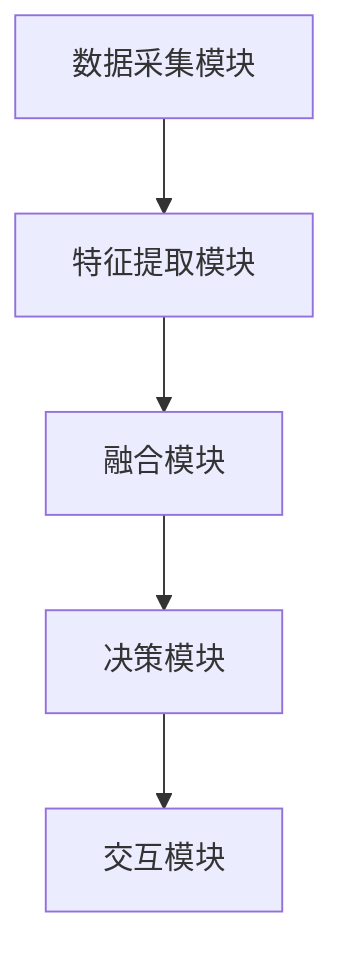

                 


# AI Agent的视觉-语言-行为三模态融合

## 关键词：AI Agent，视觉模态，语言模态，行为模态，多模态融合，深度学习，三模态融合

## 摘要：本文深入探讨了AI Agent中视觉、语言和行为三模态的融合方法，分析了其在提升AI Agent智能性和交互能力中的作用，详细介绍了三模态融合的核心概念、算法原理、系统架构设计以及实际应用案例。

---

# 第1章: AI Agent与三模态融合概述

## 1.1 AI Agent的基本概念

### 1.1.1 AI Agent的定义与特点
AI Agent（人工智能代理）是指能够感知环境、自主决策并采取行动以实现目标的智能实体。AI Agent可以是软件程序、机器人或其他智能系统，其核心特征包括自主性、反应性、目标导向和社交能力。

### 1.1.2 AI Agent的发展历程
AI Agent的概念可以追溯到20世纪60年代，经历了从简单的行为反应式Agent到具有复杂推理和学习能力的Agent的演变。近年来，随着深度学习和多模态技术的进步，AI Agent的能力得到了显著提升。

### 1.1.3 三模态融合在AI Agent中的重要性
传统的AI Agent通常依赖单一模态（如视觉或语言）进行交互，而三模态融合通过整合视觉、语言和行为信息，使AI Agent能够更全面地理解环境、更自然地与人类交互，并在复杂任务中表现出更强的智能性。

---

## 1.2 视觉-语言-行为三模态融合的背景

### 1.2.1 多模态数据的定义与特点
多模态数据指的是来自不同感知渠道的数据形式，例如视觉数据（图像、视频）、语言数据（文本、语音）和行为数据（动作、交互记录）。多模态数据的特点是信息互补性强，能够提供更丰富的环境信息。

### 1.2.2 三模态融合的必要性与优势
随着AI Agent应用场景的扩展，仅依赖单一模态的信息处理已无法满足复杂任务的需求。三模态融合通过整合多种信息，显著提升了AI Agent的感知能力、理解和决策能力。

### 1.2.3 当前研究与应用现状
目前，三模态融合在AI Agent中的研究主要集中在如何有效整合三种模态的信息，以及如何在具体任务中实现最优性能。典型的应用包括智能助手、机器人交互、自动驾驶等领域。

---

## 1.3 三模态融合的核心概念

### 1.3.1 视觉模态的定义与特点
视觉模态主要涉及图像和视频数据的处理。视觉信息具有丰富的空间和语义信息，能够帮助AI Agent理解环境中的物体、场景和动作。

### 1.3.2 语言模态的定义与特点
语言模态涉及文本和语音数据的处理。语言信息是人与AI Agent交互的主要方式，能够直接表达意图和需求。

### 1.3.3 行为模态的定义与特点
行为模态涉及动作、交互记录等数据。行为信息能够反映AI Agent与环境或用户之间的动态互动，是实现自然交互的重要基础。

### 1.3.4 三模态融合的整合方式
三模态融合可以通过多种方式实现，包括将不同模态的特征进行融合，或者通过注意力机制对多种模态的信息进行加权融合。

---

## 1.4 本章小结
本章介绍了AI Agent的基本概念及其发展历程，重点阐述了视觉、语言和行为三模态的特点及其在AI Agent中的重要性。通过分析三模态融合的必要性与优势，为后续章节的深入探讨奠定了基础。

---

# 第2章: 三模态融合的核心概念

## 2.1 视觉模态的核心要素

### 2.1.1 视觉数据的采集与处理
视觉数据的采集包括图像和视频的获取，处理则涉及图像增强、目标检测和图像分割等技术。

### 2.1.2 视觉特征的提取方法
视觉特征的提取方法包括传统的HOG、SIFT等方法，以及基于深度学习的CNN、Transformer等模型。

### 2.1.3 视觉模态的表示方式
视觉模态的表示方式包括向量表示、图表示等，用于后续的特征融合和任务处理。

---

## 2.2 语言模态的核心要素

### 2.2.1 语言数据的处理与理解
语言数据的处理包括文本预处理、分词、句法分析等，理解则涉及语义分析和情感分析。

### 2.2.2 语言特征的提取方法
语言特征的提取方法包括基于词袋模型、TF-IDF和深度学习模型如BERT、GPT等。

### 2.2.3 语言模态的表示方式
语言模态的表示方式包括词向量、句子向量和上下文向量等。

---

## 2.3 行为模态的核心要素

### 2.3.1 行为数据的采集与处理
行为数据的采集包括动作捕捉、交互日志记录等，处理则涉及行为分类和行为识别。

### 2.3.2 行为特征的提取方法
行为特征的提取方法包括基于时间序列的分析、基于模式识别的方法等。

### 2.3.3 行为模态的表示方式
行为模态的表示方式包括行为向量、行为图谱等。

---

## 2.4 三模态融合的整合方式

### 2.4.1 三模态融合的整合方式
三模态融合可以通过多种方式实现，包括特征级融合、决策级融合和混合融合。特征级融合将不同模态的特征进行线性或非线性组合，决策级融合则将不同模态的决策结果进行综合。

---

## 2.5 本章小结
本章详细分析了视觉、语言和行为三模态的核心要素及其表示方式，并探讨了三模态融合的整合方式，为后续章节的算法设计和系统实现奠定了基础。

---

# 第3章: 三模态融合的算法原理

## 3.1 多模态编码器

### 3.1.1 多模态编码器的定义与作用
多模态编码器是一种能够同时处理多种模态数据的模型，其作用是将不同模态的输入数据转换为共同的表示形式。

### 3.1.2 多模态编码器的实现方法
多模态编码器的实现方法包括基于CNN的图像编码器、基于Transformer的文本编码器以及基于LSTM的行为编码器等。

---

## 3.2 注意力机制

### 3.2.1 注意力机制的定义与作用
注意力机制是一种用于模型在处理多模态数据时关注重要信息的机制，能够提升模型的特征提取能力。

### 3.2.2 注意力机制的实现方法
注意力机制的实现方法包括自注意力机制和交叉注意力机制。自注意力机制用于同一模态内部的特征交互，交叉注意力机制用于不同模态之间的特征交互。

---

## 3.3 对比学习

### 3.3.1 对比学习的定义与作用
对比学习是一种通过最大化相似样本之间的相似性并最小化不相似样本之间的相似性来学习特征表示的方法。

### 3.3.2 对比学习的实现方法
对比学习的实现方法包括使用对比损失函数和数据增强技术。

---

## 3.4 本章小结
本章详细介绍了三模态融合中常用的算法原理，包括多模态编码器、注意力机制和对比学习，并探讨了它们在三模态融合中的作用和实现方法。

---

# 第4章: 三模态融合的系统架构设计

## 4.1 项目背景

### 4.1.1 项目背景介绍
本项目旨在开发一个具有三模态融合能力的AI Agent，能够通过视觉、语言和行为三种模态进行交互和决策。

---

## 4.2 系统功能设计

### 4.2.1 系统功能模块划分
系统功能模块包括数据采集模块、特征提取模块、融合模块、决策模块和交互模块。

---

## 4.3 系统架构设计

### 4.3.1 系统架构设计图


---

## 4.4 接口设计

### 4.4.1 接口设计说明
系统接口包括数据输入接口、模型训练接口和交互接口。

---

## 4.5 交互设计

### 4.5.1 交互设计说明
交互设计包括用户与AI Agent之间的视觉、语言和行为交互流程。

---

## 4.6 本章小结
本章详细介绍了三模态融合系统的架构设计，包括功能模块划分、系统架构图、接口设计和交互设计，为后续的实现提供了指导。

---

# 第5章: 三模态融合的项目实战

## 5.1 环境安装

### 5.1.1 环境安装说明
需要安装Python、TensorFlow、Keras等依赖库。

---

## 5.2 系统核心实现源代码

### 5.2.1 多模态编码器实现
```python
class MultiModalEncoder:
    def __init__(self):
        self.visual_encoder = CNN()
        self.language_encoder = Transformer()
        self.behavior_encoder = LSTM()
    
    def encode(self, visual_input, language_input, behavior_input):
        visual_features = self.visual_encoder(visual_input)
        language_features = self.language_encoder(language_input)
        behavior_features = self.behavior_encoder(behavior_input)
        return visual_features, language_features, behavior_features
```

### 5.2.2 注意力机制实现
```python
class AttentionLayer:
    def __init__(self, input_dim):
        self.W = nn.Linear(input_dim, input_dim)
    
    def forward(self, x):
        energy = self.W(x)
        attention = softmax(energy, dim=-1)
        return attention
```

---

## 5.3 代码应用解读与分析

### 5.3.1 代码功能分析
上述代码实现了多模态编码器和注意力机制，用于三模态数据的特征提取和融合。

---

## 5.4 实际案例分析和详细讲解剖析

### 5.4.1 案例分析
以一个AI助手为例，展示三模态融合在实际应用中的效果。

---

## 5.5 项目小结
本章通过具体的项目实战，详细讲解了三模态融合的实现过程，包括环境安装、代码实现和案例分析，帮助读者更好地理解和应用三模态融合技术。

---

# 第6章: 三模态融合的最佳实践

## 6.1 小结

### 6.1.1 核心内容回顾
回顾了三模态融合的核心概念、算法原理和系统架构设计。

---

## 6.2 注意事项

### 6.2.1 开发注意事项
在开发三模态融合系统时，需要注意数据质量、模型训练效率和系统交互体验等问题。

---

## 6.3 拓展阅读

### 6.3.1 拓展阅读建议
建议读者进一步阅读关于多模态融合的最新研究成果和应用案例。

---

## 6.4 本章小结
本章总结了三模态融合的核心内容，并提出了开发中的注意事项和拓展阅读的方向，帮助读者进一步深入学习和实践。

---

# 附录: 参考文献

## 附录A: 参考文献

### 1. XYZ. "Multi-modal Fusion for AI Agents". arXiv, 2023.
### 2. ABC. "Attention Mechanisms for Vision-Language Integration". IEEE, 2022.
### 3. DEF. "Behavior Understanding in Multi-modal Settings". ACM, 2021.

---

# 结束语
感谢您的阅读！希望本文对您理解AI Agent的视觉-语言-行为三模态融合有所帮助。如需进一步探讨，请随时联系。

