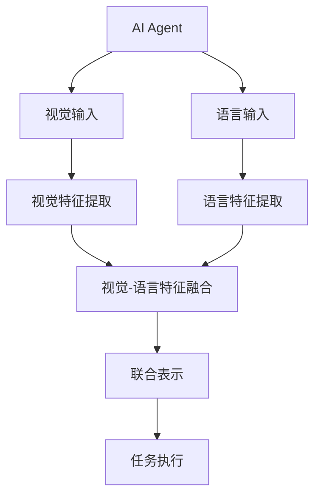
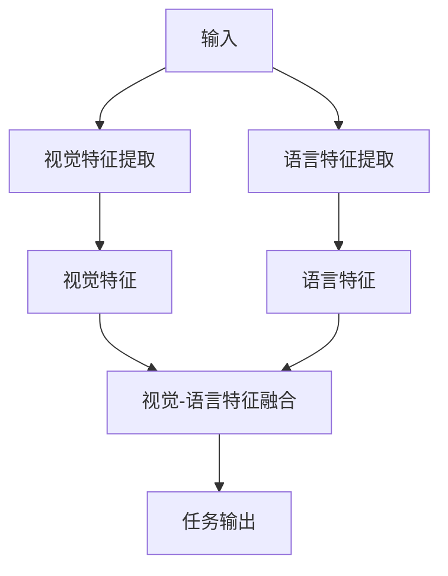
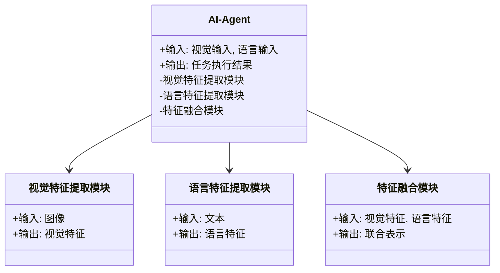
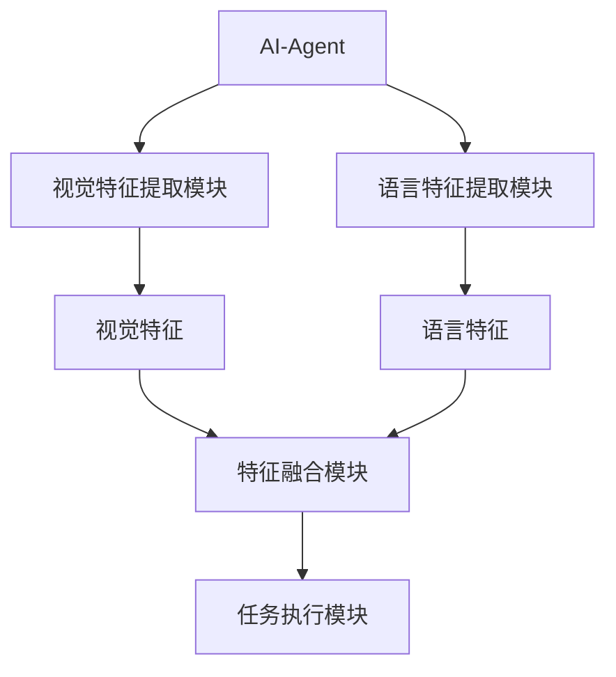
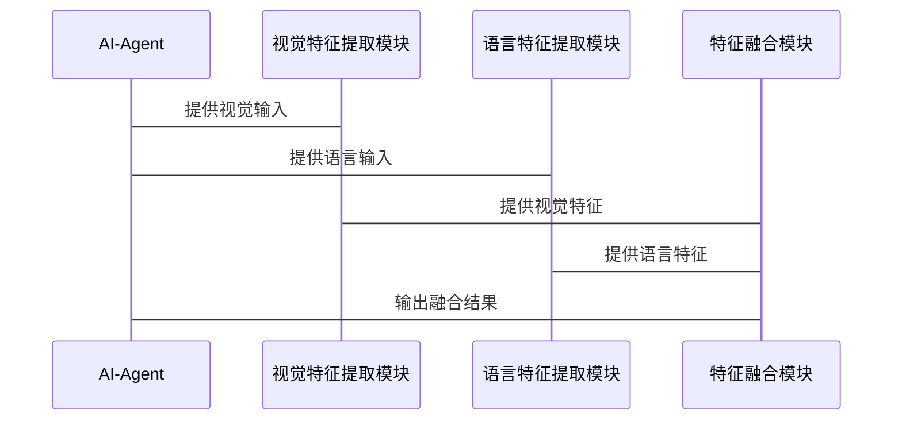

                 


# AI Agent的视觉-语言预训练模型开发

## 关键词
AI Agent, 视觉-语言模型, 多模态预训练, 深度学习, 自然语言处理

## 摘要
本文详细探讨了AI Agent的视觉-语言预训练模型的开发过程，从基本概念到算法原理，从系统架构到项目实战，全面解析了该领域的核心技术和应用实践。文章通过丰富的案例分析和详细的代码实现，帮助读者理解如何构建一个高效的视觉-语言预训练模型，并将其应用于实际的AI Agent系统中。

---

# 第1章: AI Agent与视觉-语言模型概述

## 1.1 AI Agent的基本概念

### 1.1.1 AI Agent的定义与特点
AI Agent（人工智能代理）是一种能够感知环境、自主决策并执行任务的智能实体。其特点包括：
- **自主性**：能够在没有外部干预的情况下独立运行。
- **反应性**：能够实时感知环境并做出响应。
- **目标导向性**：基于目标进行决策和行动。
- **学习能力**：通过与环境的交互不断优化自身的性能。

### 1.1.2 AI Agent的核心功能与应用场景
AI Agent的核心功能包括：
- **感知**：通过传感器或其他输入方式获取环境信息。
- **决策**：基于感知信息做出决策。
- **执行**：通过执行器或其他输出方式执行决策。

应用场景包括自动驾驶、智能客服、机器人控制等领域。

### 1.1.3 AI Agent与传统AI的区别
传统AI通常是在特定任务下运行的程序，而AI Agent具有更强的自主性和适应性，能够在动态环境中灵活应对各种情况。

## 1.2 视觉-语言模型的基础

### 1.2.1 视觉模型的基本原理
视觉模型通过处理图像或视频等视觉数据，提取图像中的特征信息。常见的视觉模型包括CNN（卷积神经网络）和Transformer架构。

### 1.2.2 语言模型的基本原理
语言模型通过处理文本数据，生成或理解语言。常见的语言模型包括RNN、LSTM和Transformer架构。

### 1.2.3 视觉-语言模型的结合方式
视觉-语言模型的结合方式包括：
- **多模态特征提取**：同时处理视觉和语言信息，提取跨模态特征。
- **融合方法**：将视觉和语言特征进行融合，生成联合表示。
- **联合训练**：在多模态数据上进行联合训练，优化模型的跨模态理解能力。

## 1.3 AI Agent的视觉-语言预训练模型的背景

### 1.3.1 当前AI Agent的发展趋势
随着深度学习技术的发展，AI Agent的视觉和语言处理能力得到了显著提升，尤其是在多模态数据处理方面。

### 1.3.2 视觉-语言预训练模型的兴起
视觉-语言预训练模型的兴起源于多模态数据的广泛存在和应用需求，尤其是在需要同时处理视觉和语言信息的场景中。

### 1.3.3 AI Agent与视觉-语言模型结合的意义
AI Agent与视觉-语言模型的结合使得AI Agent能够更高效地处理复杂的多模态任务，提升其在实际应用中的表现。

---

# 第2章: 视觉-语言预训练模型的核心概念与联系

## 2.1 视觉-语言模型的核心原理

### 2.1.1 多模态特征提取
多模态特征提取是视觉-语言模型的核心步骤，包括：
- **视觉特征提取**：通过CNN等模型提取图像特征。
- **语言特征提取**：通过Transformer等模型提取文本特征。

### 2.1.2 视觉与语言的融合方法
视觉与语言的融合方法包括：
- **基于注意力机制的融合**：通过注意力机制将视觉和语言特征进行加权融合。
- **基于Transformer的融合**：将视觉和语言特征输入到Transformer中进行交叉注意力计算。

### 2.1.3 模型的训练与优化
模型的训练与优化包括：
- **预训练**：在大规模多模态数据上进行自监督学习。
- **微调**：在特定任务上进行有监督微调。

## 2.2 核心概念对比分析

### 2.2.1 视觉特征与语言特征的对比
| 特征类型 | 视觉特征 | 语言特征 |
|----------|----------|----------|
| 表达方式 | 图像中的空间和语义信息 | 文本中的语法和语义信息 |
| 处理方式 | 使用CNN或Transformer提取 | 使用RNN或Transformer提取 |
| 优势     | 能够捕捉图像中的细节信息 | 能够捕捉文本中的语义信息 |

### 2.2.2 不同视觉-语言模型的对比
| 模型名称 | 视觉-语言处理方式 | 优劣势 |
|----------|-------------------|--------|
| CLIP     | 对图像和文本进行联合嵌入 | 跨模态对齐能力强，但需要大量数据 |
| ViLBERT  | 使用Transformer进行视觉和语言特征融合 | 融合能力强，但训练复杂 |
| ALBEF     | 基于Transformer的多模态模型 | 适合小样本数据，训练效率高 |

### 2.2.3 AI Agent中视觉-语言模型的优劣势分析
- **优势**：能够同时处理视觉和语言信息，提升AI Agent的多模态理解能力。
- **劣势**：需要大量多模态数据进行训练，计算资源消耗较大。

## 2.3 ER实体关系图架构



---

# 第3章: 视觉-语言预训练模型的算法原理

## 3.1 视觉-语言模型的算法流程



## 3.2 模型的数学表达

### 3.2.1 视觉特征提取
视觉特征提取通常使用CNN模型，其数学表达为：
$$
f(x) = \text{CNN}(x)
$$
其中，$x$是输入图像，$f(x)$是提取的视觉特征。

### 3.2.2 语言特征提取
语言特征提取通常使用Transformer模型，其数学表达为：
$$
g(x) = \text{Transformer}(x)
$$
其中，$x$是输入文本，$g(x)$是提取的语言特征。

### 3.2.3 视觉-语言特征融合
视觉-语言特征融合可以通过注意力机制实现：
$$
h = \alpha f(x) + \beta g(x)
$$
其中，$\alpha$和$\beta$是注意力权重，$\alpha + \beta = 1$。

## 3.3 模型的训练与优化

### 3.3.1 预训练
预训练的目标是最小化视觉和语言特征之间的差异，损失函数为：
$$
\mathcal{L} = \text{CE}(f(x), g(x))
$$

### 3.3.2 微调
微调是在特定任务上进行有监督学习，损失函数为：
$$
\mathcal{L} = \text{CE}(y_{\text{pred}}, y_{\text{true}})
$$

---

# 第4章: 系统分析与架构设计

## 4.1 系统功能设计

### 4.1.1 领域模型


### 4.1.2 系统架构设计


## 4.2 接口与交互设计

### 4.2.1 接口设计
- **输入接口**：接收视觉和语言输入。
- **输出接口**：输出任务执行结果。

### 4.2.2 交互流程


---

# 第5章: 项目实战

## 5.1 环境安装
- Python 3.8+
- PyTorch 1.9+
- Transformers 4.10+
- Mermaid CLI

## 5.2 系统核心实现源代码

### 5.2.1 视觉特征提取模块
```python
import torch
import torch.nn as nn

class VisualFeatureExtractor(nn.Module):
    def __init__(self):
        super().__init__()
        self.cnn = nn.Sequential(
            nn.Conv2d(3, 64, kernel_size=3, stride=2),
            nn.ReLU(),
            nn.Conv2d(64, 128, kernel_size=3, stride=2),
            nn.ReLU()
        )
    
    def forward(self, x):
        return self.cnn(x)
```

### 5.2.2 语言特征提取模块
```python
from transformers import AutoTokenizer, AutoModel

class TextFeatureExtractor:
    def __init__(self):
        self.tokenizer = AutoTokenizer.from_pretrained('bert-base-uncased')
        self.model = AutoModel.from_pretrained('bert-base-uncased')
    
    def forward(self, x):
        inputs = self.tokenizer(x, return_tensors='pt')
        outputs = self.model(**inputs)
        return outputs.last_hidden_state
```

### 5.2.3 特征融合模块
```python
class FeatureFuser(nn.Module):
    def __init__(self):
        super().__init__()
        self.visual_attn = nn.Parameter(torch.ones(1))
        self.text_attn = nn.Parameter(torch.ones(1))
    
    def forward(self, visual_feats, text_feats):
        visual_feats = visual_feats * self.visual_attn
        text_feats = text_feats * self.text_attn
        fused_feats = visual_feats + text_feats
        return fused_feats
```

## 5.3 代码应用解读与分析
- **视觉特征提取模块**：使用CNN提取图像特征。
- **语言特征提取模块**：使用BERT提取文本特征。
- **特征融合模块**：通过注意力机制融合视觉和语言特征。

## 5.4 实际案例分析和详细讲解剖析
以图像描述生成任务为例，AI Agent通过视觉-语言模型生成对图像的描述文本。

## 5.5 项目小结
通过本项目，读者可以掌握AI Agent的视觉-语言模型的基本实现方法，包括多模态特征提取、融合和任务执行。

---

# 第6章: 总结与展望

## 6.1 最佳实践 tips
- 在实际应用中，建议使用预训练好的视觉-语言模型进行微调，以提高模型的性能。
- 注意模型的计算资源消耗，合理优化模型结构和训练参数。

## 6.2 小结
本文详细介绍了AI Agent的视觉-语言预训练模型的开发过程，从基本概念到算法原理，从系统架构到项目实战，全面解析了该领域的核心技术。

## 6.3 注意事项
- 在实际应用中，需要根据具体任务需求选择合适的模型和优化方法。
- 注意模型的泛化能力和适应性，避免过拟合和欠拟合问题。

## 6.4 拓展阅读
- [CLIP: Connecting Modalities with a Linear Probe](https://arxiv.org/abs/2012.05974)
- [ViLBERT: Pre-training of Text and Image Together at Scale](https://arxiv.org/abs/1908.02392)

---

# 附录

## 附录1: 相关学术资源

## 附录2: 工具与库

---

通过以上内容，读者可以系统地学习和理解AI Agent的视觉-语言预训练模型的开发过程，从理论到实践，全面掌握该领域的核心技术。

