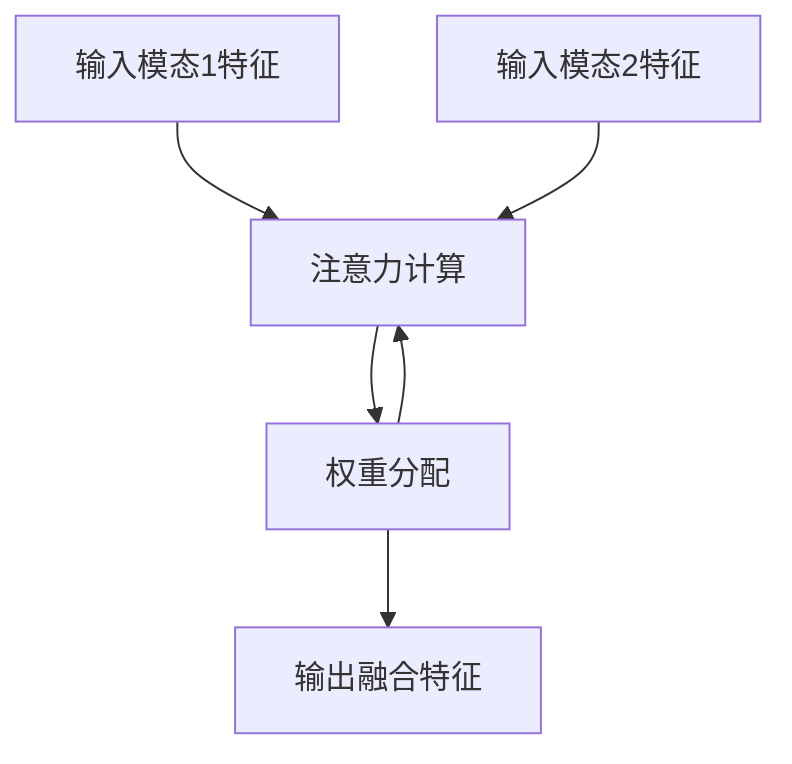
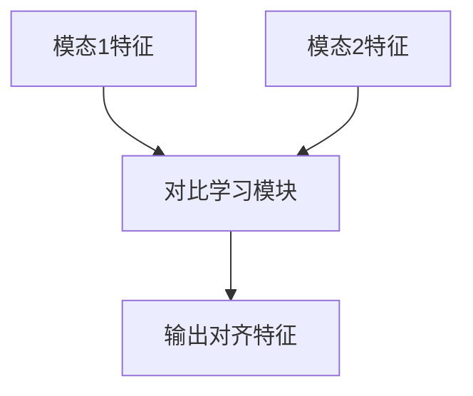
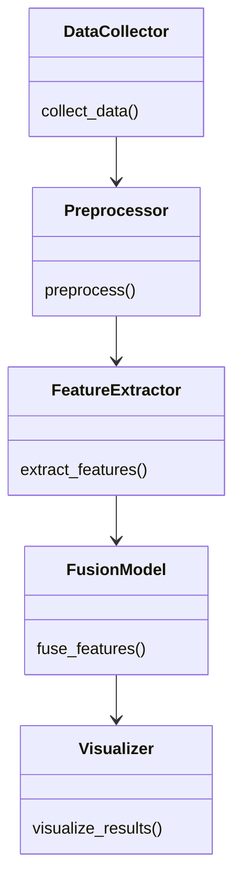
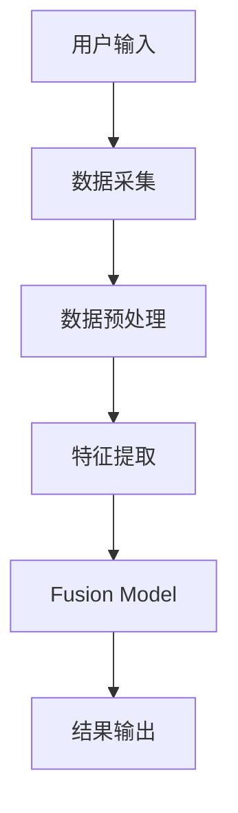
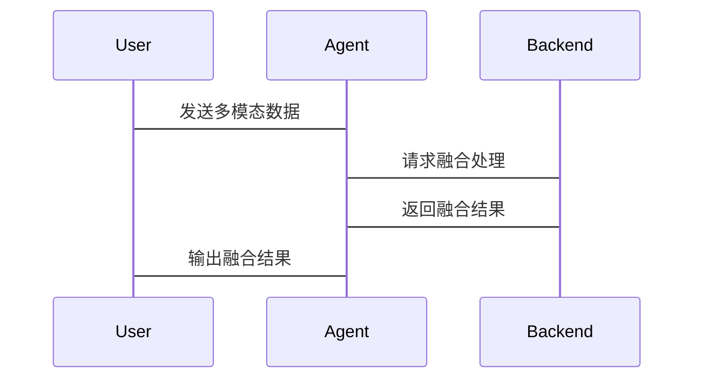

                 


# AI Agent的视觉-语音-文本多模态融合

> 关键词：AI Agent, 多模态融合, 视觉, 语音, 文本, 注意力机制, 对比学习

> 摘要：本文系统地探讨了AI Agent在视觉、语音和文本多模态数据融合的关键技术，涵盖背景介绍、核心概念、算法原理、系统架构、项目实战以及最佳实践。通过深入分析多模态数据的特点，结合具体的算法实现和系统设计，为AI Agent的多模态融合提供了全面的解决方案。

---

## 第一部分：背景介绍

### 第1章：AI Agent与多模态融合概述

#### 1.1 多模态数据融合的背景与意义
- **1.1.1 多模态数据的定义与特点**
  多模态数据指的是来自不同感官渠道的数据，如视觉（图像、视频）、语音（音频、语调）、文本（文字、符号）等。这些数据具有互补性和冗余性，能够提供更全面的信息理解能力。
  
- **1.1.2 多模态融合在AI Agent中的作用**
  AI Agent通过融合多模态数据，能够更好地理解环境、进行智能决策和自然交互，从而提升用户体验和任务处理效率。
  
- **1.1.3 多模态融合的挑战与机遇**
  挑战包括数据异构性、模态间关联性复杂以及计算资源消耗大；机遇则体现在提升AI Agent的泛化能力、增强交互体验和实现更复杂的任务。

#### 1.2 AI Agent的定义与分类
- **1.2.1 AI Agent的基本概念**
  AI Agent是一种智能体，能够感知环境、自主决策并执行任务。它可以分为简单反射型、基于模型的反应型、基于目标的和基于效用的四种类型。
  
- **1.2.2 基于多模态的AI Agent分类**
  根据处理数据模态的数量和类型，AI Agent可以分为单模态、双模态和多模态三类。本文主要关注多模态AI Agent。
  
- **1.2.3 多模态AI Agent的应用场景**
  包括智能客服、智能家居、自动驾驶、虚拟助手等，这些场景需要处理多种数据模态以提供更智能的服务。

#### 1.3 多模态融合技术的发展与趋势
- **1.3.1 多模态融合技术的历史演变**
  从早期的简单特征拼接到现在的深度学习驱动的端到端融合，多模态融合技术经历了多个发展阶段。
  
- **1.3.2 当前技术发展现状**
  基于深度学习的多模态融合技术成为主流，特别是在视觉-文本和语音-文本融合方面取得了显著进展。
  
- **1.3.3 未来发展趋势与研究方向**
  包括更高效的跨模态对齐方法、轻量化模型设计以及多模态实时处理能力的提升。

---

## 第二部分：核心概念与联系

### 第2章：多模态数据特征分析

#### 2.1 视觉、语音、文本的特征对比
| 特征维度 | 视觉数据 | 语音数据 | 文本数据 |
|----------|----------|----------|----------|
| 数据类型 | 图像/视频 | 音频/语调 | 文本序列 |
| 时空特性 | 空间性、时序性 | 时间性、频率特性 | 序列性、语义性 |
| 信息密度 | 高 | 中 | 高（语义） |
| 表达方式 | 像素值 | 频率/振幅 | 文字符号 |

#### 2.2 多模态融合的核心要素
- **模态间关联性**：不同模态数据之间的相关性是融合的基础，例如视觉中的物体与语音中的描述可能存在语义关联。
- **融合方式**：选择加性融合、乘性融合或注意力机制等方法。
- **融合效果评估**：通过准确率、召回率、F1分数等指标衡量融合效果。

#### 2.3 多模态融合的实体关系图
```mermaid
erDiagram
    user [*--- interaction
    interaction [*--- modality
    modality [*--- feature
    feature [*--- model
    model [*--- result
```

---

## 第三部分：算法原理

### 第3章：多模态融合算法原理

#### 3.1 多模态注意力机制


#### 3.2 对比学习与特征对齐


#### 3.3 融合算法的数学模型
- 注意力机制的数学公式：
  $$\alpha_i = \frac{e^{score(x_i)}}{\sum_j e^{score(x_j)}}$$
  其中，$score(x_i)$表示模态i的注意力得分，$\alpha_i$表示模态i的注意力权重。

- 对比学习的损失函数：
  $$L = -\log\left(\frac{e^{score(x,y)}}{\sum_{y'} e^{score(x,y')}}\right)$$
  其中，$(x,y)$表示正样本对，$y'$表示负样本对。

---

## 第四部分：系统分析与架构设计

### 第4章：多模态融合系统的架构设计

#### 4.1 系统功能设计


#### 4.2 系统架构图


#### 4.3 系统接口设计


---

## 第五部分：项目实战

### 第5章：基于多模态融合的AI Agent实现

#### 5.1 环境安装
```bash
pip install numpy matplotlib tensorflow
```

#### 5.2 核心代码实现
```python
import numpy as np
import tensorflow as tf

def attention Mechanism(x1, x2):
    # 计算注意力权重
    score = tf.matmul(x1, tf.transpose(x2))
    alpha = tf.nn.softmax(score)
    return tf.matmul(x1, alpha)

def contrastive_learning(x_pos, x_neg):
    # 对比学习
    similarity_pos = tf.reduce_mean(x_pos * x_pos)
    similarity_neg = tf.reduce_mean(x_neg * x_neg)
    loss = -tf.log(similarity_pos / (similarity_pos + similarity_neg))
    return loss
```

#### 5.3 代码解读与分析
- `attention Mechanism`函数实现了多模态注意力机制，计算模态间的注意力权重并进行融合。
- `contrastive_learning`函数实现了对比学习，通过计算正样本和负样本的相似性，优化特征对齐。

#### 5.4 实际案例分析
- 案例：跨语言语音助手
  - 输入：用户用中文说“播放音乐”。
  - 处理：系统提取语音特征和文本特征，通过注意力机制进行融合，生成对应的执行指令。
  - 输出：执行播放音乐的任务。

#### 5.5 项目小结
- 项目实现了一个简单的多模态融合AI Agent，展示了如何通过注意力机制和对比学习实现多模态数据的融合。
- 实践中需要注意数据预处理、模型调优和系统的实时性优化。

---

## 第六部分：最佳实践与总结

### 第6章：总结与展望

#### 6.1 总结
- 本文系统地介绍了AI Agent的多模态融合技术，包括背景、核心概念、算法实现和系统设计。
- 通过具体案例展示了如何将理论应用于实践。

#### 6.2 最佳实践 tips
- 数据预处理是关键，确保各模态数据的对齐和标准化。
- 在模型设计中，合理选择融合方式，避免过拟合。
- 实际应用中，注重系统的实时性和资源消耗。

#### 6.3 注意事项
- 多模态数据的异构性可能导致模型训练困难，需采用适当的预处理方法。
- 模态间的关联性需通过领域知识或数据分析来确定。

#### 6.4 拓展阅读
- "Learning Cross-Modal Representation for Sketch-Based Image Retrieval"。
- "Unsupervised Cross-Modal Hashing for Efficient Similarity Search"。

---

通过以上详细的内容，我们系统地探讨了AI Agent的视觉-语音-文本多模态融合技术，从理论到实践，为读者提供了全面的解决方案和参考。

