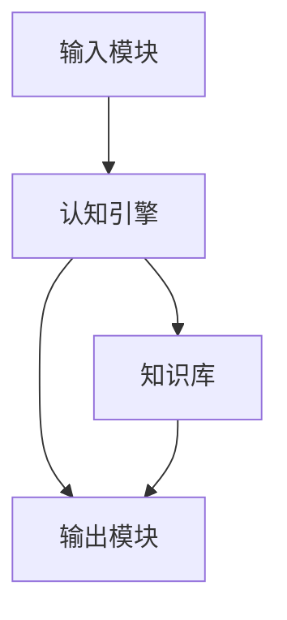
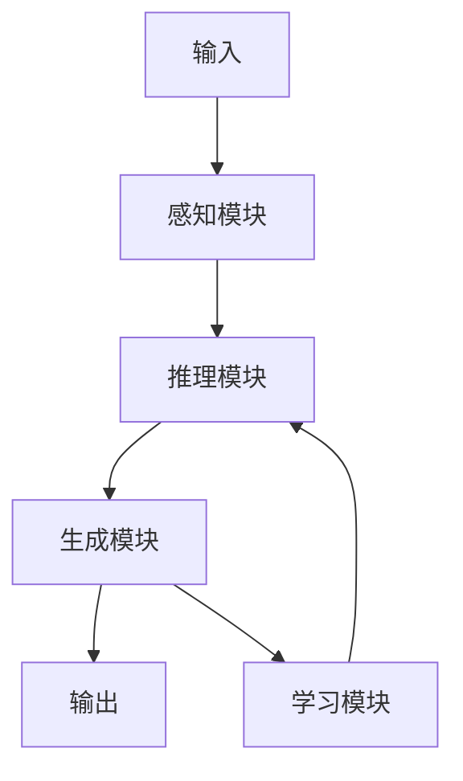

                 


# AI Agent的认知发展模拟：探索LLM的智能进化过程

## 关键词：AI Agent，LLM，认知模拟，智能进化，大语言模型，机器学习，深度学习

## 摘要：本文探讨AI Agent的认知发展模拟，特别是通过大语言模型（LLM）的智能进化过程。从AI Agent和LLM的基本概念出发，分析认知模拟的理论基础，详细讲解技术实现，包括算法原理和数学模型。通过系统架构设计和项目实战，展示如何实现AI Agent的认知模拟，并探讨未来发展与挑战。

---

# 第一部分: AI Agent与LLM的认知发展基础

## 第1章: AI Agent与LLM的基本概念

### 1.1 AI Agent的定义与特点

#### 1.1.1 AI Agent的定义
AI Agent（人工智能代理）是指能够感知环境并采取行动以实现目标的智能实体。它具备自主性、反应性、目标导向和社交能力等特征。

#### 1.1.2 AI Agent的核心特点
- **自主性**：能够自主决策和行动。
- **反应性**：能实时感知环境并做出反应。
- **目标导向**：所有行为均以实现特定目标为导向。
- **社交能力**：能与其他Agent或人类进行有效交互。

#### 1.1.3 AI Agent与传统AI的区别
| 特性          | 传统AI             | AI Agent           |
|---------------|--------------------|--------------------|
| 自主性        | 无自主性           | 高自主性           |
| 反应性        | 响应有限           | 高度响应性         |
| 目标导向      | 无明确目标         | 明确目标导向       |
| 交互能力      | 单向或弱交互       | 强交互能力         |

### 1.2 大语言模型（LLM）的定义与特点

#### 1.2.1 LLM的定义
LLM是基于深度学习的自然语言处理模型，能够理解和生成人类语言。其核心是Transformer架构，具备强大的上下文理解和生成能力。

#### 1.2.2 LLM的核心特点
- **大规模训练数据**：通常使用海量文本数据进行预训练。
- **自注意力机制**：通过自注意力机制捕捉文本中的长程依赖关系。
- **生成能力强**：能够生成高质量的文本，包括回答、摘要、翻译等。

#### 1.2.3 AI Agent与LLM的关系
LLM为AI Agent提供了强大的语言理解和生成能力，使其能够更自然地与人类交互。AI Agent利用LLM的能力来实现更复杂的认知任务。

### 1.3 AI Agent的认知模拟与LLM的结合

#### 1.3.1 认知模拟的必要性
认知模拟是让AI Agent具备人类-like的思考和决策能力，使其能够更好地理解复杂环境并做出合理决策。

#### 1.3.2 LLM在认知模拟中的作用
- **语言理解**：通过LLM理解输入的自然语言指令。
- **推理能力**：利用LLM的上下文理解能力进行推理。
- **知识整合**：将LLM的生成能力与知识库结合，提升认知能力。

#### 1.3.3 认知模拟的挑战与边界
- **数据依赖性**：LLM依赖于训练数据，可能面临数据偏差问题。
- **推理深度**：当前LLM的推理能力有限，难以处理复杂的逻辑推理。
- **实时性**：在实时交互中，LLM的响应速度可能成为瓶颈。

---

## 第2章: AI Agent认知发展的理论基础

### 2.1 认知科学与AI Agent

#### 2.1.1 认知科学的基本概念
认知科学是研究人类认知过程的学科，涉及心理学、神经科学、语言学等领域。

#### 2.1.2 AI Agent的认知模型
AI Agent的认知模型模拟人类的认知过程，包括感知、记忆、推理和行动。

#### 2.1.3 认知科学对AI Agent的启示
- **模块化设计**：将认知过程分解为独立的模块。
- **动态推理**：基于实时信息进行动态推理。
- **自适应学习**：通过经验不断优化认知模型。

### 2.2 LLM与认知模拟的关系

#### 2.2.1 LLM的语言理解能力
LLM能够理解上下文，捕捉隐含含义，提供更自然的交互方式。

#### 2.2.2 LLM的推理能力
通过生成文本，LLM可以模拟推理过程，但目前主要基于语言模式，推理深度有限。

#### 2.2.3 LLM在认知模拟中的优势
- **强大的语言处理能力**：能够理解和生成复杂文本。
- **可扩展性**：通过微调或提示工程技术，可以适应多种任务。

### 2.3 认知发展的阶段模型

#### 2.3.1 认知发展的阶段划分
- **感知阶段**：单纯基于感官输入进行反应。
- **记忆阶段**：具备简单的记忆能力，能够存储和调用简单信息。
- **推理阶段**：能够进行逻辑推理，解决复杂问题。
- **学习阶段**：具备学习能力，能够优化自身认知模型。

#### 2.3.2 不同阶段的LLM表现
| 阶段          | LLM的表现               |
|---------------|------------------------|
| 感知阶段      | 基于输入文本生成反应   |
| 记忆阶段      | 结合上下文生成回答     |
| 推理阶段      | 进行简单的逻辑推理     |
| 学习阶段      | 通过反馈优化生成结果   |

#### 2.3.3 认知发展的连续性与跳跃性
认知发展是一个渐进的过程，不同阶段之间存在连续性，但某些关键点上可能会出现能力的跳跃性提升。

---

## 第3章: AI Agent认知模拟的核心算法

### 3.1 大语言模型的训练算法

#### 3.1.1 Transformer模型的结构
Transformer模型由编码器和解码器组成，编码器负责将输入序列编码为固定长度的向量，解码器负责根据编码结果生成输出序列。

#### 3.1.2 自注意力机制的数学公式
自注意力机制的计算公式如下：
$$
\text{Attention}(Q, K, V) = \text{softmax}\left(\frac{QK^T}{\sqrt{d_k}}\right)V
$$
其中，$Q$是查询向量，$K$是键向量，$V$是值向量，$d_k$是向量的维度。

#### 3.1.3 大语言模型的训练流程
1. **输入预处理**：对输入文本进行分词、编码等预处理。
2. **自注意力计算**：计算查询、键、值向量的自注意力权重。
3. **前向网络**：将注意力结果通过前向网络生成输出。
4. **损失计算**：使用交叉熵损失函数计算预测值与真实值的差异。
5. **反向传播**：通过梯度下降优化模型参数。

### 3.2 认知模拟的算法实现

#### 3.2.1 认知模拟的基本流程
1. **输入处理**：接收外部输入，解析为模型可处理的形式。
2. **上下文理解**：通过LLM理解输入的上下文信息。
3. **推理与决策**：基于理解的信息进行推理，生成决策结果。
4. **输出生成**：将决策结果转化为自然语言输出。

#### 3.2.2 认知模拟的优化策略
- **微调技术**：在特定任务上对LLM进行微调，提升任务相关性。
- **提示工程技术**：通过设计提示语引导模型生成符合要求的输出。
- **多模态融合**：结合视觉、听觉等多模态信息，提升认知能力。

### 3.3 算法实现的数学模型

#### 3.3.1 注意力机制的数学模型
注意力机制的权重计算公式为：
$$
\alpha_i = \text{softmax}\left(\frac{Q_i K_j^T}{\sqrt{d_k}}\right)
$$
其中，$\alpha_i$是查询$Q_i$对键$K_j$的注意力权重。

#### 3.3.2 损失函数的数学表达
交叉熵损失函数为：
$$
\text{Loss} = -\sum_{i=1}^{n} y_i \log(p_i) + (1 - y_i) \log(1 - p_i)
$$
其中，$y_i$是真实标签，$p_i$是模型预测的概率。

---

## 第4章: AI Agent认知模拟的系统架构与设计

### 4.1 系统架构设计

#### 4.1.1 系统组成模块
- **输入模块**：接收外部输入，如文本、语音、图像等。
- **认知引擎**：负责理解和推理输入信息。
- **输出模块**：生成自然语言或其他形式的输出。
- **知识库**：存储必要的知识和经验，辅助推理。

#### 4.1.2 系统架构图


### 4.2 系统功能设计

#### 4.2.1 功能模块划分
- **感知模块**：负责接收和解析输入信息。
- **推理模块**：基于感知信息进行推理和决策。
- **生成模块**：根据推理结果生成输出。
- **学习模块**：通过反馈优化认知模型。

#### 4.2.2 功能流程图


### 4.3 接口设计与交互流程

#### 4.3.1 系统接口设计
- **输入接口**：支持文本、语音、图像等多种输入形式。
- **输出接口**：支持文本、语音、图像等多种输出形式。
- **知识库接口**：支持知识的存储、查询和更新。

#### 4.3.2 交互流程
1. **输入处理**：系统接收外部输入。
2. **感知与理解**：系统解析输入内容，理解其含义。
3. **推理与决策**：系统基于理解的信息进行推理，生成决策结果。
4. **输出生成**：系统将决策结果转化为可输出的形式。
5. **反馈优化**：系统根据反馈调整认知模型。

---

## 第5章: AI Agent认知模拟的项目实战

### 5.1 项目环境与工具安装

#### 5.1.1 环境配置
- **操作系统**：Linux/Windows/MacOS
- **Python版本**：Python 3.8+
- **依赖库**：TensorFlow/PyTorch、Hugging Face Transformers

#### 5.1.2 工具安装
```bash
pip install transformers torch
```

### 5.2 核心代码实现

#### 5.2.1 模型加载与初始化
```python
from transformers import AutoTokenizer, AutoModelForCausalLM
model_name = "gpt2-large"
tokenizer = AutoTokenizer.from_pretrained(model_name)
model = AutoModelForCausalLM.from_pretrained(model_name)
```

#### 5.2.2 输入处理与生成
```python
def generate_response(input_text):
    inputs = tokenizer(input_text, return_tensors="pt")
    with torch.no_grad():
        outputs = model.generate(**inputs, max_length=50)
    response = tokenizer.decode(outputs[0], skip_special_tokens=True)
    return response
```

#### 5.2.3 系统交互流程
```python
while True:
    input_text = input("User: ")
    response = generate_response(input_text)
    print("AI Agent:", response)
```

### 5.3 项目总结与优化

#### 5.3.1 项目总结
通过本项目，我们实现了基于LLM的AI Agent认知模拟系统，能够进行基本的自然语言交互和推理。

#### 5.3.2 优化方向
- **提升推理能力**：引入逻辑推理模块，增强系统推理深度。
- **多模态融合**：结合视觉、听觉等多模态信息，提升认知能力。
- **实时性优化**：优化模型推理速度，提升系统响应效率。

---

## 第6章: AI Agent认知模拟的未来发展与挑战

### 6.1 未来发展方向

#### 6.1.1 提升推理能力
通过引入逻辑推理、知识图谱等技术，增强AI Agent的推理能力。

#### 6.1.2 实现通用认知
研究通用人工智能（AGI），使AI Agent具备广泛适用的认知能力。

#### 6.1.3 多模态融合
结合视觉、听觉等多模态信息，实现更全面的认知能力。

### 6.2 当前技术的局限性

#### 6.2.1 数据依赖性
AI Agent的表现严重依赖于训练数据，存在数据偏差和过拟合问题。

#### 6.2.2 推理深度不足
当前LLM的推理能力有限，难以处理复杂的逻辑推理任务。

#### 6.2.3 实时性问题
在实时交互场景中，模型的响应速度可能成为瓶颈。

### 6.3 未来研究方向

#### 6.3.1 增强学习
通过强化学习优化AI Agent的决策能力，使其在动态环境中表现更好。

#### 6.3.2 知识图谱整合
将知识图谱与LLM结合，增强AI Agent的知识整合和推理能力。

#### 6.3.3 伦理与安全
研究AI Agent的伦理和安全问题，确保其应用符合社会规范。

---

## 总结

通过本文的探讨，我们深入了解了AI Agent的认知发展模拟，特别是通过大语言模型（LLM）实现智能进化的过程。从基本概念到算法实现，从系统设计到项目实战，我们全面分析了AI Agent认知模拟的各个方面。未来，随着技术的不断发展，AI Agent的认知模拟将更加智能化和人性化，为人类社会带来更多可能性。

---

## 参考文献

（此处可以列出相关文献和资料，根据实际需求添加）

---

## 致谢

感谢读者的耐心阅读，感谢所有参与本项目开发和研究的人员。

--- 

通过以上内容，我们可以清晰地看到AI Agent认知模拟的完整流程和技术实现细节。

