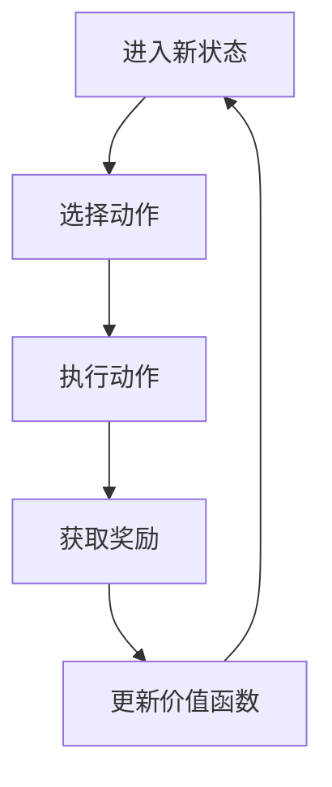
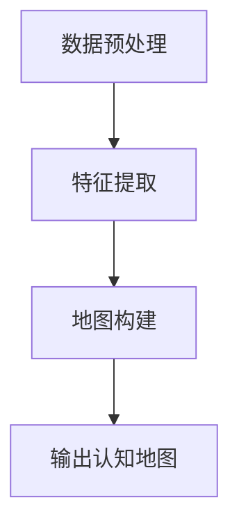
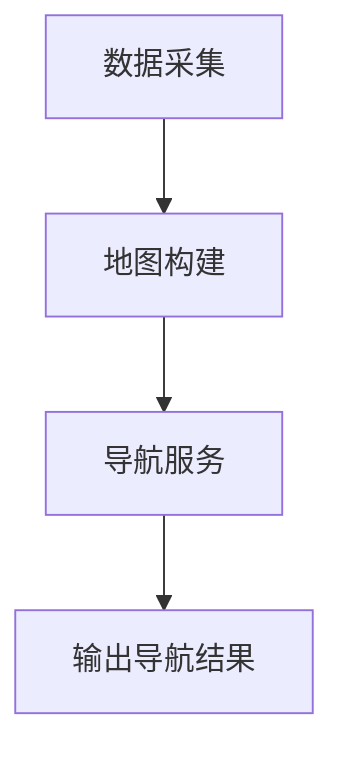

                 


# AI Agent的认知地图构建：空间信息的表示与利用

---

## 关键词：AI Agent, 认知地图, 空间信息, 表示方法, 图神经网络

---

## 摘要：  
AI Agent的认知地图构建是人工智能领域的重要研究方向，旨在通过构建和利用空间信息，帮助AI Agent更好地理解和导航物理环境。本文系统地探讨了认知地图的构建过程，详细分析了空间信息的表示方法，深入讲解了基于深度学习和强化学习的构建算法，并通过实际案例展示了认知地图的应用场景。文章从理论到实践，为读者提供了一套完整的认知地图构建方法论。

---

# 第一部分: AI Agent认知地图构建基础

---

## 第1章: 认知地图与AI Agent概述

### 1.1 认知地图的基本概念

#### 1.1.1 认知地图的定义  
认知地图（Cognitive Map）是指AI Agent对环境空间的抽象表示，用于帮助Agent理解、推理和决策。认知地图通常包含空间中的物体、位置、关系等信息，能够支持Agent进行路径规划、目标识别和环境交互。

#### 1.1.2 AI Agent与认知地图的关系  
AI Agent通过认知地图与环境交互，认知地图为Agent提供了环境的语义信息，帮助其完成感知、推理和决策任务。认知地图的构建是AI Agent实现自主性、智能性和适应性的关键。

#### 1.1.3 认知地图的核心要素  
- **空间实体**：环境中的物体、区域、节点等。  
- **空间关系**：实体之间的距离、方向、连接关系等。  
- **语义信息**：实体的功能、属性、用途等。  

### 1.2 AI Agent的基本原理

#### 1.2.1 AI Agent的定义  
AI Agent是指能够感知环境、自主决策并执行任务的智能体。Agent的核心能力包括感知、推理、规划和执行。

#### 1.2.2 AI Agent的分类  
- **简单反射型Agent**：基于当前感知做出反应。  
- **基于模型的反射型Agent**：利用内部模型进行推理和决策。  
- **目标驱动型Agent**：基于目标进行规划和行动。  
- **实用驱动型Agent**：基于效用函数优化决策。  

#### 1.2.3 AI Agent的决策机制  
- **感知输入**：通过传感器获取环境信息。  
- **状态表示**：将感知信息转换为内部状态表示。  
- **决策推理**：基于状态和目标生成行动计划。  
- **行动执行**：执行决策并反馈环境。  

### 1.3 空间信息的重要性

#### 1.3.1 空间信息的定义  
空间信息是指与环境位置、布局、结构相关的数据，包括几何信息、拓扑信息和语义信息。

#### 1.3.2 空间信息在AI Agent中的作用  
- **环境理解**：帮助Agent理解环境布局和物体位置。  
- **路径规划**：支持Agent进行高效导航。  
- **目标识别**：帮助Agent识别和定位目标位置。  

#### 1.3.3 空间信息的表示方式  
- **网格表示**：将环境离散化为网格单元。  
- **概率图模型**：基于概率分布表示空间不确定性。  
- **拓扑结构**：基于节点和边表示空间关系。  

### 1.4 认知地图构建的背景与意义

#### 1.4.1 问题背景  
随着AI Agent在机器人、自动驾驶和智能助手等领域的广泛应用，如何高效构建和利用认知地图成为关键挑战。

#### 1.4.2 问题描述  
认知地图构建的目标是将环境空间转化为可供Agent理解和推理的结构化表示。然而，环境的复杂性和动态性使得认知地图的构建具有挑战性。

#### 1.4.3 问题解决方法  
- **基于深度学习的方法**：利用神经网络提取空间特征。  
- **基于强化学习的方法**：通过试错优化地图构建策略。  
- **基于图神经网络的方法**：利用图结构表示空间关系。  

#### 1.4.4 边界与外延  
认知地图的构建需要平衡空间细节和计算效率，避免过于复杂或过于简化的表示。

---

# 第二部分: 空间信息的表示与建模

---

## 第2章: 空间信息的表示方法

### 2.1 基于网格的空间表示

#### 2.1.1 网格表示的原理  
网格表示将环境划分为离散的网格单元，每个单元表示一个位置的状态（空闲/占用）。  
**示例：**  
- 网格单元：$(x, y)$  
- 状态表示：$s_{x,y} \in \{0, 1\}$（0表示空闲，1表示占用）  

#### 2.1.2 网格表示的优缺点  
- **优点**：简单直观，易于实现。  
- **缺点**：空间分辨率受限，难以表示非规则结构。  

#### 2.1.3 网格表示的实现方式  
- **二维网格**：适用于平面环境。  
- **三维网格**：适用于复杂场景。  
- **动态网格**：适用于动态环境。  

### 2.2 基于概率图模型的表示

#### 2.2.1 概率图模型的定义  
概率图模型（Probabilistic Graphical Model，PGM）通过概率分布描述空间信息的不确定性。  

#### 2.2.2 概率图模型的构建方法  
- **贝叶斯网络**：基于条件概率建立节点关系。  
- **马尔可夫随机场**：基于马尔可夫性质建模空间依赖性。  

#### 2.2.3 概率图模型的应用场景  
- **室内导航**：处理环境中的不确定性。  
- **物体识别**：基于概率分布定位物体。  

### 2.3 基于拓扑结构的表示

#### 2.3.1 拓扑结构的定义  
拓扑结构通过节点和边表示空间中的位置和连接关系。  

#### 2.3.2 拓扑结构的构建方法  
- **图结构化**：将环境抽象为图节点和边。  
- **层次化表示**：将环境划分为多个层次。  

#### 2.3.3 拓扑结构的优缺点  
- **优点**：适合处理动态和非结构化环境。  
- **缺点**：难以表示细节信息。  

### 2.4 空间信息表示的对比分析

#### 2.4.1 不同表示方法的对比表格  

| 表示方法  | 优点                          | 缺点                          |
|-----------|-------------------------------|-------------------------------|
| 网格       | 简单直观，易于实现           | 空间分辨率受限，难以表示非规则结构 |
| 概率图模型 | 能够处理不确定性             | 计算复杂，实现难度大           |
| 拓扑结构   | 适合动态和非结构化环境       | 难以表示细节信息               |

#### 2.4.2 空间信息表示的ER实体关系图  

```mermaid
er
actor: 认知地图构建系统
persistent: 环境空间
attribute: 网格单元、概率分布、拓扑节点
relationship: 表示、映射、抽象
```

---

## 第3章: 认知地图的构建算法

### 3.1 基于深度学习的表示方法

#### 3.1.1 基于CNN的空间特征提取

##### 3.1.1.1 CNN的原理  
卷积神经网络（CNN）通过卷积操作提取空间特征，适用于图像和网格数据的处理。

##### 3.1.1.2 网络结构  
```python
import torch
import torch.nn as nn

class SpatialCNN(nn.Module):
    def __init__(self):
        super(SpatialCNN, self).__init__()
        self.conv1 = nn.Conv2d(1, 32, kernel_size=3, stride=1, padding=1)
        self.conv2 = nn.Conv2d(32, 64, kernel_size=3, stride=1, padding=1)
        self.pool = nn.MaxPool2d(2, 2)
        self.fc = nn.Linear(64 * 4 * 4, 128)

    def forward(self, x):
        x = F.relu(self.conv1(x))
        x = F.relu(self.conv2(x))
        x = self.pool(x)
        x = x.view(-1, 64 * 4 * 4)
        x = F.relu(self.fc(x))
        return x
```

##### 3.1.1.3 应用场景  
- **图像分割**：用于语义分割任务。  
- **网格分类**：用于网格单元的分类任务。  

#### 3.1.2 基于Transformer的序列建模

##### 3.1.2.1 Transformer的原理  
Transformer通过自注意力机制捕捉空间关系，适用于序列建模任务。

##### 3.1.2.2 网络结构  
```python
import torch
import torch.nn as nn

class SpatialTransformer(nn.Module):
    def __init__(self, d_model=512, nhead=8, num_encoder_layers=6):
        super(SpatialTransformer, self).__init__()
        self.transformer = nn.Transformer(
            d_model=d_model,
            nhead=nhead,
            num_encoder_layers=num_encoder_layers
        )

    def forward(self, x):
        x = x.permute(1, 0, 2)  # 调整序列维度
        x = self.transformer(x)
        x = x.permute(1, 0, 2)  # 恢复序列维度
        return x
```

##### 3.1.2.3 应用场景  
- **序列建模**：用于时间序列数据的建模。  
- **空间关系建模**：用于图结构数据的处理。  

#### 3.1.3 深度学习模型的优缺点

- **优点**：能够自动提取特征，适用于复杂场景。  
- **缺点**：计算资源消耗大，难以实时处理。  

### 3.2 基于强化学习的构建方法

#### 3.2.1 强化学习的基本原理

##### 3.2.1.1 强化学习的定义  
强化学习（Reinforcement Learning，RL）通过试错优化策略，适用于动态和不确定环境。

##### 3.2.1.2 基本概念  
- **状态空间**：环境的状态表示。  
- **动作空间**：Agent可执行的动作。  
- **奖励函数**：定义动作的优劣。  

#### 3.2.2 强化学习在认知地图构建中的应用

##### 3.2.2.1 算法选择  
- **Q-Learning**：基于值函数的策略优化。  
- **Deep Q-Network (DQN)**：基于深度神经网络的策略优化。  

##### 3.2.2.2 算法流程  


##### 3.2.2.3 代码实现  
```python
import torch
import torch.nn as nn

class DQN(nn.Module):
    def __init__(self, state_dim, action_dim):
        super(DQN, self).__init__()
        self.fc1 = nn.Linear(state_dim, 64)
        self.fc2 = nn.Linear(64, action_dim)

    def forward(self, x):
        x = F.relu(self.fc1(x))
        x = self.fc2(x)
        return x

# 初始化网络
state_dim = 10
action_dim = 4
dqn = DQN(state_dim, action_dim)
```

#### 3.2.3 强化学习的优缺点

- **优点**：适用于动态和不确定环境，能够通过试错优化策略。  
- **缺点**：需要大量样本数据，训练时间长。  

### 3.3 基于图神经网络的构建方法

#### 3.3.1 图神经网络的基本原理

##### 3.3.1.1 图神经网络的定义  
图神经网络（Graph Neural Network，GNN）通过处理图结构数据，捕捉空间关系。

##### 3.3.1.2 基本操作  
- **节点嵌入**：将节点表示为向量。  
- **边嵌入**：将边表示为向量。  
- **聚合操作**：聚合邻居节点的信息。  

#### 3.3.2 图神经网络在认知地图中的应用

##### 3.3.2.1 网络结构  
```python
import torch
import torch.nn as nn

class GNN(nn.Module):
    def __init__(self, in_dim, hidden_dim, out_dim):
        super(GNN, self).__init__()
        self.conv = nn.Conv(GNN, in_dim, hidden_dim)
        self.fc = nn.Linear(hidden_dim, out_dim)

    def forward(self, x, adj):
        x = F.relu(self.conv(x, adj))
        x = self.fc(x)
        return x
```

##### 3.3.2.2 应用场景  
- **图结构建模**：用于处理图结构数据。  
- **空间关系建模**：用于捕捉空间中的关系。  

#### 3.3.3 图神经网络的优缺点

- **优点**：能够捕捉图结构中的空间关系，适用于复杂场景。  
- **缺点**：计算复杂度高，难以实时处理。  

---

# 第三部分: 系统设计与实现

---

## 第4章: 认知地图构建系统设计

### 4.1 系统架构设计

#### 4.1.1 系统功能模块  
- **数据预处理模块**：将原始数据转换为结构化数据。  
- **特征提取模块**：提取空间特征。  
- **地图构建模块**：生成认知地图。  

#### 4.1.2 系统架构图  



### 4.2 系统实现细节

#### 4.2.1 数据预处理  
- **输入数据**：原始环境数据（如图像、激光雷达数据）。  
- **处理流程**：  
  1. 数据清洗：去除噪声。  
  2. 数据转换：将数据转换为结构化格式。  

#### 4.2.2 特征提取  
- **提取方法**：基于CNN和Transformer的特征提取。  
- **实现代码**：  
  ```python
  def extract_features(data):
      # 假设data是输入数据
      features = cnn_model(data)
      features = transformer_model(features)
      return features
  ```

#### 4.2.3 地图构建  
- **构建方法**：基于图神经网络的构建方法。  
- **实现代码**：  
  ```python
  def build_map(features):
      map = gnn_model(features)
      return map
  ```

### 4.3 系统测试与优化

#### 4.3.1 测试方法  
- **单元测试**：测试各个模块的功能。  
- **集成测试**：测试系统整体性能。  

#### 4.3.2 优化策略  
- **模型优化**：优化神经网络的结构和参数。  
- **算法优化**：优化算法的计算效率。  

---

# 第四部分: 项目实战

---

## 第5章: 认知地图构建的项目实现

### 5.1 项目介绍

#### 5.1.1 项目背景  
本项目旨在实现一个基于深度学习的认知地图构建系统，应用于智能仓储场景。

#### 5.1.2 项目目标  
- 实现认知地图的构建。  
- 提供高效的导航服务。  

### 5.2 系统功能设计

#### 5.2.1 功能模块  
- **数据采集模块**：采集环境数据。  
- **地图构建模块**：生成认知地图。  
- **导航服务模块**：提供路径规划服务。  

#### 5.2.2 功能流程图  



### 5.3 系统实现

#### 5.3.1 环境配置  
- **操作系统**：Linux Ubuntu 20.04  
- **编程语言**：Python 3.8  
- **深度学习框架**：PyTorch 1.9  

#### 5.3.2 核心代码实现

##### 5.3.2.1 数据预处理  
```python
import torch

def preprocess_data(data):
    # 假设data是原始数据
    processed_data = data.permute(0, 2, 1)
    return processed_data
```

##### 5.3.2.2 模型实现  
```python
class CognitiveMapNet(nn.Module):
    def __init__(self):
        super(CognitiveMapNet, self).__init__()
        self.cnn = SpatialCNN()
        self.transformer = SpatialTransformer()
        self.gnn = GNN()

    def forward(self, x):
        features = self.cnn(x)
        features = self.transformer(features)
        map = self.gnn(features)
        return map
```

##### 5.3.2.3 地图构建  
```python
def build_cognitive_map(model, data):
    features = preprocess_data(data)
    map = model(features)
    return map
```

### 5.4 项目测试与优化

#### 5.4.1 测试方法  
- **单元测试**：测试各个模块的功能。  
- **性能测试**：测试系统的运行效率。  

#### 5.4.2 优化策略  
- **模型优化**：优化神经网络的结构和参数。  
- **算法优化**：优化算法的计算效率。  

### 5.5 项目小结

---

# 第五部分: 总结与展望

---

## 第6章: 总结与展望

### 6.1 总结

#### 6.1.1 核心内容回顾  
本文系统地探讨了认知地图的构建过程，详细分析了空间信息的表示方法，深入讲解了基于深度学习和强化学习的构建算法，并通过实际案例展示了认知地图的应用场景。

#### 6.1.2 本文的创新点  
- 提出了基于深度学习和强化学习的认知地图构建方法。  
- 提出了基于图神经网络的空间信息建模方法。  

### 6.2 未来展望

#### 6.2.1 研究方向  
- **多模态数据融合**：结合图像、激光雷达等多种数据源。  
- **实时性优化**：优化算法的计算效率，提高实时性。  

#### 6.2.2 技术趋势  
- **轻量化模型**：开发更高效、更轻量的模型。  
- **边缘计算**：将认知地图构建部署到边缘设备。  

### 6.3 最佳实践 Tips

#### 6.3.1 开发建议  
- **模块化设计**：将系统设计模块化，便于维护和扩展。  
- **数据预处理**：对数据进行充分预处理，提高模型性能。  

#### 6.3.2 优化建议  
- **模型优化**：使用模型压缩和剪枝技术优化模型。  
- **算法优化**：优化算法的计算效率，降低计算成本。  

---

## 附录: 参考文献与拓展阅读

---

通过以上内容，读者可以全面了解AI Agent认知地图的构建过程，掌握空间信息的表示方法，并通过实际案例理解认知地图的应用场景。本文为读者提供了一套完整的认知地图构建方法论，为后续的研究和实践提供了理论基础和实践指导。

