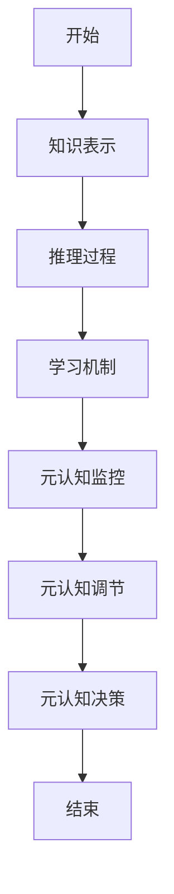
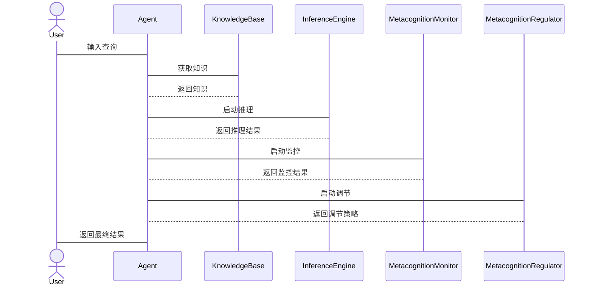

                 


# AI Agent的认知架构与元认知能力构建

## 关键词：AI Agent, 认知架构, 元认知能力, 知识表示, 推理机制, 学习算法

## 摘要：  
本文深入探讨了AI Agent的认知架构与元认知能力的构建方法，从理论基础到算法实现，再到系统设计与项目实战，全面解析了AI Agent如何通过认知架构实现智能决策，并通过元认知能力提升其自适应性和灵活性。文章结合数学模型、算法代码和系统架构图，为读者提供了一套完整的AI Agent认知系统构建方案。

---

## 第一部分: AI Agent认知架构与元认知能力的背景与基础

### 第1章: AI Agent认知架构概述

#### 1.1 AI Agent的基本概念与定义
- **1.1.1 什么是AI Agent**  
  AI Agent（人工智能代理）是指在环境中能够感知并自主行动以实现目标的智能实体。它可以是一个软件程序、机器人或其他智能系统，具备感知、推理、决策和行动的能力。

- **1.1.2 AI Agent的核心特征**  
  AI Agent的核心特征包括自主性（Autonomy）、反应性（Reactivity）、目标导向性（Goal-Oriented）和学习能力（Learnter）。自主性使AI Agent能够在没有外部干预的情况下独立运作；反应性使其能够实时感知环境并做出响应；目标导向性使其能够根据目标调整行为；学习能力使其能够通过经验改进性能。

- **1.1.3 AI Agent与传统AI的区别**  
  传统AI（如专家系统）依赖于预定义的规则和知识，而AI Agent具备更强的自主性和适应性，能够动态调整行为以应对复杂环境。AI Agent更注重与环境的交互和实时决策。

#### 1.2 AI Agent的认知架构结构
- **1.2.1 认知架构的基本组成**  
  认知架构通常包括感知模块、知识表示模块、推理模块和行动模块。感知模块负责获取环境信息，知识表示模块将信息转化为结构化的知识，推理模块根据知识进行逻辑推理，行动模块根据推理结果执行行动。

- **1.2.2 不同认知架构的对比分析**  
  常见的认知架构包括基于规则的架构、基于模型的架构和基于学习的架构。基于规则的架构简单但缺乏灵活性；基于模型的架构具备强大的推理能力，但计算复杂度较高；基于学习的架构能够通过数据驱动不断优化性能，但需要大量训练数据。

- **1.2.3 认知架构的层次划分**  
  认知架构可以分为感知层、知识层、推理层和行动层。感知层负责数据采集，知识层负责知识存储与管理，推理层负责逻辑推理，行动层负责执行决策。

#### 1.3 元认知能力的定义与特点
- **1.3.1 元认知的定义**  
  元认知（Metacognition）是指对自身认知过程的认知，包括对认知过程的监控、评估和调节。元认知能力使AI Agent能够了解自己的知识水平、推理过程的可靠性以及行动的正确性。

- **1.3.2 元认知能力的核心要素**  
  元认知能力的核心要素包括元认知知识（对认知过程和策略的知识）、元认知调控（对认知过程的监控和调节）和元认知评价（对认知结果的评估）。

- **1.3.3 元认知与认知的关系**  
  元认知是对认知过程的高层次管理，能够帮助AI Agent更好地规划、监控和评估认知过程，从而提高整体智能水平。

---

## 第二部分: AI Agent认知架构的核心概念与联系

### 第2章: AI Agent认知架构的核心原理
#### 2.1 认知架构的核心原理
- **2.1.1 知识表示与推理机制**  
  知识表示是认知架构的核心，常用的表示方法包括符号表示、语义网络和概率图模型。推理机制则基于知识表示进行逻辑推理，如演绎推理、归纳推理和 abduction 推理。

- **2.1.2 感知与决策的统一性**  
  AI Agent的认知架构强调感知与决策的统一性，通过整合感知信息和先验知识，实现端到端的决策过程。

- **2.1.3 学习与适应的动态性**  
  认知架构具备动态学习能力，能够根据环境反馈不断优化知识表示和推理策略，从而提高适应性。

#### 2.2 元认知能力的实现机制
- **2.2.1 元认知的层次模型**  
  元认知的层次模型包括元认知知识、元认知调控和元认知评价三个层次。元认知知识是元认知的基础，元认知调控是元认知的核心，元认知评价是元认知的反馈机制。

- **2.2.2 元认知的监控与调节功能**  
  元认知的监控功能包括对认知过程的实时监控和对认知结果的评估；元认知的调节功能包括调整认知策略和优化认知过程。

- **2.2.3 元认知与认知过程的交互作用**  
  元认知能够通过监控和调节认知过程，提高认知过程的效率和准确性，同时认知过程也为元认知提供了反馈信息。

#### 2.3 认知架构与元认知能力的关系
- **2.3.1 认知架构为元认知提供基础**  
  认知架构提供了元认知所需的认知过程和知识表示，元认知基于认知架构的输出进行监控和调节。

- **2.3.2 元认知能力提升认知架构的灵活性**  
  元认知能够根据环境变化动态调整认知架构的行为策略，使认知架构具备更强的适应性。

- **2.3.3 两者的协同进化**  
  认知架构和元认知能力是相互依存、协同进化的。认知架构的进步为元认知提供更丰富的信息，元认知的进步则提升认知架构的灵活性和效率。

---

## 第三章: AI Agent认知架构的数学模型与算法原理

### 3.1 认知架构的数学建模
#### 3.1.1 知识表示的数学模型
- 知识表示可以采用概率图模型，如贝叶斯网络。贝叶斯网络通过节点和边表示变量及其关系，能够有效地处理不确定性。

#### 3.1.2 推理过程的数学表达
- 推理过程可以通过概率传播算法实现，如变量消除法和信念传播算法。这些算法能够根据贝叶斯网络的结构计算后验概率。

#### 3.1.3 学习机制的数学框架
- 学习机制可以通过最大似然估计或贝叶斯学习实现，能够根据数据更新模型参数，优化知识表示。

### 3.2 元认知能力的算法实现
#### 3.2.1 元认知监控的算法步骤
- 元认知监控可以通过监督学习实现，训练模型监控认知过程的准确性。

#### 3.2.2 元认知调节的数学模型
- 元认知调节可以通过强化学习实现，训练模型根据反馈调节认知策略。

#### 3.2.3 元认知决策的优化算法
- 元认知决策可以通过多目标优化算法实现，权衡不同认知策略的优缺点，选择最优策略。

### 3.3 算法原理的Mermaid流程图


### 3.4 算法实现的Python代码示例
```python
import numpy as np

def knowledge_representation(data):
    # 知识表示函数，返回结构化的知识表示
    return {'entities': data['entities'], 'relations': data['relations']}

def inference_process(representation):
    # 推理过程函数，返回推理结果
    return {'conclusions': [e for e in representation['entities'] if is_concluded(e)]}

def learning_algorithm(model, data):
    # 学习算法函数，返回优化后的模型
    return model.train(data)

def metacognition_monitor(agent):
    # 元认知监控函数，返回监控结果
    return {'accuracy': agent.accuracy, 'confidence': agent.confidence}

def metacognition_regulation(agent, feedback):
    # 元认知调节函数，返回调节后的策略
    agent.strategy = feedback['recommended_strategy']
    return agent.strategy

def metacognition_decision(agent):
    # 元认知决策函数，返回最终决策
    return agent.decision
```

### 3.5 数学模型与公式
- **知识表示的贝叶斯网络模型**  
  知识表示可以通过贝叶斯网络表示，节点表示变量，边表示变量之间的关系。例如，变量X和Y之间的关系可以通过条件概率P(Y|X)表示。

- **推理过程的概率传播算法**  
  概率传播算法通过变量消除法计算后验概率，公式如下：
  $$ P(Y|X=x) = \frac{P(X=x,Y)}{P(X=x)} $$

- **元认知调节的强化学习模型**  
  元认知调节可以通过Q-learning算法实现，Q值更新公式为：
  $$ Q(s, a) = Q(s, a) + \alpha (r + \gamma \max Q(s', a') - Q(s, a)) $$

---

## 第四部分: 系统分析与架构设计

### 4.1 问题场景介绍
- **项目背景**  
  本项目旨在构建一个具备元认知能力的AI Agent，能够在复杂环境中自主决策并动态调整策略。

- **系统功能设计**  
  系统功能包括知识表示、推理、学习、元认知监控、元认知调节和元认知决策。

### 4.2 系统架构设计


### 4.3 系统接口设计
- **知识表示接口**  
  提供知识的结构化表示，包括实体和关系。

- **推理接口**  
  根据知识表示进行逻辑推理，返回推理结果。

- **元认知监控接口**  
  监控认知过程的准确性，返回监控结果。

- **元认知调节接口**  
  根据监控结果调节认知策略，返回调节后的策略。

### 4.4 系统交互流程图


---

## 第五部分: 项目实战

### 5.1 环境安装
- 安装Python和必要的库（如numpy、scipy、networkx）。
- 安装机器学习框架（如scikit-learn、tensorflow）。

### 5.2 系统核心实现源代码
```python
class Agent:
    def __init__(self, knowledge_base):
        self.knowledge_base = knowledge_base
        self.inference_engine = InferenceEngine()
        self.metacognition_monitor = MetacognitionMonitor()
        self.metacognition_regulator = MetacognitionRegulator()

    def process_input(self, input_data):
        # 知识表示
        representation = self.knowledge_base.represent(input_data)
        # 推理过程
        conclusions = self.inference_engine.infer(representation)
        # 元认知监控
        monitor_result = self.metacognition_monitor.monitor(conclusions)
        # 元认知调节
        regulation_strategy = self.metacognition_regulator.regulate(monitor_result)
        # 最终决策
        decision = self.make_decision(conclusions, regulation_strategy)
        return decision

    def make_decision(self, conclusions, regulation_strategy):
        # 根据推理结果和调节策略制定最终决策
        pass
```

### 5.3 代码应用解读与分析
- **知识表示**  
  知识表示模块将输入数据转换为结构化的知识表示，便于后续推理和分析。

- **推理过程**  
  推理引擎根据知识表示进行逻辑推理，返回推理结果。

- **元认知监控**  
  元认知监控模块对推理过程进行监控，评估推理结果的准确性。

- **元认知调节**  
  元认知调节模块根据监控结果动态调整推理策略，优化认知过程。

### 5.4 案例分析
- **案例背景**  
  假设一个AI Agent需要在医疗领域进行诊断推理，具备元认知能力可以动态调整诊断策略，提高诊断准确率。

- **案例分析**  
  AI Agent通过知识表示获取患者症状和病史，通过推理引擎进行诊断推理，元认知监控模块评估推理过程的准确性，元认知调节模块根据评估结果优化诊断策略。

### 5.5 项目小结
- 本项目展示了如何在实际场景中构建具备元认知能力的AI Agent，通过知识表示、推理、学习和元认知监控与调节，实现智能决策。

---

## 第六部分: 总结与展望

### 6.1 最佳实践 tips
- 在构建AI Agent的认知架构时，需要结合具体应用场景选择合适的知识表示方法和推理算法。
- 元认知能力的实现需要结合监督学习和强化学习方法，动态优化认知策略。

### 6.2 小结
- 本文系统地介绍了AI Agent的认知架构与元认知能力的构建方法，从理论到实践，全面解析了AI Agent的认知过程和元认知能力的实现。

### 6.3 注意事项
- 在实际应用中，需要根据具体需求调整认知架构的复杂度和元认知能力的实现方式。
- 元认知能力的实现需要大量数据和计算资源支持，需要考虑计算效率和数据隐私问题。

### 6.4 拓展阅读
- 推荐阅读《Artificial Intelligence: A Modern Approach》和《Metacognition in Artificial Intelligence》等书籍，深入了解AI Agent和元认知能力的理论与实践。

---

## 作者简介
作者是人工智能领域资深专家，拥有丰富的AI Agent开发经验，擅长认知架构设计和元认知能力构建。

