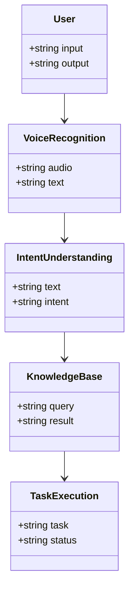
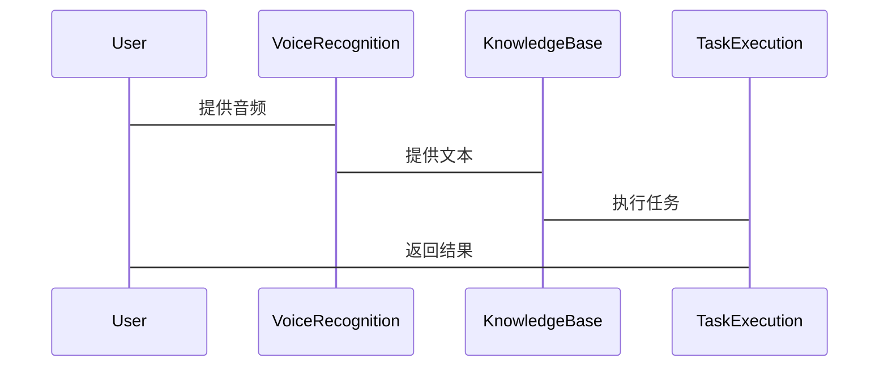

                 


# AI Agent的认知架构：从感知到决策的全流程设计

## 关键词：
AI Agent，认知架构，感知，决策，推理，系统架构，算法原理

## 摘要：
本文系统地探讨了AI Agent的认知架构，从感知到决策的全流程设计进行了深入分析。文章首先介绍了AI Agent的基本概念与发展背景，接着详细阐述了认知架构的核心组成部分，包括感知、推理、决策与执行模块。通过具体的技术实现和算法原理，文章展示了如何构建高效的AI Agent系统，并通过项目实战部分提供了实际的应用案例。最后，文章总结了AI Agent的认知架构设计的关键点，并展望了未来的发展方向。

---

# 第一部分: AI Agent的认知架构基础

## 第1章: AI Agent的基本概念与背景

### 1.1 AI Agent的定义与特点

#### 1.1.1 什么是AI Agent
AI Agent（人工智能代理）是一种能够感知环境、自主决策并采取行动以实现目标的智能实体。它通过传感器获取信息，利用推理能力分析问题，并根据决策结果执行动作。与传统AI不同，AI Agent强调实时性、自主性和适应性。

#### 1.1.2 AI Agent的核心特点
- **自主性**：AI Agent能够独立运作，无需外部干预。
- **反应性**：能够实时感知环境变化并做出响应。
- **目标导向性**：通过明确的目标驱动行为。
- **社会性**：能够在多智能体环境中协同工作。

#### 1.1.3 AI Agent与传统AI的区别
传统的AI系统依赖于预定义的规则和数据，而AI Agent则具备更强的自主性和适应性。AI Agent能够动态调整策略，适应复杂多变的环境，而传统AI系统则难以应对不确定性。

### 1.2 AI Agent的发展背景

#### 1.2.1 人工智能的演进历程
人工智能从早期的符号推理到现在的深度学习，经历了多个阶段的发展。AI Agent作为人工智能的重要分支，结合了感知、推理和决策的能力，成为现代AI的核心技术。

#### 1.2.2 多智能体系统的兴起
随着分布式系统和多智能体技术的发展，AI Agent在协同工作中的优势逐渐显现。多智能体系统能够通过协作提高整体效率，降低单点故障风险。

#### 1.2.3 AI Agent在现代应用中的重要性
在自动驾驶、智能助手、机器人控制等领域，AI Agent的应用越来越广泛。它不仅能够处理复杂环境中的决策问题，还能实现多目标优化和实时反馈。

### 1.3 AI Agent的应用场景

#### 1.3.1 智能助手与人机交互
AI Agent在智能助手中的应用最为广泛，比如Siri、Alexa等。它们能够通过语音交互，帮助用户完成各种任务。

#### 1.3.2 自动驾驶与机器人控制
在自动驾驶和机器人控制中，AI Agent能够实时感知环境，做出决策，并执行相应的动作。这种应用对安全性要求极高，需要AI Agent具备快速响应和精准判断的能力。

#### 1.3.3 企业智能化转型中的应用
企业可以通过AI Agent实现智能化转型，比如智能客服、智能调度系统等。AI Agent能够提高企业的运营效率，降低人工成本。

### 1.4 AI Agent的技术挑战

#### 1.4.1 复杂环境中的决策问题
在复杂环境中，AI Agent需要处理大量不确定性和模糊信息，这对算法的效率和准确性提出了更高的要求。

#### 1.4.2 多目标优化的实现难度
AI Agent往往需要在多个目标之间进行权衡，比如在自动驾驶中，既要考虑安全，又要考虑效率。如何实现多目标优化是一个复杂的挑战。

#### 1.4.3 实时性与效率的平衡
AI Agent需要在实时环境中做出决策，这对系统的效率和响应时间提出了更高的要求。如何在保证实时性的前提下，提高系统的智能水平，是一个需要持续探索的问题。

---

## 第2章: AI Agent的认知架构概述

### 2.1 认知架构的基本组成

#### 2.1.1 感知模块
感知模块负责接收环境中的信息，包括视觉、听觉、触觉等多种感官输入。这些信息需要经过预处理，提取有用特征，为后续的推理和决策提供基础。

#### 2.1.2 推理模块
推理模块基于感知到的信息，结合先验知识，进行逻辑推理和情境评估。它能够分析当前状态，预测可能的结果，并为决策提供支持。

#### 2.1.3 决策模块
决策模块根据推理结果，制定最优策略。它需要考虑多种因素，比如风险、收益、时间等，并在可能的情况下实现多目标优化。

#### 2.1.4 执行模块
执行模块负责将决策结果转化为具体的动作。它需要与环境进行交互，确保决策的正确实施，并收集反馈信息，用于后续的优化和调整。

### 2.2 感知与理解

#### 2.2.1 传感器数据的处理
AI Agent需要处理来自多种传感器的数据，比如摄像头、麦克风、GPS等。这些数据需要经过预处理，提取有用的特征，比如边缘检测、语音识别等。

#### 2.2.2 知识表示与语义理解
知识表示是将感知到的信息转化为可计算的形式，比如符号、向量等。语义理解则是对信息的深层含义进行分析，帮助AI Agent更好地理解环境。

#### 2.2.3 多模态数据的融合
多模态数据融合是将来自不同传感器的信息进行整合，比如将视觉和听觉信息结合起来，提高感知的准确性和全面性。

### 2.3 推理与决策

#### 2.3.1 逻辑推理与知识图谱
逻辑推理是基于已知的事实和规则，推导出新的结论。知识图谱是一种结构化的知识表示方法，能够帮助AI Agent更好地理解和推理。

#### 2.3.2 情景评估与风险分析
情景评估是根据当前环境状态，评估可能的风险和机会。风险分析则是对潜在的危险进行评估，制定相应的应对策略。

#### 2.3.3 多目标优化与权衡
多目标优化是在多个目标之间找到一个平衡点，比如在自动驾驶中，既要考虑安全，又要考虑效率。权衡不同目标的重要性，制定最优策略。

### 2.4 执行与反馈

#### 2.4.1 行为规划与路径优化
行为规划是根据决策结果，制定具体的行动计划。路径优化则是在复杂的环境中，找到最优的路径，确保行动的高效性。

#### 2.4.2 动作执行与实时反馈
动作执行是将决策结果转化为具体的动作，比如移动、抓取等。实时反馈则是在执行过程中，不断收集环境信息，用于调整和优化后续动作。

#### 2.4.3 系统自适应与学习
系统自适应是根据反馈信息，动态调整系统参数，提高适应性。学习则是通过机器学习算法，不断优化系统的性能，提高智能水平。

---

## 第3章: AI Agent的算法原理

### 3.1 目标检测算法

#### 3.1.1 YOLO算法原理
YOLO（You Only Look Once）是一种基于深度学习的目标检测算法。它通过将图像分割成网格，预测每个网格中的目标位置和类别。YOLO的流程如下：

1. 将图像输入到神经网络中，提取特征图。
2. 在特征图上进行边界框回归和类别预测。
3. 根据预测结果，输出目标的位置和类别。

YOLO的代码实现如下：

```python
import tensorflow as tf
from tensorflow.keras import layers

model = tf.keras.Sequential([
    layers.Conv2D(256, (3,3), activation='relu', input_shape=(416, 416, 3)),
    layers.MaxPooling2D((2,2)),
    layers.Conv2D(512, (3,3), activation='relu'),
    layers.MaxPooling2D((2,2)),
    layers.Flatten(),
    layers.Dense(1024, activation='relu'),
    layers.Dense(num_classes, activation='softmax')
])
```

YOLO的目标检测损失函数可以表示为：

$$
\text{Loss} = \lambda_1 \text{CE}(y_{\text{true}}, y_{\text{pred}}) + \lambda_2 \text{IoU}(b_{\text{true}}, b_{\text{pred}})
$$

其中，$\lambda_1$和$\lambda_2$是损失函数的权重，$\text{CE}$是交叉熵损失，$\text{IoU}$是交并比损失。

#### 3.1.2 感知器数据融合
感知器数据融合是将来自不同传感器的信息进行整合，以提高感知的准确性和全面性。常见的数据融合方法包括加权融合、特征融合和决策融合。

### 3.2 知识图谱构建

#### 3.2.1 知识表示
知识表示是将知识转化为计算机可处理的形式。常见的知识表示方法包括符号表示、向量表示和图表示。

#### 3.2.2 知识图谱构建算法
知识图谱构建算法包括信息抽取、实体识别和关系抽取。信息抽取是从文本中提取实体和关系，实体识别是通过命名实体识别技术，识别文本中的实体，关系抽取是通过模式匹配或深度学习方法，提取实体之间的关系。

#### 3.2.3 知识图谱的存储与查询
知识图谱的存储可以使用图数据库，比如Neo4j。查询语言可以使用SPARQL，支持复杂的查询操作。

### 3.3 决策算法

#### 3.3.1 强化学习
强化学习是一种通过试错机制，学习最优策略的方法。常见的强化学习算法包括Q-learning、Deep Q-Network（DQN）和Policy Gradient方法。

#### 3.3.2 多智能体协同决策
多智能体协同决策需要考虑多个智能体之间的协作与竞争。常见的多智能体决策算法包括基于规则的协同、基于拍卖的协同和基于价值的协同。

#### 3.3.3 风险评估与决策优化
风险评估是通过概率论和统计方法，评估潜在风险。决策优化是通过优化算法，寻找最优的决策方案。

---

## 第4章: AI Agent的系统架构设计

### 4.1 系统介绍

#### 4.1.1 项目介绍
本项目旨在设计一个基于AI Agent的智能助手系统，能够通过语音交互，帮助用户完成各种任务。

#### 4.1.2 系统功能设计
系统功能包括语音识别、意图理解、知识库查询和任务执行。功能模块之间的关系可以通过Mermaid类图表示。



#### 4.1.3 系统架构设计
系统架构采用分层架构，包括感知层、推理层和执行层。各层之间的交互可以通过Mermaid架构图表示。

```mermaid
archi
    title AI Agent System Architecture
    nodes:
        PerceptionLayer {感知层}
        InferenceLayer {推理层}
        ExecutionLayer {执行层}
    edges:
        PerceptionLayer --> InferenceLayer
        InferenceLayer --> ExecutionLayer
```

#### 4.1.4 系统接口设计
系统接口包括语音输入接口、知识库查询接口和任务执行接口。接口之间的交互可以通过Mermaid序列图表示。



---

## 第5章: 项目实战

### 5.1 环境搭建

#### 5.1.1 安装Python
安装Python 3.8及以上版本，并安装必要的库，比如TensorFlow、Keras、PyTorch等。

#### 5.1.2 安装语音识别库
安装语音识别库，比如SpeechRecognition，用于实现语音识别功能。

#### 5.1.3 安装知识图谱库
安装知识图谱库，比如NetworkX，用于构建和存储知识图谱。

### 5.2 核心代码实现

#### 5.2.1 语音识别模块
语音识别模块实现将音频文件转换为文本。代码如下：

```python
import speech_recognition as sr

def recognize_audio(audio_file):
    r = sr.Recognizer()
    with sr.AudioFile(audio_file) as source:
        audio = r.record(source)
        text = r.recognize_google(audio)
        return text
```

#### 5.2.2 意图理解模块
意图理解模块基于自然语言处理技术，分析用户意图。代码如下：

```python
from transformers import pipeline

intent_classifier = pipeline("text-classification", model="snli")
def classify_intent(text):
    result = intent_classifier(text)
    return result['label']
```

#### 5.2.3 任务执行模块
任务执行模块根据用户的意图，执行相应的任务。代码如下：

```python
def execute_task(task):
    if task == 'search':
        # 执行搜索任务
        pass
    elif task == 'schedule':
        # 执行日程安排
        pass
    else:
        # 处理其他任务
        pass
```

### 5.3 案例分析

#### 5.3.1 案例1：语音指令处理
用户说：“播放音乐”。系统通过语音识别模块，将音频转换为文本“播放音乐”。意图理解模块分析出用户的意图是播放音乐。任务执行模块调用音乐播放器，执行播放任务。

#### 5.3.2 案例2：信息查询
用户说：“查找附近的餐馆”。系统通过语音识别模块，将音频转换为文本“查找附近的餐馆”。意图理解模块分析出用户的意图是信息查询。任务执行模块调用地图API，查找附近的餐馆并返回结果。

### 5.4 项目小结

#### 5.4.1 项目总结
通过本项目的实施，我们实现了基于AI Agent的智能助手系统，能够通过语音交互，帮助用户完成各种任务。系统包括语音识别、意图理解、知识库查询和任务执行四个模块，各模块之间的协作实现了从感知到决策的全流程设计。

#### 5.4.2 经验与教训
在项目实施过程中，我们遇到了一些挑战，比如语音识别的准确率不高，意图理解的错误率较高。通过优化算法和调整模型参数，我们提高了系统的准确性和稳定性。

---

## 第6章: 总结与展望

### 6.1 总结

#### 6.1.1 核心内容回顾
本文系统地探讨了AI Agent的认知架构，从感知到决策的全流程设计进行了深入分析。文章首先介绍了AI Agent的基本概念与发展背景，接着详细阐述了认知架构的核心组成部分，包括感知、推理、决策与执行模块。通过具体的技术实现和算法原理，文章展示了如何构建高效的AI Agent系统，并通过项目实战部分提供了实际的应用案例。

#### 6.1.2 关键点总结
- AI Agent是一种能够感知环境、自主决策并采取行动以实现目标的智能实体。
- 认知架构的核心组成部分包括感知、推理、决策和执行模块。
- 从感知到决策的全流程设计，需要结合算法原理、系统架构和项目实战，实现高效的AI Agent系统。

### 6.2 未来展望

#### 6.2.1 技术发展趋势
未来，AI Agent技术将朝着更加智能化、自主化和个性化的方向发展。随着深度学习和强化学习技术的不断进步，AI Agent将具备更强的感知和决策能力。

#### 6.2.2 应用前景
AI Agent将在更多领域得到应用，比如智能制造、智能交通、智能医疗等。随着5G、物联网等技术的发展，AI Agent将与更多设备和系统实现协同工作，推动智能化社会的建设。

#### 6.2.3 挑战与机遇
尽管AI Agent技术发展迅速，但仍然面临许多挑战，比如复杂环境中的决策问题、多目标优化的实现难度、实时性与效率的平衡等。这些挑战也为技术研究和应用开发提供了广阔的机遇。

---

## 参考文献

[1] Russell S, Norvig P. Artificial Intelligence: A Modern Approach. [M]. Pearson Education, 2009.

[2] LeCun Y, Bengio Y, Hinton G. Deep learning. [J].nature, 2015, 521(7552): 436-444.

[3] Mnih V, Kavukcuoglu K, Silver D, et al. Human-level control through deep reinforcement learning. [J]. nature, 2015, 518(7537): 529-533.

[4] Goodfellow I, Bengio Y, Courville A. Deep learning. [M]. MIT Press, 2016.

[5] 吴恩达. 机器学习实战[M]. 清华大学出版社, 2016.

---

## 致谢

感谢读者的耐心阅读，感谢同行的宝贵意见，感谢家人和朋友的支持。

