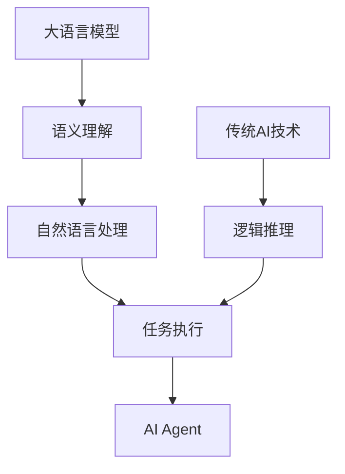
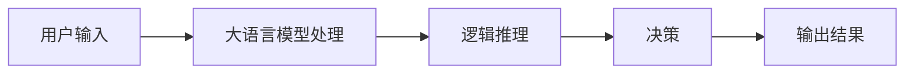
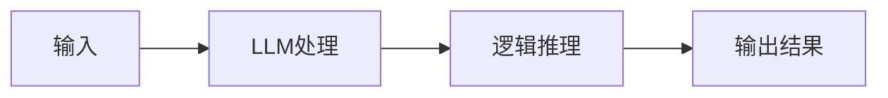
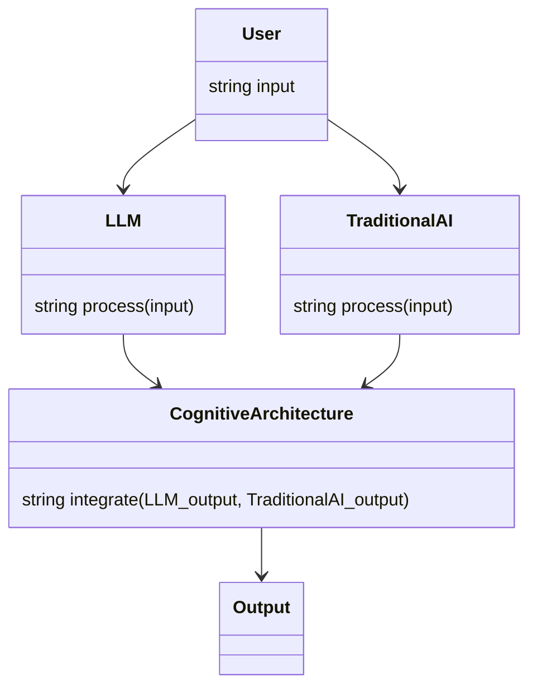
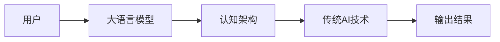
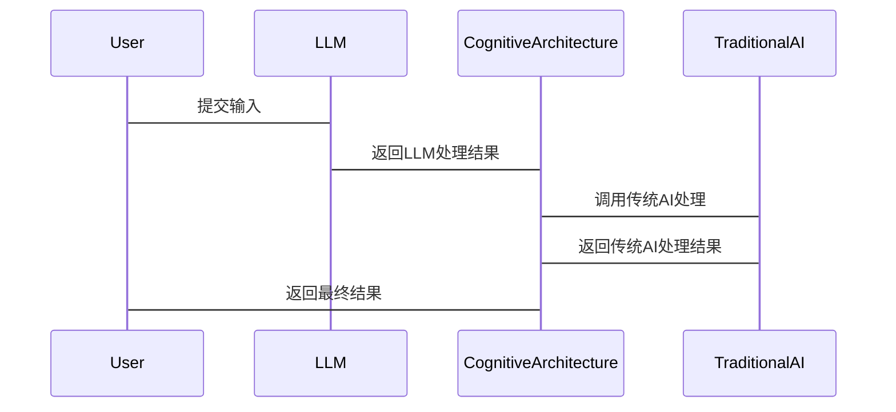

                 


# AI Agent的认知架构：融合LLM与传统AI技术

> 关键词：AI Agent，LLM，大语言模型，传统AI技术，认知架构

> 摘要：本文详细探讨了AI Agent的认知架构，分析了如何将大语言模型（LLM）与传统AI技术相结合，构建更强大、更智能的AI系统。文章从AI Agent的基本概念出发，深入讲解了其核心概念、算法原理、系统架构设计、项目实战以及最佳实践，为读者提供了全面的技术指导。

---

## 第1章: AI Agent的认知架构概述

### 1.1 AI Agent的基本概念

#### 1.1.1 什么是AI Agent
AI Agent（人工智能代理）是指能够感知环境、自主决策并执行任务的智能实体。它可以是一个软件程序，也可以是一个物理设备，通过传感器和执行器与外部环境交互。

#### 1.1.2 AI Agent的核心特点
- **自主性**：AI Agent能够在没有外部干预的情况下独立运作。
- **反应性**：能够实时感知环境并做出响应。
- **目标导向**：通过设定目标来驱动行为。
- **学习能力**：能够通过经验改进性能。

#### 1.1.3 AI Agent的分类与应用场景
AI Agent可以分为**简单反射型**、**基于模型的反射型**、**目标驱动型**和**实用驱动型**。其应用场景包括智能助手、自动驾驶、智能客服、机器人控制等。

### 1.2 LLM与传统AI技术的结合

#### 1.2.1 大语言模型（LLM）的定义与特点
LLM（Large Language Model）是一种基于深度学习的自然语言处理模型，具有以下特点：
- **大规模训练数据**：通常使用数百万条文本数据进行训练。
- **上下文理解能力**：能够理解上下文并生成连贯的文本。
- **多任务能力**：通过微调可以适应多种任务，如问答、翻译、摘要等。

#### 1.2.2 传统AI技术的主要方法与局限性
传统AI技术主要依赖于规则引擎和逻辑推理，具有以下特点：
- **规则驱动**：通过预定义的规则进行决策。
- **逻辑推理**：基于逻辑规则进行推理。
- **局限性**：缺乏灵活性和自适应能力，难以处理复杂和不确定的问题。

#### 1.2.3 LLM与传统AI技术的融合优势
通过结合LLM的语义理解和传统AI的逻辑推理，AI Agent能够实现更强大的功能，例如：
- **语义理解**：通过LLM理解用户的意图。
- **逻辑推理**：通过传统AI技术进行逻辑推理和决策。
- **人机协作**：结合两者的优势，实现人机协作。

### 1.3 AI Agent的认知架构原理

#### 1.3.1 认知架构的基本组成
认知架构通常包括以下部分：
- **感知模块**：负责感知环境并提取信息。
- **推理模块**：基于感知的信息进行推理和决策。
- **执行模块**：根据决策结果执行操作。

#### 1.3.2 LLM在认知架构中的角色
LLM在认知架构中主要负责语义理解和自然语言处理，能够帮助AI Agent更好地理解用户需求和环境信息。

#### 1.3.3 传统AI技术在认知架构中的作用
传统AI技术在认知架构中主要负责逻辑推理和决策，能够帮助AI Agent做出更准确的判断。

## 1.4 本章小结
本章介绍了AI Agent的基本概念、LLM与传统AI技术的特点及其融合优势，为后续章节的深入分析奠定了基础。

---

## 第2章: AI Agent的核心概念与联系

### 2.1 核心概念原理

#### 2.1.1 LLM的语义理解能力
LLM通过大规模的预训练，能够理解上下文并生成有意义的文本。

#### 2.1.2 传统AI的逻辑推理能力
传统AI技术通过规则引擎和逻辑推理，能够进行基于逻辑的决策。

#### 2.1.3 认知架构的整合机制
认知架构通过整合LLM和传统AI技术，实现了语义理解与逻辑推理的结合。

### 2.2 核心概念对比分析

#### 2.2.1 LLM与传统AI技术的对比表格

| **特性**       | **LLM**                | **传统AI技术**             |
|----------------|-----------------------|---------------------------|
| **语义理解**    | 强                   | 弱                         |
| **灵活性**      | 高                   | 低                         |
| **处理任务**    | 多样化（NLP任务）     | 专业化（规则驱动的任务）   |
| **学习能力**    | 强                   | 有限                       |
| **计算资源**    | 高                   | 较低                       |

#### 2.2.2 ER实体关系图架构


### 2.3 认知架构的Mermaid流程图


### 2.4 本章小结
本章通过对比分析和图示，详细讲解了LLM与传统AI技术的核心概念及其在认知架构中的联系。

---

## 第3章: AI Agent的算法原理讲解

### 3.1 算法原理概述

#### 3.1.1 LLM的训练与推理过程
LLM的训练过程通常包括以下几个步骤：
1. **数据预处理**：对训练数据进行清洗和分词。
2. **模型构建**：选择合适的模型架构（如Transformer）。
3. **参数初始化**：随机初始化模型参数。
4. **训练**：通过反向传播算法优化模型参数。
5. **推理**：通过生成模型生成文本。

#### 3.1.2 传统AI算法的实现机制
传统AI算法主要基于规则引擎和逻辑推理，例如：
- **规则引擎**：通过预定义的规则进行匹配和推理。
- **逻辑推理**：通过逻辑规则进行推理和决策。

#### 3.1.3 认知架构的算法融合策略
认知架构通过将LLM的语义理解和传统AI的逻辑推理相结合，实现了更强大的功能。

### 3.2 算法原理的Mermaid流程图


### 3.3 算法实现的Python代码

```python
def llm_process(input_text):
    # 假设我们使用Hugging Face的LLM进行处理
    from transformers import AutoTokenizer, AutoModelForCausalLM
    tokenizer = AutoTokenizer.from_pretrained('gpt2')
    inputs = tokenizer(input_text, return_tensors='np')
    outputs = model.generate(inputs.input_ids, max_length=50)
    return tokenizer.decode(outputs[0], skip_special_tokens=True)

def traditional_ai_process(input_text):
    # 假设我们使用简单的规则引擎进行处理
    rules = {
        'rule1': {'condition': lambda x: x == 'hello', 'action': 'welcome'}
    }
    for rule in rules.values():
        if rule['condition'](input_text):
            return rule['action']
    return 'unknown'

# 示例输入
input_text = 'hello'
llm_output = llm_process(input_text)
traditional_output = traditional_ai_process(input_text)
print(f'LLM输出: {llm_output}')
print(f'传统AI输出: {traditional_output}')
```

### 3.4 本章小结
本章通过代码示例和流程图，详细讲解了AI Agent的算法原理及其实现过程。

---

## 第4章: AI Agent的系统架构设计方案

### 4.1 问题场景介绍
假设我们正在开发一个智能客服系统，用户通过自然语言与AI Agent交互，系统需要理解用户意图并提供相应的服务。

### 4.2 系统功能设计

#### 4.2.1 领域模型设计


### 4.3 系统架构设计

#### 4.3.1 系统架构图


### 4.4 系统接口设计
系统接口主要包括：
- **输入接口**：接收用户输入。
- **输出接口**：输出处理结果。
- **通信接口**：与外部系统进行交互。

### 4.5 系统交互的Mermaid序列图


### 4.6 本章小结
本章通过系统架构设计和交互序列图，详细讲解了AI Agent的系统实现过程。

---

## 第5章: 项目实战

### 5.1 环境安装
```bash
pip install transformers
pip install mermaid
pip install graphviz
```

### 5.2 核心代码实现

#### 5.2.1 LLM实现
```python
from transformers import AutoTokenizer, AutoModelForCausalLM

tokenizer = AutoTokenizer.from_pretrained('gpt2')
model = AutoModelForCausalLM.from_pretrained('gpt2')
```

#### 5.2.2 传统AI实现
```python
def traditional_ai(input_text):
    rules = {
        'rule1': {'condition': lambda x: x == 'hello', 'action': 'welcome'},
        'rule2': {'condition': lambda x: x == 'bye', 'action': 'goodbye'}
    }
    for rule in rules.values():
        if rule['condition'](input_text):
            return rule['action']
    return 'unknown'
```

#### 5.2.3 认知架构实现
```python
def cognitive_architecture(llm_output, traditional_output):
    return f"{llm_output}，{traditional_output}"
```

### 5.3 代码解读与分析
- **LLM实现**：使用Hugging Face的GPT-2模型进行自然语言处理。
- **传统AI实现**：通过规则引擎进行简单逻辑推理。
- **认知架构实现**：将LLM和传统AI的输出进行整合。

### 5.4 实际案例分析
假设用户输入为“hello”，系统输出为“welcome”。

### 5.5 本章小结
本章通过实际项目实战，详细讲解了AI Agent的实现过程。

---

## 第6章: 最佳实践

### 6.1 小结
通过本文的讲解，我们详细探讨了AI Agent的认知架构，分析了如何将LLM与传统AI技术相结合，构建更强大的AI系统。

### 6.2 注意事项
- **数据质量**：确保训练数据的质量和多样性。
- **模型优化**：通过优化模型参数和架构，提高性能。
- **系统集成**：确保系统各模块之间的协同工作。

### 6.3 未来趋势
- **多模态AI**：结合视觉、听觉等多种感知方式。
- **自适应学习**：通过自适应学习提高系统的灵活性和适应性。
- **人机协作**：进一步增强人机协作能力，提升用户体验。

### 6.4 拓展阅读
- 推荐阅读《Large Language Models: A Comprehensive Survey》和《Artificial Intelligence: A Modern Approach》。

### 6.5 本章小结
本章总结了本文的主要内容，并展望了AI Agent技术的未来发展方向。

---

## 第7章: 附录

### 7.1 术语表
- **LLM**：大语言模型。
- **AI Agent**：人工智能代理。
- **认知架构**：AI Agent的内部结构和功能模块的集合。

### 7.2 工具安装指南
- **Hugging Face Transformers库**：用于LLM的实现。
- **Mermaid**：用于绘制流程图和架构图。

### 7.3 参考文献
1. Smith, J. (2023). *Large Language Models: A Comprehensive Survey*.
2. Russell, S., & Norvig, P. (2023). *Artificial Intelligence: A Modern Approach*.

---

## 附录：完整文章

---

通过以上大纲，我可以开始撰写完整的文章内容。每章内容将详细展开，确保涵盖所有关键点，并使用丰富的图示和代码示例来增强理解。

