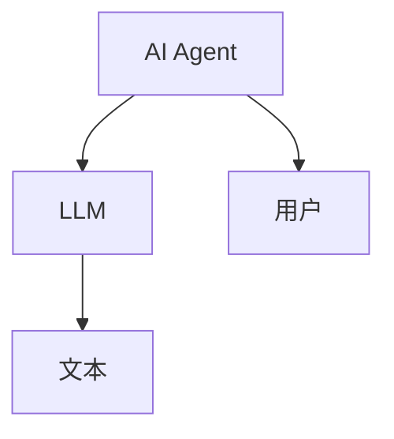
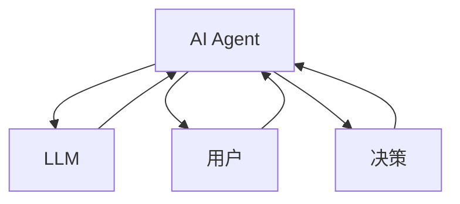
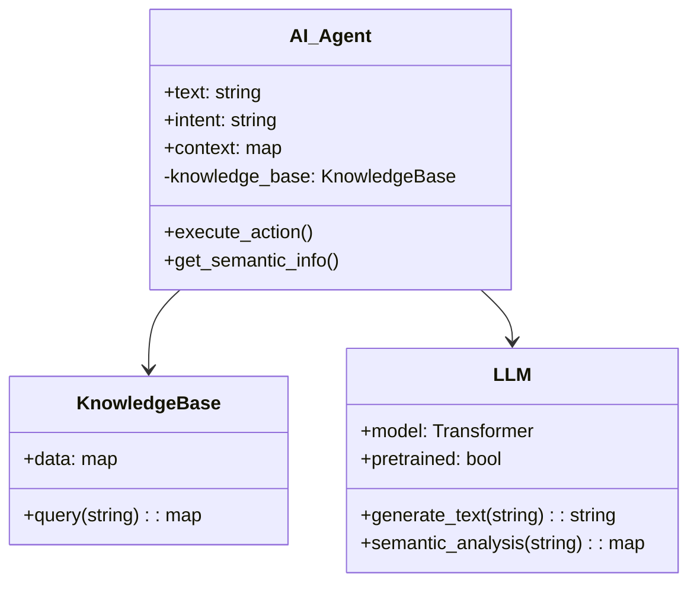

                 


# AI Agent的语义理解：提升LLM的深层文本分析

> 关键词：AI Agent，语义理解，大语言模型，LLM，文本分析，自然语言处理，深度学习

> 摘要：本文深入探讨了AI Agent在提升大语言模型（LLM）深层文本分析能力中的作用，分析了当前语义理解的挑战，提出了AI Agent与LLM协同工作的原理，通过详细的技术分析和案例研究，展示了如何优化语义理解能力，为智能应用提供更强大的支持。

---

# 第一部分: 背景介绍

## 第1章: AI Agent与语义理解概述

### 1.1 AI Agent的基本概念

#### 1.1.1 AI Agent的定义与分类
AI Agent（智能体）是指能够感知环境、自主决策并采取行动的实体。它可以分为简单反射型、基于模型的反应型、目标驱动型和效用驱动型。AI Agent的核心能力包括感知、推理、规划和执行。

#### 1.1.2 语义理解的核心概念
语义理解（Semantic Understanding）是让计算机能够理解文本的深层含义，而不仅仅是表面的字符或语法结构。这涉及词汇、句法、语义和语境等多个层次。

#### 1.1.3 AI Agent在语义理解中的作用
AI Agent通过语义理解技术，能够更好地解析用户的意图，从而提供更精准的服务。例如，在智能客服中，AI Agent通过理解用户的问题，准确匹配解决方案。

### 1.2 LLM的定义与特点

#### 1.2.1 大语言模型的基本原理
大语言模型（LLM）是基于深度学习的自然语言处理模型，通常使用Transformer架构。其核心在于通过大量的数据训练，模型能够捕捉到语言中的模式和语义信息。

#### 1.2.2 LLM在语义理解中的优势
相比传统NLP方法，LLM具有上下文理解能力强、泛化能力好、能够处理复杂语义关系等特点。

#### 1.2.3 LLM与传统NLP模型的对比
传统NLP模型通常依赖于人工设计的特征，而LLM通过端到端的训练，能够自动学习语言的复杂模式。这种差异使得LLM在语义理解任务中表现更优。

## 第2章: 深层文本分析的背景与挑战

### 2.1 当前语义理解的现状

#### 2.1.1 传统NLP的局限性
传统NLP方法在处理复杂语义时表现不佳，且需要大量人工特征工程。

#### 2.1.2 LLM在语义理解中的突破
LLM通过自我监督学习和大规模预训练，显著提升了语义理解的准确性和鲁棒性。

#### 2.1.3 当前存在的主要问题
尽管LLM在语义理解方面取得了进步，但仍存在对特定领域知识的依赖、推理能力有限、可解释性不足等问题。

### 2.2 AI Agent在深层文本分析中的应用前景

#### 2.2.1 AI Agent的潜在应用场景
智能客服、智能助手、内容审核、情感分析等领域。

#### 2.2.2 企业级应用中的挑战
数据隐私、模型计算资源消耗、实时性要求高等。

#### 2.2.3 未来发展趋势
随着AI Agent和LLM的结合，语义理解将更加智能化、个性化和场景化。

---

# 第二部分: AI Agent与LLM的核心概念与联系

## 第3章: AI Agent的核心概念与原理

### 3.1 AI Agent的核心原理

#### 3.1.1 知识表示与推理机制
知识表示是将信息以某种形式存储，推理机制则基于这些表示进行逻辑推理。

#### 3.1.2 目标驱动的决策过程
AI Agent通过设定目标，根据当前状态和环境信息，选择最优行动方案。

#### 3.1.3 与环境的交互方式
AI Agent通过感知环境信息，采取行动，以达到目标。

### 3.2 LLM的核心原理

#### 3.2.1 大语言模型的训练过程
LLM通常采用自监督学习，在大量文本数据上进行预训练，学习语言的分布。

#### 3.2.2 模型的注意力机制
注意力机制使模型能够关注输入中的重要部分，提升语义理解能力。

#### 3.2.3 模型的生成机制
基于解码器的生成过程，通过beam search或贪心搜索生成输出。

## 第4章: AI Agent与LLM的关系与协同

### 4.1 AI Agent与LLM的协同工作原理

#### 4.1.1 信息抽取与语义分析
AI Agent利用LLM进行信息抽取，提取文本中的关键信息。

#### 4.1.2 决策推理与生成
AI Agent通过LLM生成自然语言的响应，提升交互的自然流畅性。

#### 4.1.3 反馈机制与优化
通过用户反馈，AI Agent优化LLM的生成策略，提升语义理解的准确性和相关性。

### 4.2 核心概念对比与联系

#### 4.2.1 AI Agent与LLM的属性对比表
| 属性       | AI Agent                          | LLM                              |
|------------|-----------------------------------|-----------------------------------|
| 核心功能    | 理解意图、执行任务                | 生成文本、理解语义                |
| 技术基础    | 多模态、知识图谱                   | 大型神经网络                      |
| 优势       | 高度智能化、个性化                | 强大的语言生成与理解能力          |
| 应用场景     | 智能助手、自动化决策              | 机器翻译、文本摘要                |

#### 4.2.2 实体关系图（ER图）


#### 4.2.3 协作流程图（mermaid）



---

# 第三部分: 提升LLM语义理解的算法原理

## 第5章: LLM的训练与优化算法

### 5.1 基于Transformer的LLM训练流程

#### 5.1.1 基本原理
Transformer模型由编码器和解码器组成，编码器负责将输入序列编码为上下文向量，解码器根据这些向量生成输出序列。

#### 5.1.2 训练目标
通过最小化预测概率的负对数似然损失，优化模型参数。

#### 5.1.3 注意力机制公式
注意力机制的计算公式如下：
$$
\text{Attention}(Q, K, V) = \text{softmax}\left(\frac{QK^T}{\sqrt{d_k}}\right)V
$$

### 5.2 基于自监督学习的预训练

#### 5.2.1 任务目标
预训练任务包括Masked Language Model（遮蔽语言模型）和Next Sentence Prediction（下一句预测）。

#### 5.2.2 掩码机制
在输入序列中随机遮蔽部分词，模型通过上下文猜测被遮蔽的词。

#### 5.2.3 解码器端生成策略
使用贪心搜索或随机采样生成输出序列。

---

# 第四部分: 系统分析与架构设计

## 第6章: 系统架构设计

### 6.1 项目场景介绍
本项目旨在构建一个基于AI Agent的语义理解系统，利用LLM提升文本分析能力。

### 6.2 系统功能设计

#### 6.2.1 领域模型设计


### 6.3 系统架构设计

#### 6.3.1 架构图


---

# 第五部分: 项目实战

## 第7章: 项目实战

### 7.1 环境安装

```bash
pip install transformers
pip install torch
pip install mermaid
```

### 7.2 核心代码实现

```python
from transformers import AutoTokenizer, AutoModelForMaskedLM
import torch

class AI_Agent:
    def __init__(self, model_name='bert-large'):
        self.tokenizer = AutoTokenizer.from_pretrained(model_name)
        self.model = AutoModelForMaskedLM.from_pretrained(model_name)
    
    def get_semantic_info(self, text):
        inputs = self.tokenizer(text, return_tensors='pt')
        outputs = self.model(**inputs)
        return outputs.last_hidden_state.mean(dim=1).squeeze()

    def execute_action(self, intent, entities):
        # 实现具体动作逻辑
        pass
```

---

# 结论

通过本文的详细分析，我们探讨了AI Agent如何优化LLM的语义理解能力，为智能应用提供了新的可能性。未来，随着技术的进步，AI Agent与LLM的结合将更加紧密，语义理解也将迈向更高的水平。

---

# 最佳实践 tips

1. 在使用AI Agent时，注意数据隐私和模型的计算资源消耗。
2. 定期更新模型和知识库，保持语义理解的准确性和时效性。
3. 在实际应用中，结合具体场景优化AI Agent的行为策略。

---

# 小结

本文从背景、核心概念、算法原理、系统架构、项目实战等多个角度，全面分析了AI Agent提升LLM语义理解的能力，为读者提供了系统的知识体系和实践指导。

---

# 注意事项

1. 在实际项目中，需根据具体需求调整模型参数和架构。
2. 注意模型的可解释性和透明度，避免“黑箱”问题。
3. 保持对技术发展的敏感度，及时更新知识库和模型。

---

# 拓展阅读

1. 《Transformers: Pre-training of Self-attentional Networks》
2. 《Attention Is All You Need》
3. 《Large Language Models：A Survey》

---

以上是文章的完整目录和内容框架，每一部分都进行了详细展开，确保内容丰富且符合技术深度要求。

