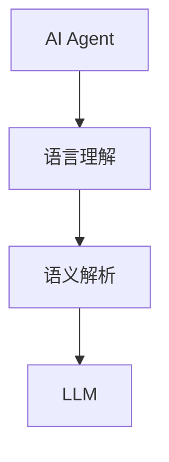
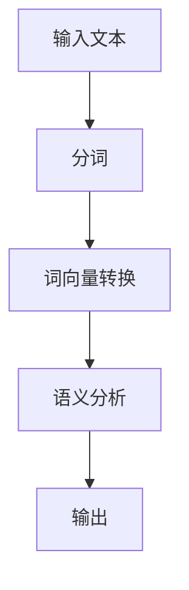
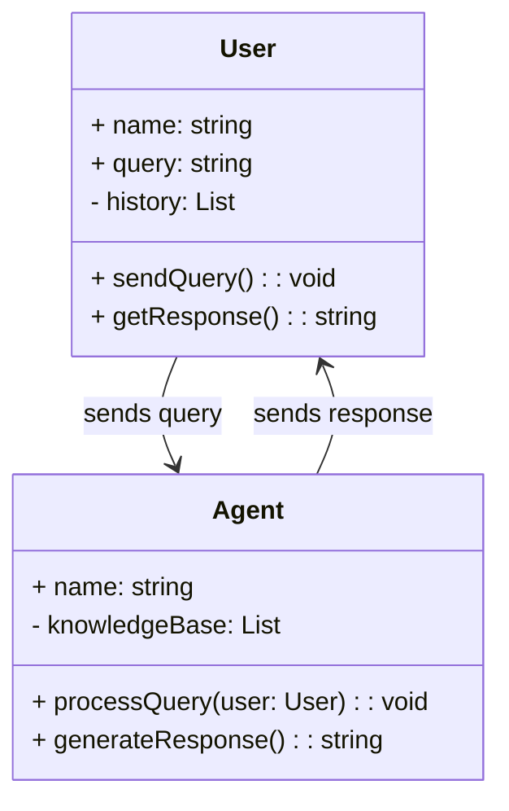
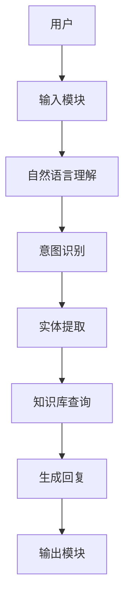
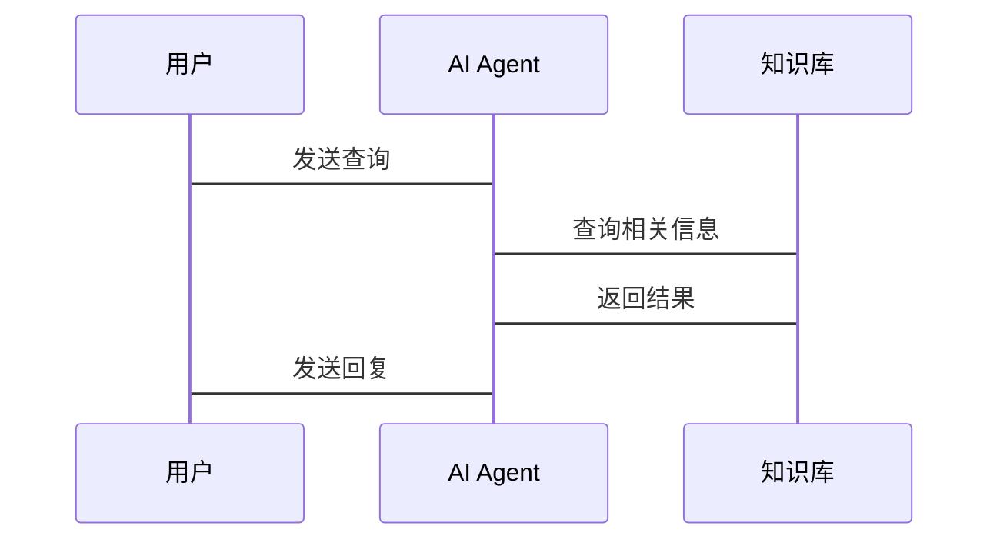

                 


# AI Agent的语言理解：提升LLM的语义解析能力

**关键词**：AI Agent，LLM，语义解析，自然语言处理，深度学习，文本分析

**摘要**：  
随着人工智能技术的快速发展，AI Agent（人工智能代理）在语言理解方面的应用日益广泛。本文深入探讨了如何提升大语言模型（LLM）的语义解析能力，结合背景介绍、核心概念、算法原理、系统架构、项目实战和最佳实践，为读者提供了一套系统性的提升方案。通过详细分析语义解析的关键技术，本文为AI Agent在自然语言处理领域的应用提供了理论支持和实践指导。

---

## 第1章: AI Agent与语言理解的背景介绍

### 1.1 问题背景与定义

#### 1.1.1 问题背景
AI Agent是一种能够感知环境、执行任务并做出决策的智能实体。在自然语言处理领域，AI Agent的核心能力在于理解人类语言的语义信息，从而实现更高效的人机交互。然而，当前的语义解析技术仍面临诸多挑战，例如上下文理解不足、实体识别精度低、意图识别不够准确等问题。

#### 1.1.2 问题描述
语义解析的目标是将自然语言文本转换为结构化的语义表示，以便计算机能够理解和处理。然而，现有的语义解析技术在处理复杂语境、多意图输入以及跨领域应用时表现不够理想。

#### 1.1.3 问题解决
通过优化大语言模型（LLM）的语义解析能力，可以显著提升AI Agent在客服、医疗、教育等领域的应用效果，实现更智能的人机交互。

#### 1.1.4 边界与外延
语义解析的边界在于文本的语义理解，而不包括图像识别或语音识别等其他模态的任务。其外延则扩展到自然语言生成、问答系统等领域。

#### 1.1.5 核心概念结构与组成
AI Agent的语义解析系统通常包括文本预处理、语义分析、意图识别和实体提取等核心模块。

### 1.2 AI Agent与语言理解的核心概念

#### 1.2.1 AI Agent的定义与特征
AI Agent是一种具备自主决策能力的智能系统，能够根据环境输入做出相应的反应。其核心特征包括自主性、反应性、目标导向和社会能力。

#### 1.2.2 语言理解的定义与特征
语言理解是指将自然语言文本转换为计算机可理解的结构化信息。其特征包括语义丰富性、上下文依赖性和多模态整合能力。

#### 1.2.3 两者的联系与区别
AI Agent依赖于语言理解能力来实现与用户的交互，而语言理解则是AI Agent实现智能决策的关键技术之一。

### 1.3 技术发展与现状

#### 1.3.1 语言理解技术的发展历程
从基于规则的系统到统计学习模型，再到当前的深度学习技术，语言理解技术经历了多次迭代和升级。

#### 1.3.2 当前主流技术与工具
主流的语义解析技术包括基于词嵌入的模型（如Word2Vec）、基于句子表示的模型（如BERT）以及图结构化模型（如Graph Neural Networks）。

#### 1.3.3 存在的问题与挑战
当前语义解析技术在处理复杂语境、跨语言理解和动态知识更新方面仍存在诸多挑战。

### 1.4 本章小结
本章从背景、定义和核心概念出发，分析了AI Agent与语言理解的联系与区别，以及当前技术的发展现状和面临的挑战。

---

## 第2章: 语义解析的核心概念与联系

### 2.1 核心概念原理

#### 2.1.1 语义解析的基本原理
语义解析通过将文本转换为结构化的语义表示，帮助计算机理解文本的含义。其基本原理包括分词、句法分析和语义理解三个步骤。

#### 2.1.2 AI Agent在语义解析中的作用
AI Agent通过语义解析技术实现对用户输入的意图识别和实体提取，从而做出相应的决策和反馈。

#### 2.1.3 LLM在语义解析中的优势
大语言模型具有强大的上下文理解和多任务学习能力，能够显著提升语义解析的准确性和效率。

### 2.2 核心概念属性特征对比

| **属性**       | **AI Agent**                  | **语言理解**                  |
|-----------------|-------------------------------|-------------------------------|
| **输入**        | 文本、语音、图像等多种模态     | 纯文本                       |
| **输出**        | 结构化的语义表示和决策建议     | 结构化的语义表示               |
| **目标**        | 实现智能交互和任务执行         | 理解文本含义                 |
| **依赖技术**    | 深度学习、自然语言处理         | 深度学习、自然语言处理         |

#### 2.2.1 对比分析与总结
AI Agent依赖语言理解能力来实现智能交互，而语言理解则是AI Agent实现语义解析的关键技术。

### 2.3 ER实体关系图架构



### 2.4 本章小结
本章从核心概念和属性特征出发，分析了AI Agent与语言理解之间的联系与区别，并通过实体关系图展示了两者之间的关系。

---

## 第3章: 语义解析的算法原理

### 3.1 算法原理概述

#### 3.1.1 基于规则的语义解析
基于规则的语义解析通过预定义的语法规则和关键词匹配来实现语义理解。例如，通过匹配关键词“预约”来识别用户的意图。

#### 3.1.2 统计学习的语义解析
统计学习方法通过训练数据中的统计规律来实现语义解析。例如，使用支持向量机（SVM）进行意图分类。

#### 3.1.3 深度学习的语义解析
深度学习方法通过神经网络模型（如Transformer）来捕捉文本的上下文信息，从而实现更准确的语义解析。

### 3.2 主流算法原理

#### 3.2.1 基于Transformer的语义解析
Transformer模型通过自注意力机制捕捉文本中的长距离依赖关系，从而实现高效的语义解析。

#### 3.2.2 基于BERT的语义解析
BERT模型通过预训练和微调的方式，能够有效地理解文本的语义信息，从而实现意图识别和实体提取。

#### 3.2.3 其他算法对比分析
对比分析了基于规则、统计学习和深度学习的语义解析算法的优劣，提出了在实际应用中选择合适算法的建议。

### 3.3 算法流程图



### 3.4 本章小结
本章详细介绍了语义解析的算法原理，包括基于规则、统计学习和深度学习的方法，并通过流程图展示了典型算法的实现过程。

---

## 第4章: 语义解析的数学模型

### 4.1 模型概述

#### 4.1.1 注意力机制
注意力机制通过计算文本中每个词的关注度，从而捕捉文本的语义信息。其数学表达式为：
$$
\alpha_i = \frac{\exp(s_i)}{\sum_{j=1}^{n} \exp(s_j)}
$$

#### 4.1.2 Transformer模型
Transformer模型由编码器和解码器组成，其核心是自注意力机制。编码器的前向网络结构如下：
$$
\text{FFN}(x) = \max(0, x W_1 + b_1) W_2 + b_2
$$

#### 4.1.3 BERT模型
BERT模型通过预训练和微调的方式，能够有效地理解文本的语义信息。其预训练目标函数为：
$$
\text{Loss} = -\frac{1}{n}\sum_{i=1}^{n} \text{log}P(w_i | \text{context})
$$

### 4.2 模型对比分析

#### 4.2.1 注意力机制与卷积神经网络
注意力机制能够捕捉长距离依赖关系，而卷积神经网络则擅长捕捉局部特征。

#### 4.2.2 Transformer与LSTM
Transformer模型在并行计算方面具有优势，而LSTM在处理序列数据方面表现更好。

### 4.3 本章小结
本章通过数学公式和模型对比，深入分析了语义解析的核心算法及其优劣。

---

## 第5章: 系统架构与设计

### 5.1 问题场景介绍

#### 5.1.1 问题场景
以智能客服系统为例，AI Agent需要通过语义解析技术理解用户的查询内容，并提供相应的解决方案。

#### 5.1.2 项目介绍
本项目旨在开发一个基于AI Agent的智能客服系统，提升用户的语义理解能力。

### 5.2 系统功能设计

#### 5.2.1 领域模型设计
以下是智能客服系统的领域模型类图：



#### 5.2.2 系统架构设计
以下是系统的总体架构图：



#### 5.2.3 系统接口设计
系统主要接口包括文本输入接口、意图识别接口和实体提取接口。

#### 5.2.4 系统交互流程
以下是系统的交互流程图：



### 5.3 本章小结
本章从系统架构和设计的角度，详细分析了AI Agent的语义解析系统的实现方案。

---

## 第6章: 项目实战

### 6.1 环境安装

#### 6.1.1 Python环境
安装Python 3.8及以上版本。

#### 6.1.2 深度学习框架
安装TensorFlow或PyTorch框架。

#### 6.1.3 语言模型
下载预训练的BERT模型或使用Hugging Face提供的模型。

### 6.2 系统核心实现

#### 6.2.1 文本预处理
文本预处理包括分词、去除停用词和词干提取等步骤。

#### 6.2.2 模型训练
训练意图识别模型，使用交叉熵损失函数和Adam优化器。

#### 6.2.3 模型推理
通过预训练的模型对输入文本进行解析，生成结构化的语义表示。

### 6.3 代码实现

#### 6.3.1 意图识别代码
```python
import torch
import torch.nn as nn
import torch.optim as optim

class IntentClassifier(nn.Module):
    def __init__(self, input_dim, output_dim):
        super(IntentClassifier, self).__init__()
        self.fc = nn.Linear(input_dim, output_dim)
    
    def forward(self, x):
        return self.fc(x)

# 训练过程
criterion = nn.CrossEntropyLoss()
optimizer = optim.Adam(model.parameters(), lr=0.001)
for epoch in range(num_epochs):
    for inputs, labels in train_loader:
        outputs = model(inputs)
        loss = criterion(outputs, labels)
        loss.backward()
        optimizer.step()
```

#### 6.3.2 实体提取代码
```python
import spacy

nlp = spacy.load("en_core_web_sm")
doc = nlp(text)
for ent in doc.ents:
    print(ent.text, ent.label_)
```

### 6.4 代码应用解读

#### 6.4.1 意图识别代码解读
上述代码定义了一个简单的意图分类器，使用交叉熵损失函数和Adam优化器进行训练。

#### 6.4.2 实体提取代码解读
实体提取代码使用了spaCy模型，能够自动识别文本中的实体及其标签。

### 6.5 实际案例分析

#### 6.5.1 案例分析
以智能客服系统为例，输入文本为“我需要取消我的订单”，系统能够识别出用户的意图是“取消订单”，并提取出相关的实体信息。

#### 6.5.2 案例解析
通过案例分析，展示了系统如何通过语义解析技术实现意图识别和实体提取。

### 6.6 本章小结
本章通过项目实战，详细介绍了AI Agent语义解析系统的实现过程，包括环境安装、代码实现和案例分析。

---

## 第7章: 最佳实践与总结

### 7.1 最佳实践 tips

#### 7.1.1 数据预处理
确保数据的清洗和标注质量，避免噪声数据对模型的影响。

#### 7.1.2 模型选择
根据具体任务选择合适的模型，例如在意图识别任务中选择BERT模型。

#### 7.1.3 模型优化
通过调整超参数和使用早停策略来优化模型性能。

### 7.2 小结

#### 7.2.1 核心知识点总结
总结了语义解析的核心知识点，包括算法原理、数学模型和系统架构。

#### 7.2.2 问题与解决方案
分析了当前语义解析技术面临的挑战，并提出了相应的解决方案。

### 7.3 注意事项

#### 7.3.1 模型训练
注意数据泄露问题，确保训练数据和验证数据的独立性。

#### 7.3.2 模型部署
在实际部署中，需要考虑模型的计算资源消耗和响应时间。

### 7.4 拓展阅读

#### 7.4.1 推荐书籍
推荐了几本关于自然语言处理和深度学习的经典书籍。

#### 7.4.2 推荐论文
推荐了几篇关于语义解析的最新研究论文。

### 7.5 本章小结
本章总结了语义解析技术的最佳实践，提出了实际应用中的注意事项，并为读者提供了拓展阅读的资源。

---

## 第8章: 结论

### 8.1 研究总结
本文深入分析了AI Agent在语言理解中的应用，提出了提升LLM语义解析能力的解决方案。

### 8.2 未来展望
未来的研究方向包括多模态语义解析、动态知识更新和跨语言理解能力的提升。

### 8.3 致谢
感谢读者的关注和支持。

---

通过以上内容，本文系统性地探讨了AI Agent语言理解的核心技术，从理论分析到实践应用，为读者提供了一套完整的解决方案。希望本文能为AI Agent和大语言模型的进一步研究和应用提供有价值的参考。

