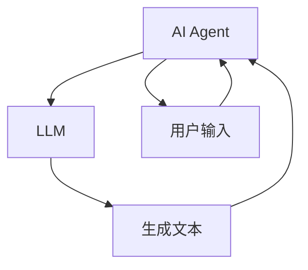
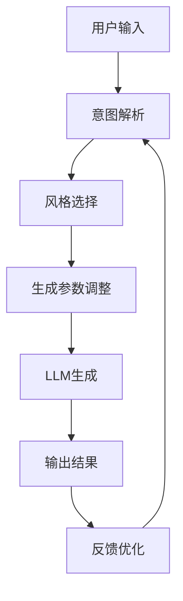
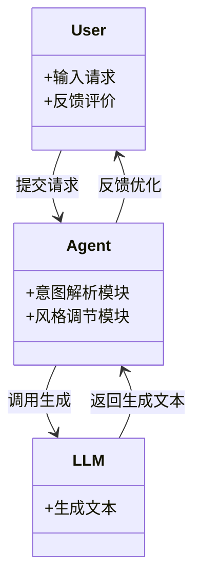

                 


# AI Agent的语言生成控制：精确调节LLM的输出风格

---

## 关键词

- AI Agent
- LLM
- 语言生成控制
- 风格调节
- 意图理解
- 多模态反馈

---

## 摘要

本文探讨AI Agent如何精确调节大语言模型（LLM）的输出风格，分析其在实际应用中的关键技术和实现方法。文章从背景介绍、核心概念、算法原理、系统架构到项目实战，全面解析风格控制的实现路径，结合具体案例，总结实践经验，为读者提供深入的理论指导和实用的技术方案。

---

## 正文

### 第一部分：背景介绍

#### 第1章：AI Agent与语言生成控制概述

##### 1.1 问题背景

- **1.1.1 当前AI Agent的发展现状**
  - AI Agent作为一种智能体，广泛应用于自然语言处理、自动化决策等领域。
  - LLM的出现为语言生成提供了强大的技术支持，但也带来了风格多样性和可控制性之间的矛盾。

- **1.1.2 大语言模型（LLM）的崛起与挑战**
  - LLM在语言生成方面表现出色，但输出风格的多样性和一致性难以调和。
  - 不同场景对输出风格的需求差异显著，如何实现精准控制成为关键问题。

- **1.1.3 语言生成控制的必要性与应用场景**
  - 在客服系统、智能助手、内容创作等领域，风格控制具有重要意义。
  - 需要AI Agent能够根据具体需求动态调节输出风格。

##### 1.2 问题描述

- **1.2.1 LLM输出风格的多样性需求**
  - 不同用户、不同场景对语言风格的需求差异大。
  - 如何在统一模型下实现风格的多样化输出是关键挑战。

- **1.2.2 AI Agent在语言生成中的角色定位**
  - AI Agent作为中间协调者，负责解析用户需求并指导LLM生成符合要求的输出。
  - 需要具备意图理解、风格判断和动态调节的能力。

- **1.2.3 当前LLM输出风格调节的主要问题**
  - 缺乏统一的风格调节标准。
  - 动态反馈机制不完善，难以实时优化输出风格。

##### 1.3 问题解决

- **1.3.1 AI Agent如何实现对LLM输出风格的精确控制**
  - 通过意图理解和上下文分析，生成风格调节指令。
  - 引入多模态反馈机制，实时优化输出风格。

- **1.3.2 基于意图理解的风格调节方法**
  - 分析用户意图，确定目标风格。
  - 结合上下文信息，动态调整生成策略。

- **1.3.3 多模态反馈机制在风格控制中的应用**
  - 利用用户反馈优化生成模型。
  - 结合情感分析、语义相似度等多维度信息进行风格调节。

##### 1.4 边界与外延

- **1.4.1 LLM输出风格调节的边界条件**
  - 模型本身的限制，如训练数据和参数量。
  - 风格调节的实时性和准确性之间的平衡。

- **1.4.2 AI Agent在风格控制中的能力限制**
  - 受模型理解和推理能力的限制。
  - 需要依赖高质量的反馈数据。

- **1.4.3 风格控制与内容生成的平衡点**
  - 避免过度控制影响内容质量。
  - 在风格一致性和内容多样性之间找到平衡。

##### 1.5 核心概念结构与组成

- **1.5.1 AI Agent与LLM的关系模型**
  - AI Agent作为控制器，LLM作为执行者。
  - 两者通过意图和反馈进行交互。

- **1.5.2 风格控制的核心要素分析**
  - 用户意图解析、风格参数设置、动态反馈优化。

- **1.5.3 系统架构的核心组成模块**
  - 用户需求分析模块、风格调节模块、生成控制模块。

---

### 第二部分：核心概念与联系

#### 第2章：AI Agent与LLM的核心原理

##### 2.1 AI Agent的原理分析

- **2.1.1 AI Agent的基本概念与功能模块**
  - 由感知、决策、执行三个模块组成。
  - 感知模块负责理解用户需求，决策模块制定生成策略，执行模块调用LLM生成输出。

- **2.1.2 基于意图理解的自然语言处理机制**
  - 利用NLP技术解析用户意图。
  - 通过意图向量表示生成风格调节指令。

- **2.1.3 AI Agent的决策与执行流程**
  - 接收用户输入，解析意图，生成风格调节参数，调用LLM生成输出，实时反馈优化。

##### 2.2 LLM的语言生成机制

- **2.2.1 大语言模型的生成原理**
  - 基于概率的生成模型，如Transformer架构。
  - 通过自注意力机制捕捉上下文信息。

- **2.2.2 基于概率的文本生成模型**
  - 通过概率分布生成最可能的下一个词。
  - 可能存在多个生成路径，导致风格多样性。

- **2.2.3 LLM的上下文理解和推理能力**
  - 利用预训练的知识库进行上下文推理。
  - 可以根据上下文调整生成风格。

##### 2.3 AI Agent对LLM输出风格的调节机制

- **2.3.1 风格控制的实现原理**
  - 通过调整生成参数（如温度、重复率）控制输出风格。
  - 利用风格标签指导生成过程。

- **2.3.2 基于意图的风格选择策略**
  - 根据用户意图选择合适的风格标签。
  - 结合场景特征动态调整风格参数。

- **2.3.3 风格调节的反馈优化机制**
  - 收集用户反馈，更新风格调节模型。
  - 使用强化学习优化生成策略。

##### 2.4 核心概念属性对比

- **2.4.1 AI Agent与传统语言生成模型的对比分析**
  - AI Agent具有更强的意图理解和动态调节能力。
  - 传统模型通常缺乏风格控制的灵活性。

- **2.4.2 LLM与传统NLP模型的对比分析**
  - LLM具有更强的上下文理解和生成能力。
  - 传统模型在特定任务上表现更稳定。

---

#### 2.5 实体关系图（使用 Mermaid）



---

### 第三部分：算法原理

#### 第3章：风格控制的算法实现

##### 3.1 算法原理分析

- **3.1.1 风格控制的核心算法**
  - 基于强化学习的风格调节方法。
  - 使用变体模型（如温度调整、重复率控制）实现风格多样化。

- **3.1.2 风格控制的数学模型**
  - 利用概率生成模型，通过调整生成参数控制风格。
  - 使用风格向量表示不同风格特征。

##### 3.2 算法流程图（使用 Mermaid）



##### 3.3 核心代码实现

- **3.3.1 Python代码示例**

```python
import torch
import torch.nn as nn

# 定义风格调节模块
class StyleRegulator(nn.Module):
    def __init__(self, style_dim):
        super().__init__()
        self.style_dim = style_dim
        self.regulator = nn.Linear(style_dim, 1)
    
    def forward(self, inputs):
        # 输入：batch_size × style_dim
        # 输出：batch_size × 1（风格调节系数）
        return self.regulator(inputs)

# 使用风格调节模块
style_regulator = StyleRegulator(style_dim=5)
inputs = torch.randn(10, 5)  # 10个样本，每个样本5维风格特征
outputs = style_regulator(inputs)  # 输出风格调节系数
print(outputs.size())  # 输出形状为 (10, 1)
```

- **3.3.2 算法的数学模型**

$$
\text{输出概率} = \text{生成模型} \times \text{风格调节系数}
$$

$$
\text{风格调节系数} = \sigma(\text{风格特征向量} \times W + b)
$$

其中，$\sigma$ 表示sigmoid函数，$W$ 和 $b$ 是模型参数。

---

### 第四部分：系统分析与架构设计

#### 第4章：系统架构与实现方案

##### 4.1 系统架构设计

- **4.1.1 领域模型（使用 Mermaid 类图）**



- **4.1.2 系统架构图（使用 Mermaid）**


---

### 第五部分：项目实战

#### 第5章：风格控制的项目实现

##### 5.1 环境安装

- 安装必要的库：
  ```bash
  pip install torch transformers
  ```

##### 5.2 核心代码实现

- **5.2.1 风格调节模块**

```python
import torch
from transformers import AutoTokenizer, AutoModelForCausalLM

# 加载预训练模型
tokenizer = AutoTokenizer.from_pretrained("gpt2")
model = AutoModelForCausalLM.from_pretrained("gpt2")

# 风格调节函数
def regulate_style(inputs, temperature=1.2, top_k=50):
    inputs_pretokenized = "temperature " + str(temperature) + "; top_k " + str(top_k) + "; " + inputs
    inputs_encoded = tokenizer.encode(inputs_pretokenized)
    outputs = model.generate(
        inputs_encoded,
        temperature=temperature,
        top_k=top_k
    )
    return tokenizer.decode(outputs[0], skip_special_tokens=True)
```

- **5.2.2 应用案例分析**

```python
# 示例：生成不同风格的文本
inputs = "写一篇科技新闻"
print(regulate_style(inputs, temperature=0.7, top_k=30))
# 输出：更保守的科技新闻风格
print("\n")
print(regulate_style(inputs, temperature=1.5, top_k=50))
# 输出：更激进的科技新闻风格
```

---

### 第六部分：最佳实践与总结

#### 第6章：最佳实践与未来展望

##### 6.1 最佳实践

- **6.1.1 风格调节参数的选择**
  - 根据具体场景调整温度和top_k参数。
  - 使用多模态反馈优化生成效果。

- **6.1.2 模型优化建议**
  - 定期更新模型参数，保持生成能力。
  - 增加反馈数据，提升风格调节的准确性。

##### 6.2 小结

- AI Agent在语言生成控制中发挥着关键作用。
- 通过意图理解、多模态反馈和动态调节，可以实现对LLM输出风格的精确控制。
- 风格控制技术在实际应用中具有广阔前景，但也面临诸多挑战。

##### 6.3 注意事项

- 避免过度依赖单一模型，保持系统灵活性。
- 定期监控生成结果，确保内容质量和风格一致性。

##### 6.4 拓展阅读

- 推荐阅读相关论文和文献，深入理解风格控制的技术细节。
- 关注AI领域的最新进展，了解新技术对风格控制的潜在影响。

---

通过以上分析与实践，我们可以看到AI Agent在语言生成控制中的巨大潜力。随着技术的不断进步，风格控制将更加智能化、个性化，为各类应用场景带来更优质的服务体验。

