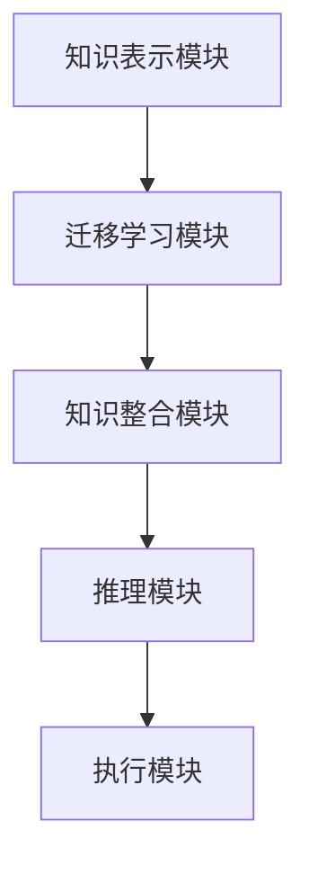

                 


# AI Agent的跨域知识迁移与整合

---

## 关键词：
AI Agent、跨域知识迁移、知识表示、迁移学习、多任务学习、知识整合

---

## 摘要：
本文深入探讨AI Agent在跨域知识迁移与整合中的核心原理、算法框架和实际应用。通过分析知识表示、迁移学习和多任务学习，结合具体案例，详细阐述了AI Agent如何实现跨域知识的有效迁移与整合，为解决实际问题提供了理论基础和实践指导。

---

## 第一部分: AI Agent的跨域知识迁移与整合概述

### 第1章: 引言

#### 1.1 问题背景
- **AI Agent**是一种能够感知环境并采取行动以实现目标的智能体，广泛应用于自然语言处理、计算机视觉等领域。
- 跨域知识迁移的必要性：AI Agent需要在不同领域间迁移知识，解决单一领域模型难以应对跨域问题的局限性。
- 当前挑战：跨域知识迁移面临语义鸿沟、数据异构性等问题。

#### 1.2 问题描述
- AI Agent的定义与功能：感知环境、推理、规划和执行。
- 跨域知识迁移的具体场景：例如医疗与金融领域的知识迁移。
- 知识迁移中的语义鸿沟问题：不同领域术语和概念的差异。

#### 1.3 问题解决
- 跨域知识迁移的解决方案：通过知识表示学习和迁移学习实现。
- 整合多领域知识的策略：构建统一的知识图谱，利用迁移学习算法进行知识迁移。

#### 1.4 边界与外延
- 跨域知识迁移的边界条件：数据量、领域相关性等。
- 相关概念对比：知识迁移与数据迁移的区别。
- 适用范围与限制：适用于中低相关性的领域。

#### 1.5 概念结构与核心要素组成
- AI Agent的结构：感知模块、推理模块、执行模块。
- 跨域知识迁移的核心要素：知识表示、迁移策略、整合机制。
- 知识整合的逻辑框架：从知识提取到对齐，再到整合。

---

## 第二部分: AI Agent的核心概念与原理

### 第2章: AI Agent的核心概念与原理

#### 2.1 AI Agent的基本原理
- **知识表示**：使用符号逻辑或向量表示知识，如概念间的关系。
- **推理机制**：基于知识库进行逻辑推理，如演绎推理和归纳推理。

#### 2.2 跨域知识迁移的原理
- **知识表示的统一性**：通过向量空间模型统一不同领域的知识表示。
- **语义对齐方法**：使用对比学习对齐不同领域的语义向量。
- **迁移机制**：利用预训练模型如BERT进行跨域迁移。

#### 2.3 AI Agent的多领域知识整合
- **知识图谱的构建**：整合多个领域的知识，形成统一的知识图谱。
- **动态更新机制**：根据新数据动态更新知识图谱，保持知识的时效性。

---

## 第三部分: 跨域知识迁移的核心算法与数学模型

### 第3章: 跨域知识迁移的核心算法

#### 3.1 知识表示与迁移算法
- **向量空间模型**：将知识表示为向量，计算向量的相似度。
- **图神经网络**：用于处理知识图谱中的复杂关系。

#### 3.2 跨域迁移学习算法
- **特征对齐算法**：通过对抗训练对齐不同领域的特征向量。
- **分布匹配算法**：通过最大 mean discrepancy (MMD) 优化分布差异。

#### 3.3 多任务学习与知識整合
- **多任务学习框架**：同时学习多个相关任务，共享知识。
- **基于多任务学习的知識遷移**：通过共享参数实现跨域知识整合。

---

## 第四部分: 跨域知识迁移的数学模型与公式

### 第4章: 跨域知识迁移的数学模型

#### 4.1 知识表示的数学模型
- **向量表示**：将知识表示为高维向量，计算余弦相似度。
- **图表示**：使用图神经网络编码节点关系，输出节点嵌入向量。

#### 4.2 跨域知识遷移的数学公式
- **损失函数**：定义损失函数，如交叉熵损失，用于优化模型。
- **对齐策略**：使用对比损失对齐不同领域的表示。

---

## 第五部分: 系统分析与架构设计方案

### 第5章: 系统分析与架构设计方案

#### 5.1 问题场景介绍
- **项目背景**：医疗与金融领域的知识迁移案例。
- **系统目标**：构建跨领域知识迁移模型，提升AI Agent的推理能力。

#### 5.2 系统功能设计
- **领域模型设计**：设计医疗和金融领域的知识图谱，展示实体及其关系。
- **系统架构设计**：包括知识表示模块、迁移学习模块和知识整合模块。

#### 5.3 系统架构图


---

## 第六部分: 项目实战

### 第6章: 项目实战

#### 6.1 环境安装
- 安装必要的库，如TensorFlow、Keras、Scikit-learn。

#### 6.2 系统核心实现源代码
```python
import tensorflow as tf
from tensorflow.keras import layers

def contrastive_loss(y_true, y_pred):
    margin = 1.0
    loss = tf.reduce_mean(tf.square(y_true - y_pred))
    return loss

# 定义编码器模型
def encoder_model(input_dim):
    inputs = layers.Input(shape=(input_dim,))
    x = layers.Dense(64, activation='relu')(inputs)
    outputs = layers.Dense(128, activation='sigmoid')(x)
    return tf.keras.Model(inputs=inputs, outputs=outputs)

# 定义对比学习模型
encoder = encoder_model(input_dim)
```

#### 6.3 代码应用解读与分析
- **编码器模型**：将输入数据映射到低维空间，提取特征。
- **对比损失函数**：优化编码器，使同一类别数据的特征向量尽可能接近，不同类别尽可能远离。

#### 6.4 实际案例分析
- **案例分析**：医疗与金融领域的数据预处理、特征提取和模型训练。
- **结果展示**：对比不同算法的迁移效果，评估模型性能。

---

## 第七部分: 总结与展望

### 第7章: 总结与展望

#### 7.1 总结
- **核心内容回顾**：AI Agent的跨域知识迁移与整合的核心概念、算法和系统架构。
- **关键点总结**：知识表示、迁移学习和多任务学习的重要性。

#### 7.2 未来展望
- **研究方向**：更高效的跨域知识迁移算法，如基于自监督学习的方法。
- **应用前景**：AI Agent在更多领域的应用，如教育、司法等。

---

## 参考文献
1. Pan, S. J., et al. "Domain adaptation via kernel-based methods." IEEE transactions on pattern analysis and machine intelligence, 2009.
2. Yin, H., et al. "Transfer learning." Synthesis lectures on artificial intelligence and machine learning, 2010.

---

## 致谢
感谢读者的支持和关注，希望本文能为AI Agent的研究和应用提供有价值的参考。

