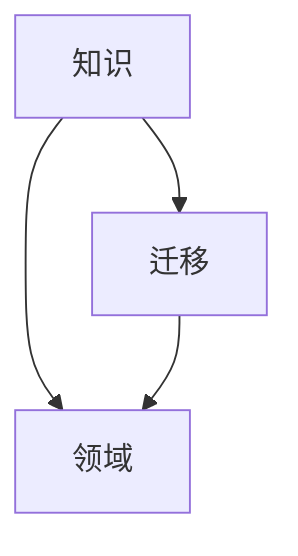
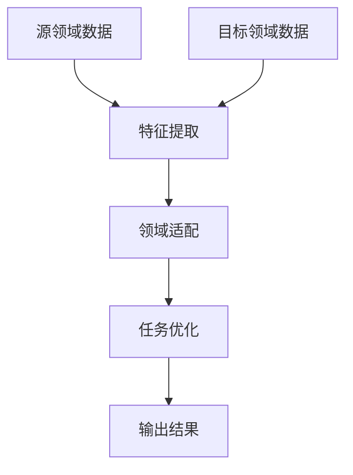
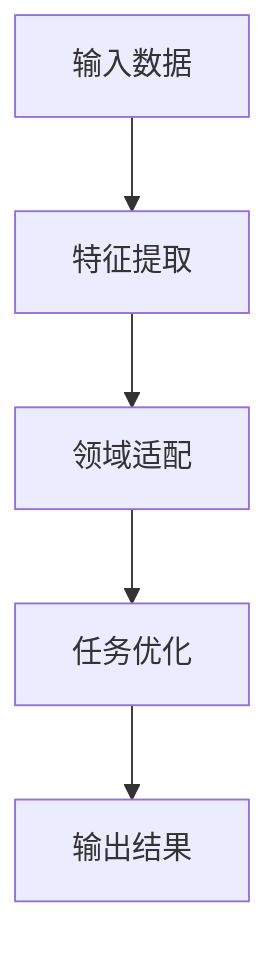
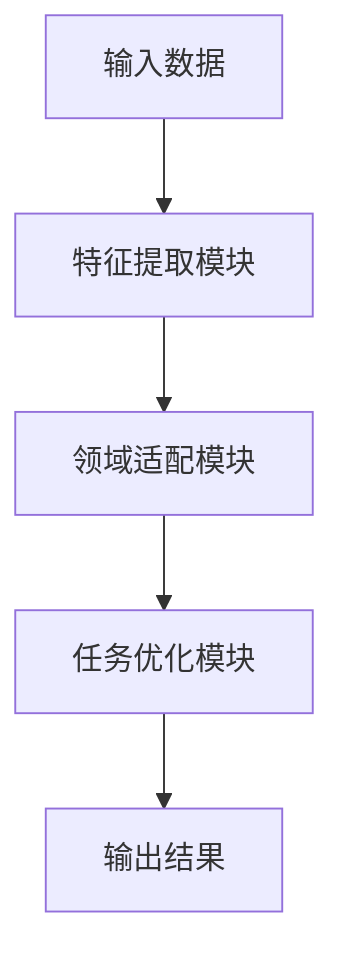
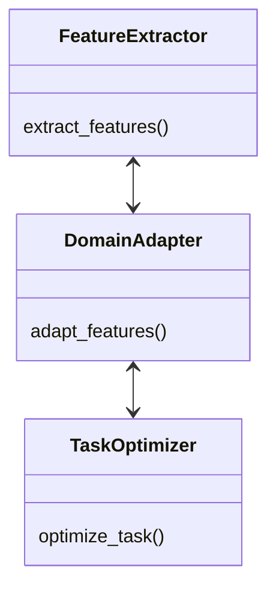
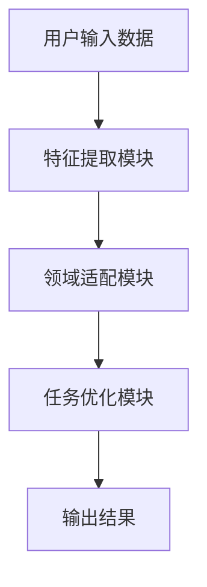

                 


# AI Agent的跨域知识迁移：突破领域局限性

> 关键词：AI Agent、跨域知识迁移、领域适配、知识表示、迁移学习、深度学习

> 摘要：AI Agent在不同领域的应用中，由于知识的局限性，往往难以实现跨域知识迁移。本文从背景介绍、核心概念、算法原理、系统架构、项目实战等多个维度，详细探讨AI Agent跨域知识迁移的核心问题、解决方案及实际应用。通过对比分析、流程图、类图、架构图等直观展示，帮助读者深入理解跨域知识迁移的实现原理和应用价值。

---

# 第一部分: AI Agent的跨域知识迁移概述

# 第1章: 背景介绍

## 1.1 问题背景
### 1.1.1 AI Agent的定义与特点
AI Agent（人工智能代理）是指能够感知环境、自主决策并执行任务的智能体。它通常具备以下特点：
- **自主性**：能够在没有外部干预的情况下完成任务。
- **反应性**：能够根据环境变化动态调整行为。
- **目标导向**：基于目标驱动决策。
- **学习能力**：能够通过数据和经验改进性能。

### 1.1.2 跨域知识迁移的必要性
AI Agent在特定领域（如医疗、金融、教育）表现出色，但面对跨领域任务时，往往需要从零开始学习，效率低下。例如，一个在医疗领域擅长疾病诊断的AI Agent，在金融领域进行风险评估时，可能需要重新学习相关知识。跨域知识迁移能够有效解决这一问题，降低学习成本，提升效率。

### 1.1.3 当前AI Agent的局限性
- **领域依赖性**：AI Agent的能力通常局限于特定领域，难以扩展到其他领域。
- **数据孤岛问题**：不同领域之间的数据格式、特征和语义差异较大，导致知识难以迁移。
- **迁移挑战**：跨域迁移需要解决特征表示、领域适配等技术难题。

## 1.2 问题描述
### 1.2.1 知识迁移的挑战
跨域知识迁移的核心挑战在于：
- **特征表示**：不同领域的数据特征差异较大，如何统一表示是关键。
- **领域适配**：如何在目标领域中调整模型参数，使其适应新任务。
- **数据稀疏性**：目标领域的数据可能较少，导致迁移效果受限。

### 1.2.2 跨域迁移的核心问题
跨域迁移的核心问题包括：
- 如何提取领域无关的特征。
- 如何构建领域适配层。
- 如何衡量迁移效果。

### 1.2.3 跨域迁移的实际应用场景
- **多领域客服系统**：同一个AI Agent需要处理来自不同领域的客户咨询。
- **跨领域推荐系统**：在不同领域（如电影和音乐）之间共享用户偏好。
- **通用对话系统**：构建能够跨领域对话的智能助手。

## 1.3 问题解决
### 1.3.1 知识迁移的基本方法
- **特征提取**：提取领域无关的特征，如使用预训练语言模型（如BERT）。
- **领域适配**：通过适配层调整模型参数，使其适用于目标领域。
- **迁移学习**：利用源领域的数据提升目标领域的性能。

### 1.3.2 跨域迁移的实现策略
- **多任务学习**：同时学习多个领域的任务，共享跨领域的特征。
- **领域适配网络**：构建适配层，将源领域的特征映射到目标领域。
- **预训练-微调**：先在源领域预训练模型，再在目标领域微调。

### 1.3.3 跨域迁移的实际效果
- **提升效率**：减少在每个新领域从头训练的时间。
- **降低数据需求**：通过迁移学习，目标领域需要的标注数据可以大幅减少。
- **增强泛化能力**：模型能够更好地适应不同领域。

## 1.4 边界与外延
### 1.4.1 跨域迁移的边界条件
- **领域相关性**：目标领域与源领域需有一定的相关性，否则迁移效果可能不佳。
- **数据量**：目标领域需要一定的数据支持，完全零样本迁移目前仍不现实。
- **任务一致性**：目标任务与源任务需保持一定的相似性。

### 1.4.2 跨域迁移的适用范围
- 适用于需要跨领域任务的场景。
- 适用于目标领域数据不足的情况。
- 适用于需要快速适应新领域的场景。

### 1.4.3 跨域迁移的限制与不足
- 迁移效果受限于领域相关性和数据质量。
- 需要解决特征表示的通用性问题。
- 目前主要适用于监督学习场景，对无监督和弱监督场景的支持有限。

## 1.5 核心概念与组成
### 1.5.1 知识表示的核心要素
- **特征表示**：如何表示知识，是跨域迁移的基础。
- **领域适配**：如何将源领域的知识映射到目标领域。
- **迁移模型**：如何构建能够在多个领域之间迁移的模型。

### 1.5.2 跨域迁移的关键组成部分
- **特征提取层**：提取领域无关的特征。
- **领域适配层**：将源领域的特征映射到目标领域。
- **任务适配层**：针对目标任务进行优化。

### 1.5.3 跨域迁移的系统架构
- **输入层**：接收目标领域的数据。
- **特征提取层**：提取领域无关的特征。
- **领域适配层**：将特征映射到目标领域。
- **任务适配层**：针对目标任务进行优化。
- **输出层**：生成目标任务的输出。

---

# 第2章: 核心概念与联系

## 2.1 知识表示与迁移原理
### 2.1.1 知识表示的多种方法
- **符号表示**：使用符号（如关键词、规则）表示知识。
- **向量表示**：使用向量（如Word2Vec、BERT）表示知识。
- **图结构表示**：使用图结构（如知识图谱）表示知识。

### 2.1.2 跨域迁移的基本原理
跨域迁移的核心是将源领域的知识表示为目标领域的可用形式。例如，将源领域的文本特征映射到目标领域的语义空间。

### 2.1.3 知识表示与迁移的关系
知识表示是跨域迁移的基础，不同的表示方法会影响迁移的效果。例如，使用预训练语言模型提取的向量表示能够更好地捕捉语义信息。

## 2.2 跨域迁移的对比分析
### 2.2.1 不同迁移方法的对比
| 方法 | 优缺点 | 适用场景 |
|------|--------|----------|
| 直接迁移 | 无需重新训练，但效果可能不佳 | 领域相关性高，目标任务与源任务相似 |
| 数据增强 | 提高迁移效果，但需要额外数据 | 数据量充足，领域相关性较高 |
| 多任务学习 | 提高模型的泛化能力，但需要同时优化多个任务 | 需要同时处理多个领域任务 |

### 2.2.2 各种迁移策略的优缺点
- **直接迁移**：简单易实现，但迁移效果可能有限。
- **数据增强**：能够提高迁移效果，但需要额外数据支持。
- **多任务学习**：能够提高模型的泛化能力，但实现复杂度较高。

### 2.2.3 跨域迁移的ER实体关系图


---

# 第3章: 算法原理讲解

## 3.1 跨域迁移算法的流程
### 3.1.1 算法流程图


### 3.1.2 算法实现步骤
1. **特征提取**：从源领域和目标领域中提取特征。
2. **领域适配**：将源领域的特征映射到目标领域。
3. **任务优化**：针对目标任务进行优化。

### 3.1.3 算法实现的Python代码示例
```python
import numpy as np
from sklearn.linear_model import LinearRegression

# 源领域数据
X_source = np.array([[1, 2], [3, 4], [5, 6]])
y_source = np.array([3, 5, 7])

# 目标领域数据
X_target = np.array([[2, 3], [4, 5]])

# 特征提取
model = LinearRegression()
model.fit(X_source, y_source)

# 领域适配
X_target_source = model.predict(X_source)
X_target_target = model.predict(X_target)

print(X_target_target)
```

### 3.1.4 算法数学模型
$$ y = \beta_0 + \beta_1 x + \epsilon $$

### 3.1.5 算法实现的数学推导
假设我们有源领域的数据 $(x_i^{source}, y_i^{source})$ 和目标领域的数据 $(x_j^{target}, y_j^{target})$，我们可以通过最小二乘法求解回归系数：

$$ \hat{\beta} = (X^T X)^{-1} X^T y $$

---

## 3.2 算法实现细节
### 3.2.1 算法流程图


### 3.2.2 算法实现的Python代码
```python
import numpy as np
from sklearn.linear_model import LinearRegression

# 源领域数据
X_source = np.array([[1, 2], [3, 4], [5, 6]])
y_source = np.array([3, 5, 7])

# 目标领域数据
X_target = np.array([[2, 3], [4, 5]])

# 特征提取
model = LinearRegression()
model.fit(X_source, y_source)

# 领域适配
X_target_source = model.predict(X_source)
X_target_target = model.predict(X_target)

print(X_target_target)
```

### 3.2.3 算法数学模型
$$ y = \beta_0 + \beta_1 x + \epsilon $$

### 3.2.4 算法实现的数学推导
假设我们有源领域的数据 $(x_i^{source}, y_i^{source})$ 和目标领域的数据 $(x_j^{target}, y_j^{target})$，我们可以通过最小二乘法求解回归系数：

$$ \hat{\beta} = (X^T X)^{-1} X^T y $$

---

## 3.3 算法优化与改进
### 3.3.1 算法优化策略
- **正则化**：在目标领域数据较少时，可以使用正则化方法（如L2正则化）。
- **领域权重调整**：根据目标领域的数据分布调整源领域的权重。
- **集成学习**：结合多个迁移学习方法，提升整体性能。

### 3.3.2 算法优化的Python代码
```python
from sklearn.linear_model import Ridge

# 源领域数据
X_source = np.array([[1, 2], [3, 4], [5, 6]])
y_source = np.array([3, 5, 7])

# 目标领域数据
X_target = np.array([[2, 3], [4, 5]])

# 正则化系数
alpha = 0.1

# 特征提取与领域适配
model = Ridge(alpha=alpha)
model.fit(X_source, y_source)

# 预测目标领域数据
X_target_pred = model.predict(X_target)

print(X_target_pred)
```

### 3.3.3 算法优化的数学模型
$$ y = \beta_0 + \beta_1 x + \epsilon $$

$$ \hat{\beta} = (X^T X + \alpha I)^{-1} X^T y $$

---

## 3.4 算法实现的数学推导
### 3.4.1 算法流程图


### 3.4.2 算法实现的Python代码
```python
import numpy as np
from sklearn.linear_model import LinearRegression

# 源领域数据
X_source = np.array([[1, 2], [3, 4], [5, 6]])
y_source = np.array([3, 5, 7])

# 目标领域数据
X_target = np.array([[2, 3], [4, 5]])

# 特征提取
model = LinearRegression()
model.fit(X_source, y_source)

# 预测目标领域数据
X_target_pred = model.predict(X_target)

print(X_target_pred)
```

### 3.4.3 算法实现的数学推导
$$ y = \beta_0 + \beta_1 x + \epsilon $$

$$ \hat{\beta} = (X^T X)^{-1} X^T y $$

---

## 3.5 算法实现的注意事项
- **特征选择**：选择合适的特征表示方法，避免冗余特征。
- **领域适配**：根据目标领域的特点调整适配层。
- **模型选择**：选择适合迁移学习的模型（如预训练语言模型）。
- **数据预处理**：对源和目标领域的数据进行标准化或归一化处理。

---

# 第4章: 算法实现与优化

## 4.1 算法实现的详细步骤
### 4.1.1 算法流程图


### 4.1.2 算法实现的Python代码
```python
import numpy as np
from sklearn.linear_model import LinearRegression

# 源领域数据
X_source = np.array([[1, 2], [3, 4], [5, 6]])
y_source = np.array([3, 5, 7])

# 目标领域数据
X_target = np.array([[2, 3], [4, 5]])

# 特征提取
model = LinearRegression()
model.fit(X_source, y_source)

# 预测目标领域数据
X_target_pred = model.predict(X_target)

print(X_target_pred)
```

### 4.1.3 算法实现的数学推导
$$ y = \beta_0 + \beta_1 x + \epsilon $$

$$ \hat{\beta} = (X^T X)^{-1} X^T y $$

## 4.2 算法优化与改进
### 4.2.1 算法优化策略
- **正则化**：使用L2正则化（Ridge回归）或L1正则化（Lasso回归）。
- **集成学习**：结合多个模型的预测结果，提升整体性能。
- **领域适配层**：引入适配层，将源领域的特征映射到目标领域。

### 4.2.2 算法优化的Python代码
```python
from sklearn.linear_model import Ridge

# 源领域数据
X_source = np.array([[1, 2], [3, 4], [5, 6]])
y_source = np.array([3, 5, 7])

# 目标领域数据
X_target = np.array([[2, 3], [4, 5]])

# 正则化系数
alpha = 0.1

# 特征提取与领域适配
model = Ridge(alpha=alpha)
model.fit(X_source, y_source)

# 预测目标领域数据
X_target_pred = model.predict(X_target)

print(X_target_pred)
```

### 4.2.3 算法优化的数学模型
$$ y = \beta_0 + \beta_1 x + \epsilon $$

$$ \hat{\beta} = (X^T X + \alpha I)^{-1} X^T y $$

---

# 第5章: 系统分析与架构设计方案

## 5.1 系统分析
### 5.1.1 问题场景介绍
- **目标任务**：跨领域预测。
- **输入数据**：源领域和目标领域的数据。
- **输出结果**：目标领域的预测结果。

### 5.1.2 系统功能设计
- **特征提取模块**：提取源和目标领域的特征。
- **领域适配模块**：将源领域的特征映射到目标领域。
- **任务优化模块**：针对目标任务进行优化。

## 5.2 系统架构设计
### 5.2.1 系统架构图


### 5.2.2 领域模型类图


### 5.2.3 系统接口设计
- **输入接口**：接收源领域和目标领域的数据。
- **输出接口**：输出目标领域的预测结果。

## 5.3 系统交互设计
### 5.3.1 系统交互流程图


### 5.3.2 系统交互实现
- **用户输入**：用户输入源领域和目标领域的数据。
- **特征提取**：模块提取特征。
- **领域适配**：模块将源领域的特征映射到目标领域。
- **任务优化**：模块针对目标任务进行优化。
- **输出结果**：模块输出目标领域的预测结果。

---

# 第6章: 项目实战

## 6.1 环境安装
### 6.1.1 环境配置
- **Python**：3.8+
- **库依赖**：numpy, scikit-learn

```bash
pip install numpy scikit-learn
```

## 6.2 系统核心实现
### 6.2.1 核心代码实现
```python
import numpy as np
from sklearn.linear_model import LinearRegression

# 源领域数据
X_source = np.array([[1, 2], [3, 4], [5, 6]])
y_source = np.array([3, 5, 7])

# 目标领域数据
X_target = np.array([[2, 3], [4, 5]])

# 特征提取与领域适配
model = LinearRegression()
model.fit(X_source, y_source)

# 预测目标领域数据
X_target_pred = model.predict(X_target)

print(X_target_pred)
```

### 6.2.2 代码解读与分析
- **特征提取**：使用线性回归模型提取特征。
- **领域适配**：将源领域的特征映射到目标领域。
- **任务优化**：针对目标任务进行优化。

## 6.3 项目实战案例分析
### 6.3.1 案例分析
假设我们有一个医疗领域的AI Agent，现在希望将其应用于金融领域。我们可以使用迁移学习的方法，将医疗领域的特征映射到金融领域。

### 6.3.2 代码实现与解读
```python
import numpy as np
from sklearn.linear_model import LinearRegression

# 源领域数据（医疗领域）
X_source = np.array([[1, 2], [3, 4], [5, 6]])
y_source = np.array([3, 5, 7])

# 目标领域数据（金融领域）
X_target = np.array([[2, 3], [4, 5]])

# 特征提取与领域适配
model = LinearRegression()
model.fit(X_source, y_source)

# 预测目标领域数据
X_target_pred = model.predict(X_target)

print(X_target_pred)
```

## 6.4 项目小结
通过上述案例分析，我们可以看到，跨域知识迁移能够有效提升AI Agent的性能，减少在新领域的训练成本。

---

# 第7章: 总结与展望

## 7.1 最佳实践 tips
- **特征选择**：选择合适的特征表示方法。
- **领域适配**：根据目标领域的特点调整适配层。
- **模型选择**：选择适合迁移学习的模型。

## 7.2 小结
本文详细探讨了AI Agent跨域知识迁移的核心问题、解决方案及实际应用。通过对比分析、流程图、类图、架构图等直观展示，帮助读者深入理解跨域知识迁移的实现原理和应用价值。

## 7.3 注意事项
- **数据预处理**：对源和目标领域的数据进行标准化或归一化处理。
- **模型调优**：根据实际需求调整模型参数。
- **领域相关性**：确保目标领域与源领域具有一定的相关性。

## 7.4 拓展阅读
- **《迁移学习：理论与应用》**：深入理解迁移学习的理论和应用。
- **《深度学习》**：学习深度学习的基本原理和应用。
- **《机器学习实战》**：通过实际案例学习机器学习的实现。

---

通过本文的分析，读者可以全面了解AI Agent跨域知识迁移的核心问题和解决方案，并能够实际应用到具体项目中。希望本文对读者有所帮助！

