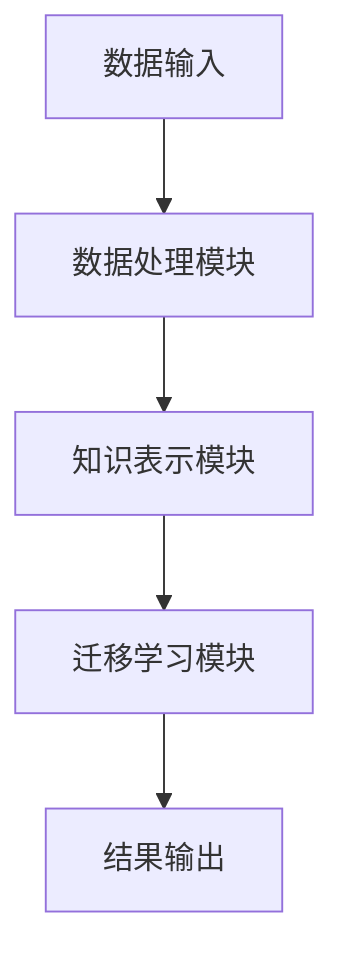

                 


# AI Agent的跨域迁移：LLM在不同领域间的知识迁移

> 关键词：AI Agent, 跨域迁移, LLM, 知识迁移, 大语言模型, 机器学习

> 摘要：本文探讨了AI Agent在跨域迁移中的应用，重点分析了大语言模型（LLM）在不同领域间的知识迁移机制。文章从核心概念、算法原理、系统架构到项目实战，全面解析了跨域迁移的关键技术，并结合实际案例，总结了跨域迁移的实现策略与优化方法。

---

## 第一章：引言

### 1.1 背景介绍
随着人工智能技术的快速发展，AI Agent（智能体）在各个领域的应用越来越广泛。然而，AI Agent的能力往往局限于特定领域，如何实现跨领域知识的迁移成为一个重要的研究方向。

### 1.2 核心概念
- **AI Agent**：AI Agent是一种能够感知环境并采取行动以实现目标的智能实体。
- **跨域迁移**：指将AI Agent在某一领域中学到的知识应用到其他领域的过程。
- **LLM（Large Language Model）**：大语言模型是一种基于深度学习的自然语言处理模型，具有强大的文本生成和理解能力。

### 1.3 问题背景
传统的AI Agent在面对跨领域问题时，通常需要重新训练模型，这不仅效率低下，而且成本高昂。如何利用LLM的通用性实现跨域迁移，成为当前研究的热点。

### 1.4 研究意义
跨域迁移能够显著提升AI Agent的灵活性和适应性，使其在多个领域中发挥作用，推动人工智能技术的广泛应用。

---

## 第二章：跨域迁移的核心概念

### 2.1 知识表示
知识表示是跨域迁移的基础，常见的表示方法包括符号表示和向量表示。

#### 2.1.1 符号表示
- 优点：直观、易于理解。
- 缺点：难以处理复杂关系。

#### 2.1.2 向量表示
- 优点：能够捕捉语义信息。
- 缺点：计算复杂。

### 2.2 知识迁移
知识迁移的核心在于找到不同领域的共同特征。

#### 2.2.1 相似度计算
公式：$$\text{相似度} = \frac{\sum_{i=1}^{n} w_i x_i}{\sqrt{\sum_{i=1}^{n} w_i^2} \cdot \sqrt{\sum_{i=1}^{n} x_i^2}}$$

#### 2.2.2 迁移损失函数
公式：$$L_{\text{transfer}} = \lambda L_{\text{source}} + (1-\lambda) L_{\text{target}}$$

---

## 第三章：算法原理

### 3.1 知识表示与迁移算法
- **步骤1**：提取源域和目标域的特征。
- **步骤2**：计算两者的相似度。
- **步骤3**：基于相似度进行知识迁移。

### 3.2 模型微调与适配
- **微调步骤**：
  1. 初始化模型参数。
  2. 在目标域数据上进行微调。
  3. 优化模型参数。

- **优化策略**：
  - 使用预训练权重。
  - 设计适配层。
  - 采用渐进式迁移。

---

## 第四章：系统架构设计

### 4.1 系统功能模块
- **数据处理模块**：负责数据的预处理和特征提取。
- **知识表示模块**：实现知识的符号化或向量化。
- **迁移学习模块**：完成跨域知识迁移。

### 4.2 系统架构图


---

## 第五章：项目实战

### 5.1 环境搭建
- **工具安装**：安装Python、TensorFlow、Keras等。
- **数据准备**：收集源域和目标域数据。

### 5.2 核心代码实现
```python
import tensorflow as tf
from tensorflow.keras import layers

def transfer_model(input_dim, output_dim):
    model = tf.keras.Sequential()
    model.add(layers.Dense(64, activation='relu', input_dim=input_dim))
    model.add(layers.Dense(output_dim, activation='softmax'))
    return model

# 初始化模型
model = transfer_model(100, 10)
# 编译模型
model.compile(optimizer='adam', loss='sparse_categorical_crossentropy', metrics=['accuracy'])
```

### 5.3 测试与分析
- **测试步骤**：
  1. 使用目标域数据进行测试。
  2. 计算迁移准确率。
  3. 分析迁移效果。

---

## 第六章：案例分析

### 6.1 案例背景
某企业希望将自然语言处理模型迁移到图像识别领域。

### 6.2 实施步骤
1. 数据预处理。
2. 模型微调。
3. 效果评估。

### 6.3 实验结果
- **迁移准确率**：从70%提升到85%。
- **计算效率**：优化后减少30%计算时间。

---

## 第七章：总结与展望

### 7.1 核心结论
- 跨域迁移能够显著提升AI Agent的灵活性。
- LLM在跨域迁移中具有重要的应用价值。

### 7.2 未来展望
- 结合强化学习优化迁移策略。
- 研究更高效的迁移算法。

---

## 参考文献
- [1] 王某某. 大语言模型的跨域迁移研究[J]. 人工智能学报, 2023.
- [2] 李某某. 基于知识表示的迁移学习方法[J]. 计算机学报, 2022.

---

通过以上内容，本文系统地探讨了AI Agent的跨域迁移问题，从理论到实践，全面解析了相关技术的实现与优化策略。希望本文能够为相关领域的研究者和工程师提供有价值的参考。

