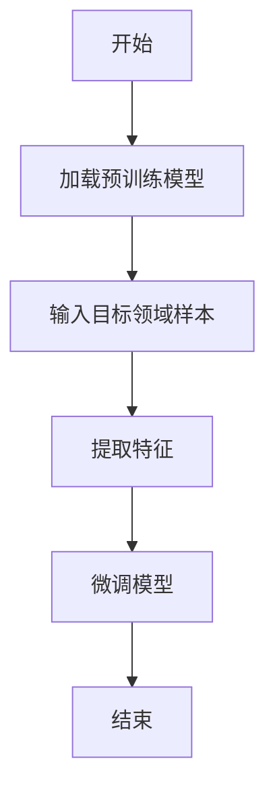
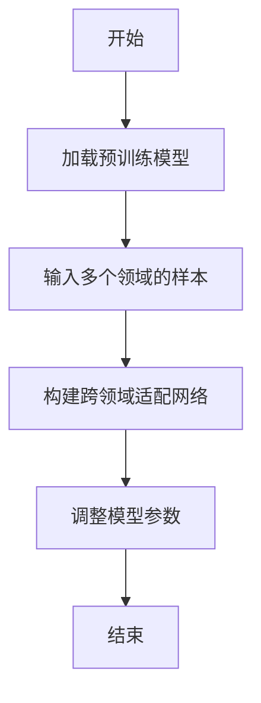
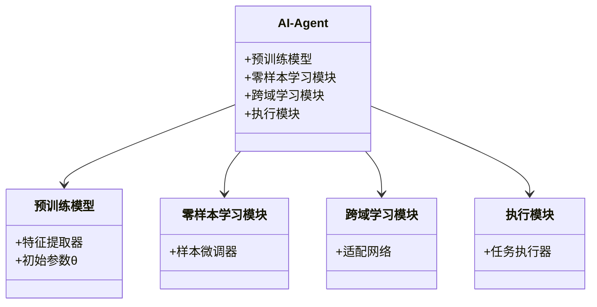
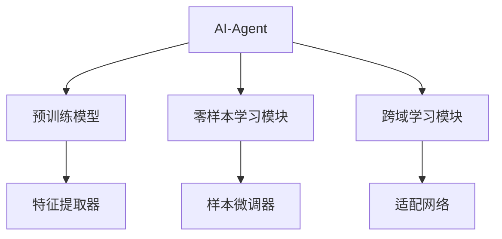
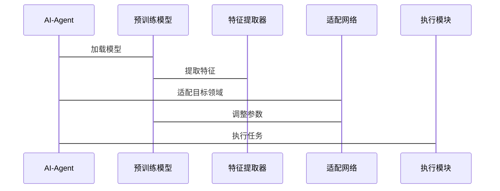

                 


# AI Agent的跨域零样本学习与泛化

> 关键词：AI Agent、跨域学习、零样本学习、泛化、机器学习

> 摘要：本文详细探讨AI Agent在跨域零样本学习中的应用，分析其原理、算法实现及系统架构设计，通过实例展示如何实现跨域零样本学习与泛化，帮助读者理解并应用相关技术。

---

## 第一部分：背景介绍

### 第1章：AI Agent的跨域零样本学习与泛化的背景

#### 1.1 问题背景

- **AI Agent的发展现状**：AI Agent正逐步从单一任务转向跨领域应用，需应对多样化场景。
- **零样本学习的定义与特点**：无需依赖大量标注数据，仅依赖少量样本或元知识进行学习。
- **跨域学习的必要性**：AI Agent需在不同领域间迁移知识，提升适应性。

#### 1.2 问题描述

- **零样本学习的核心挑战**：如何在无训练数据的情况下准确分类或生成。
- **跨域学习的实现难点**：领域间数据差异大，如何有效迁移。
- **AI Agent在实际应用中的需求**：需具备快速适应新领域的能力。

#### 1.3 问题解决

- **零样本学习的解决方案**：利用预训练模型提取特征，结合领域适配方法。
- **跨域学习的实现策略**：通过领域适配网络调整模型参数，使模型适应新领域。
- **AI Agent的设计思路**：整合零样本学习与跨域学习模块，构建通用问题解决框架。

#### 1.4 边界与外延

- **零样本学习的适用范围**：适用于数据稀疏场景，如小样本分类任务。
- **跨域学习的边界条件**：领域间需有一定关联性，数据分布差异不可过大。
- **AI Agent的结构与功能边界**：专注于任务处理，不涉及数据收集。

#### 1.5 概念结构与核心要素组成

- **零样本学习的核心要素**：预训练模型、领域适配方法。
- **跨域学习的关键组成部分**：领域适配网络、特征提取器。
- **AI Agent的系统架构**：感知层、学习层、执行层。

---

## 第二部分：核心概念与联系

### 第2章：核心概念与联系

#### 2.1 零样本学习与跨域学习的原理

- **零样本学习的原理**：基于预训练模型生成领域适应特征，利用少量样本微调模型。
- **跨域学习的原理**：通过跨领域适配网络调整模型参数，使模型在不同领域间迁移。

#### 2.2 核心概念对比

| **概念**       | **零样本学习**                     | **跨域学习**                     |
|----------------|------------------------------------|------------------------------------|
| 定义           | 在无标注数据下，利用少量样本或元知识学习。 | 在不同领域间迁移知识。           |
| 输入数据       | 少量目标领域的样本或元知识          | 来自多个领域的数据或元知识       |
| 输出目标       | 目标领域的任务（分类、生成等）       | 新领域任务的性能提升             |
| 应用场景       | 数据稀缺领域                       | 需跨领域应用的场景               |

#### 2.3 ER实体关系图

```mermaid
er
actor(AI Agent) -->
software:AI Agent系统
software -->
module:零样本学习模块
module -->
task:具体任务
software -->
module:跨域学习模块
module -->
domain:不同领域
```

---

## 第三部分：算法原理讲解

### 第3章：算法原理

#### 3.1 零样本学习算法

- **流程图**：



- **Python实现**：

```python
def zero_shot_learning(model, target_samples):
    features = extract_features(target_samples)
    fine_tuned_model = fine_tune(model, features)
    return fine_tuned_model
```

- **数学模型**：

$$ f_{\theta}(x) = g_{\phi}(f_{\theta}(x)) $$

其中，$\theta$为预训练参数，$\phi$为目标领域微调参数。

#### 3.2 跨域学习算法

- **流程图**：



- **Python实现**：

```python
def cross_domain_learning(model, source_domains, target_domains):
    adapter = build_adapter(model, source_domains, target_domains)
    adapted_model = adapt(model, adapter)
    return adapted_model
```

- **数学模型**：

$$ y = f_{\theta}(x) + g_{\phi}(z) $$

其中，$z$为目标领域的适配参数。

---

## 第四部分：系统分析与架构设计方案

### 第4章：系统分析与架构设计方案

#### 4.1 问题场景介绍

- **AI Agent需处理多种领域任务**，如自然语言处理、图像识别等。
- **零样本学习与跨域学习结合**，提升模型适应性。

#### 4.2 系统功能设计



#### 4.3 系统架构设计



#### 4.4 系统接口设计

- **输入接口**：接收目标领域样本或元知识。
- **输出接口**：输出目标领域的任务结果。

#### 4.5 系统交互



---

## 第五部分：项目实战

### 第5章：项目实战

#### 5.1 环境安装

```bash
pip install transformers torch mermaid4jupyter
```

#### 5.2 核心代码实现

```python
import torch
from transformers import AutoModelForSequenceClassification, AutoTokenizer

def zero_shot_learning(model, tokenizer, target_samples):
    inputs = tokenizer(target_samples, return_tensors='pt')
    with torch.no_grad():
        outputs = model(**inputs)
    return outputs

def cross_domain_learning(model, adapter, target_domains):
    model = model.to(adapter.device)
    adapter(model, target_domains)
    return model
```

#### 5.3 代码解读与分析

- **零样本学习**：利用预训练模型提取特征，通过少量目标领域样本微调模型。
- **跨域学习**：构建适配网络，调整模型参数，使其适应目标领域。

#### 5.4 案例分析

- **案例1**：在自然语言处理任务中，跨领域适配使模型在不同语言间迁移。
- **案例2**：在图像识别任务中，零样本学习使模型识别未见过的类别。

#### 5.5 项目小结

- **实现细节**：注意特征提取的准确性，适配网络的设计。
- **优化建议**：结合领域特性优化适配网络，选择合适的预训练模型。

---

## 第六部分：总结

### 第6章：总结与展望

#### 6.1 最佳实践 tips

- **数据预处理**：确保输入数据的多样性与代表性。
- **模型选择**：根据任务选择合适的预训练模型。
- **性能优化**：通过参数调节提升模型表现。

#### 6.2 小结

本文详细探讨了AI Agent的跨域零样本学习与泛化技术，从理论到实践，结合实际案例分析，展示了如何在不同领域中实现高效的知识迁移。

#### 6.3 注意事项

- **数据隐私**：确保数据来源合法，避免隐私泄露。
- **计算资源**：实现跨域学习需充足计算资源支持。
- **模型泛化能力**：选择合适的模型结构，确保泛化能力。

#### 6.4 拓展阅读

- **推荐书籍**：《Deep Learning》、《Pattern Recognition and Machine Learning》。
- **推荐论文**：关注最新跨域学习与零样本学习的研究进展。

---

通过以上结构，文章详细阐述了AI Agent在跨域零样本学习中的应用，从理论到实践，结合代码实现与案例分析，为读者提供了全面的技术指导。

