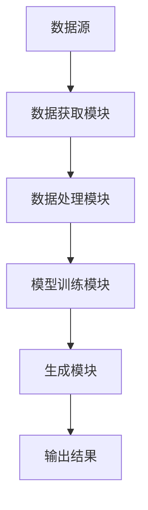

                 


# AI Agent的跨模态内容理解与生成系统

> 关键词：AI Agent，跨模态，内容理解，生成系统，多模态数据

> 摘要：本文深入探讨AI Agent在跨模态内容理解与生成系统中的应用。从核心概念、算法原理到系统架构，结合实际案例，详细分析跨模态技术如何助力AI Agent实现多模态数据的高效处理与生成。

---

## 第一部分：AI Agent与跨模态技术的背景

### 第1章：AI Agent的基本概念

#### 1.1 AI Agent的定义与特点

AI Agent（人工智能代理）是指能够感知环境、执行任务并做出决策的智能实体。其特点包括：

- **自主性**：能够在无外部干预的情况下自主运行。
- **反应性**：能够实时感知环境并做出响应。
- **目标导向**：基于明确的目标执行任务。
- **社交能力**：能够与其他Agent或人类进行交互。

#### 1.2 跨模态技术的背景

跨模态技术是指在不同数据模态（如文本、图像、语音等）之间进行信息理解和生成的技术。其核心在于通过多模态数据的协同处理，提升AI系统的智能化水平。

#### 1.3 AI Agent与跨模态技术的结合

AI Agent通过跨模态技术能够实现以下功能：

- **多模态数据处理**：同时处理文本、图像、语音等多种数据类型。
- **跨模态交互**：在不同模态之间建立关联，提升用户体验。
- **上下文理解**：通过多模态数据的融合，增强对复杂场景的理解能力。

---

### 第2章：跨模态内容理解与生成的核心概念

#### 2.1 跨模态数据处理的基本原理

跨模态数据处理涉及以下几个关键步骤：

1. **数据获取**：从多模态数据源中获取原始数据（如文本、图像、语音等）。
2. **预处理**：对数据进行清洗、归一化等处理，以便后续分析。
3. **特征提取**：提取数据中的关键特征，如文本的情感特征、图像的视觉特征等。
4. **特征融合**：将不同模态的特征进行融合，以捕捉跨模态信息。

#### 2.2 跨模态模型的核心要素

跨模态模型的核心要素包括：

1. **编码器**：将输入的多模态数据转换为通用表示。
2. **解码器**：根据编码器输出的表示生成目标模态的数据。
3. **融合机制**：通过注意力机制或对比学习等方式，将不同模态的特征进行融合。

---

### 第3章：跨模态内容理解与生成的算法原理

#### 3.1 多模态编码器-解码器模型

多模态编码器-解码器模型是一种常见的跨模态生成模型，其工作原理如下：

- **编码器**：将输入的多模态数据编码为一个通用的向量表示。
- **解码器**：根据编码器输出的向量生成目标模态的数据（如文本生成图像，或图像生成文本）。

#### 3.2 跨模态特征融合算法

跨模态特征融合是通过将不同模态的特征进行融合，以增强模型的表达能力。常用的方法包括：

- **基于注意力机制的特征融合**：通过注意力机制确定不同模态特征的重要性。
- **基于对比学习的特征融合**：通过对比学习方法，增强不同模态特征之间的关联性。

---

## 第二部分：系统分析与架构设计

### 第4章：AI Agent的系统架构

#### 4.1 系统功能设计

AI Agent的系统功能设计包括以下几个模块：

1. **数据获取模块**：从多模态数据源中获取数据。
2. **数据处理模块**：对数据进行预处理和特征提取。
3. **模型训练模块**：训练跨模态模型。
4. **生成模块**：根据输入生成目标模态的数据。

#### 4.2 系统架构图

以下是AI Agent的系统架构图：



---

### 第5章：项目实战

#### 5.1 项目背景

本项目旨在实现一个基于跨模态技术的AI Agent，能够根据输入的文本生成相应的图像。

#### 5.2 环境安装

- **Python**：3.8+
- **深度学习框架**：TensorFlow或PyTorch
- **自然语言处理库**：Hugging Face的Transformers库
- **图像处理库**：OpenCV

#### 5.3 核心实现代码

以下是跨模态生成模型的核心代码示例：

```python
import tensorflow as tf
from tensorflow.keras import layers

def multi_modal_encoder(input_text, input_image):
    # 文本编码器
    text_encoder = layers.Bidirectional(layers.LSTM(128, return_sequences=True))(input_text)
    text_encoder = layers.GlobalMaxPooling1D()(text_encoder)
    
    # 图像编码器
    image_encoder = layers.Flatten()(input_image)
    image_encoder = layers.Dense(128, activation='relu')(image_encoder)
    
    # 融合特征
    merged_feature = layers.concatenate([text_encoder, image_encoder])
    merged_output = layers.Dense(256, activation='relu')(merged_feature)
    return merged_output

def multi_modal_decoder(encoded_feature, output_shape):
    # 解码器
    decoded_output = layers.Dense(256, activation='relu')(encoded_feature)
    decoded_output = layers.Dense(64, activation='relu')(decoded_output)
    decoded_output = layers.Dense(output_shape, activation='sigmoid')(decoded_output)
    return decoded_output
```

#### 5.4 实际案例分析

以文本生成图像为例，输入文本描述“一只猫坐在窗台上”，模型生成相应的图像。

---

## 第三部分：总结与展望

### 第6章：总结与最佳实践

#### 6.1 总结

本文详细探讨了AI Agent在跨模态内容理解与生成系统中的应用。通过分析跨模态技术的核心概念、算法原理和系统架构，展示了如何实现一个多模态AI Agent。

#### 6.2 最佳实践

- **数据预处理**：确保多模态数据的质量和一致性。
- **模型调优**：通过超参数调整和模型优化提升性能。
- **实时性优化**：在实时应用中，需优化模型的推理速度。

---

### 第7章：未来展望

随着AI技术的不断发展，跨模态内容理解与生成系统将在更多领域得到应用。未来的研究方向包括：

- **更高效的特征融合方法**。
- **更具鲁棒性的跨模态生成模型**。
- **多模态数据的安全与隐私保护**。

---

通过本文的分析，我们深入理解了AI Agent在跨模态内容理解与生成系统中的潜力和挑战。希望本文能为相关领域的研究和实践提供有价值的参考。

