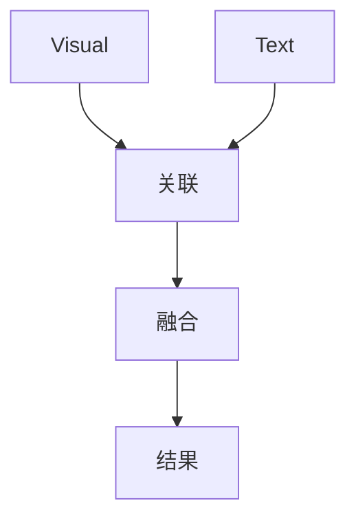
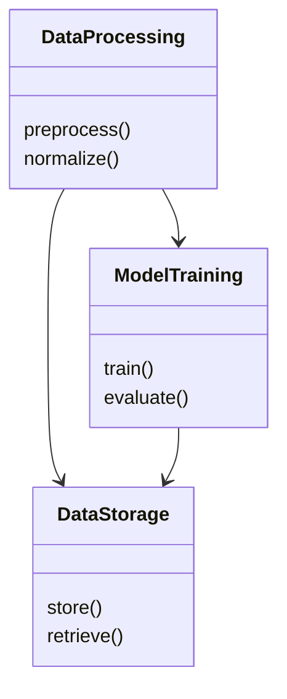

                 


# AI Agent的跨模态学习：促进多种感官信息的融合

**关键词**：跨模态学习，多感官信息融合，AI Agent，算法原理，系统架构设计

**摘要**：  
AI Agent的跨模态学习是一种新兴的技术，旨在通过整合来自不同感官的信息（如视觉、听觉、触觉等）来提升AI Agent的理解和决策能力。本文将从跨模态学习的基本概念出发，深入探讨其核心原理、算法实现、系统架构设计以及实际应用案例，帮助读者全面理解这一领域的技术细节和最新进展。

---

# 第一部分: AI Agent的跨模态学习基础

---

## 第1章: 跨模态学习的背景与意义

### 1.1 跨模态学习的定义与核心概念  
跨模态学习（Multimodal Learning）是指通过整合多种模态（如视觉、听觉、文本、触觉等）信息，使AI Agent能够更好地理解和处理复杂任务的技术。与单模态学习相比，跨模态学习能够利用多源信息的优势，提升模型的泛化能力和鲁棒性。

#### 1.1.1 跨模态学习的定义  
跨模态学习是通过多种感官数据（如图像、声音、文本等）的融合，构建能够理解复杂场景的AI模型。其核心目标是通过多模态数据的互补性，提升模型对真实世界的理解和适应能力。

#### 1.1.2 多感官信息融合的重要性  
在现实世界中，信息通常是多模态的。例如，在自动驾驶场景中，车辆需要同时处理来自摄像头（视觉）、雷达（距离）和环境声音（听觉）等多种信息。跨模态学习能够帮助AI Agent更全面地感知环境，从而做出更准确的决策。

#### 1.1.3 跨模态学习的应用场景  
跨模态学习广泛应用于计算机视觉、自然语言处理、机器人控制、智能助手等领域。例如，在智能助手中，跨模态学习可以使其通过语音和视觉信息更准确地理解用户的意图。

---

### 1.2 跨模态学习的背景与问题背景  

#### 1.2.1 传统单模态学习的局限性  
单模态学习依赖于单一类型的数据（如仅图像或仅文本），这在实际应用中存在诸多限制。例如，仅依赖图像的计算机视觉模型在面对光照变化或遮挡等问题时，表现较差。

#### 1.2.2 跨模态学习的提出与目标  
跨模态学习的提出是为了克服单模态学习的局限性，通过整合多种模态信息，提升模型的泛化能力和适应性。其核心目标是实现多模态数据的协同学习和信息互补。

#### 1.2.3 当前技术发展的驱动力  
近年来，随着深度学习技术的发展，跨模态学习逐渐成为研究热点。其驱动力包括：  
1. 大数据技术的发展使得多模态数据的获取变得容易。  
2. 计算能力的提升使得复杂的跨模态模型可以高效训练。  
3. 实际应用需求（如自动驾驶、智能助手）对多模态感知能力的需求日益增加。

---

### 1.3 跨模态学习的核心问题与挑战  

#### 1.3.1 数据异构性问题  
不同模态的数据具有不同的特征和表示方式（如图像为二维矩阵，声音为时序信号），如何统一这些数据的表示方式是一个挑战。

#### 1.3.2 模态间关联性建模的挑战  
不同模态之间的关联性复杂，如何建模这些关联性以实现信息的有效融合是跨模态学习的核心问题。

#### 1.3.3 跨模态推理与理解的难点  
跨模态学习需要模型具备跨模态推理能力，例如，通过视觉信息推断听觉信息，或通过文本信息理解图像内容。

---

### 1.4 跨模态学习的边界与外延  

#### 1.4.1 跨模态学习与其他相关概念的区分  
跨模态学习与多任务学习、多标签学习等概念的区别在于，跨模态学习关注的是不同模态数据的融合，而多任务学习关注的是多个任务的联合优化。

#### 1.4.2 跨模态学习的适用范围与限制  
跨模态学习适用于需要多源信息融合的场景，但其效果依赖于数据的质量和多样性。

#### 1.4.3 跨模态学习未来发展的方向  
未来，跨模态学习将朝着更高效的数据表示方法、更智能的模态间关联建模和更强大的跨模态推理能力方向发展。

---

## 第2章: 跨模态学习的核心概念与联系  

### 2.1 跨模态学习的核心原理  

#### 2.1.1 多模态数据的表示与融合  
多模态数据需要通过特定的表示方法（如模态嵌入）进行统一，然后通过融合方法（如注意力机制）实现信息的互补。

#### 2.1.2 模态间信息的关联建模  
通过构建模态间的关联模型（如对比学习），可以实现不同模态数据的协同优化。

#### 2.1.3 跨模态学习的数学模型  
跨模态学习的数学模型通常包括模态嵌入、关联函数和损失函数三个部分。例如，对比学习的目标是最优化跨模态数据的相似性。

---

### 2.2 跨模态学习的关键属性与特征对比  

#### 2.2.1 不同模态数据的特征分析  
| 模态类型 | 特征描述 | 示例 |
|----------|----------|------|
| 视觉     | 二维空间信息 | 图像、视频 |
| 听觉     | 时间序列信号 | 音频、语音 |
| 文本     | 离散符号序列 | 文本、语言 |

#### 2.2.2 跨模态学习方法的对比表格  
| 方法       | 核心思想 | 优缺点 | 应用场景 |
|------------|----------|--------|----------|
| 对比学习   | 增强跨模态数据的相似性 | 计算效率高，效果显著 | 图像-文本匹配 |
| 联合学习   | 联合优化多个模态任务 | 模型复杂度高 | 多任务学习 |
| 多任务学习 | 同时优化多个相关任务 | 任务间可能存在冲突 | 多模态分类 |

#### 2.2.3 ER实体关系图的Mermaid流程图  


---

## 第3章: 跨模态学习的算法原理  

### 3.1 跨模态学习的主要算法  

#### 3.1.1 对比学习算法  
对比学习是一种通过最大化跨模态数据相似性来增强模型表达能力的方法。其核心思想是通过对比损失函数优化模型参数。

#### 3.1.2 联合学习算法  
联合学习通过同时优化多个模态任务，实现模态间的协同优化。

#### 3.1.3 多任务学习算法  
多任务学习通过同时学习多个相关任务，共享模型参数以提高学习效率。

---

### 3.2 跨模态学习的数学模型与公式  

#### 3.2.1 对比学习的损失函数  
对比学习的损失函数通常采用信息瓶颈思想，公式如下：  
$$ L = -\sum_{i=1}^n \log p(x_i, y_i) + \log \sum_{j=1}^n p(x_i, y_j) $$  

#### 3.2.2 多模态融合的公式推导  
多模态融合可以通过加权求和的方式实现，公式如下：  
$$ f(x, y) = \alpha x + (1-\alpha) y $$  

#### 3.2.3 跨模态注意力机制的数学表达  
跨模态注意力机制通过计算不同模态之间的注意力权重，公式如下：  
$$ \alpha_i = \frac{\exp(a_i)}{\sum_j \exp(a_j)} $$  

---

## 第4章: 跨模态学习的系统分析与架构设计  

### 4.1 跨模态学习的系统功能设计  

#### 4.1.1 领域模型的Mermaid类图  


#### 4.1.2 系统功能模块划分  
系统功能模块包括数据预处理、模型训练、结果评估和模型部署。

#### 4.1.3 系统架构的Mermaid架构图  
```mermaid
container Database {
    MongoDB
    MySQL
}
container API Gateway {
    RESTful API
}
container Web Service {
    Frontend
    Backend
}
Database --> API Gateway
API Gateway --> Web Service
```

---

## 第5章: 跨模态学习的项目实战  

### 5.1 项目环境的安装与配置  

#### 5.1.1 开发环境  
- 操作系统：Linux/MacOS/Windows  
- Python版本：3.8+  
- 依赖库：TensorFlow、PyTorch、numpy、pandas  

#### 5.1.2 安装依赖  
```bash
pip install tensorflow torch numpy pandas
```

---

### 5.2 系统核心实现源代码  

#### 5.2.1 对比学习的代码实现  
```python
import tensorflow as tf
import numpy as np

def contrastive_loss(y_true, y_pred):
    margin = 1.0
    loss = tf.reduce_mean(tf.square(y_true - y_pred))
    return loss

model = tf.keras.Sequential()
model.add(tf.keras.layers.Dense(128, activation='relu'))
model.add(tf.keras.layers.Dense(1, activation='sigmoid'))
model.compile(optimizer='adam', loss=contrastive_loss)
```

#### 5.2.2 联合学习的代码示例  
```python
import torch
import torch.nn as nn

class MultimodalModel(torch.nn.Module):
    def __init__(self):
        super().__init__()
        self.text_encoder = TextEncoder()
        self.image_encoder = ImageEncoder()
        self.fc = nn.Linear(256, 1)

    def forward(self, x_text, x_image):
        text_features = self.text_encoder(x_text)
        image_features = self.image_encoder(x_image)
        combined = torch.cat((text_features, image_features), dim=1)
        output = self.fc(combined)
        return output
```

---

## 第6章: 跨模态学习的高级主题  

### 6.1 跨模态学习的最新研究方向  

#### 6.1.1 生成模型的跨模态应用  
生成模型（如GPT、Diffusion）在跨模态学习中的应用，例如通过视觉信息生成描述性文本。

#### 6.1.2 跨模态学习与人机协作  
跨模态学习在人机协作中的应用，例如通过语音和视觉信息实现更自然的人机交互。

---

### 6.2 跨模态学习的未来挑战与趋势  

#### 6.2.1 数据异构性问题的解决  
如何更高效地处理异构模态数据是未来的重要挑战。

#### 6.2.2 模态间关联性建模的优化  
如何建模模态间的复杂关联性是跨模态学习的核心问题。

#### 6.2.3 跨模态学习的可解释性  
提升跨模态学习模型的可解释性是未来的重要研究方向。

---

## 第7章: 小结与展望  

### 7.1 小结  
跨模态学习通过整合多种感官信息，显著提升了AI Agent的理解和决策能力。其核心在于如何高效地处理异构模态数据，并建模模态间的关联性。

### 7.2 注意事项  
在实际应用中，需要注意数据质量、模型复杂度和计算资源的平衡。

### 7.3 拓展阅读  
推荐阅读以下论文：  
1. "Contrastive Learning for Multimodal Representation"  
2. "Cross-Modal Retrieval with Large Language Models"  

---

# 结语  

跨模态学习是一项具有广阔前景的技术，其应用将深刻影响AI Agent的发展。通过整合多种感官信息，跨模态学习将推动AI技术向更智能化、更人性化的方向发展。

