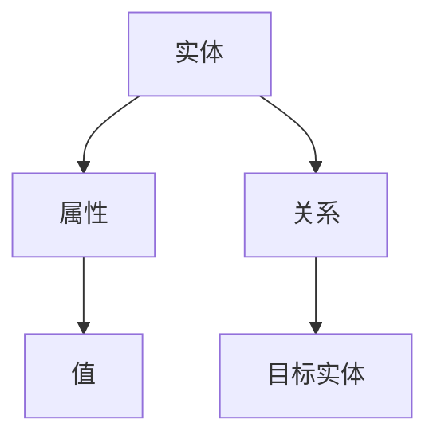
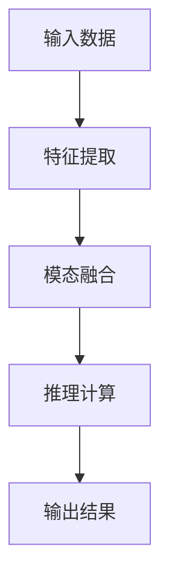
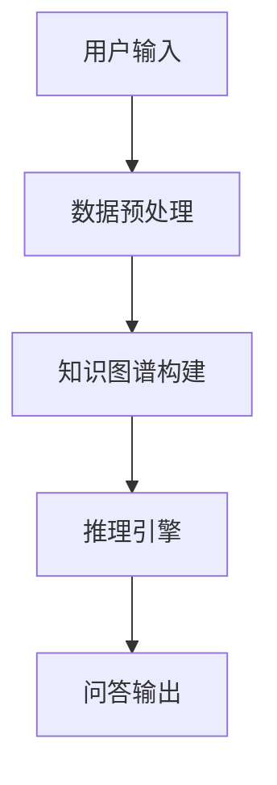
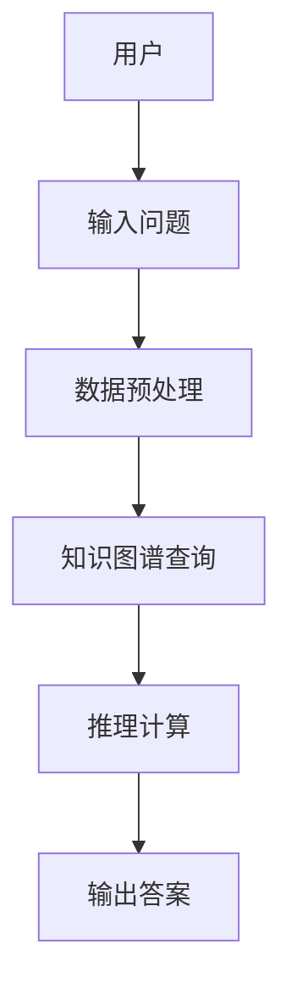

                 


# AI Agent的跨模态知识推理与问答

## 关键词：
AI Agent, 跨模态知识推理, 问答系统, 图知识库, 推理算法, 跨模态数据

## 摘要：
本文详细探讨AI Agent在跨模态知识推理与问答系统中的应用，从基础概念到算法原理，再到系统架构和实际案例，全面解析其核心技术和应用价值。

---

## 第1章: AI Agent与跨模态知识推理概述

### 1.1 AI Agent的基本概念
AI Agent是一种能够感知环境并采取行动以实现目标的智能实体。跨模态知识推理涉及处理文本、图像、音频等多种数据类型，并在这些数据之间建立关联。

### 1.2 跨模态知识推理的核心问题
跨模态数据的融合、知识图谱的构建与推理算法的挑战是当前研究的重点。如何有效地将不同模态的数据进行融合，并在此基础上进行推理，是实现跨模态问答系统的关键。

### 1.3 跨模态问答系统的应用场景
跨模态问答系统在智能客服、智慧医疗和智能教育等领域有广泛应用。例如，在智能客服中，系统能够理解用户的问题，并通过跨模态数据（如文本和图像）提供准确的答案。

---

## 第2章: 跨模态知识推理的核心概念与联系

### 2.1 跨模态数据的属性特征对比
文本数据具有语义丰富性，图像数据具有空间特征，音频数据则具有时间特征。这些特征的对比有助于理解不同数据类型的处理方式。

### 2.2 跨模态知识图谱的实体关系图
知识图谱通过实体和关系描述知识，构建跨模态知识图谱需要将不同模态的数据进行关联。



### 2.3 跨模态推理算法的流程图
推理算法通常包括数据预处理、特征提取、模态融合和推理计算等步骤。



---

## 第3章: 跨模态知识推理算法原理

### 3.1 跨模态融合方法
晚期融合、早期融合和对齐融合是常见的融合方法。晚期融合在高层进行特征组合，早期融合在低层进行特征融合，对齐融合通过模态对齐实现特征融合。

### 3.2 图神经网络在知识图谱中的应用
图嵌入表示、图注意力机制和图传播网络是图神经网络在知识图谱中的主要应用方式。这些方法能够有效地捕捉实体之间的关系和语义信息。

### 3.3 跨模态推理模型的数学公式
模态对齐公式：
$$ y = f(x_1, x_2) $$

图神经网络公式：
$$ h_i^{(l+1)} = \sigma(\sum_j a_{ij} h_j^{(l)}) $$

---

## 第4章: 跨模态知识推理系统的架构设计

### 4.1 系统功能模块设计
系统主要包括数据预处理模块、知识图谱构建模块、推理引擎模块和问答系统模块。每个模块负责不同的功能，如数据预处理负责将原始数据转化为可处理的格式。

### 4.2 系统架构图


### 4.3 系统接口设计
系统接口包括输入接口和输出接口。输入接口接收用户的问题，输出接口返回答案。

### 4.4 系统交互流程图


---

## 第5章: 项目实战——电商客服问答系统

### 5.1 项目背景与目标
电商客服问答系统旨在通过跨模态知识推理，实现对用户问题的准确理解和回答。

### 5.2 环境安装与配置
需要安装Python、TensorFlow、Keras等工具，并配置相应的深度学习环境。

### 5.3 核心代码实现
```python
import tensorflow as tf
from tensorflow.keras import layers

# 模态对齐模型
class CrossModalityAlign(tf.keras.Model):
    def __init__(self, vocab_size, embedding_dim):
        super(CrossModalityAlign, self).__init__()
        self.embedding_text = layers.Embedding(vocab_size, embedding_dim)
        self.dense_text = layers.Dense(128, activation='relu')
        self.dense_image = layers.Dense(128, activation='relu')
        self.attention = layers.Attention(units=64)
        self.dense_output = layers.Dense(1, activation='sigmoid')

    def call(self, text_input, image_input):
        text_embeddings = self.embedding_text(text_input)
        text_features = self.dense_text(text_embeddings)
        image_features = self.dense_image(image_input)
        aligned_features = self.attention([text_features, image_features])
        output = self.dense_output(aligned_features)
        return output
```

### 5.4 代码应用解读
上述代码实现了一个跨模态对齐模型，通过文本和图像的特征提取和注意力机制，实现对用户问题的理解和回答。

### 5.5 实际案例分析
以用户查询“退款流程”为例，系统能够通过文本和图像数据，准确理解用户的问题，并提供相应的退款流程说明。

---

## 第6章: 最佳实践与总结

### 6.1 小结
跨模态知识推理是AI Agent实现智能问答的核心技术，通过对不同模态数据的融合和推理，能够显著提升问答系统的性能和准确性。

### 6.2 注意事项
在实际应用中，需要注意数据的多样性和质量，选择合适的融合方法和推理算法，确保系统的稳定性和高效性。

### 6.3 未来研究方向
未来的研究可以关注更复杂的跨模态融合方法，如多模态注意力机制和动态图神经网络，进一步提升系统的智能化水平。

### 6.4 拓展阅读
推荐阅读相关领域的最新论文和书籍，深入理解跨模态知识推理的核心技术和前沿动态。

---

## 结语
通过本文的详细讲解，读者可以系统地了解AI Agent在跨模态知识推理与问答系统中的应用。从基础概念到算法原理，再到实际应用，全面掌握这一领域的核心技术。

