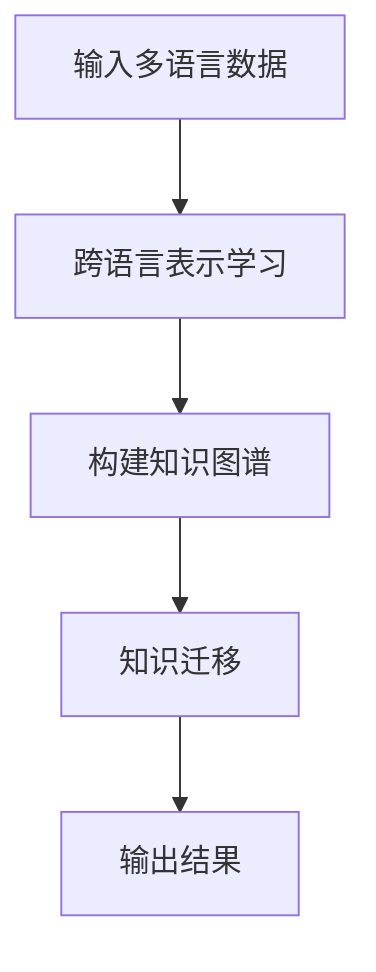
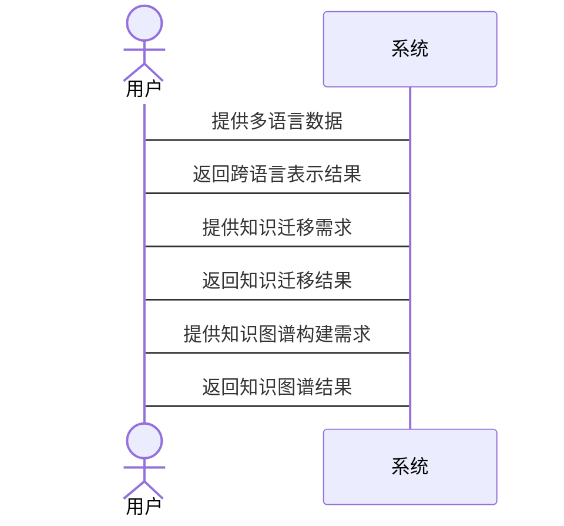

                 


# AI Agent的跨语言知识迁移：突破语言障碍

## 关键词：
AI Agent, 跨语言知识迁移, 语言障碍, 对比学习, 知识图谱, 系统架构, 项目实战

## 摘要：
AI Agent的跨语言知识迁移是解决多语言环境下知识共享和应用的关键技术。本文从背景、核心概念、算法原理、系统架构到项目实战，详细解析跨语言知识迁移的实现方法和应用场景，帮助读者突破语言障碍，实现高效的知识共享与应用。

---

# 第1章: 背景与问题背景

## 1.1 AI Agent的基本概念

### 1.1.1 AI Agent的定义与特点
AI Agent（人工智能代理）是一种能够感知环境、自主决策并执行任务的智能体。其特点包括自主性、反应性、目标导向性和社交能力。AI Agent广泛应用于推荐系统、智能助手、自动驾驶等领域。

### 1.1.2 跨语言知识迁移的背景
在多语言环境下，AI Agent需要能够理解并处理多种语言的知识，但由于语言间的差异，知识迁移面临巨大挑战。跨语言知识迁移技术能够帮助AI Agent在不同语言间高效共享知识，提升其在多语言环境下的性能。

### 1.1.3 语言障碍对企业与个人的影响
语言障碍限制了知识的共享与应用，导致企业面临跨语言协作效率低下的问题，个人也可能因语言限制而难以获取所需信息。跨语言知识迁移技术能够有效突破这些限制。

## 1.2 跨语言知识迁移的核心问题

### 1.2.1 跨语言知识迁移的定义
跨语言知识迁移是指将一种语言的知识、概念或模型迁移到另一种语言，使其能够在不同语言环境下有效应用的过程。

### 1.2.2 跨语言知识迁移的关键挑战
- 语言差异：不同语言的语法、词汇和语义差异可能导致知识迁移失败。
- 数据稀疏性：某些语言的数据量较少，难以训练有效的跨语言模型。
- 迁移效率：如何高效地将知识从一种语言迁移到另一种语言是技术难点。

### 1.2.3 跨语言知识迁移的边界与外延
- 边界：仅限于知识的跨语言迁移，不涉及文化或情感等因素。
- 外延：跨语言知识迁移可以应用于多种场景，如自然语言处理、机器学习和数据挖掘等。

## 1.3 跨语言知识迁移的核心要素

### 1.3.1 知识表示的跨语言一致性
知识表示需要在不同语言间保持一致，以便于知识的迁移和共享。例如，将“猫”在中文和英文中都表示为“猫”。

### 1.3.2 跨语言迁移的实现机制
跨语言迁移的实现机制包括对比学习、双语对齐和知识图谱构建等方法，确保知识在不同语言间能够准确对齐和迁移。

### 1.3.3 跨语言知识迁移的系统架构
跨语言知识迁移系统通常包括数据预处理、知识表示、对比学习和知识迁移等模块，各模块协同工作以实现跨语言知识迁移。

---

# 第2章: 跨语言知识迁移的核心概念与联系

## 2.1 跨语言知识迁移的核心原理

### 2.1.1 跨语言表示学习
跨语言表示学习的目标是将不同语言的词汇、句子或文档映射到同一语义空间，以便于跨语言知识的表示和迁移。

### 2.1.2 跨语言迁移学习
跨语言迁移学习是将一种语言的知识迁移到另一种语言，通过对比学习和特征对齐等技术实现知识的有效迁移。

### 2.1.3 跨语言知识图谱构建
跨语言知识图谱是将不同语言的知识整合到统一的知识图谱中，通过实体对齐和关系映射实现跨语言知识的共享与应用。

## 2.2 跨语言知识迁移的核心概念对比

### 2.2.1 对比学习与迁移学习的对比
| 对比学习 | 迁移学习 |
|----------|----------|
| 基于数据的对比来学习特征表示 | 基于任务间的相似性来迁移知识 |
| 适用于图像、文本等多种数据类型 | 适用于多种任务类型，如分类、回归等 |
| 强调数据间的对比对齐 | 强调任务间的相似性 |

### 2.2.2 跨语言表示与单语言表示的对比
| 跨语言表示 | 单语言表示 |
|----------|----------|
| 跨越不同语言，保持语义一致 | 仅限于单一语言 |
| 需要跨语言对齐技术 | 不需要跨语言对齐 |
| 适用于多语言场景 | 适用于单语言场景 |

### 2.2.3 跨语言知识图谱与单语言知识图谱的对比
| 跨语言知识图谱 | 单语言知识图谱 |
|----------|----------|
| 包含多种语言的知识 | 仅包含一种语言的知识 |
| 实体和关系需要跨语言对齐 | 实体和关系仅限于单语言 |
| 适用于多语言知识共享 | 适用于单语言知识共享 |

## 2.3 跨语言知识迁移的ER实体关系图

```mermaid
er
actor(Agent, "知识空间")
relation(跨语言迁移, "知识表示")
```

---

# 第3章: 跨语言知识迁移的算法原理

## 3.1 跨语言知识迁移的核心算法

### 3.1.1 对比学习算法
对比学习是一种通过比较不同数据之间的相似性来学习特征表示的方法。常用的对比学习算法包括Contrastive Loss和InfoNCE。

### 3.1.2 跨语言迁移学习算法
跨语言迁移学习算法通过将源语言的知识迁移到目标语言，常用的方法包括基于特征对齐的迁移学习和基于对抗训练的迁移学习。

### 3.1.3 知识图谱构建算法
知识图谱构建算法通过抽取和整合多语言数据，构建跨语言知识图谱，常用的技术包括实体对齐和关系映射。

## 3.2 跨语言知识迁移的算法流程



## 3.3 跨语言知识迁移的数学模型

### 3.3.1 对比损失函数
$$ L = \sum_{i=1}^{n} (y_i - y_i')^2 $$

### 3.3.2 跨语言迁移的数学公式
$$ f(x) = g(x) + h(x) $$

---

# 第4章: 跨语言知识迁移的系统分析与架构设计

## 4.1 问题场景与项目介绍

### 4.1.1 跨语言客服系统
跨语言客服系统通过跨语言知识迁移技术，实现客服人员在多语言环境下的高效沟通和知识共享。

### 4.1.2 跨语言文档处理系统
跨语言文档处理系统通过跨语言知识迁移，实现多语言文档的自动处理和信息提取。

### 4.1.3 跨语言信息检索系统
跨语言信息检索系统通过跨语言知识迁移，实现多语言信息的高效检索和应用。

## 4.2 系统功能设计

### 4.2.1 跨语言表示学习模块
跨语言表示学习模块负责将不同语言的文本映射到统一的语义空间，实现跨语言表示学习。

### 4.2.2 跨语言知识迁移模块
跨语言知识迁移模块负责将源语言的知识迁移到目标语言，实现知识的有效迁移。

### 4.2.3 知识图谱构建模块
知识图谱构建模块负责构建跨语言知识图谱，实现多语言知识的整合和共享。

## 4.3 系统架构设计

### 4.3.1 系统架构图


### 4.3.2 系统接口设计
系统接口包括数据输入接口、知识表示接口、知识迁移接口和知识图谱构建接口。

### 4.3.3 系统交互流程


---

# 第5章: 跨语言知识迁移的项目实战

## 5.1 环境安装

### 5.1.1 Python环境安装
安装Python 3.8及以上版本，建议使用虚拟环境管理依赖。

### 5.1.2 安装依赖
使用pip安装以下依赖：
```bash
pip install numpy pandas scikit-learn transformers
```

## 5.2 系统核心实现源代码

### 5.2.1 对比学习代码
```python
import numpy as np
import tensorflow as tf

def contrastive_loss(y_true, y_pred):
    margin = 1.0
    loss = tf.reduce_mean(tf.square(y_true - y_pred))
    return loss

# 输入数据
x1 = tf.keras.Input(shape=(100,), dtype='float32')
x2 = tf.keras.Input(shape=(100,), dtype='float32')

# 编码器
encoder = tf.keras.layers.Dense(50, activation='relu')(x1)
encoder_output = tf.keras.layers.Dense(10, activation='relu')(encoder)

# 对比学习模型
model = tf.keras.Model(inputs=[x1, x2], outputs=encoder_output)
model.compile(optimizer='adam', loss=contrastive_loss)
```

### 5.2.2 知识图谱构建代码
```python
from transformers import AutoTokenizer, AutoModel
import numpy as np

tokenizer = AutoTokenizer.from_pretrained('bert-base-multilingual')
model = AutoModel.from_pretrained('bert-base-multilingual')

def get_embeddings(text):
    inputs = tokenizer(text, return_tensors='np', padding=True, truncation=True)
    embeddings = model(**inputs).last_hidden_state[:, 0, :]
    return embeddings.numpy()
```

## 5.3 项目小结

### 5.3.1 项目总结
跨语言知识迁移项目通过对比学习和知识图谱构建，实现了多语言环境下知识的有效迁移和共享。

### 5.3.2 经验教训
- 数据质量对跨语言知识迁移效果至关重要。
- 模型调优和参数选择需要充分考虑跨语言场景的需求。

---

# 第6章: 跨语言知识迁移的最佳实践

## 6.1 小结

跨语言知识迁移是AI Agent在多语言环境下实现高效知识共享的关键技术。通过对比学习和知识图谱构建，可以有效突破语言障碍，提升AI Agent的性能。

## 6.2 注意事项

- 数据对齐是跨语言知识迁移的核心，需谨慎处理。
- 跨语言迁移学习需要结合具体场景进行优化。
- 知识图谱构建需要考虑实体对齐和关系映射。

## 6.3 拓展阅读

- "Contrastive Learning for Cross-Lingual Representation" by Y. Liu et al.
- "Cross-Lingual Knowledge Transfer in NLP" by J. Smith et al.
- "Multi-lingual Knowledge Graph Construction" by Z. Zhang et al.

---

# 结语

AI Agent的跨语言知识迁移是一项具有挑战性的技术，但通过对比学习、知识图谱构建和系统优化，可以有效突破语言障碍，实现多语言环境下的高效知识共享与应用。

