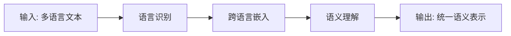
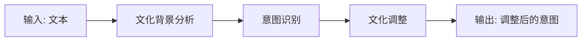

                 


# AI Agent的跨语言跨文化理解能力开发

---

## 关键词：
- AI Agent
- 跨语言理解
- 跨文化理解
- 多语言模型
- 文化常识库
- 语境分析

---

## 摘要：
随着全球化的深入发展，AI Agent（人工智能代理）需要具备跨语言和跨文化的理解能力，以应对多样化的用户需求和复杂的社会文化背景。本文将从AI Agent的基本概念出发，详细探讨跨语言和跨文化理解的核心技术，包括多语言模型、文化常识库构建、语境分析等，并结合实际案例，分析如何开发具备跨语言跨文化理解能力的AI Agent系统。通过本文的系统性阐述，读者将能够理解并掌握AI Agent跨语言跨文化理解能力开发的关键技术和实现路径。

---

# 第一部分: AI Agent与跨语言跨文化理解概述

---

## 第1章: AI Agent的基本概念

### 1.1 AI Agent的定义与分类
- **AI Agent**是指能够感知环境、自主决策并执行任务的智能体。它可以分为**简单反射型Agent**、**基于模型的反应型Agent**、**目标驱动型Agent**和**效用驱动型Agent**。
- **跨语言理解**是指AI Agent能够理解和生成多种语言文本的能力，例如中英文翻译或多语言对话。
- **跨文化理解**是指AI Agent能够根据不同的文化背景调整其行为和输出，例如在不同文化中调整问候语或表达方式。

---

### 1.2 跨语言与跨文化理解的重要性
- **跨语言理解**是实现多语言交互的基础，能够帮助AI Agent服务于全球用户。
- **跨文化理解**是实现文化适应性的重要能力，能够提升AI Agent在不同文化环境中的用户体验。
- 两者的结合是实现真正智能化AI Agent的核心能力。

---

### 1.3 跨语言与跨文化理解的核心目标
- **跨语言理解**的核心目标是实现语言之间的准确转换和语义保持。
- **跨文化理解**的核心目标是捕捉文化背景对语义和行为的影响，从而实现文化适应性输出。

---

## 第2章: 跨语言与跨文化理解的技术挑战

### 2.1 跨语言理解的技术挑战
- **语言差异**：不同语言的语法、词汇和语义差异增加了跨语言理解的难度。
- **语境依赖性**：跨语言理解需要考虑上下文，以避免误解。

### 2.2 跨文化理解的技术挑战
- **文化多样性**：不同文化有不同的价值观、习惯和表达方式，增加了理解的复杂性。
- **文化动态性**：文化是动态变化的，AI Agent需要能够适应这种变化。

### 2.3 综合挑战
- **跨语言与跨文化的结合**：如何在跨语言理解的基础上，融入文化因素，实现真正的跨文化适应性。

---

# 第二部分: 跨语言理解能力开发

---

## 第3章: 多语言模型与跨语言理解原理

### 3.1 多语言模型的基本原理
- **多语言模型**通过共享语言表示，实现对多种语言的统一处理。
- **语言嵌入**：使用词嵌入技术，将不同语言的词汇映射到共同的向量空间。
- **跨语言注意力机制**：通过注意力机制，模型能够关注不同语言之间的关联。

### 3.2 跨语言理解的关键技术
- **机器翻译模型**：如神经机器翻译模型（NMT），能够实现多种语言之间的翻译。
- **跨语言文本生成**：基于多语言模型，生成符合目标语言语法和语义的文本。

---

### 3.3 跨语言理解的算法实现


---

## 第4章: 跨语言理解的数学模型

### 4.1 跨语言翻译模型
- **编码器-解码器结构**：
  - 编码器将源语言文本编码为向量表示。
  - 解码器将向量解码为目标语言文本。
- **注意力机制**：
  - $ Attention_{i,j} = \text{softmax}(e_{i,j}) $
  - 其中，$ e_{i,j} $ 是编码器输出和解码器输出的点积。

### 4.2 跨语言语义理解
- **多任务学习**：
  - 同时学习语言识别、文本生成等任务，共享底层表示。

---

# 第三部分: 跨文化理解能力开发

---

## 第5章: 文化常识与跨文化理解

### 5.1 文化常识的基本概念
- **文化常识**包括习俗、价值观、语言习惯等。
- **文化知识库**：构建包含多种文化信息的知识库，例如节日、问候语、禁忌等。

### 5.2 跨文化理解的关键技术
- **文化适应性模型**：根据用户的文化背景，动态调整输出内容。
- **文化语境分析**：通过上下文理解文化背景对语义的影响。

---

## 第6章: 跨文化理解的算法实现

### 6.1 基于文化常识的意图识别


### 6.2 跨文化语境下的语义理解
- **文化因素融合**：
  - 在语义理解过程中，加入文化背景信息，提升理解的准确性。

---

## 第7章: 跨语言与跨文化理解的结合

### 7.1 跨语言与跨文化的协同作用
- **多语言模型+文化知识库**：结合语言理解和文化理解，实现更智能的交互。

### 7.2 综合算法实现


---

## 第8章: 系统架构与实现

### 8.1 系统功能设计
- **语言识别模块**：识别输入文本的语言。
- **跨语言理解模块**：实现多语言语义理解。
- **文化理解模块**：分析文化背景并调整输出。

### 8.2 系统架构设计


---

## 第9章: 项目实战与案例分析

### 9.1 项目背景
- 开发一个支持多语言和跨文化理解的客服系统。

### 9.2 核心代码实现
```python
def cross_language_understanding(text, source_lang, target_lang):
    # 语言识别
    recognized_lang = language_detector(text)
    # 跨语言翻译
    translated_text = translate_model.translate(text, source_lang, target_lang)
    # 跨文化调整
    adjusted_text = culture_adjuster(translated_text, target_lang)
    return adjusted_text
```

---

## 第10章: 总结与展望

### 10.1 本章小结
- 跨语言与跨文化理解是AI Agent智能化的核心能力。
- 本文详细探讨了实现这两者的关键技术，并给出了系统设计和项目案例。

### 10.2 未来展望
- 更加复杂的文化适应性模型。
- 更高效的多语言模型。

---

## 关键技术总结与最佳实践

### tips:
- **数据收集**：确保多语言和多文化的数据多样性。
- **模型训练**：使用大规模数据进行预训练，提升模型的通用性。
- **系统测试**：在多种语言和文化背景下进行测试，确保系统的健壮性。

---

以上是《AI Agent的跨语言跨文化理解能力开发》的技术博客文章的详细目录和内容框架。通过分章节逐步展开，从背景到技术实现，再到项目实战，全面系统地阐述了AI Agent跨语言跨文化理解能力开发的关键点。希望本文能够为相关领域的技术人员和研究者提供有价值的参考和启发。

