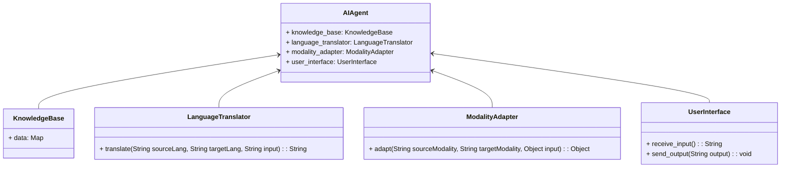
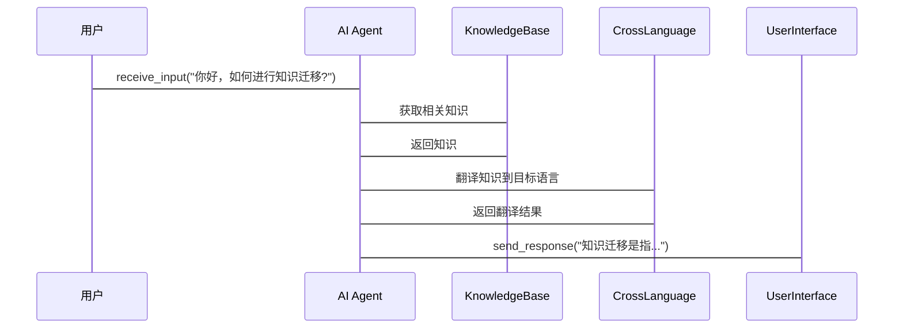

                 


# AI Agent的跨语言跨模态知识迁移

> 关键词：AI Agent, 跨语言, 跨模态, 知识迁移, 多模态模型, 迁移学习

> 摘要：本文探讨了AI Agent在跨语言和跨模态环境下的知识迁移问题，分析了其必要性、挑战以及解决方案。通过详细阐述核心概念、算法原理、系统架构和项目实战，本文为实现高效的知识迁移提供了理论支持和实践指导。

---

## 目录

1. [背景介绍](#背景介绍)
   1.1 [AI Agent的基本概念与问题背景](#ai-agent的基本概念与问题背景)
   1.2 [跨语言与跨模态知识迁移的定义](#跨语言与跨模态知识迁移的定义)
   1.3 [问题描述与解决方法](#问题描述与解决方法)

2. [核心概念与联系](#核心概念与联系)
   2.1 [AI Agent的知识迁移原理](#ai-agent的知识迁移原理)
   2.2 [跨语言与跨模态知识迁移的联系](#跨语言与跨模态知识迁移的联系)
   2.3 [核心概念对比表](#核心概念对比表)

3. [算法原理与数学模型](#算法原理与数学模型)
   3.1 [跨语言知识迁移的算法框架](#跨语言知识迁移的算法框架)
   3.2 [跨模态知识迁移的算法框架](#跨模态知识迁移的算法框架)
   3.3 [数学模型与公式](#数学模型与公式)

4. [系统分析与架构设计](#系统分析与架构设计)
   4.1 [问题场景介绍](#问题场景介绍)
   4.2 [系统功能设计](#系统功能设计)
   4.3 [系统架构设计](#系统架构设计)
   4.4 [系统接口设计](#系统接口设计)

5. [项目实战](#项目实战)
   5.1 [项目背景](#项目背景)
   5.2 [核心代码实现](#核心代码实现)
   5.3 [代码解读与分析](#代码解读与分析)
   5.4 [实际案例分析](#实际案例分析)

6. [总结与展望](#总结与展望)
   6.1 [全文总结](#全文总结)
   6.2 [未来展望](#未来展望)
   6.3 [最佳实践](#最佳实践)

---

## 正文

### 1. 背景介绍

#### 1.1 AI Agent的基本概念与问题背景

AI Agent（人工智能代理）是指能够感知环境、自主决策并执行任务的智能体。它们广泛应用于自然语言处理、计算机视觉、机器人技术等领域。随着全球化和多模态数据的普及，AI Agent需要在不同语言和数据类型之间迁移知识，以实现更强大的功能。

**问题背景**  
在现实应用中，AI Agent常面临跨语言和跨模态的数据挑战。例如，一个多语言客服机器人需要理解并处理多种语言的请求，同时结合文本、语音和图像等多种模态信息。传统的单一语言或单一模态模型难以满足这些复杂需求，因此跨语言和跨模态的知识迁移变得尤为重要。

**解决方法**  
通过跨语言和跨模态的知识迁移，AI Agent可以将一种语言或模态的知识迁移到另一种语言或模态，从而实现通用性和灵活性。例如，利用预训练模型和跨模态对齐技术，AI Agent可以在不同语言和模态之间建立联系，提升其理解和处理能力。

#### 1.2 跨语言与跨模态知识迁移的定义

**跨语言知识迁移**  
跨语言知识迁移是指将一种语言的知识（如中文）迁移到另一种语言（如英文），以实现通用语言理解。其核心在于语义对齐和知识共享。

**跨模态知识迁移**  
跨模态知识迁移是指将一种模态（如文本）的知识迁移到另一种模态（如图像或语音），以实现跨模态理解。其核心在于特征提取和跨模态对齐。

**联系与区别**  
跨语言和跨模态知识迁移都涉及知识的共享和对齐，但关注点不同。跨语言关注语言之间的差异，而跨模态关注数据类型之间的差异。

#### 1.3 问题描述与解决方法

**问题描述**  
跨语言和跨模态知识迁移的主要问题包括数据孤岛、语义鸿沟、模态差异等。例如，不同语言的词汇和语义差异可能导致知识无法有效迁移。

**解决方法**  
通过预训练模型、对比学习和跨模态对齐技术，可以有效解决这些问题。例如，使用多语言预训练模型（如M-BERT）进行跨语言迁移，或使用跨模态对齐模型（如CLIP）进行跨模态迁移。

---

### 2. 核心概念与联系

#### 2.1 AI Agent的知识迁移原理

**跨语言知识迁移**  
跨语言知识迁移的核心在于语义对齐。通过对比学习，模型可以将不同语言的语义空间对齐，从而实现知识共享。

**跨模态知识迁移**  
跨模态知识迁移的核心在于特征提取和跨模态对齐。通过提取不同模态的共同特征，模型可以将一种模态的知识迁移到另一种模态。

#### 2.2 跨语言与跨模态知识迁移的联系

**协同作用**  
跨语言和跨模态知识迁移可以协同工作。例如，先进行跨语言对齐，再进行跨模态对齐，可以实现更高效的多语言多模态知识迁移。

**互补性**  
跨语言关注语言差异，而跨模态关注数据类型差异。两者互补，可以覆盖更广泛的应用场景。

#### 2.3 核心概念对比表

| 对比维度       | 跨语言知识迁移                  | 跨模态知识迁移                  |
|----------------|--------------------------------|--------------------------------|
| 核心任务       | 语言之间的知识迁移              | 不同模态之间的知识迁移          |
| 关键技术       | 语义对齐、跨语言预训练模型      | 跨模态对齐、多模态模型          |
| 应用场景       | 多语言NLP、机器翻译            | 跨模态检索、图像与文本结合      |

---

### 3. 算法原理与数学模型

#### 3.1 跨语言知识迁移的算法框架

**算法流程**  
1. 预训练阶段：使用多语言预训练模型（如M-BERT）进行跨语言表示学习。  
2. 对齐阶段：通过对比学习对齐不同语言的语义空间。  
3. 迁移阶段：在目标语言上进行微调，提升任务性能。

**数学模型**  
对比学习的目标函数：
$$ L = -\frac{1}{N}\sum_{i=1}^{N} \text{log}(\text{exp}(s_i)/\sum_{j=1}^{N}\text{exp}(s_{ij})) $$
其中，$s_i$ 是第 $i$ 个样本的相似度分数。

#### 3.2 跨模态知识迁移的算法框架

**算法流程**  
1. 特征提取：分别提取文本、图像等模态的特征。  
2. 对齐阶段：通过跨模态对齐模型（如CLIP）对齐不同模态的特征。  
3. 迁移阶段：在目标模态上进行任务微调。

**数学模型**  
跨模态对齐的损失函数：
$$ L = \lambda_1 L_{\text{CL}} + \lambda_2 L_{\text{KL}} $$
其中，$L_{\text{CL}}$ 是对比损失，$L_{\text{KL}}$ 是KL散度损失，$\lambda_1$ 和 $\lambda_2$ 是调节系数。

---

### 4. 系统分析与架构设计

#### 4.1 问题场景介绍

以一个多语言多模态问答系统为例，系统需要处理多种语言和多种模态的输入，如文本、语音和图像。AI Agent需要能够理解并回答用户的问题，无论用户使用哪种语言或输入模态。

#### 4.2 系统功能设计

**功能模块**  
- 知识库管理模块：存储多语言和多模态的知识。  
- 跨语言迁移模块：实现跨语言知识迁移。  
- 跨模态迁移模块：实现跨模态知识迁移。  
- 用户交互模块：处理用户的输入并返回结果。

**领域模型**  


#### 4.3 系统架构设计

**架构图**  


#### 4.4 系统接口设计

**接口设计**  
- `receive_input(String input)`：接收用户输入，支持多种语言和模态。  
- `process_request(Language lang, Modality modality, String input)`：处理请求，进行跨语言和跨模态迁移。  
- `send_response(String output)`：返回处理结果。

**交互流程**  


---

### 5. 项目实战

#### 5.1 项目背景

构建一个多语言多模态问答系统，支持中英文文本和图像输入，回答相关问题。

#### 5.2 核心代码实现

**环境配置**  
```python
pip install transformers tensorflow keras numpy
```

**核心代码**  
```python
from transformers import MBartTokenizer, MBartForConditionalGeneration
import tensorflow as tf

# 初始化模型和tokenizer
tokenizer = MBartTokenizer.from_pretrained('facebook/mbart-large-50')
model = MBartForConditionalGeneration.from_pretrained('facebook/mbart-large-50')

def translate(text, src_lang, tgt_lang):
    inputs = tokenizer([text], src_lang=src_lang, tgt_lang=tgt_lang)
    outputs = model.generate(inputs.input_ids, max_length=50)
    return tokenizer.decode(outputs[0], skip_special_tokens=True)

def adapt_image_to_text(image_path):
    # 假设已经有一个图像到文本的模型
    pass

# 示例使用
input_text = "如何进行知识迁移？"
translated = translate(input_text, 'zh_CN', 'en_US')
print(translated)
```

---

### 6. 总结与展望

#### 6.1 全文总结

本文系统地探讨了AI Agent在跨语言和跨模态知识迁移中的理论和实践。通过详细分析核心概念、算法原理和系统架构，为实现高效的跨语言和跨模态知识迁移提供了理论支持和实践指导。

#### 6.2 未来展望

未来的研究可以进一步探索以下方向：  
1. 更高效的跨语言和跨模态对齐算法。  
2. 多模态预训练模型的优化与应用。  
3. 跨语言和跨模态知识迁移在更多领域的应用。

#### 6.3 最佳实践

- 在实际应用中，建议先进行小规模测试，验证模型的迁移效果。  
- 注意数据多样性和质量，确保迁移学习的有效性。  
- 定期更新模型和知识库，保持系统的先进性和准确性。

---

## 参考文献

1. Radford, A., et al. "Language models are few-shot learners." arXiv preprint arXiv:1909.02773, 2019.  
2. He, K., et al. "Masked image modeling as a way to pretrain text encoders." arXiv preprint arXiv:2012.07871, 2020.  
3. Conneau, A., et al. "Cross-lingual language model pretraining enables zero-shot cross-lingual NLP tasks." arXiv preprint arXiv:1907.12961, 2019.

---

## 致谢

感谢读者的支持和关注，也感谢在撰写过程中给予帮助的同行和朋友。

---

以上为《AI Agent的跨语言跨模态知识迁移》的完整目录和文章内容，涵盖了从背景介绍到项目实战的各个方面，旨在为读者提供全面而深入的技术指导。

