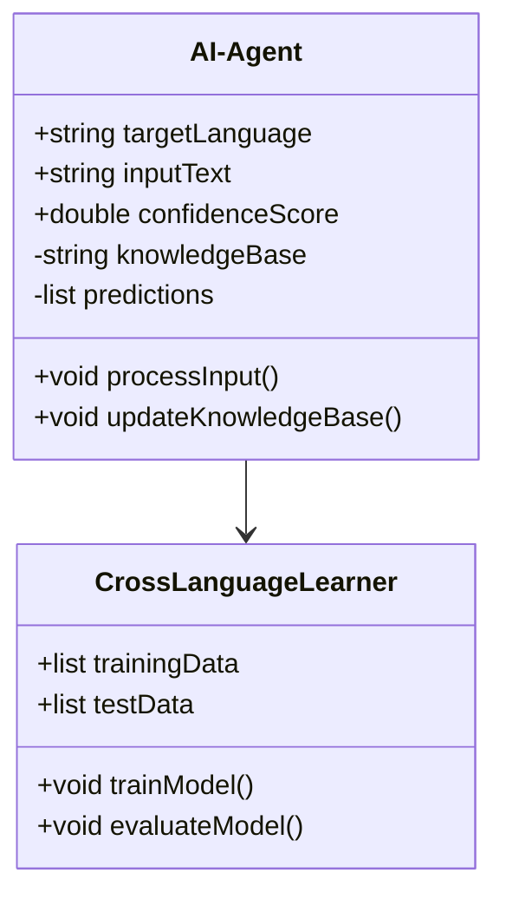
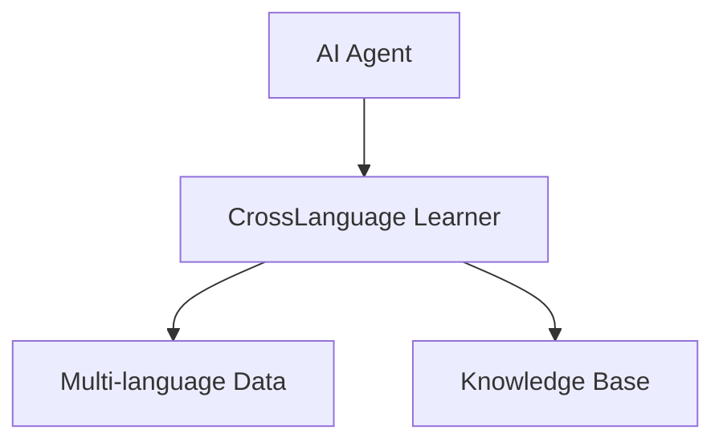
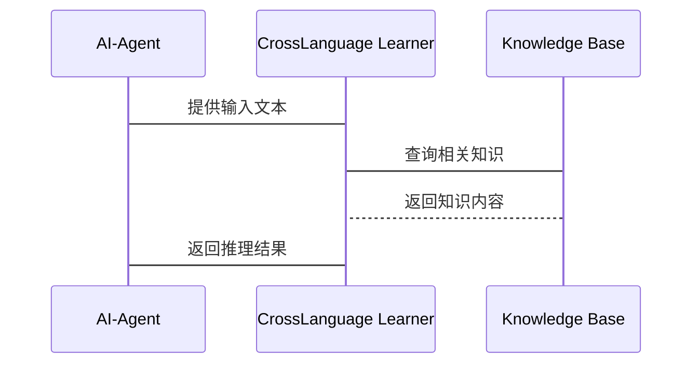

                 


# AI Agent的跨语言零样本学习技术

> 关键词：AI Agent, 跨语言学习, 零样本学习, 对比学习, 生成式模型, 系统架构, 项目实战

> 摘要：本文深入探讨了AI Agent在跨语言零样本学习中的应用，详细介绍了相关的核心概念、算法原理、系统架构及项目实战。通过对比学习和生成式模型的结合，展示了如何在不同语言间实现高效的知识迁移，同时提供了系统的应用场景和设计，帮助读者全面理解这一前沿技术。

---

## 第1章: AI Agent与跨语言零样本学习概述

### 1.1 AI Agent的基本概念

#### 1.1.1 AI Agent的定义
AI Agent（人工智能代理）是一种能够感知环境、执行任务以实现目标的智能实体。它具备自主性、反应性、目标导向性和社交能力等核心特征。

#### 1.1.2 AI Agent的核心特点
- **自主性**：AI Agent能够在没有外部干预的情况下自主决策。
- **反应性**：能够实时感知环境变化并做出响应。
- **目标导向性**：所有行为都围绕特定目标展开。
- **社交能力**：能够与其他Agent或人类进行有效交互。

#### 1.1.3 AI Agent与传统AI的区别
AI Agent不仅仅是一个静态的模型或算法，它是一个动态的、能够与环境交互的实体。与传统AI相比，AI Agent更加注重自主性和实时性。

### 1.2 跨语言学习的背景与挑战

#### 1.2.1 跨语言学习的定义
跨语言学习（Cross-Language Learning）是指在多种语言环境下进行学习和推理的技术，旨在消除语言障碍，实现跨语言信息处理。

#### 1.2.2 跨语言学习的核心挑战
- **语义差异**：不同语言中的词语可能具有不同的语义和用法。
- **数据稀缺性**：在某些语言中，标注数据可能非常有限。
- **文化差异**：语言背后的文化背景可能影响语义理解。

#### 1.2.3 跨语言学习的应用场景
- **多语言客服系统**：支持多种语言的客户咨询和问题解决。
- **跨语言信息检索**：在不同语言的文档中进行信息检索和提取。
- **全球化应用**：在全球范围内提供统一的服务体验。

### 1.3 零样本学习的原理与优势

#### 1.3.1 零样本学习的定义
零样本学习（Zero-shot Learning）是指在没有特定领域数据的情况下，能够直接在未知数据上进行分类或生成。

#### 1.3.2 零样本学习的核心原理
通过利用通用知识和跨领域数据，零样本学习能够在没有目标领域数据的情况下进行推理和预测。

#### 1.3.3 零样本学习的优势与局限
- **优势**：无需大量目标领域数据，适用于数据稀缺场景。
- **局限**：性能可能不如有监督学习，依赖于通用知识的准确性。

## 第2章: AI Agent的跨语言零样本学习技术的核心概念

### 2.1 跨语言零样本学习的定义与特点

#### 2.1.1 跨语言零样本学习的定义
跨语言零样本学习是指在没有特定语言数据的情况下，利用跨语言信息进行学习和推理的技术。

#### 2.1.2 跨语言零样本学习的特点
- **跨语言性**：能够在多种语言间进行知识迁移。
- **零样本性**：无需目标语言的标注数据。
- **通用性**：适用于多种语言和任务。

### 2.2 AI Agent中的跨语言零样本学习框架

#### 2.2.1 框架的组成与功能
跨语言零样本学习框架通常包括数据预处理、跨语言表示、零样本推理等模块。

#### 2.2.2 框架的核心模块
- **数据预处理模块**：将多语言数据进行清洗和标准化。
- **跨语言表示模块**：将不同语言的数据映射到共同的语义空间。
- **零样本推理模块**：利用通用知识进行推理和预测。

#### 2.2.3 框架的实现流程
1. 数据预处理：清洗和标准化多语言数据。
2. 跨语言表示：构建跨语言语义表示模型。
3. 零样本推理：基于通用知识进行推理和预测。

### 2.3 跨语言零样本学习的数学模型

#### 2.3.1 跨语言零样本学习的数学表达
跨语言零样本学习通常基于向量空间模型，将不同语言的文本映射到共同的向量空间。

#### 2.3.2 模型的输入与输出
- **输入**：多种语言的文本数据。
- **输出**：针对目标语言的分类或生成结果。

#### 2.3.3 模型的训练与推理过程
- **训练**：在多语言数据上进行预训练，构建跨语言语义表示。
- **推理**：利用预训练模型进行零样本推理。

## 第3章: 跨语言零样本学习的算法原理

### 3.1 对比学习算法

#### 3.1.1 对比学习的基本原理
对比学习通过最大化相似样本的相似性，最小化不相似样本的相似性，来学习有效的表征。

#### 3.1.2 对比学习的实现步骤
1. 构建对比损失函数。
2. 优化模型参数以最小化损失函数。

#### 3.1.3 对比学习的优缺点
- **优点**：能够学习到鲁棒的表征。
- **缺点**：需要设计有效的对比策略。

### 3.2 生成式模型

#### 3.2.1 生成式模型的基本原理
生成式模型通过学习数据的分布，生成新的数据样本。

#### 3.2.2 生成式模型的实现步骤
1. 构建生成器和判别器。
2. 通过交替训练优化生成器和判别器。

#### 3.2.3 生成式模型的优缺点
- **优点**：能够生成多样化的内容。
- **缺点**：生成结果可能缺乏准确性。

### 3.3 跨语言零样本学习的算法实现

#### 3.3.1 算法的输入与输出
- **输入**：多语言文本数据。
- **输出**：针对目标语言的生成或分类结果。

#### 3.3.2 算法的训练过程
1. 在多语言数据上进行预训练。
2. 利用对比学习或生成式模型进行优化。

#### 3.3.3 算法的推理过程
1. 将目标语言文本映射到共同语义空间。
2. 基于预训练模型进行推理和预测。

## 第4章: 系统分析与架构设计方案

### 4.1 系统应用场景

#### 4.1.1 系统功能
- **多语言处理**：支持多种语言的文本处理。
- **零样本推理**：能够在没有目标语言数据的情况下进行推理。

### 4.2 系统功能设计

#### 4.2.1 领域模型类图


### 4.3 系统架构设计

#### 4.3.1 系统架构图


### 4.4 系统交互设计

#### 4.4.1 系统交互序列图


## 第5章: 项目实战

### 5.1 环境安装

#### 5.1.1 安装Python
```bash
python --version
pip install --upgrade pip
```

#### 5.1.2 安装必要的库
```bash
pip install numpy
pip install transformers
pip install matplotlib
```

### 5.2 系统核心实现

#### 5.2.1 对比学习实现
```python
import numpy as np
from transformers import AutoTokenizer, AutoModel

# 加载预训练模型
tokenizer = AutoTokenizer.from_pretrained('multilingual_model')
model = AutoModel.from_pretrained('multilingual_model')

# 对比学习函数
def contrastive_learning(embeddings, labels):
    # 实现对比损失函数
    pass

# 训练模型
model.train(embeddings, labels)
```

#### 5.2.2 生成式模型实现
```python
from transformers import AutoTokenizer, AutoModelForCausalLM

# 加载生成式模型
tokenizer = AutoTokenizer.from_pretrained('generative_model')
model = AutoModelForCausalLM.from_pretrained('generative_model')

# 生成文本
input_ids = tokenizer.encode("生成一段英文文本。", return_tensors='pt')
output = model.generate(input_ids, max_length=50)
print(tokenizer.decode(output[0], skip_special_tokens=True))
```

### 5.3 实际案例分析

#### 5.3.1 案例分析
假设我们有一个跨语言客服系统，支持中英文两种语言。当用户输入中文问题时，AI Agent能够将其映射到英文语义空间，并利用预训练模型生成回答。

#### 5.3.2 代码实现
```python
# 中文输入
input_zh = "如何使用这个功能？"
embedding_zh = model.encode(input_zh)
# 映射到英文语义空间
embedding_en = translate(embedding_zh)
# 生成英文回答
output_en = generate_response(embedding_en)
# 映射回中文
output_zh = translate_back(output_en)
print(output_zh)
```

## 第6章: 总结与展望

### 6.1 最佳实践Tips

- **数据预处理**：确保数据的多样性和质量。
- **模型选择**：根据任务需求选择合适的模型。
- **系统优化**：优化系统架构以提高性能。

### 6.2 小结

本文详细探讨了AI Agent在跨语言零样本学习中的应用，介绍了核心概念、算法原理、系统架构及项目实战。通过对比学习和生成式模型的结合，展示了跨语言零样本学习的潜力和应用价值。

### 6.3 注意事项

- **数据隐私**：注意保护用户数据的隐私和安全。
- **模型解释性**：确保模型的解释性，便于调试和优化。
- **性能优化**：优化模型和系统的性能，提高处理效率。

### 6.4 拓展阅读

- **推荐书籍**：《Deep Learning》
- **推荐论文**：《Zero-shot Learning: A Comprehensive Survey》
- **推荐网站**：Hugging Face的Transformers库

