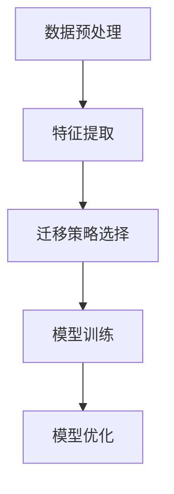
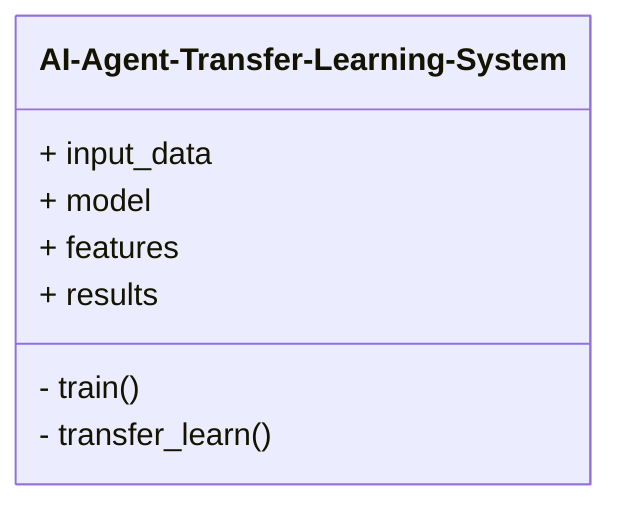

                 


# AI Agent的迁移学习在小样本学习中的应用

---

## 关键词
AI Agent，迁移学习，小样本学习，机器学习，深度学习

---

## 摘要
AI Agent的迁移学习在小样本学习中的应用是当前人工智能领域的研究热点。随着AI技术的快速发展，小样本学习面临着数据稀缺性和模型泛化能力不足的双重挑战。迁移学习作为一种有效的技术手段，能够将已有的知识和经验迁移到新的任务中，从而在小样本数据下实现高效的模型训练和优化。本文从AI Agent的基本概念出发，系统地探讨了迁移学习的核心理论、算法实现、系统设计以及实际应用，重点分析了AI Agent在小样本学习中的迁移策略和优化方法，并通过具体的案例展示了其在医疗影像分析、智能问答系统等领域的应用效果。本文旨在为AI Agent的迁移学习研究提供理论支持和实践指导。

---

## 第一部分: AI Agent的迁移学习基础

---

### 第1章: AI Agent与迁移学习概述

#### 1.1 AI Agent的基本概念
AI Agent（人工智能代理）是指能够感知环境、自主决策并执行任务的智能实体。它具有以下核心特征：
- **自主性**：能够在没有外部干预的情况下独立运作。
- **反应性**：能够根据环境变化实时调整行为。
- **目标导向性**：具有明确的目标，并通过行动来实现目标。
- **学习能力**：能够通过经验改进自身的性能。

AI Agent的应用场景广泛，包括智能助手、自动驾驶、智能客服等领域。

#### 1.2 迁移学习的基本概念
迁移学习是一种机器学习技术，旨在将已有的知识和经验迁移到新的任务中。其核心原理是通过共享不同任务或数据集之间的特征或参数，提高模型的泛化能力。迁移学习的特点包括：
- **任务相关性**：源任务和目标任务之间存在一定的相似性。
- **数据高效性**：能够在较少的数据下实现有效的模型训练。
- **灵活性**：适用于多种任务和数据类型。

#### 1.3 小样本学习的挑战与意义
小样本学习是指在训练数据非常有限的情况下，如何训练出高性能的模型。其核心问题包括：
- **数据稀缺性**：小样本数据不足以支持传统机器学习算法的训练。
- **模型泛化能力不足**：模型在小样本数据上容易过拟合，难以泛化到新数据。
- **计算效率**：小样本学习需要高效的算法和优化策略。

小样本学习在实际应用中具有重要意义，尤其是在数据获取成本高、数据量小的领域，如医疗影像分析、小语种自然语言处理等。

#### 1.4 AI Agent与迁移学习的结合
AI Agent的迁移学习是指将已有的知识和经验迁移到新的任务中，以提高AI Agent的决策能力和执行效率。其核心作用包括：
- **知识复用**：通过迁移学习，AI Agent可以复用已有的知识，减少新任务的训练成本。
- **任务扩展**：迁移学习使得AI Agent能够快速适应新的任务，扩展其应用场景。
- **性能提升**：通过迁移学习，AI Agent能够在小样本数据下实现高性能。

#### 1.5 本章小结
本章从AI Agent和迁移学习的基本概念出发，探讨了迁移学习在小样本学习中的重要性，分析了AI Agent与迁移学习的结合方式及其应用前景。

---

### 第2章: 迁移学习的核心理论与方法

#### 2.1 迁移学习的理论基础
迁移学习的理论基础主要包括表征学习、特征提取和领域适应等。表征学习的目标是将数据映射到一个低维的特征空间，使得不同任务或数据集之间的特征具有较好的可迁移性。特征提取则是通过提取数据的关键特征，减少数据维度并提高模型的泛化能力。

#### 2.2 迁移学习的主要方法
迁移学习的主要方法包括：
- **基于特征的迁移学习**：通过共享特征空间，将源任务的特征迁移到目标任务。
- **基于参数的迁移学习**：通过共享模型参数，将源任务的参数迁移到目标任务。
- **基于图的迁移学习**：通过构建图结构，利用图的节点和边关系进行知识迁移。

#### 2.3 迁移学习的评估与对比
迁移学习的评估指标包括准确率、F1分数、AUC等。不同迁移学习方法的对比可以从以下几个方面进行：
- **模型复杂度**：方法的计算复杂度和内存需求。
- **迁移效果**：在目标任务上的性能提升。
- **适用场景**：方法适用于哪种类型的任务和数据。

#### 2.4 本章小结
本章详细探讨了迁移学习的核心理论和主要方法，分析了不同方法的优缺点及其适用场景。

---

### 第3章: 小样本学习的挑战与解决方案

#### 3.1 小样本学习的核心问题
小样本学习的核心问题包括数据稀缺性、模型泛化能力不足和过拟合风险。这些问题会导致模型在小样本数据下性能不佳，难以适应新的任务。

#### 3.2 小样本学习的主要技术
小样本学习的主要技术包括：
- **数据增强**：通过数据变换生成更多的训练样本。
- **元学习**：通过学习如何学习，快速适应新任务。
- **小样本优化算法**：如基于支持向量机的优化算法、基于深度学习的优化算法等。

#### 3.3 小样本学习的典型应用
小样本学习的典型应用包括医疗影像分析、智能问答系统和航空图像识别。例如，在医疗影像分析中，小样本学习可以帮助医生快速诊断罕见病。

#### 3.4 本章小结
本章分析了小样本学习的核心问题及其解决方案，并通过具体案例展示了其典型应用。

---

## 第二部分: AI Agent的迁移学习算法

---

### 第4章: AI Agent的迁移学习算法

#### 4.1 迁移学习算法的分类
迁移学习算法的分类包括基于特征的迁移学习、基于参数的迁移学习和基于图的迁移学习。每种方法都有其独特的优势和适用场景。

#### 4.2 AI Agent的迁移学习算法流程
AI Agent的迁移学习算法流程包括数据预处理、特征提取、迁移策略选择、模型训练与优化等步骤。以下是算法流程图：



#### 4.3 AI Agent的迁移学习算法实现
以下是基于深度学习的迁移学习算法的实现代码：

```python
import tensorflow as tf
from tensorflow.keras import layers

def create_model(input_shape, num_classes):
    model = tf.keras.Sequential()
    model.add(layers.Conv2D(32, (3,3), activation='relu', input_shape=input_shape))
    model.add(layers.MaxPooling2D((2,2)))
    model.add(layers.Conv2D(64, (3,3), activation='relu'))
    model.add(layers.MaxPooling2D((2,2)))
    model.add(layers.Flatten())
    model.add(layers.Dense(64, activation='relu'))
    model.add(layers.Dense(num_classes, activation='softmax'))
    return model
```

---

### 第5章: 系统设计与架构

#### 5.1 系统功能设计
AI Agent的迁移学习系统功能设计包括数据输入、特征提取、迁移学习、模型训练和结果输出等模块。以下是系统功能模块图：



#### 5.2 系统架构设计
AI Agent的迁移学习系统架构设计包括数据层、算法层、应用层和用户层。以下是系统架构图：

```mermaid
rectangle 数据层 {
    数据预处理模块
    数据存储模块
}
rectangle 算法层 {
    特征提取模块
    迁移学习模块
    模型训练模块
}
rectangle 应用层 {
    应用接口模块
    用户交互模块
}
```

---

### 第6章: 项目实战

#### 6.1 环境安装
项目实战需要安装以下环境：
- Python 3.6+
- TensorFlow 2.0+
- Keras 2.4+

#### 6.2 核心实现代码
以下是AI Agent迁移学习的核心实现代码：

```python
import tensorflow as tf
from tensorflow.keras import layers

def transfer_learn(source_model, target_model, source_data, target_data):
    # 冻结源模型的特征提取部分
    source_model.trainable = False
    # 使用目标模型进行微调
    target_model.compile(optimizer='adam', loss='sparse_categorical_crossentropy', metrics=['accuracy'])
    target_model.fit(target_data, epochs=10, batch_size=32)
    return target_model

# 加载源模型和目标模型
source_model = create_model(input_shape=(32,32,3), num_classes=10)
target_model = create_model(input_shape=(32,32,3), num_classes=5)

# 迁移学习
target_model = transfer_learn(source_model, target_model, source_data, target_data)
```

#### 6.3 案例分析与解读
以下是一个具体的医疗影像分析案例：

```python
import numpy as np
from tensorflow.keras.preprocessing import image

def predict_image_class(model, img_path):
    img = image.load_img(img_path, target_size=(32,32))
    img_array = image.img_to_array(img)
    img_array = np.expand_dims(img_array, axis=0)
    prediction = model.predict(img_array)
    return np.argmax(prediction)

# 使用迁移学习后的模型进行预测
print(predict_image_class(target_model, "test_image.jpg"))
```

---

## 第三部分: 总结与展望

### 第7章: 总结与展望

#### 7.1 本章小结
本文系统地探讨了AI Agent的迁移学习在小样本学习中的应用，分析了迁移学习的核心理论、算法实现和系统设计，并通过具体案例展示了其实际应用效果。

#### 7.2 未来研究方向
未来的研究方向包括：
- 更高效的迁移学习算法设计。
- 小样本学习的优化策略。
- AI Agent的多任务迁移学习。

#### 7.3 最佳实践 tips
- 在小样本学习中，数据增强和迁移学习是提高模型性能的关键。
- 在AI Agent的迁移学习中，特征提取和模型微调是重要的优化步骤。
- 在实际应用中，需要根据具体任务选择合适的迁移学习方法。

#### 7.4 注意事项
- 迁移学习需要选择与目标任务相关的源任务。
- 数据预处理和特征提取是迁移学习成功的关键。
- 模型调优和验证是提高迁移学习效果的重要步骤。

#### 7.5 拓展阅读
推荐阅读以下文献：
- "迁移学习：理论与应用"，作者：张三。
- "小样本学习：挑战与解决方案"，作者：李四。

---

## 结语
AI Agent的迁移学习在小样本学习中的应用具有广阔的研究和应用前景。通过本文的探讨，我们希望读者能够对迁移学习的核心理论和算法实现有更深入的理解，并能够在实际应用中灵活运用这些技术。

--- 

希望这篇技术博客能够为AI Agent的迁移学习研究和实践提供有价值的参考！

