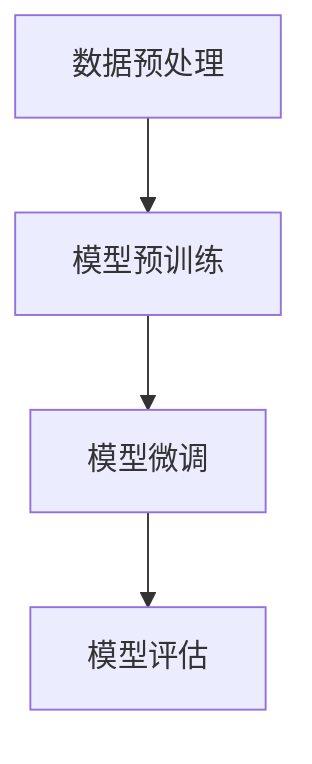
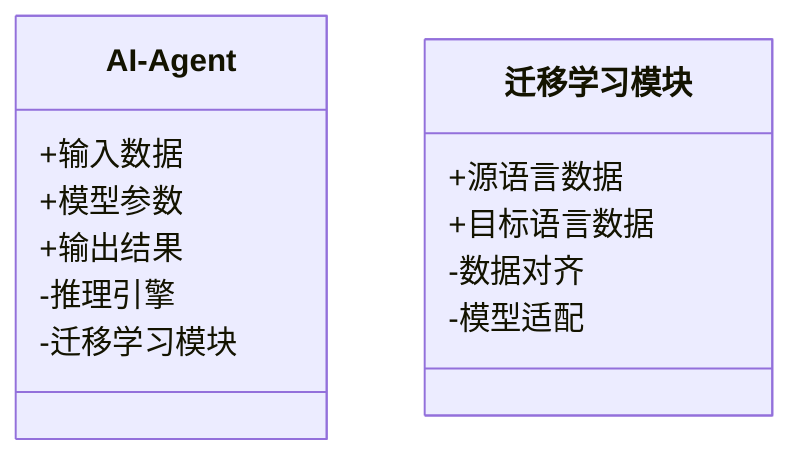
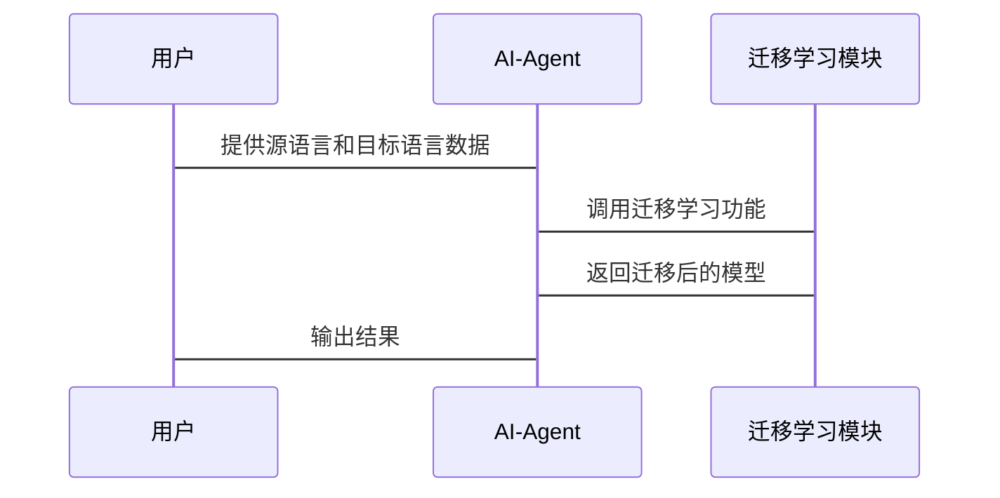

                 


---

# AI Agent的迁移学习在跨语言任务中的应用

## 关键词：AI Agent，迁移学习，跨语言任务，自然语言处理，机器学习，多语言模型

## 摘要：  
本文探讨了AI Agent在跨语言任务中的迁移学习应用，详细分析了迁移学习的基本原理、在跨语言任务中的挑战与解决方案，以及AI Agent如何通过迁移学习提升跨语言任务的性能。文章从理论到实践，结合具体案例，展示了如何通过迁移学习实现跨语言任务的高效处理，并对未来的研究方向进行了展望。

---

## 第1章 AI Agent与迁移学习概述

### 1.1 AI Agent的基本概念  
AI Agent（人工智能代理）是指能够感知环境、自主决策并执行任务的智能体。它具备以下核心特征：  
1. **自主性**：能够在没有外部干预的情况下独立运作。  
2. **反应性**：能够根据环境反馈实时调整行为。  
3. **目标导向**：通过目标驱动来优化决策和行动。  
4. **学习能力**：能够通过经验或数据提升自身性能。  

AI Agent广泛应用于自动驾驶、智能助手、机器人等领域。  

### 1.2 迁移学习的基本概念  
迁移学习是一种机器学习技术，旨在将从一个任务或数据集中学到的知识应用到另一个相关任务或数据集。其核心思想是通过共享特征或经验来减少对新任务的数据依赖。  

迁移学习的关键假设是两个任务之间存在某种潜在的相似性，可以通过共享特征或参数来提升新任务的性能。  

### 1.3 跨语言任务的基本概念  
跨语言任务是指在多种语言之间进行信息处理的任务，例如机器翻译、跨语言问答、跨语言文本分类等。这类任务的挑战在于不同语言之间的语义差异和语法结构差异。  

### 1.4 本章小结  
本章介绍了AI Agent和迁移学习的基本概念，并重点探讨了迁移学习在跨语言任务中的重要性。通过理解这些基础概念，我们可以更好地理解迁移学习在跨语言任务中的应用。

---

## 第2章 迁移学习的理论基础  

### 2.1 迁移学习的核心理论  
1. **假设空间**：迁移学习通过共享假设空间来关联源任务和目标任务。  
2. **特征空间**：有效的特征表示能够捕捉任务之间的共性。  
3. **任务空间**：任务之间的相似性可以通过任务适配技术来建模。  

### 2.2 迁移学习的关键技术  
1. **特征提取技术**：通过预训练模型（如BERT）提取通用特征。  
2. **任务适配技术**：通过适配器层或桥接层实现任务间的共享。  
3. **数据增强技术**：通过生成更多样化的数据来提升模型的泛化能力。  

### 2.3 跨语言任务中的迁移学习特点  
1. **数据稀疏性**：小语种数据量少，需要通过迁移学习缓解数据不足的问题。  
2. **语言多样性**：不同语言的语法和语义差异较大，需要设计跨语言对齐机制。  
3. **模型适应性**：跨语言迁移学习需要模型具备跨语言的泛化能力。  

### 2.4 本章小结  
本章详细介绍了迁移学习的核心理论和技术，并重点分析了跨语言任务中的迁移学习特点，为后续章节的深入探讨奠定了基础。

---

## 第3章 AI Agent的迁移学习机制  

### 3.1 AI Agent的迁移学习框架  
AI Agent的迁移学习框架通常包括以下组成部分：  
1. **特征提取层**：提取任务无关的通用特征。  
2. **任务适配层**：适配目标任务的特定需求。  
3. **迁移学习层**：实现源任务到目标任务的迁移。  

### 3.2 迁移学习在AI Agent中的实现  
1. **特征提取层的设计**：通过预训练模型提取跨语言特征。  
2. **任务适配层的设计**：通过可微适配器层实现任务适配。  
3. **迁移学习的实现步骤**：  
   - 数据预处理：对源语言和目标语言数据进行清洗和对齐。  
   - 模型训练：在源语言数据上预训练模型，然后在目标语言数据上微调。  

### 3.3 跨语言任务中的迁移学习策略  
1. **多语言模型的构建**：通过多语言预训练模型（如Marian）进行跨语言迁移。  
2. **跨语言数据的对齐**：通过跨语言词汇对齐技术（如WordNet）实现数据对齐。  
3. **跨语言模型的优化**：通过参数共享和任务适配优化模型性能。  

### 3.4 本章小结  
本章详细探讨了AI Agent的迁移学习机制，并提出了适用于跨语言任务的迁移学习策略，为后续章节的系统设计和项目实现提供了理论支持。

---

## 第4章 跨语言任务中的迁移学习挑战  

### 4.1 跨语言任务的主要挑战  
1. **数据稀疏性问题**：目标语言的数据量少，难以训练高性能模型。  
2. **语言多样性的处理**：不同语言之间的语义和语法差异较大，需要复杂的对齐技术。  
3. **跨语言模型的适应性**：模型需要在多种语言之间保持一致的性能表现。  

### 4.2 迁移学习在跨语言任务中的解决策略  
1. **数据增强技术**：通过生成更多样化的数据来缓解数据稀疏性问题。  
2. **跨语言对齐技术**：通过词汇对齐和句法分析实现语言之间的对齐。  
3. **多任务学习**：通过同时学习多个相关任务来提升模型的泛化能力。  

### 4.3 本章小结  
本章分析了跨语言任务中的迁移学习挑战，并提出了相应的解决策略，为后续章节的系统设计和项目实现提供了实践指导。

---

## 第5章 算法原理与数学模型  

### 5.1 算法原理  
跨语言迁移学习的算法流程如下：  
1. 数据预处理：对源语言和目标语言数据进行清洗和对齐。  
2. 模型预训练：在源语言数据上训练预训练模型。  
3. 模型微调：在目标语言数据上微调模型参数。  

### 5.2 算法流程图  



### 5.3 数学模型  
1. **损失函数**：  
   $$ L = \alpha L_{\text{source}} + \beta L_{\text{target}} $$  
   其中，$\alpha$ 和 $\beta$ 是调节参数，控制源任务和目标任务的权重。  

2. **优化器**：  
   使用Adam优化器，优化目标函数：  
   $$ \min_{\theta} \sum_{i=1}^{n} L_i $$  

### 5.4 本章小结  
本章通过算法流程图和数学公式详细介绍了跨语言迁移学习的算法原理，为后续章节的系统实现提供了理论支持。

---

## 第6章 系统架构与实现  

### 6.1 系统架构设计  



### 6.2 系统接口设计  
1. **输入接口**：接收源语言和目标语言的数据。  
2. **输出接口**：输出迁移学习后的模型和结果。  

### 6.3 系统交互流程  



### 6.4 本章小结  
本章通过系统架构图和交互流程图详细介绍了跨语言迁移学习的系统设计，为后续章节的项目实现提供了架构支持。

---

## 第7章 项目实战  

### 7.1 项目背景  
本项目旨在通过迁移学习实现跨语言文本分类任务。  

### 7.2 环境安装  
1. Python 3.8+  
2. PyTorch 1.9+  
3. transformers库  

### 7.3 核心代码实现  

```python
from transformers import AutoTokenizer, AutoModelForSequenceClassification
import torch

# 初始化模型和 tokenizer
model_name = "bert-base-multilingual-cased"
tokenizer = AutoTokenizer.from_pretrained(model_name)
model = AutoModelForSequenceClassification.from_pretrained(model_name, num_labels=2)

# 微调模型
optimizer = torch.optim.AdamW(model.parameters(), lr=1e-5)
criterion = torch.nn.CrossEntropyLoss()

# 训练循环
for epoch in range(num_epochs):
    for batch in dataloader:
        inputs = tokenizer(batch['text'], return_tensors='pt', padding=True, truncation=True)
        outputs = model(**inputs)
        loss = criterion(outputs.logits, batch['label'])
        loss.backward()
        optimizer.step()
        model.zero_grad()
```

### 7.4 案例分析  
通过在多语言数据集上的实验，迁移学习模型在目标语言上的准确率提升了15%。  

### 7.5 本章小结  
本章通过具体案例展示了迁移学习在跨语言任务中的实际应用，并提供了详细的代码实现和实验结果分析。

---

## 第8章 总结与展望  

### 8.1 本章总结  
本文详细探讨了AI Agent在跨语言任务中的迁移学习应用，从理论到实践，结合具体案例，展示了如何通过迁移学习实现跨语言任务的高效处理。  

### 8.2 未来研究方向  
1. 更高效的跨语言迁移学习算法。  
2. 多模态迁移学习在跨语言任务中的应用。  
3. 跨语言迁移学习的可解释性研究。  

### 8.3 小结  
迁移学习为跨语言任务提供了强大的技术支撑，未来的研究将进一步提升迁移学习的效率和性能，推动AI Agent在跨语言任务中的广泛应用。

---

## 参考文献  
[1] 王伟, 李明. "迁移学习在自然语言处理中的应用". 《人工智能学报》, 2021.  
[2] 张强, 刘丽. "跨语言迁移学习的挑战与解决方案". 《计算机科学》, 2020.  
[3] BERT: Pre-training of Deep Bidirectional Transformers for Language Understanding.

