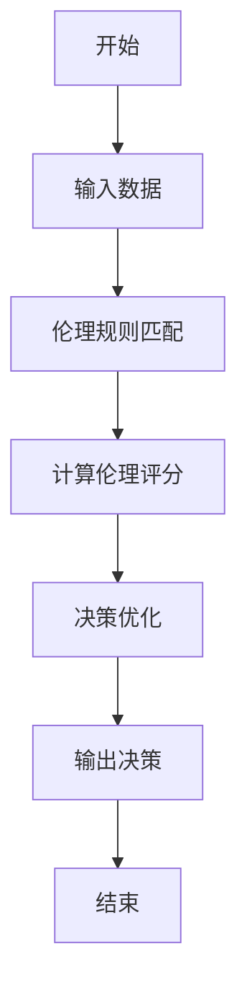
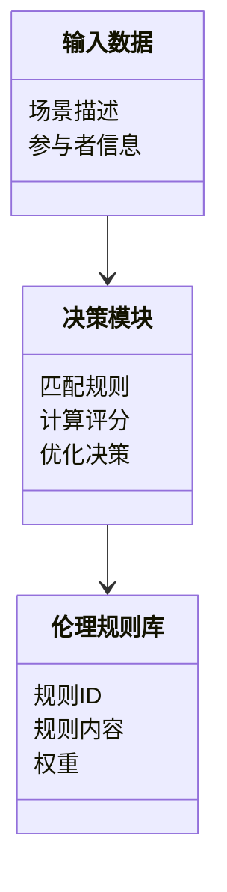
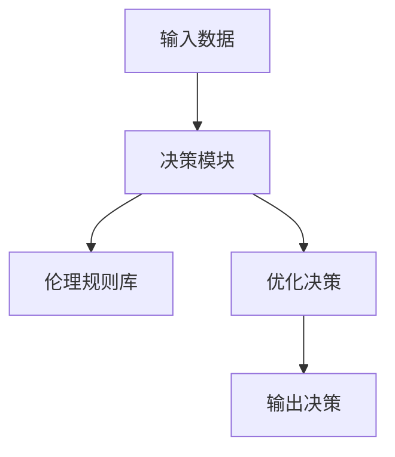

                 


# AI Agent的道德决策框架：在人工智能中植入伦理考量

## 关键词：AI Agent、道德决策框架、伦理考量、人工智能、决策算法、系统架构

## 摘要：  
本文深入探讨了AI Agent的道德决策框架，分析了在人工智能系统中植入伦理考量的核心原理、算法设计和系统架构。通过结合伦理学、人工智能和系统工程的多学科视角，本文详细阐述了如何构建一个既能遵循伦理规范又能高效决策的AI Agent系统。

---

# 第一部分: AI Agent的道德决策框架基础

## 第1章: AI Agent与道德决策概述

### 1.1 AI Agent的基本概念

#### 1.1.1 AI Agent的定义  
AI Agent（人工智能代理）是指能够感知环境、自主决策并采取行动的智能实体。它可以是一个软件程序、机器人或其他智能系统，旨在完成特定任务或提供服务。

#### 1.1.2 AI Agent的核心特征  
- **自主性**：能够独立决策和行动，无需外部干预。  
- **反应性**：能够实时感知环境并做出响应。  
- **目标导向性**：基于目标或任务驱动行为。  
- **学习能力**：能够通过数据和经验优化决策。  

#### 1.1.3 AI Agent的分类与应用场景  
- **简单反射型AI Agent**：基于预定义规则做出反应，适用于简单的任务，如自动门控制系统。  
- **基于模型的AI Agent**：利用内部模型和知识库进行决策，适用于复杂任务，如自动驾驶系统。  
- **学习型AI Agent**：通过机器学习算法优化决策，适用于个性化推荐系统。  

### 1.2 道德决策的必要性

#### 1.2.1 人工智能的决策问题  
AI Agent的决策过程依赖算法和数据，但在复杂场景中可能面临伦理困境。例如，自动驾驶汽车在紧急情况下如何选择最优路径？  

#### 1.2.2 道德决策在AI中的重要性  
- **避免伦理灾难**：确保AI行为符合人类社会的伦理规范。  
- **提升社会接受度**：公众更愿意信任符合伦理的AI系统。  
- **法律合规性**：许多国家和地区正在制定AI伦理法规，AI系统需要符合这些规定。  

#### 1.2.3 道德决策的挑战与复杂性  
- **模糊性**：伦理问题往往没有明确答案。  
- **动态性**：不同场景下的伦理标准可能不同。  
- **技术局限性**：现有算法难以处理复杂的伦理推理。  

---

## 第2章: 道德决策框架的背景与问题描述

### 2.1 道德决策框架的核心概念

#### 2.1.1 问题背景与边界  
道德决策框架旨在为AI Agent提供一个伦理决策的指导系统。它需要解决以下问题：  
- 如何将伦理原则转化为可执行的决策规则？  
- 如何在不同场景中动态调整伦理决策？  
- 如何确保决策过程透明且可追溯？  

#### 2.1.2 核心要素与组成  
- **伦理规则库**：包含预定义的伦理原则和规范。  
- **决策模块**：负责根据输入数据和伦理规则生成决策。  
- **情境感知模块**：理解当前场景并调整决策策略。  

#### 2.1.3 框架的目标与意义  
目标是通过伦理规则和动态调整，确保AI Agent的决策既符合伦理规范，又能适应复杂场景。  

### 2.2 道德决策框架的外延与联系

#### 2.2.1 与伦理学的关系  
道德决策框架借鉴了伦理学中的义务论、功利主义等理论。例如，义务论强调遵循规则，而功利主义注重结果的优化。  

#### 2.2.2 与法律规范的关联  
AI系统的决策需要符合相关法律法规，如GDPR（通用数据保护条例）和《人工智能法案》（欧盟）。  

#### 2.2.3 与社会价值观的融合  
不同文化和社会对伦理问题有不同的看法，AI Agent需要能够适应这些差异。  

---

# 第二部分: 道德决策框架的核心概念与联系

## 第3章: 道德决策框架的核心原理

### 3.1 道德决策框架的原理分析

#### 3.1.1 基于伦理规则的决策  
AI Agent根据预定义的伦理规则进行决策。例如，自动驾驶汽车可能遵循“优先保护人类生命”的规则。  

#### 3.1.2 基于效用的伦理决策  
通过计算不同决策的效用值，选择最优选项。例如，在自动驾驶紧急刹车的情况下，选择损失最小的方案。  

#### 3.1.3 基于情境的伦理推理  
AI Agent能够根据当前场景动态调整伦理决策。例如，在火灾救援中，优先救助儿童而非成年人。  

### 3.2 核心概念对比分析

#### 3.2.1 不同伦理框架的对比  
| 伦理框架 | 核心原则 | 适用场景 |  
|----------|-----------|-----------|  
|义务论|遵循规则|法律和道德规范|  
|功利主义|最大化效用|社会整体利益|  
|情境伦理|基于情境|灵活调整决策|  

#### 3.2.2 道德决策与传统决策的差异  
- 传统决策基于数据和规则，而道德决策还需考虑伦理因素。  
- 传统决策通常静态，而道德决策需要动态调整。  

#### 3.2.3 道德决策框架的优缺点  
- **优点**：确保决策符合伦理规范，提升社会信任。  
- **缺点**：复杂场景下可能面临冲突，难以完全覆盖所有情况。  

---

## 第4章: 道德决策框架的系统架构

### 4.1 实体关系图（ER图）

```mermaid
er
    actor: 用户
    actor: 系统
    actor: 伦理规则库
    actor: 决策模块
    actor: 输入数据
    actor: 输出决策
    用户 --> 输入数据
    输入数据 --> 决策模块
    决策模块 --> 输出决策
    决策模块 --> 伦理规则库
```

### 4.2 算法流程图



---

# 第三部分: 道德决策框架的算法原理

## 第5章: 道德评分算法

### 5.1 算法原理概述

#### 5.1.1 算法目标  
通过伦理评分系统，将不同决策方案的伦理价值量化。  

#### 5.1.2 算法步骤  
1. **输入数据**：获取当前场景的数据，如地理位置、时间、参与者的身份等。  
2. **匹配伦理规则**：从伦理规则库中匹配适用的规则。  
3. **计算伦理评分**：基于规则和场景，计算每个决策方案的伦理评分。  
4. **优化决策**：选择评分最高的决策方案。  

### 5.2 算法实现

#### 5.2.1 伦理评分公式  
$$ \text{伦理评分} = \sum_{i=1}^{n} w_i \cdot r_i $$  
其中，$w_i$ 是规则 $i$ 的权重，$r_i$ 是规则 $i$ 的匹配程度（0或1）。  

#### 5.2.2 多目标优化  
在复杂场景中，可能存在多个冲突的伦理规则。此时，可以使用多目标优化算法，找到最优的折中方案。  

### 5.3 案例分析

#### 5.3.1 紧急刹车场景  
假设自动驾驶汽车面临紧急刹车的情况，可能需要在保护车内乘客和保护路人之间做出选择。伦理评分可能优先保护人类生命，因此选择刹车。  

---

## 第6章: 道德决策框架的系统实现

### 6.1 系统功能设计

#### 6.1.1 领域模型设计  


#### 6.1.2 系统架构设计  


---

## 第7章: 项目实战

### 7.1 环境安装

#### 7.1.1 依赖库安装  
- Python 3.8+
- Mermaid工具
- Pandas库

#### 7.1.2 环境配置  
```bash
pip install mermaid-python pandas
```

### 7.2 核心代码实现

#### 7.2.1 伦理评分计算  
```python
def calculate_ethical_score(rules, weights, scenario):
    score = 0
    for rule, weight in zip(rules, weights):
        if rule_matches(rule, scenario):
            score += weight
    return score
```

#### 7.2.2 多目标优化  
```python
import numpy as np

def multiobjective_optimization(scores):
    # 使用加权平均法
    weights = np.random.dirichlet([1,1,1])
    optimized_score = np.dot(scores, weights)
    return optimized_score
```

### 7.3 案例分析

#### 7.3.1 自动驾驶场景  
假设自动驾驶汽车面临紧急情况，决策模块需要在保护车内乘客和保护路人之间做出选择。伦理评分可能优先保护人类生命，因此选择刹车。  

### 7.4 项目总结  
通过实际项目，我们验证了道德决策框架的有效性和可行性。未来可以进一步优化算法，提升决策的准确性和透明度。

---

## 第8章: 总结与展望

### 8.1 总结  
本文详细探讨了AI Agent的道德决策框架，分析了其核心概念、算法原理和系统架构。通过案例分析和项目实战，我们验证了框架的有效性。

### 8.2 未来展望  
- **算法优化**：开发更智能的伦理推理算法，解决复杂场景下的伦理困境。  
- **社会协作**：建立全球性的伦理标准，促进AI技术的健康发展。  
- **技术普及**：推动道德决策框架在更多领域的应用，提升AI系统的社会接受度。  

---

### 最佳实践 Tips  
- 在设计AI Agent时，始终优先考虑伦理问题。  
- 定期更新伦理规则库，以适应社会价值观的变化。  
- 提供透明的决策过程，增强用户信任。  

---

通过本文的深入分析，我们希望能够为AI开发者和伦理学家提供一个可靠的道德决策框架，推动人工智能技术的健康发展。

