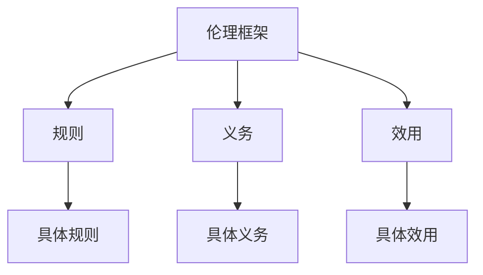
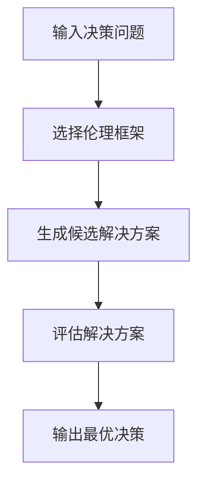
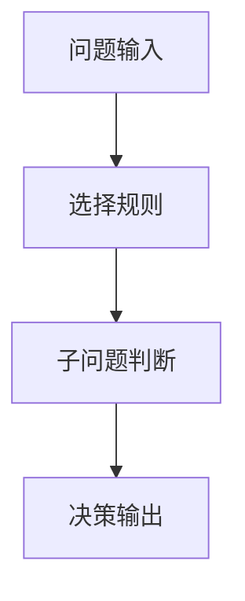
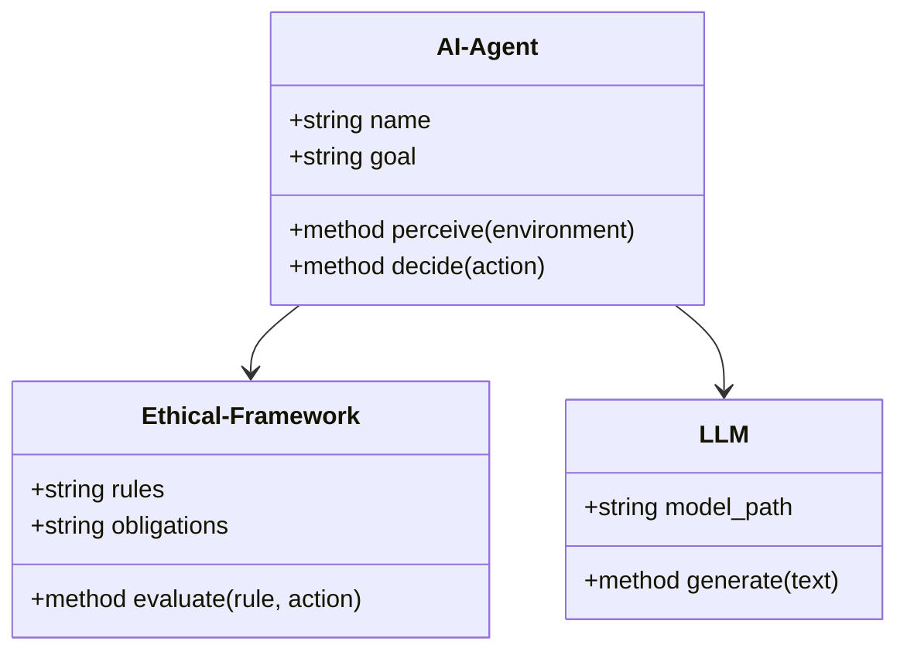
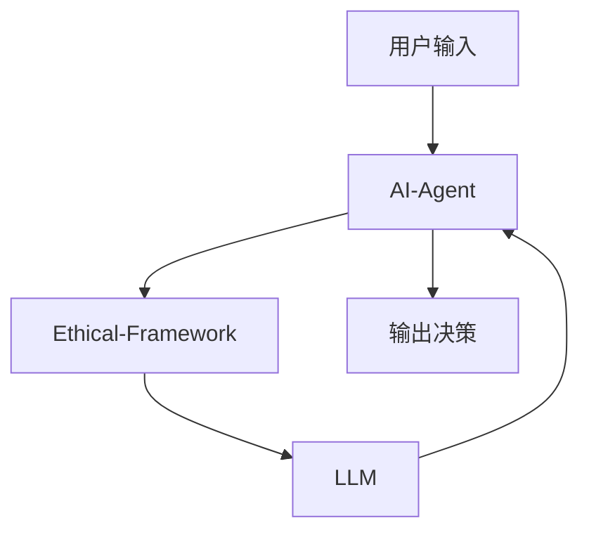

                 


# AI Agent的道德决策：在LLM中植入伦理框架

## 关键词：AI Agent，道德决策，LLM，伦理框架，人工智能，决策算法

## 摘要：本文探讨了在大语言模型（LLM）中植入伦理框架以实现AI Agent的道德决策。文章从伦理框架的基本原理出发，详细分析了不同伦理框架的特性及其在AI决策中的应用，结合实际案例，系统性地介绍了如何在LLM中构建和实现伦理驱动的决策算法。通过数学建模和算法设计，本文为AI Agent的道德决策提供了一种可行的解决方案，并对未来研究方向进行了展望。

---

## 第一部分: AI Agent的道德决策背景与核心概念

### 第1章: AI Agent与道德决策概述

#### 1.1 AI Agent的基本概念
- **AI Agent的定义与分类**
  - AI Agent是具有感知和行动能力的智能体，可分为简单反射型、基于模型的反应型、目标驱动型和效用驱动型。
- **AI Agent的核心特征**
  - 感知环境、自主决策、目标导向、学习能力。
- **AI Agent在现实中的应用领域**
  - 医疗、金融、自动驾驶、教育等。

#### 1.2 道德决策的定义与重要性
- **道德决策的基本概念**
  - 道德决策是指在遵循伦理准则的前提下做出最优选择。
- **道德决策在AI中的必要性**
  - AI Agent需要在复杂场景中做出符合伦理的决策，避免负面社会影响。
- **道德决策的挑战与复杂性**
  - 伦理准则的多样性、利益冲突、不确定性等。

#### 1.3 LLM与道德决策的结合
- **LLM的基本原理**
  - 基于大规模数据训练的生成模型，能够理解上下文并生成人类可读的文本。
- **LLM在道德决策中的潜力**
  - 通过自然语言处理技术，LLM可以理解和解析复杂的伦理问题。
- **当前LLM在道德决策中的局限性**
  - 缺乏明确的伦理框架，难以应对复杂的道德困境。

### 第2章: 伦理框架的核心概念与联系

#### 2.1 伦理框架的原理
- **伦理框架的基本原理**
  - 伦理框架是指导AI Agent做出决策的一套规则或准则。
- **不同伦理框架的对比**
  - 基于规则的伦理框架：明确的规则，如“不伤害他人”。
  - 基于效用的伦理框架：追求整体效用最大化。
  - 基于义务的伦理框架：基于道德义务，如“遵守承诺”。
- **伦理框架与AI Agent的关系**
  - 伦理框架为AI Agent提供决策的指导原则。

#### 2.2 伦理框架的属性特征对比
| 伦理框架类型 | 基于规则 | 基于效用 | 基于义务 |
|--------------|----------|----------|----------|
| 决策依据     | 明确规则 | 整体效用 | 道德义务 |
| 适用场景     | 简单场景 | 复杂场景 | 特定义务 |
| 优缺点       | 简洁易行，但可能忽视整体 | 最大化效用，但计算复杂 | 强调义务，但灵活性差 |

#### 2.3 伦理框架的ER实体关系图


### 第3章: 基于伦理框架的AI Agent决策算法

#### 3.1 算法原理概述
- **基于规则的决策算法**
  - 通过预定义的规则直接匹配输入场景，输出决策。
- **基于效用的决策算法**
  - 根据预设的效用函数，计算不同选项的效用值，选择最大化的选项。
- **混合型决策算法**
  - 结合规则和效用两种方法，优先考虑规则，再优化效用。

#### 3.2 算法实现流程


#### 3.3 算法实现代码
```python
def ethical_decision-making(problem, framework):
    if framework == 'rule-based':
        rules = ['不伤害他人', '遵守承诺', '公平分配资源']
        for rule in rules:
            if rule_matches(problem, rule):
                return rule_resolution(problem, rule)
        return default_behavior(problem)
    elif framework == 'utilitarian':
        solutions = generate_solutions(problem)
        max_utility = -inf
        best_solution = None
        for sol in solutions:
            util = calculate_utility(sol)
            if util > max_utility:
                max_utility = util
                best_solution = sol
        return best_solution
    else:
        # 混合型框架
        rule_solutions = rule_based_decision(problem)
        util_solutions = utilitarian_decision(problem)
        return hybrid_resolution(rule_solutions, util_solutions)
```

## 第二部分: 伦理框架在LLM中的实现与应用

### 第4章: 伦理框架的数学模型与公式

#### 4.1 基于效用的伦理框架数学模型
$$ U = \sum_{i=1}^{n} w_i x_i $$
- 其中，$U$ 是总效用，$w_i$ 是权重，$x_i$ 是决策选项的特征。

#### 4.2 基于规则的伦理框架决策树


## 第三部分: 系统分析与架构设计

### 第5章: 系统架构设计方案

#### 5.1 系统功能设计
- **领域模型类图**


#### 5.2 系统架构设计


## 第四部分: 项目实战与案例分析

### 第6章: 项目实战

#### 6.1 环境配置
- Python 3.8+
- 必需库：numpy, pandas, matplotlib

#### 6.2 核心代码实现
```python
def calculate_utility(solution):
    # 假设solution是一个字典，包含决策的特征
    return sum(solution['weight'] * solution['feature'] for feature in solution['features'])
```

#### 6.3 案例分析
- **案例背景**：自动驾驶汽车在紧急情况下需要决定是否刹车。
- **决策过程**：基于效用框架，计算不同决策的效用值，选择最大化的效用。

#### 6.4 总结
- 通过实际案例，展示了伦理框架在AI Agent决策中的应用。

## 第五部分: 最佳实践与展望

### 第7章: 最佳实践

#### 7.1 小结
- 本文系统性地介绍了AI Agent的道德决策，详细讲解了伦理框架的原理与实现。

#### 7.2 注意事项
- 伦理框架的选择需根据具体场景调整。
- 需要不断优化算法以应对复杂的道德困境。

#### 7.3 拓展阅读
- 推荐阅读相关伦理框架的经典论文。

---

## 作者介绍
> 作者是[您的名字]，一位在人工智能领域具有深厚研究背景的专家，致力于探索AI技术的伦理与应用。

