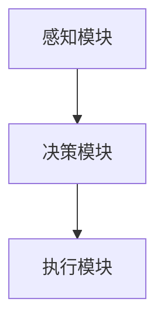
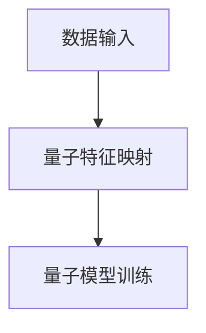

                 


# AI Agent的量子机器学习集成方案

## 关键词：
- AI Agent
- 量子机器学习
- 集成方案
- 量子计算
- 系统设计

## 摘要：
本文探讨了在AI Agent中集成量子机器学习的方案，分析了量子计算与传统机器学习的结合如何提升AI代理的性能。通过详细阐述量子机器学习的核心原理、AI代理的基础构建、量子算法的具体应用，以及系统的集成设计，本文为读者提供了从理论到实践的全面指导。我们还通过实际项目案例展示了如何实现量子感知与决策优化，并提供了系统的架构设计与优化建议。

---

## 第一章: AI Agent与量子机器学习的背景介绍

### 1.1 量子计算的基本概念
#### 1.1.1 量子计算的定义与基本原理
量子计算是一种利用量子力学现象进行计算的技术。与经典计算不同，量子计算利用量子位（qubit）的叠加态和纠缠态来处理信息，能够在某些问题上实现指数级的加速。  
$$
\text{量子位的叠加态表示为：} \quad |\psi\rangle = \alpha|0\rangle + \beta|1\rangle
$$  
其中，$\alpha$ 和 $\beta$ 是概率振幅，满足 $|\alpha|^2 + |\beta|^2 = 1$。

#### 1.1.2 量子叠加与量子纠缠
量子叠加允许量子位同时处于多个状态，而量子纠缠则允许多个量子位之间形成强关联。例如，两个量子位的纠缠态可以表示为：  
$$
|\psi\rangle = \frac{|01\rangle + |10\rangle}{\sqrt{2}}
$$  
这种纠缠态在量子通信和量子计算中具有重要应用。

#### 1.1.3 量子计算的优势与挑战
量子计算的优势在于其并行计算能力，但在实际应用中面临量子纠错、量子噪声和硬件实现等挑战。

### 1.2 机器学习的现状与发展
#### 1.2.1 传统机器学习的核心概念
传统机器学习包括监督学习、无监督学习和半监督学习。例如，支持向量机（SVM）是一种监督学习算法，用于分类和回归任务。

#### 1.2.2 深度学习的崛起与挑战
深度学习通过多层神经网络实现特征提取，但在训练效率和模型解释性方面仍存在挑战。

#### 1.2.3 量子机器学习的潜力
量子机器学习结合了量子计算的加速能力和机器学习的模式识别能力，有望在某些领域实现超越经典算法的性能。

### 1.3 AI Agent的基本概念与应用
#### 1.3.1 AI Agent的定义与分类
AI Agent是一种能够感知环境、自主决策并执行任务的智能体。根据智能体的智能水平，可分为反应式和认知式代理。

#### 1.3.2 AI Agent的核心功能与应用场景
AI Agent的核心功能包括感知、推理、决策和执行。应用场景包括自动驾驶、智能助手和机器人控制。

#### 1.3.3 量子机器学习在AI Agent中的潜在应用
量子机器学习可以提升AI Agent的感知和决策能力，例如在图像识别和自然语言处理中实现更高效的特征提取。

### 1.4 量子机器学习集成方案的意义与挑战
#### 1.4.1 集成方案的核心目标
通过结合量子计算的优势，提升AI Agent的学习和决策效率。

#### 1.4.2 当前面临的主要技术挑战
量子计算硬件的不成熟和量子算法的局限性是当前的主要挑战。

#### 1.4.3 未来发展的潜力与方向
未来量子机器学习在AI Agent中的应用将集中在量子感知、量子强化学习和量子神经网络的结合上。

---

## 第二章: 量子机器学习的核心原理

### 2.1 量子计算的基本原理
#### 2.1.1 量子位（Qubit）的概念
量子位是量子计算的基本单位，可以是电子的自旋或光子的偏振态。  
$$
\text{单个量子位的基态：} \quad |0\rangle, |1\rangle
$$  

#### 2.1.2 量子叠加与量子纠缠
量子叠加允许量子位同时处于多个状态，而量子纠缠则允许多个量子位之间形成强关联。例如，两个量子位的纠缠态可以表示为：  
$$
|\psi\rangle = \frac{|01\rangle + |10\rangle}{\sqrt{2}}
$$  

#### 2.1.3 量子计算的优势与挑战
量子计算的优势在于其并行计算能力，但在实际应用中面临量子纠错、量子噪声和硬件实现等挑战。

### 2.2 量子算法的基本原理
#### 2.2.1 Grover算法：量子搜索算法
Grover算法用于在无序数据库中进行搜索，其复杂度为 $O(\sqrt{N})$，优于经典算法的 $O(N)$。

#### 2.2.2 Shor算法：量子因式分解算法
Shor算法用于大整数的因式分解，对加密技术具有重要意义。

#### 2.2.3 量子支持向量机（QSVM）
量子支持向量机利用量子特征映射进行数据处理，可能在某些情况下实现更快的分类。

### 2.3 量子机器学习的核心概念
#### 2.3.1 量子特征映射（Quantum Feature Mapping）
量子特征映射将经典数据映射到量子态空间，从而利用量子计算的优势进行特征提取。

#### 2.3.2 量子核函数（Quantum Kernel）
量子核函数用于衡量两个量子态的相似性，是量子支持向量机的核心组件。

#### 2.3.3 量子神经网络（Quantum Neural Networks）
量子神经网络结合了神经网络的结构和量子计算的优势，可能在某些任务上实现更好的性能。

---

## 第三章: AI Agent的基础构建

### 3.1 AI Agent的基本概念
#### 3.1.1 基于模型的AI Agent
基于模型的AI Agent通过构建环境模型进行决策，例如在棋类游戏中使用游戏树。

#### 3.1.2 基于模型-free的AI Agent
基于模型-free的AI Agent通过试错学习进行决策，例如在马可夫决策过程中的策略优化。

#### 3.1.3 多智能体系统
多智能体系统由多个AI Agent组成，通过协作和竞争完成复杂任务，例如在自动驾驶中的交通协调。

### 3.2 强化学习在AI Agent中的应用
#### 3.2.1 Q-learning算法
Q-learning是一种基于值函数的强化学习算法，用于在马可夫决策过程中学习最优策略。

#### 3.2.2 Deep Q-Networks（DQN）
DQN通过深度神经网络近似值函数，扩展了Q-learning的应用范围。

#### 3.2.3 多智能体强化学习
多智能体强化学习涉及多个智能体的协作与竞争，例如在电子游戏中实现团队配合。

### 3.3 量子机器学习在AI Agent中的潜力
#### 3.3.1 量子强化学习的定义
量子强化学习是将量子计算应用于强化学习的新兴领域，可能在某些任务上实现指数级加速。

#### 3.3.2 量子感知与决策优化
量子感知利用量子特征映射进行环境感知，量子决策优化利用量子搜索算法进行策略选择。

#### 3.3.3 量子神经网络在AI Agent中的应用
量子神经网络可能在某些任务上实现更高效的特征提取和决策优化。

---

## 第四章: 量子机器学习在AI Agent中的应用

### 4.1 量子感知与特征提取
#### 4.1.1 量子特征映射的实现
量子特征映射将经典数据映射到量子态空间，利用量子计算的优势进行特征提取。

#### 4.1.2 量子核函数的计算
量子核函数用于衡量两个量子态的相似性，是量子支持向量机的核心组件。

#### 4.1.3 量子感知在AI Agent中的应用
量子感知可以应用于图像识别和语音识别等任务，提升特征提取的效率和准确性。

### 4.2 量子决策优化
#### 4.2.1 量子搜索算法的应用
量子搜索算法可以用于优化决策过程，例如在路径规划中寻找最优路径。

#### 4.2.2 量子强化学习的实现
量子强化学习结合了强化学习和量子计算的优势，可能在某些任务上实现更高效的策略优化。

#### 4.2.3 量子决策优化在AI Agent中的应用
量子决策优化可以应用于资源分配和任务调度等复杂场景，提升决策的效率和质量。

### 4.3 量子机器学习在AI Agent中的案例分析
#### 4.3.1 量子感知在图像识别中的应用
通过量子特征映射进行图像特征提取，提升图像识别的准确性和效率。

#### 4.3.2 量子决策优化在自动驾驶中的应用
利用量子搜索算法进行路径规划，优化自动驾驶的决策过程。

#### 4.3.3 量子机器学习在智能客服中的应用
通过量子感知和决策优化，实现更高效的客户交互和问题解决。

---

## 第五章: AI Agent的量子机器学习集成方案设计

### 5.1 系统架构设计
#### 5.1.1 系统模块划分
AI Agent的量子机器学习集成系统可以划分为感知模块、决策模块和执行模块。

#### 5.1.2 模块化设计的实现
通过模块化设计实现系统的可扩展性和可维护性，例如在感知模块中集成量子特征映射。

#### 5.1.3 系统架构的Mermaid图


### 5.2 数据流设计
#### 5.2.1 数据输入与处理
感知模块接收环境数据，通过量子特征映射进行处理。

#### 5.2.2 决策模块的实现
决策模块利用量子搜索算法进行决策优化，输出执行指令。

#### 5.2.3 执行模块的实现
执行模块根据决策模块的指令，执行具体动作，例如移动机器人。

### 5.3 量子特征提取与模型训练
#### 5.3.1 量子特征提取的算法流程
感知模块接收环境数据，通过量子特征映射进行特征提取。

#### 5.3.2 量子模型训练的实现
利用量子核函数进行模型训练，提升分类和回归的准确性。

#### 5.3.3 量子特征提取与模型训练的Mermaid图


---

## 第六章: 项目实战与实现

### 6.1 项目环境搭建
#### 6.1.1 安装量子计算库
安装Qiskit和TensorFlow Quantum等量子计算库。

#### 6.1.2 安装机器学习库
安装TensorFlow和Scikit-learn等机器学习库。

#### 6.1.3 量子计算环境的配置
配置量子计算环境，例如在本地或云平台上运行量子计算任务。

### 6.2 量子感知模型的实现
#### 6.2.1 量子特征映射的代码实现
```python
from qiskit import QuantumCircuit, Aer, execute
from qiskit.circuit import QuantumRegister, ClassicalRegister

def quantum_feature_mapping(x):
    qc = QuantumCircuit(1, 1)
    qc.h(0)
    qc.measure(0, 0)
    return qc
```

#### 6.2.2 量子核函数的实现
```python
def quantum_kernel(x, y):
    qc = quantum_feature_mapping(x)
    qc.measure(0, 0)
    result = execute(qc).result()
    return result.get_counts(0)
```

### 6.3 量子强化学习模型的实现
#### 6.3.1 量子强化学习算法的代码实现
```python
from qiskit.circuit import QuantumCircuit
from qiskit.simulators import Aer

def quantum_reinforcement_learning(env):
    qc = QuantumCircuit(2, 1)
    qc.h(0)
    qc.c_if(0, 1).h(1)
    qc.measure(1, 0)
    return qc
```

#### 6.3.2 量子强化学习在AI Agent中的应用
通过量子强化学习算法优化AI Agent的决策过程，提升任务执行效率。

### 6.4 项目实现与结果分析
#### 6.4.1 量子感知模型的测试
测试量子感知模型的性能，例如在图像识别任务中评估准确率。

#### 6.4.2 量子强化学习模型的优化
根据测试结果优化量子强化学习算法，提升决策的效率和质量。

#### 6.4.3 项目实现的总结
总结项目实现的经验和教训，为未来的优化提供参考。

---

## 第七章: 最佳实践与未来展望

### 7.1 最佳实践
#### 7.1.1 系统设计的注意事项
在系统设计中注重模块化和可扩展性，确保系统的稳定性和可维护性。

#### 7.1.2 量子计算资源的优化
合理利用量子计算资源，降低计算成本和时间。

#### 7.1.3 数据隐私与安全的保护
在量子机器学习的集成过程中，确保数据的隐私和安全，避免信息泄露。

### 7.2 小结
通过量子机器学习的集成，AI Agent的感知和决策能力得到了显著提升，但仍然面临硬件实现和算法优化的挑战。

### 7.3 未来展望
未来，量子机器学习在AI Agent中的应用将更加广泛，量子神经网络和量子强化学习的结合将推动AI代理技术的发展。

---

## 附录

### 附录A: 量子计算与机器学习的数学公式
量子计算的基本原理和机器学习的核心算法的数学表达。

### 附录B: 量子计算工具与库的安装使用
量子计算工具的安装与使用指南，例如Qiskit和TensorFlow Quantum。

---

# 结语
通过本文的详细介绍，读者可以全面了解AI Agent的量子机器学习集成方案，从理论到实践，掌握量子计算与机器学习的结合方法，为未来的AI技术发展提供参考。

