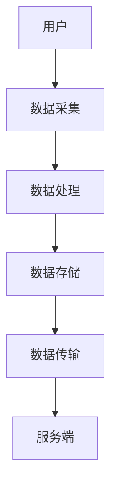

                 


# AI Agent的隐私保护措施：用户数据安全

## 关键词：AI Agent，隐私保护，用户数据安全，数据加密，隐私算法，系统架构

## 摘要：本文深入探讨AI Agent在用户数据安全中的隐私保护措施。从数据加密、匿名化处理到系统架构设计，分析如何有效保护用户隐私。通过实际案例和最佳实践，为技术从业者提供实用的指导和参考。

---

# 第一部分: AI Agent的隐私保护背景与核心概念

## 第1章: AI Agent与隐私保护概述

### 1.1 AI Agent的基本概念

#### 1.1.1 AI Agent的定义与特点
AI Agent（人工智能代理）是一种能够感知环境、自主决策并执行任务的智能实体。它结合了机器学习、自然语言处理和自动化技术，能够以用户为中心提供智能化服务。AI Agent的特点包括：
- **自主性**：无需人工干预，自主完成任务。
- **反应性**：能够实时感知环境变化并做出反应。
- **目标导向**：以特定目标为导向，优化决策过程。
- **学习能力**：通过数据学习和优化自身行为。

#### 1.1.2 AI Agent在现代信息技术中的地位
AI Agent作为智能系统的组成部分，广泛应用于推荐系统、智能助手、自动驾驶等领域。它通过处理大量用户数据，提供个性化服务，但也因此成为数据泄露的主要风险之一。

#### 1.1.3 隐私保护的重要性与挑战
随着AI Agent的普及，用户数据的收集和使用变得更加频繁。数据泄露可能导致严重的隐私问题，如身份盗窃、信息滥用等。隐私保护的挑战在于如何在提供个性化服务的同时，确保用户数据的安全。

### 1.2 隐私保护的核心问题

#### 1.2.1 用户数据安全的定义
用户数据安全是指通过技术手段确保用户数据的机密性、完整性和可用性。机密性指只有授权方能访问数据；完整性指数据在存储和传输过程中不被篡改；可用性指数据在合法授权下可随时访问。

#### 1.2.2 数据泄露的常见场景
- **未授权访问**：恶意攻击者通过漏洞获取用户数据。
- **数据滥用**：合法授权方在未经授权的情况下使用数据。
- **数据传输过程中的泄露**：数据在传输过程中被截获或篡改。

#### 1.2.3 隐私保护的目标与边界
隐私保护的目标是在不影响服务的前提下，最大限度地保护用户数据。其边界包括数据的收集范围、存储方式、使用目的以及授权范围。

### 1.3 数据安全的基本原则

#### 1.3.1 数据最小化原则
数据最小化原则要求仅收集实现服务所需的最小数据量，避免不必要的数据暴露。

#### 1.3.2 数据匿名化处理
数据匿名化是通过技术手段将数据中的个人身份信息去除，使其无法被重新识别的过程。常见的匿名化技术包括数据脱敏和数据加密。

#### 1.3.3 数据访问控制机制
数据访问控制机制通过身份验证、权限管理和访问日志记录，确保只有授权用户才能访问敏感数据。

### 1.4 本章小结
本章介绍了AI Agent的基本概念及其在现代信息技术中的地位，分析了隐私保护的重要性与挑战，并提出了数据安全的基本原则。这些内容为后续的技术细节分析奠定了基础。

---

# 第二部分: AI Agent隐私保护的核心技术

## 第2章: 数据加密与隐私保护

### 2.1 数据加密技术

#### 2.1.1 对称加密算法
对称加密算法是一种使用同一密钥进行加密和解密的技术。常见的对称加密算法包括AES（高级加密标准）和DES（数据加密标准）。

- **AES加密流程**：
  1. 将明文填充为固定长度的块。
  2. 使用密钥生成加密密钥。
  3. 对每个块进行加密，生成密文。

  ```mermaid
  graph TD
      A[明文] --> B[填充] --> C[加密] --> D[密文]
  ```

- **数学模型**：
  $$ C = E(k, P) $$
  其中，C为密文，E为加密函数，k为密钥，P为明文。

#### 2.1.2 非对称加密算法
非对称加密算法使用公钥和私钥进行加密和解密。公钥用于加密，私钥用于解密。常见的非对称加密算法包括RSA和 ECC（椭圆曲线加密）。

- **RSA加密流程**：
  1. 生成公钥和私钥对。
  2. 使用公钥对明文进行加密。
  3. 使用私钥对密文进行解密。

  ```mermaid
  graph TD
      A[明文] --> B[公钥加密] --> C[密文] --> D[私钥解密] --> E[明文]
  ```

- **数学模型**：
  $$ C = E(pub, P) $$
  $$ P = D(priv, C) $$

#### 2.1.3 加密算法的选择与应用
选择加密算法时需要考虑安全性、计算效率和应用场景。对称加密适用于大量数据的加密，而非对称加密适用于数字签名和身份验证。

### 2.2 同态加密原理

#### 2.2.1 同态加密的定义
同态加密是一种允许在密文上进行计算，而不必解密就能得到与明文计算相同结果的加密技术。

- **同态加密的数学模型**：
  $$ E(x \cdot y) = E(x) \cdot E(y) $$
  其中，x和y为明文，E(x)和E(y)为对应的密文。

- **应用场景**：
  - 数据聚合：在不泄露原始数据的情况下进行数据汇总。
  - 数据分析：在加密状态下进行统计分析。

#### 2.2.2 同态加密的实现步骤
1. 生成公钥和私钥对。
2. 对明文进行加密，生成密文。
3. 在密文上进行计算，得到结果。
4. 使用私钥对结果进行解密，得到明文结果。

  ```mermaid
  graph TD
      A[明文] --> B[公钥加密] --> C[密文] --> D[计算] --> E[结果] --> F[私钥解密] --> G[明文结果]
  ```

#### 2.2.3 同态加密的应用场景
- 医疗数据共享：在不泄露患者隐私的前提下，进行群体数据分析。
- 金融数据隐私保护：在加密状态下进行金融数据分析。

### 2.3 数据加密的实现步骤

#### 2.3.1 数据加密前的准备
- 确定加密算法和密钥长度。
- 对数据进行预处理（如填充）。

#### 2.3.2 加密过程
- 使用选定的加密算法对数据进行加密。
- 生成加密后的密文。

#### 2.3.3 解密过程
- 使用对应的密钥对密文进行解密，恢复原始数据。

  ```mermaid
  graph TD
      A[明文] --> B[加密算法] --> C[密文] --> D[解密算法] --> E[明文]
  ```

### 2.4 本章小结
本章详细介绍了数据加密技术，包括对称加密和非对称加密算法，以及同态加密的原理和应用场景。通过加密技术可以有效保护用户数据的安全性。

---

## 第3章: 数据匿名化与隐私保护

### 3.1 数据匿名化的概念与方法

#### 3.1.1 数据匿名化的定义
数据匿名化是通过技术手段去除数据中的个人身份信息，使其无法被重新识别的过程。

#### 3.1.2 数据匿名化的常用方法
- **数据脱敏**：对敏感数据进行修改或删除，使其无法被还原。
- **数据混淆**：通过随机化技术打乱数据的顺序或内容。

### 3.2 数据匿名化的实现步骤

#### 3.2.1 数据脱敏
- 对敏感字段进行脱敏处理，如替换、删除或加密。
- 示例：将姓名替换为随机字符串。

  ```python
  def anonymize_data(data):
      # 假设data是包含姓名的列表
      anonymized = []
      for name in data:
          # 使用哈希函数生成随机字符串
          anonymized_name = hash(name)
          anonymized.append(anonymized_name)
      return anonymized
  ```

#### 3.2.2 数据混淆
- 对数据进行随机化处理，如打乱顺序或添加噪声。
- 示例：对年龄数据添加随机噪声。

  ```python
  import random
  def add_noise(age):
      noise = random.uniform(-1, 1)
      return age + noise
  ```

### 3.3 数据匿名化的应用场景

#### 3.3.1 数据共享
在数据共享场景中，匿名化处理可以有效保护用户隐私，同时允许数据的共享和分析。

#### 3.3.2 数据发布
在公开发布数据时，匿名化处理可以防止用户身份被泄露。

### 3.4 本章小结
本章介绍了数据匿名化的概念与方法，并详细讲解了数据脱敏和数据混淆的实现步骤。通过匿名化技术可以在保护用户隐私的前提下，实现数据的共享和分析。

---

## 第4章: 数据访问控制与隐私保护

### 4.1 数据访问控制的原理

#### 4.1.1 身份验证
通过验证用户身份，确保只有合法用户才能访问数据。

#### 4.1.2 权限管理
根据用户角色和权限，限制数据的访问范围。

### 4.2 数据访问控制的实现步骤

#### 4.2.1 身份验证
- 使用用户名和密码、OAuth、JWT等进行身份验证。
- 示例：使用JWT进行身份验证。

  ```python
  import jwt
  def generate_token(user_id, secret_key):
      payload = {
          'user_id': user_id,
          'exp': datetime.utcnow() + timedelta(hours=24)
      }
      token = jwt.encode(payload, secret_key, algorithm='HS256')
      return token
  ```

#### 4.2.2 权限管理
- 基于角色的访问控制（RBAC）和基于属性的访问控制（ABAC）。
- 示例：RBAC实现。

  ```python
  class Role:
      def __init__(self, name, permissions):
          self.name = name
          self.permissions = permissions

  class User:
      def __init__(self, id, role):
          self.id = id
          self.role = role

  class Permission:
      def __init__(self, name):
          self.name = name
  ```

### 4.3 数据访问控制的应用场景

#### 4.3.1 用户数据访问
确保用户只能访问其授权范围内的数据。

#### 4.3.2 第三方访问控制
在API接口中，通过访问令牌限制第三方的访问权限。

### 4.4 本章小结
本章详细讲解了数据访问控制的原理与实现步骤，包括身份验证和权限管理。通过数据访问控制技术，可以有效防止未授权访问，保护用户隐私。

---

## 第5章: AI Agent隐私保护的系统架构设计

### 5.1 系统架构设计

#### 5.1.1 系统组成
- 数据采集模块：负责收集用户数据。
- 数据处理模块：对数据进行加密和匿名化处理。
- 数据存储模块：存储加密后的数据。
- 数据传输模块：通过安全通道传输数据。

  ```mermaid
  graph TD
      A[用户] --> B[数据采集] --> C[数据处理] --> D[数据存储] --> E[数据传输] --> F[服务端]
  ```

#### 5.1.2 系统设计原则
- 数据安全第一：优先考虑数据的机密性、完整性和可用性。
- 最小化数据暴露：仅收集必要的数据。
- 可扩展性：系统设计应具备扩展性，以适应未来的隐私保护需求。

### 5.2 系统接口设计

#### 5.2.1 数据采集接口
- 接口名称：`collect_data`
- 请求参数：`user_id`, `data_type`
- 响应：`encrypted_data`

  ```python
  def collect_data(user_id, data_type):
      # 数据采集逻辑
      return encrypted_data
  ```

#### 5.2.2 数据处理接口
- 接口名称：`process_data`
- 请求参数：`encrypted_data`
- 响应：`processed_data`

  ```python
  def process_data(encrypted_data):
      # 数据处理逻辑
      return processed_data
  ```

### 5.3 系统交互流程

#### 5.3.1 用户发起请求
用户向AI Agent发起请求，数据采集模块收集用户数据。

#### 5.3.2 数据处理
数据处理模块对数据进行加密和匿名化处理，确保数据安全。

#### 5.3.3 数据传输
处理后的数据通过安全通道传输到服务端，供后续使用。

  ```mermaid
  graph TD
      A[用户请求] --> B[数据采集] --> C[数据处理] --> D[数据传输] --> E[服务端处理]
  ```

### 5.4 本章小结
本章详细讲解了AI Agent隐私保护的系统架构设计，包括系统组成、设计原则和接口设计。通过合理的系统架构设计，可以有效保护用户数据的安全。

---

## 第6章: 项目实战：基于AI Agent的用户数据隐私保护系统

### 6.1 项目背景

#### 6.1.1 项目目标
开发一个基于AI Agent的用户数据隐私保护系统，实现数据的加密、匿名化处理和访问控制。

#### 6.1.2 项目需求
- 数据加密：对用户数据进行加密处理。
- 数据匿名化：去除用户身份信息。
- 数据访问控制：确保只有授权用户才能访问数据。

### 6.2 项目实现

#### 6.2.1 环境配置
- 安装必要的库：`PyJWT`, `cryptography`, `pandas`.

  ```bash
  pip install pyjwt cryptography pandas
  ```

#### 6.2.2 核心代码实现

##### 1. 数据加密模块

  ```python
  import jwt
  from cryptography.fernet import Fernet

  def generate_encryption_key():
      key = Fernet.generate_key()
      return key

  def encrypt_data(data, key):
      cipher = Fernet(key)
      encrypted_data = cipher.encrypt(data.encode())
      return encrypted_data

  def decrypt_data(encrypted_data, key):
      cipher = Fernet(key)
      decrypted_data = cipher.decrypt(encrypted_data).decode()
      return decrypted_data
  ```

##### 2. 数据匿名化模块

  ```python
  import random

  def anonymize_data(data):
      # 假设data是包含姓名和年龄的列表
      anonymized = []
      for item in data:
          # 对姓名进行哈希处理
          anonymized_name = hash(item['name'])
          # 对年龄添加随机噪声
          noise = random.uniform(-1, 1)
          anonymized_age = item['age'] + noise
          anonymized.append({
              'name': anonymized_name,
              'age': anonymized_age
          })
      return anonymized
  ```

##### 3. 数据访问控制模块

  ```python
  import jwt

  def generate_token(user_id, secret_key):
      payload = {
          'user_id': user_id,
          'exp': datetime.utcnow() + timedelta(hours=24)
      }
      token = jwt.encode(payload, secret_key, algorithm='HS256')
      return token

  def verify_token(token, secret_key):
      try:
          payload = jwt.decode(token, secret_key, algorithms=['HS256'])
          return True, payload
      except jwt.ExpiredSignatureError:
          return False, None
  ```

#### 6.2.3 代码功能解读与分析
- 数据加密模块：使用Fernet库对数据进行加密和解密。
- 数据匿名化模块：通过对姓名进行哈希处理，年龄添加噪声，实现数据匿名化。
- 数据访问控制模块：使用JWT进行身份验证，确保只有授权用户才能访问数据。

### 6.3 实际案例分析

#### 6.3.1 案例场景
- 用户向AI Agent发送请求，系统需要对用户数据进行加密、匿名化处理，并通过身份验证。

#### 6.3.2 案例实现步骤
1. 用户发起请求，携带用户数据。
2. 数据采集模块收集用户数据。
3. 数据处理模块对数据进行加密和匿名化处理。
4. 数据传输模块将处理后的数据传输到服务端。
5. 服务端验证用户身份，处理请求并返回结果。

### 6.4 本章小结
本章通过一个实际案例，详细讲解了基于AI Agent的用户数据隐私保护系统的实现过程。通过代码实现和案例分析，帮助读者更好地理解如何在实际项目中应用隐私保护技术。

---

## 第7章: 总结与最佳实践

### 7.1 总结

#### 7.1.1 核心内容回顾
- 数据加密技术：对称加密、非对称加密、同态加密。
- 数据匿名化技术：数据脱敏、数据混淆。
- 数据访问控制：身份验证、权限管理。

#### 7.1.2 技术要点总结
- 数据安全是AI Agent隐私保护的核心。
- 各种隐私保护技术各有优缺点，需根据实际需求选择合适的方案。

### 7.2 最佳实践

#### 7.2.1 技术选择建议
- 对于大量数据加密，推荐使用对称加密算法。
- 对于身份验证，推荐使用JWT。
- 对于数据共享，推荐使用同态加密。

#### 7.2.2 开发注意事项
- 数据加密前，确保数据已匿名化处理。
- 数据访问控制需结合身份验证和权限管理。
- 定期进行安全测试和漏洞扫描。

### 7.3 小结
通过本文的介绍，读者可以全面了解AI Agent的隐私保护措施，并能够在实际项目中应用这些技术。未来，随着技术的发展，隐私保护将更加重要，我们需要不断创新和改进，以应对新的挑战。

---

# 附录

## 附录A: 常见隐私保护技术对比表

| 技术名称         | 描述                                                                 | 优点                              | 缺点                              |
|------------------|----------------------------------------------------------------------|-----------------------------------|-----------------------------------|
| 对称加密         | 使用同一密钥进行加密和解密                                           | 计算效率高                         | 密钥管理复杂                     |
| 非对称加密       | 使用公钥加密和私钥解密                                               | 安全性高                           | 计算效率低                       |
| 同态加密         | 在密文上进行计算，无需解密                                           | 保护数据隐私                      | 实现复杂                        |
| 数据脱敏         | 去除或修改敏感数据                                                   | 简单易实现                       | 无法还原                         |
| 数据混淆         | 打乱数据顺序或添加噪声                                             | 难以被还原                       | 数据准确性降低                 |

## 附录B: 系统架构设计图



## 附录C: 数据加密算法实现代码

```python
from cryptography.fernet import Fernet

def generate_encryption_key():
    key = Fernet.generate_key()
    return key

def encrypt_data(data, key):
    cipher = Fernet(key)
    encrypted_data = cipher.encrypt(data.encode())
    return encrypted_data

def decrypt_data(encrypted_data, key):
    cipher = Fernet(key)
    decrypted_data = cipher.decrypt(encrypted_data).decode()
    return decrypted_data
```

---

通过以上详细的内容，本文全面介绍了AI Agent的隐私保护措施，从理论到实践，为技术从业者提供了深入的指导和参考。

