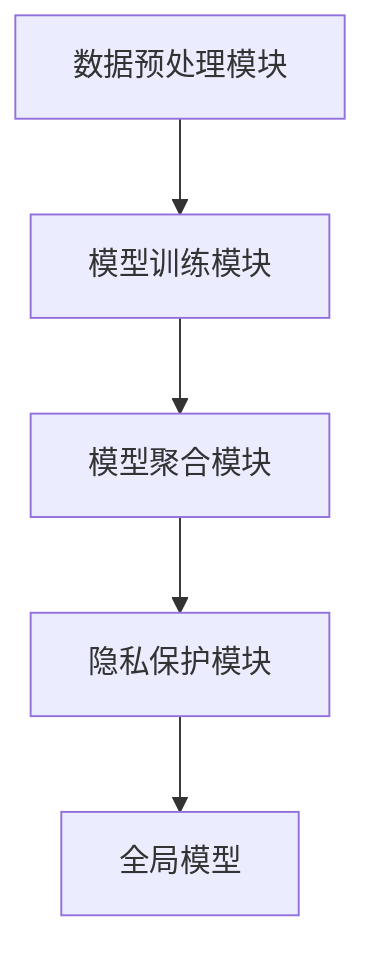

                 


# AI Agent的隐私保护联邦学习：数据不出本地的协作训练

## 关键词：隐私保护、联邦学习、AI Agent、数据安全、协作训练

## 摘要：  
本文探讨了AI Agent在隐私保护下的联邦学习技术，提出了一种数据不出本地的协作训练方法。通过分析联邦学习的核心原理、隐私保护的关键技术，以及AI Agent在协作训练中的角色，本文详细讲解了如何在保护数据隐私的前提下实现模型的联合训练。文章从理论背景到算法实现，从系统架构到项目实战，全面剖析了隐私保护联邦学习的实现细节，并通过实际案例展示了其应用场景和优势。  

---

## 第一部分：背景介绍

### 第1章：联邦学习与隐私保护概述

#### 1.1 联邦学习的基本概念  
联邦学习（Federated Learning）是一种分布式机器学习技术，允许多个数据拥有者在不共享原始数据的情况下，协作训练一个共同的模型。其核心思想是“数据不动，模型动”，即数据保留在本地，只有模型参数在服务器和客户端之间传输。  

#### 1.2 隐私保护的重要性  
在数据驱动的今天，隐私保护已成为企业和个人的重中之重。联邦学习通过避免数据集中共享，有效降低了数据泄露的风险，但其安全性仍需进一步保障。  

#### 1.3 AI Agent在协作训练中的角色  
AI Agent作为智能代理，在联邦学习中承担数据处理、模型训练和通信协调的任务。通过AI Agent的智能化决策，可以实现更高效的协作训练和更严格的隐私保护。  

#### 1.4 本章小结  
本章介绍了联邦学习的基本概念、隐私保护的重要性，以及AI Agent在协作训练中的角色，为后续内容奠定了基础。  

---

## 第二部分：核心概念与联系

### 第2章：隐私保护联邦学习的核心概念与联系

#### 2.1 联邦学习的核心原理  
联邦学习通过分布式优化算法，在多个客户端之间同步模型参数，最终得到一个全局模型。其关键步骤包括数据预处理、模型初始化、本地训练和模型聚合。  

#### 2.2 隐私保护的关键技术  
隐私保护在联邦学习中至关重要。常见的隐私保护技术包括：  
1. **同态加密**：允许在加密数据上进行计算，确保数据在传输和处理过程中的隐私性。  
2. **差分隐私**：通过在计算结果中添加随机噪声，使得数据无法被逆向推断。  
3. **联邦学习中的隐私保护机制**：通过隐私预算、差分隐私算法等手段，确保模型训练过程中的隐私性。  

#### 2.3 AI Agent与联邦学习的实体关系  
AI Agent在联邦学习中扮演着数据处理者和模型训练者的双重角色。通过AI Agent的协调，数据源、客户端和模型服务器之间的交互更加高效且安全。  

#### 2.4 本章小结  
本章深入分析了联邦学习的核心原理和隐私保护的关键技术，明确了AI Agent在协作训练中的角色和作用。  

---

## 第三部分：算法原理

### 第3章：隐私保护联邦学习的算法原理

#### 3.1 联邦学习的算法流程  
联邦学习的典型流程包括以下几个步骤：  
1. **数据预处理**：对客户端数据进行清洗和格式化。  
2. **模型初始化**：在服务器端初始化模型参数。  
3. **本地训练**：客户端基于本地数据和当前模型参数，进行局部训练。  
4. **模型聚合**：服务器将所有客户端的模型参数进行加权平均，更新全局模型。  
5. **模型更新**：客户端下载最新的全局模型，并重复训练过程。  

#### 3.2 隐私保护算法的实现  
隐私保护算法是联邦学习的核心，以下是几种常见的实现方法：  

##### 3.2.1 同态加密算法  
同态加密允许在加密数据上进行计算，确保数据在传输和处理过程中的隐私性。以下是一个简单的同态加密示例：  
```python
def homomorphic_encrypt(data, public_key):
    encrypted_data = []
    for x in data:
        encrypted_data.append(pow(x, public_key.e, public_key.n))
    return encrypted_data
```

##### 3.2.2 差分隐私算法  
差分隐私通过在计算结果中添加随机噪声，防止数据被逆向推断。以下是一个简单的差分隐私实现：  
```python
def differential_privacy(data, sensitivity, epsilon):
    noise = np.random.laplace(0, sensitivity / epsilon)
    return data + noise
```

#### 3.3 联邦学习的数学模型  
联邦学习的数学模型主要基于分布式优化和差分隐私理论。以下是两个关键公式：  

##### 损失函数  
$$ L(y, y') = \frac{1}{n} \sum_{i=1}^{n} (y_i - y'_i)^2 $$  

##### 优化器  
$$ \theta_{new} = \theta_{old} - \eta \cdot \nabla L $$  

#### 3.4 本章小结  
本章详细讲解了联邦学习的算法流程、隐私保护技术以及数学模型，为后续的系统设计和项目实现奠定了基础。  

---

## 第四部分：系统分析与架构设计

### 第4章：隐私保护联邦学习的系统架构

#### 4.1 系统功能设计  
隐私保护联邦学习系统主要包括以下几个功能模块：  
1. **数据预处理模块**：对客户端数据进行清洗和格式化。  
2. **模型训练模块**：基于本地数据和模型参数，进行局部训练。  
3. **模型聚合模块**：对客户端模型参数进行加权平均，更新全局模型。  
4. **隐私保护模块**：通过同态加密或差分隐私技术，确保数据和模型的安全性。  

#### 4.2 系统架构设计  
以下是系统架构的Mermaid图：  


#### 4.3 系统接口设计  
系统主要接口包括：  
1. **数据接口**：数据预处理模块与客户端数据的交互接口。  
2. **模型接口**：模型训练模块与模型聚合模块的交互接口。  
3. **隐私接口**：隐私保护模块与模型聚合模块的交互接口。  

#### 4.4 本章小结  
本章通过系统功能设计和架构图，明确了隐私保护联邦学习系统的各个模块及其交互关系。  

---

## 第五部分：项目实战

### 第5章：隐私保护联邦学习的项目实现

#### 5.1 环境配置  
以下是项目所需的环境配置：  
- Python 3.8+  
- TensorFlow 2.0+  
- 加密库（如Paillier）  

#### 5.2 核心代码实现  

##### 数据预处理  
```python
import numpy as np

def preprocess_data(data):
    # 数据清洗
    data_clean = data.dropna()
    # 数据格式化
    processed_data = data_clean.values
    return processed_data
```

##### 模型训练  
```python
import tensorflow as tf

def model_train(local_data, model):
    model.compile(optimizer='adam', loss='mean_squared_error')
    model.fit(local_data, epochs=10, batch_size=32)
    return model.get_weights()
```

##### 模型聚合  
```python
def model_aggregate(weights_list):
    average_weights = np.mean(weights_list, axis=0)
    return average_weights
```

##### 隐私保护  
```python
from paillier import PaillierPublicKey, PaillierPrivateKey

def homomorphic_encrypt(data, public_key):
    encrypted_data = []
    for x in data:
        encrypted_data.append(pow(x, public_key.e, public_key.n))
    return encrypted_data
```

#### 5.3 案例分析  
以下是联邦学习在医疗数据协作训练中的应用案例：  
1. 数据来源：多个医疗机构的患者数据。  
2. 数据预处理：清洗和格式化患者数据。  
3. 模型训练：在每个医疗机构进行本地训练，生成模型参数。  
4. 模型聚合：服务器端对所有医疗机构的模型参数进行加权平均，生成全局模型。  
5. 隐私保护：通过同态加密技术，确保数据在传输过程中的隐私性。  

#### 5.4 本章小结  
本章通过具体的代码实现和案例分析，展示了隐私保护联邦学习的实现过程和实际应用。  

---

## 第六部分：扩展阅读与未来展望

### 第6章：隐私保护联邦学习的未来发展

#### 6.1 扩展阅读  
1. **《隐私保护下的分布式学习》**：深入探讨隐私保护技术在分布式学习中的应用。  
2. **《联邦学习的数学原理》**：从数学角度分析联邦学习的优化算法和隐私保护机制。  

#### 6.2 未来展望  
随着人工智能技术的不断发展，隐私保护联邦学习将在更多领域得到应用。未来的研究方向包括：  
1. 更高效的隐私保护算法。  
2. 更灵活的联邦学习框架。  
3. 更广泛的应用场景。  

#### 6.3 本章小结  
本章展望了隐私保护联邦学习的未来发展，并提供了进一步学习的资源。  

---

## 结语  
本文系统地探讨了AI Agent在隐私保护联邦学习中的应用，从理论到实践，全面剖析了隐私保护联邦学习的核心技术和实现方法。希望本文能为读者提供有价值的参考，进一步推动隐私保护联邦学习技术的发展。  

--- 

（全文完）

