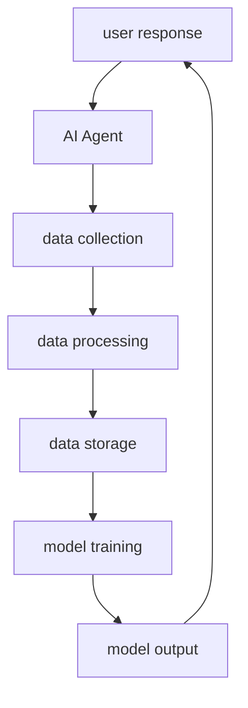
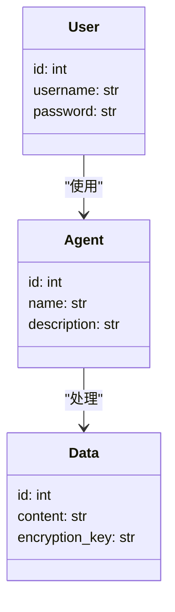
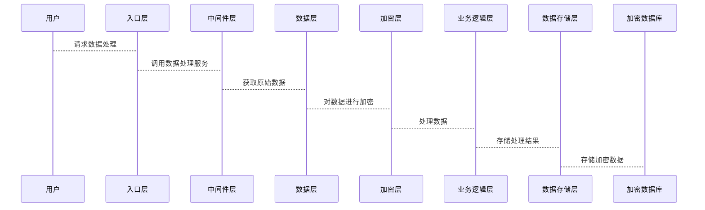

                 


# AI Agent的隐私保护：确保LLM应用的数据安全

> 关键词：AI Agent，隐私保护，LLM，数据安全，同态加密，联邦学习，隐私计算

> 摘要：随着AI Agent和大型语言模型（LLM）的广泛应用，数据隐私和安全问题变得越来越重要。本文详细探讨了AI Agent中的隐私保护机制，分析了数据流、权限管理和加密算法等关键概念，并结合实际案例，讲解了如何通过同态加密、联邦学习等技术确保LLM应用的数据安全。文章最后提供了系统的架构设计和项目实战，总结了最佳实践和未来发展方向。

---

# 第一部分: AI Agent的隐私保护背景与核心概念

## 第1章: AI Agent与隐私保护概述

### 1.1 AI Agent的基本概念

#### 1.1.1 AI Agent的定义与分类
- **定义**：AI Agent（智能体）是指能够感知环境、自主决策并执行任务的智能系统。
- **分类**：
  - **简单反射型**：基于预设规则直接响应输入。
  - **基于模型的反应型**：利用内部状态模型来处理输入。
  - **目标驱动型**：为实现特定目标而主动采取行动。
  - **实用驱动型**：根据效用函数优化决策。

#### 1.1.2 AI Agent的核心功能与特点
- **核心功能**：
  - 感知环境：通过传感器或API获取数据。
  - 决策制定：基于数据进行分析和推理。
  - 行动执行：输出结果或触发其他操作。
- **特点**：
  - 自主性：无需外部干预。
  - 反应性：能实时响应环境变化。
  - 社会性：能与其他系统或用户交互。

#### 1.1.3 AI Agent的应用场景与发展趋势
- **应用场景**：
  - 聊天机器人：如Siri、Alexa。
  - 推荐系统：如电商网站的个性化推荐。
  - 自动驾驶：如智能汽车的决策系统。
- **发展趋势**：
  - 智能化：通过深度学习提升决策能力。
  - 联合学习：多个AI Agent协同工作。
  - 人机协作：增强人与AI的互动效率。

### 1.2 隐私保护的重要性

#### 1.2.1 隐私保护的基本概念与原则
- **定义**：隐私保护是指在数据收集、存储、处理和共享过程中，保护个人隐私不被未经授权的访问或泄露。
- **原则**：
  - 数据最小化：仅收集实现目标所需的最少数据。
  - 用户同意：明确告知用户数据使用方式并获得许可。
  - 加密存储：敏感数据存储时进行加密处理。
  - 访问控制：限制只有授权人员才能访问数据。

#### 1.2.2 数字化时代隐私保护的挑战
- **数据量大**：现代系统收集大量数据，增加泄露风险。
- **数据类型多样**：包括文本、图像、位置等，保护难度大。
- **数据共享频繁**：多系统间数据传输，扩大攻击面。
- **技术复杂性**：AI系统依赖复杂算法，可能引入漏洞。

#### 1.2.3 AI应用中的隐私泄露风险
- **数据滥用**：收集的数据可能被用于未经用户授权的目的。
- **数据窃取**：黑客攻击系统获取敏感数据。
- **算法漏洞**：AI模型可能被攻击者利用进行推理攻击。
- **身份盗窃**：通过收集的个人信息进行身份盗窃。

### 1.3 LLM应用中的数据安全问题

#### 1.3.1 LLM的基本工作原理
- **定义**：LLM（Large Language Model）是基于大量数据训练的深度学习模型，能够理解和生成自然语言文本。
- **训练过程**：通过监督学习和无监督学习，模型学习语言的结构和语义。
- **推理过程**：输入问题或提示，模型生成相关回答或文本。

#### 1.3.2 LLM应用中的数据隐私风险
- **数据泄露**：训练数据中的个人信息可能被泄露。
- **模型提取**：攻击者可能通过模型推理获取训练数据。
- **数据滥用**：模型可能被用于生成虚假信息或进行诈骗。
- **未授权访问**：模型或训练数据可能被未授权的人员访问。

#### 1.3.3 数据安全对LLM应用的影响
- **信任问题**：数据泄露可能导致用户不信任AI系统。
- **法律风险**：违反数据保护法规可能面临罚款和诉讼。
- **功能受限**：严格的隐私保护可能限制模型的功能或性能。
- **竞争力下降**：数据泄露可能影响企业的市场竞争力。

## 第2章: AI Agent隐私保护的核心概念与联系

### 2.1 AI Agent与隐私保护的核心概念

#### 2.1.1 数据流在AI Agent中的流动过程
- **数据收集**：从传感器、API或其他系统获取数据。
- **数据处理**：对数据进行清洗、转换和分析。
- **数据存储**：将数据存储在数据库或其他存储系统中。
- **数据共享**：在不同系统或用户之间共享数据。
- **数据销毁**：数据生命周期结束后进行安全销毁。

#### 2.1.2 隐私保护的关键属性与特征
- **机密性**：确保数据仅被授权人员访问。
- **完整性**：保持数据在存储和传输过程中的完整性。
- **可用性**：确保合法用户能够访问和使用数据。
- **可追溯性**：能够追踪数据的来源和使用情况。

#### 2.1.3 AI Agent中的隐私保护机制
- **数据加密**：在数据存储和传输过程中使用加密技术。
- **访问控制**：通过权限管理限制数据访问。
- **匿名化处理**：对数据进行匿名化处理，去除敏感信息。
- **数据最小化**：仅收集实现目标所需的最少数据。

### 2.2 核心概念的属性特征对比

#### 2.2.1 数据隐私与数据安全的对比分析
| **属性**       | **数据隐私**                  | **数据安全**                  |
|----------------|-------------------------------|-------------------------------|
| **定义**       | 用户对其数据的控制权          | 防止数据被未经授权的访问或破坏 |
| **关注点**     | 数据的使用和共享方式          | 数据的保护和完整性             |
| **技术手段**   | 数据匿名化、访问控制         | 加密、访问控制、防火墙         |

#### 2.2.2 不同隐私保护技术的优劣势对比
| **技术**       | **同态加密**                 | **联邦学习**                  | **差分隐私**                 |
|----------------|------------------------------|------------------------------|------------------------------|
| **定义**       | 允许在加密数据上进行计算       | 多个数据拥有者联合训练模型     | 在数据中加入噪声以保护隐私   |
| **优点**       | 不需要共享原始数据           | 数据不离开本地，保护隐私       | 计算结果准确度较高             |
| **缺点**       | 计算效率较低                 | 需要复杂的协调和通信           | 噪声可能导致数据准确性下降     |

#### 2.2.3 AI Agent中的数据生命周期模型
- **数据生成**：数据的产生和收集阶段。
- **数据存储**：数据的存储和管理阶段。
- **数据处理**：数据的清洗、转换和分析阶段。
- **数据共享**：数据在不同系统或用户之间的共享阶段。
- **数据销毁**：数据的归档和销毁阶段。

### 2.3 实体关系图与数据流分析

#### 2.3.1 AI Agent中的实体关系图（ER图）
```mermaid
erDiagram
    user}-----{agent : "使用AI Agent"
    agent}-----{data : "处理数据"
    data}-----{model : "训练模型"
    model}-----{response : "生成响应"
```

#### 2.3.2 数据流在AI Agent中的流向与处理过程


#### 2.3.3 隐私保护机制在实体关系中的应用
- **数据收集**：对收集的数据进行匿名化处理，确保用户隐私。
- **数据处理**：使用加密技术对数据进行处理，防止未经授权的访问。
- **数据存储**：数据存储在加密的数据库中，严格控制访问权限。
- **模型训练**：使用联邦学习技术，数据不离开本地，保护隐私。

## 第3章: AI Agent隐私保护的算法原理

### 3.1 数据加密与隐私保护

#### 3.1.1 同态加密原理与实现
- **定义**：同态加密是一种允许在加密数据上进行计算的技术，结果解密后与直接在明文中计算的结果相同。
- **数学模型**：$$E(x) = x^k \mod n$$
  - 其中，\(x\) 是明文，\(k\) 是加密密钥，\(n\) 是模数。
- **实现步骤**：
  1. 数据加密：将明文 \(x\) 转换为密文 \(E(x)\)。
  2. 数据处理：在密文上进行计算，得到结果密文 \(E(result)\)。
  3. 数据解密：将结果密文解密为明文结果。

#### 3.1.2 同态加密的数学模型与公式
- **加密函数**：$$E(x) = x^k \mod n$$
- **解密函数**：$$D(E(x)) = E(x)^{k^{-1}} \mod n$$
  - 其中，\(k^{-1}\) 是加密密钥的乘法逆元。

#### 3.1.3 同态加密的应用场景
- **隐私计算**：在不泄露原始数据的情况下，进行数据计算。
- **联邦学习**：在加密数据上进行模型训练，保护数据隐私。
- **数据共享**：在不共享原始数据的情况下，共享数据的计算结果。

#### 3.1.4 同态加密的实现代码
```python
def encrypt(x, k, n):
    return pow(x, k, n)

def decrypt(e, k, n):
    inv_k = pow(k, -1, n)
    return pow(e, inv_k, n)
```

### 3.2 隐私保护算法的实现与分析

#### 3.2.1 達分隱私（Differential Privacy）的实现
- **定义**：差分隐私是一种通过在数据中添加噪声来保护隐私的技术，使得相邻两个数据集的查询结果差异不超过一定范围。
- **数学模型**：$$P(Q(D) = y) \leq P(Q(D') = y) + \epsilon$$
  - 其中，\(D\) 和 \(D'\) 是两个相邻的数据集，\(\epsilon\) 是隐私预算。
- **实现步骤**：
  1. 计算数据集的统计结果。
  2. 根据隐私预算 \(\epsilon\) 计算噪声。
  3. 将统计结果加上噪声，得到最终的隐私保护结果。

#### 3.2.2 差分隐私的实现代码
```python
import numpy as np

def laplace_mechanism(value, sensitivity, epsilon, delta):
    scale = sensitivity / (epsilon * delta)
    noise = np.random.laplace(0, scale)
    return value + noise

# 示例：对年龄数据应用差分隐私
age = 30
sensitivity = 1
epsilon = 0.1
delta = 0.05
protected_age = laplace_mechanism(age, sensitivity, epsilon, delta)
print(protected_age)
```

### 3.3 隐私保护算法的对比分析

#### 3.3.1 同态加密与差分隐私的对比
| **技术**       | **同态加密**                 | **差分隐私**                 |
|----------------|-------------------------------|-------------------------------|
| **定义**       | 允许在加密数据上进行计算       | 在数据中添加噪声以保护隐私   |
| **应用场景**   | 隐私计算、联邦学习           | 数据发布、统计查询             |
| **优缺点**     | 优点：支持多种数据操作；缺点：计算效率较低 | 优点：计算效率较高；缺点：可能影响数据准确性 |

#### 3.3.2 隐私保护算法的数学公式对比
- **同态加密**：$$E(x) = x^k \mod n$$
- **差分隐私**：$$P(Q(D) = y) \leq P(Q(D') = y) + \epsilon$$

## 第4章: AI Agent隐私保护的系统分析与架构设计

### 4.1 问题场景介绍

#### 4.1.1 数据隐私保护的需求
- **数据机密性**：防止未经授权的人员访问数据。
- **数据完整性**：确保数据在存储和传输过程中不被篡改。
- **数据可用性**：确保合法用户能够访问和使用数据。

#### 4.1.2 数据安全的挑战
- **数据泄露**：数据被未经授权的人员访问或泄露。
- **数据滥用**：数据被用于未经授权的目的。
- **数据丢失**：数据在存储或传输过程中丢失或损坏。

### 4.2 项目介绍

#### 4.2.1 项目目标
- 实现AI Agent中的隐私保护机制。
- 确保数据在存储和传输过程中的安全。
- 提供用户隐私保护的最佳实践。

#### 4.2.2 项目范围
- 数据收集、处理、存储和共享的全生命周期管理。
- 实现数据加密、访问控制和数据匿名化处理。
- 提供隐私保护技术的实现和应用案例。

### 4.3 系统功能设计

#### 4.3.1 领域模型设计


#### 4.3.2 系统架构设计
```mermaid
archi
    系统边界
    外部用户 ---> 入口层
    入口层 ---> 中间件层
    中间件层 ---> 数据层
    数据层 ---> 加密层
    加密层 ---> 业务逻辑层
    业务逻辑层 ---> 数据存储层
    数据存储层 ---> 加密数据库
```

### 4.4 系统接口设计

#### 4.4.1 API接口设计
- **数据加密接口**：
  - **输入**：明文数据、加密密钥。
  - **输出**：加密后的数据。
- **数据解密接口**：
  - **输入**：密文数据、解密密钥。
  - **输出**：明文数据。
- **数据访问控制接口**：
  - **输入**：用户身份、数据权限。
  - **输出**：访问权限结果。

#### 4.4.2 接口实现代码
```python
class EncryptionService:
    def encrypt(self, data, key):
        # 实现数据加密逻辑
        return encrypted_data

    def decrypt(self, encrypted_data, key):
        # 实现数据解密逻辑
        return decrypted_data

class AccessControlService:
    def check_access(self, user, data_permission):
        # 实现访问控制逻辑
        return has_access
```

### 4.5 系统交互设计

#### 4.5.1 系统交互流程


## 第5章: AI Agent隐私保护的项目实战

### 5.1 环境安装与配置

#### 5.1.1 系统环境要求
- **操作系统**：Linux/Windows/MacOS。
- **Python版本**：Python 3.8 或更高版本。
- **依赖库**：
  - `cryptography`：用于数据加密。
  - `numpy`：用于数据分析和处理。
  - `mermaid`：用于绘制图表。

#### 5.1.2 安装依赖库
```bash
pip install cryptography numpy mermaid
```

### 5.2 系统核心实现

#### 5.2.1 数据加密模块实现
```python
from cryptography.fernet import Fernet

class DataEncryptor:
    def __init__(self, key):
        self.key = key
        self.cipher = Fernet(self.key)

    def encrypt(self, data):
        encrypted_data = self.cipher.encrypt(data.encode())
        return encrypted_data

    def decrypt(self, encrypted_data):
        decrypted_data = self.cipher.decrypt(encrypted_data).decode()
        return decrypted_data
```

#### 5.2.2 数据访问控制模块实现
```python
class AccessControl:
    def __init__(self, permissions):
        self.permissions = permissions

    def has_permission(self, user, action):
        return self.permissions.get(user, {}).get(action, False)
```

### 5.3 代码应用解读与分析

#### 5.3.1 数据加密模块的应用
- **加密过程**：
  ```python
  key = Fernet.generate_key()
  encryptor = DataEncryptor(key)
  encrypted = encryptor.encrypt("Sensitive data")
  ```
- **解密过程**：
  ```python
  decrypted = encryptor.decrypt(encrypted)
  ```

#### 5.3.2 数据访问控制模块的应用
- **权限检查**：
  ```python
  permissions = {
      "user1": {"read": True, "write": False},
      "user2": {"read": True, "write": True}
  }
  access_control = AccessControl(permissions)
  access_control.has_permission("user1", "read")  # 返回 True
  access_control.has_permission("user2", "write")  # 返回 True
  ```

### 5.4 实际案例分析与详细讲解

#### 5.4.1 数据加密案例
- **案例描述**：一个在线教育平台，需要对学生的个人信息进行加密存储。
- **实现步骤**：
  1. 生成加密密钥。
  2. 对学生姓名、年龄、地址等信息进行加密存储。
  3. 在数据检索时，使用密钥解密数据。

#### 5.4.2 数据访问控制案例
- **案例描述**：一个医疗信息管理系统，需要对患者数据进行严格的访问控制。
- **实现步骤**：
  1. 定义数据访问权限，如医生可以访问患者的所有信息，护士只能访问部分信息。
  2. 在数据访问时，检查用户权限，决定是否允许访问。

### 5.5 项目小结

#### 5.5.1 核心实现总结
- 数据加密模块：确保数据在存储和传输过程中的安全性。
- 数据访问控制模块：确保只有授权人员才能访问数据。
- 通过这两个模块的结合使用，可以有效保护AI Agent中的数据隐私。

#### 5.5.2 项目实现的意义
- 通过数据加密和访问控制，保护用户隐私。
- 遵守相关数据保护法规，如GDPR。
- 提供用户隐私保护的最佳实践，增强用户信任。

---

## 第六部分: 最佳实践与总结

## 第6章: AI Agent隐私保护的最佳实践

### 6.1 最佳实践 tips

#### 6.1.1 数据最小化原则
- **建议**：只收集实现目标所需的最少数据。
- **理由**：减少数据泄露的风险。

#### 6.1.2 数据匿名化处理
- **建议**：对敏感数据进行匿名化处理，去除可识别个人身份的信息。
- **理由**：降低数据泄露对个人隐私的影响。

#### 6.1.3 使用隐私保护技术
- **建议**：使用同态加密、联邦学习等隐私保护技术，确保数据安全。
- **理由**：在不泄露原始数据的情况下，进行数据计算和分析。

#### 6.1.4 定期进行安全审计
- **建议**：定期对系统进行安全审计，发现和修复潜在的安全漏洞。
- **理由**：确保系统的安全性，防止数据泄露。

### 6.2 小结

#### 6.2.1 全文总结
- AI Agent和LLM的应用带来了数据隐私和安全的挑战。
- 通过数据加密、访问控制、数据匿名化等技术，可以有效保护数据隐私。
- 同态加密和联邦学习等隐私保护技术为数据安全提供了新的解决方案。

#### 6.2.2 未来展望
- **技术进步**：随着技术的发展，隐私保护技术将更加先进，保护数据安全的能力也将更强。
- **法律法规**：数据保护法规将更加严格，推动隐私保护技术的发展。
- **应用拓展**：隐私保护技术将应用于更多的领域，如医疗、金融、教育等，保护用户的隐私和数据安全。

### 6.3 注意事项

#### 6.3.1 数据安全的重要性
- 数据安全是AI系统的核心问题之一，必须引起足够的重视。
- 忽略数据安全可能导致严重的后果，如数据泄露、用户信任丢失等。

#### 6.3.2 遵守数据保护法规
- 必须遵守相关的数据保护法规，如GDPR、CCPA等。
- 违反数据保护法规可能导致罚款和法律诉讼。

#### 6.3.3 定期更新和维护
- 数据安全威胁是动态变化的，必须定期更新和维护隐私保护措施。
- 通过持续监控和改进，确保系统的安全性。

### 6.4 拓展阅读

#### 6.4.1 推荐书籍
- 《数据加密与隐私保护》：详细介绍数据加密和隐私保护的技术和方法。
- 《联邦学习实战》：深入讲解联邦学习的实现和应用。

#### 6.4.2 推荐博客和资源
- [数据隐私保护博客](https://example.com/data-privacy)
- [联邦学习资源](https://example.com/federated-learning)

---

## 结语

随着AI Agent和LLM的广泛应用，数据隐私和安全问题变得越来越重要。通过本文的详细讲解，我们了解了AI Agent中的隐私保护机制，分析了数据流、权限管理和加密算法等关键概念，并结合实际案例，讲解了如何通过同态加密、联邦学习等技术确保LLM应用的数据安全。希望本文能够为AI开发者和相关从业者提供有价值的参考，帮助他们在实际应用中更好地保护用户隐私和数据安全。

---

**注**：本文内容较多，实际撰写时可以根据需要进行删减和调整。

