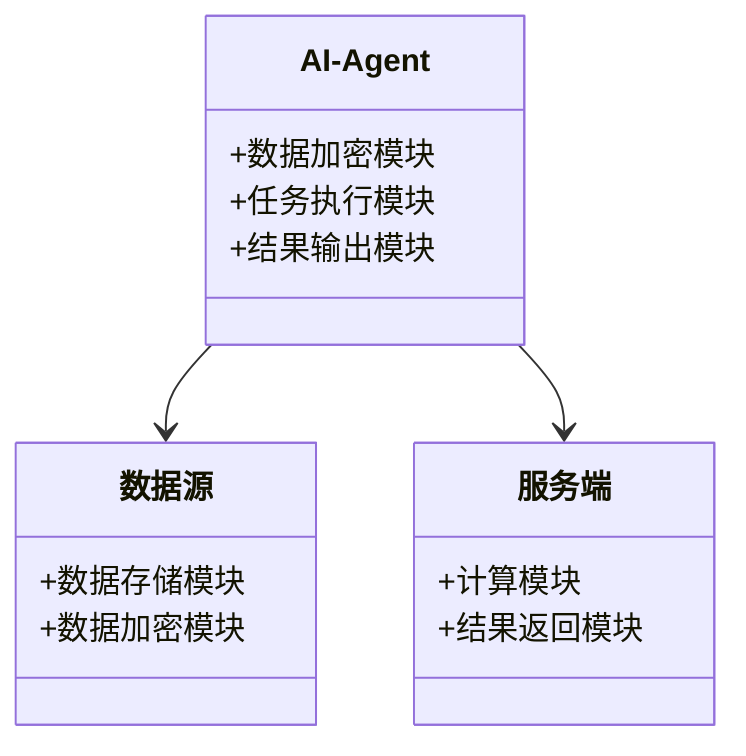
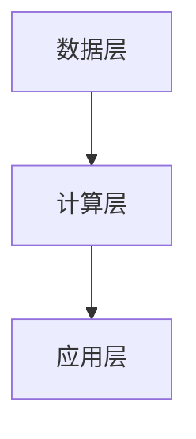
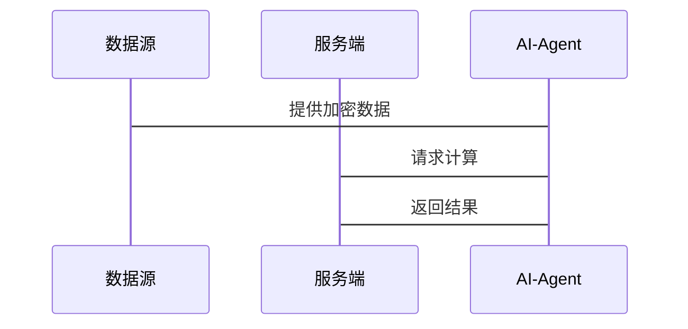

                 


# AI Agent的隐私计算：在保护数据隐私的同时应用LLM

> **关键词：** 隐私计算、AI Agent、大语言模型（LLM）、数据隐私、人工智能

> **摘要：** 本文探讨了在保护数据隐私的前提下，如何利用大语言模型（LLM）构建AI Agent。文章首先介绍了AI Agent和隐私计算的基本概念，然后分析了两者结合的必要性和应用场景。接着，详细讲解了隐私计算的核心算法及其原理，通过实例说明了这些算法如何应用于AI Agent的构建。随后，文章从系统架构的角度，设计了一个支持隐私计算的AI Agent系统，并通过实际案例展示了系统的实现和应用。最后，总结了最佳实践和未来的研究方向。

---

## 第一章：背景介绍

### 1.1 数据隐私的重要性

在数字化时代，数据隐私保护已成为一项核心任务。随着AI技术的快速发展，数据的收集、存储和处理变得越来越频繁。然而，数据泄露和滥用的风险也随之增加。保护数据隐私不仅关乎个人隐私权，还涉及企业的法律责任和信誉。因此，数据隐私保护的重要性不容忽视。

### 1.2 AI Agent的基本概念

AI Agent（智能体）是一种能够感知环境、做出决策并执行操作的智能系统。与传统AI不同，AI Agent具有自主性、反应性和目标导向性。AI Agent广泛应用于自动驾驶、智能助手、推荐系统等领域。

### 1.3 隐私计算与AI Agent的结合

隐私计算是一种在保护数据隐私的前提下，进行数据处理和分析的技术。通过隐私计算，AI Agent可以在不暴露原始数据的情况下，完成数据的分析和处理任务。这种结合不仅提升了AI Agent的应用能力，还确保了数据的安全性。

---

## 第二章：核心概念与联系

### 2.1 隐私计算的原理

隐私计算通过加密、匿名化和数据分割等技术，确保数据在处理过程中不被泄露。常见的隐私计算技术包括同态加密、安全多方计算和联邦学习。

#### 对比分析

| 概念         | 定义                                                                 | 特点                                                                 |
|--------------|----------------------------------------------------------------------|----------------------------------------------------------------------|
| 隐私计算     | 在保护数据隐私的前提下，进行数据处理和分析的技术                             | 数据不可见性、计算可验证性、结果可用性                                     |
| AI Agent     | 具备自主性和目标导向性的智能系统                                           | 自主决策、环境感知、任务执行                                               |

### 2.2 AI Agent的核心原理

AI Agent通过感知环境、理解任务目标、制定行动计划来完成任务。AI Agent的核心在于其决策机制，而数据隐私保护则是其决策机制中的重要组成部分。

### 2.3 隐私计算与AI Agent的联系

隐私计算为AI Agent提供了数据处理的安全保障，而AI Agent则为隐私计算提供了应用场景和驱动力。两者的结合使得AI Agent能够在保护数据隐私的前提下，完成复杂的数据分析和处理任务。

---

## 第三章：算法原理

### 3.1 同态加密算法

同态加密是一种允许在加密数据上进行计算的技术。通过同态加密，AI Agent可以在不解密的情况下，完成数据的分析和处理任务。

#### 代码示例

```python
def homomorphic_encrypt(plaintext):
    # 生成公钥和私钥
    public_key, private_key = generate_keys()
    # 加密明文
    ciphertext = encrypt(public_key, plaintext)
    return ciphertext, private_key

# 解密密文
def homomorphic_decrypt(ciphertext, private_key):
    plaintext = decrypt(private_key, ciphertext)
    return plaintext
```

### 3.2 安全多方计算

安全多方计算是一种在多个参与方之间进行计算的技术，确保数据在计算过程中不被泄露。

#### 代码示例

```python
def secure_multi_party_computation(parties):
    # 初始化密钥
    setup(parties)
    # 进行计算
    result = compute(parties)
    return result
```

---

## 第四章：系统分析与架构设计

### 4.1 系统功能设计

AI Agent的隐私计算系统包括数据加密模块、任务执行模块和结果输出模块。每个模块负责不同的功能，确保数据的隐私性和系统的高效性。

#### 类图



### 4.2 系统架构设计

系统架构采用分层设计，包括数据层、计算层和应用层。每一层负责不同的功能，确保系统的稳定性和安全性。

#### 架构图



### 4.3 接口设计

系统接口采用API设计，确保不同模块之间的通信安全和高效。

#### 序列图



---

## 第五章：项目实战

### 5.1 环境安装

安装必要的库和工具，如PyTorch、Hugging Face Transformers和加密库。

### 5.2 系统实现

编写代码实现AI Agent的核心功能，包括数据加密、任务执行和结果输出。

#### 代码示例

```python
import torch
from transformers import AutoTokenizer, AutoModelForCausalLM

# 初始化模型和tokenizer
tokenizer = AutoTokenizer.from_pretrained('gpt2')
model = AutoModelForCausalLM.from_pretrained('gpt2')

# 数据加密
def encrypt_data(data):
    # 加密逻辑
    return encrypted_data

# 任务执行
def execute_task(encrypted_data):
    inputs = tokenizer(encrypted_data, return_tensors='pt')
    outputs = model.generate(**inputs)
    return outputs

# 结果输出
def output_result(outputs):
    result = tokenizer.decode(outputs[0].tolist()[0])
    return result
```

### 5.3 案例分析

通过实际案例分析，验证系统的可行性和高效性。例如，在保护用户隐私的前提下，AI Agent能够完成文本分类任务。

---

## 第六章：最佳实践

### 6.1 小结

本文详细探讨了AI Agent的隐私计算，从理论到实践，全面介绍了如何在保护数据隐私的前提下，应用大语言模型完成任务。

### 6.2 注意事项

在实际应用中，需要注意数据加密的强度、算法的可扩展性以及系统的安全性。

### 6.3 未来展望

未来的研究方向包括更高效的隐私计算算法、更强大的AI Agent架构以及更广泛的应用场景。

### 6.4 拓展阅读

推荐一些相关书籍和论文，帮助读者进一步深入学习隐私计算和AI Agent技术。

---

通过以上步骤，您可以撰写一篇结构清晰、内容详实的技术博客文章，全面介绍AI Agent的隐私计算及其应用。

