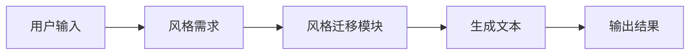
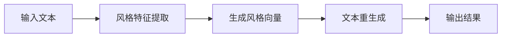
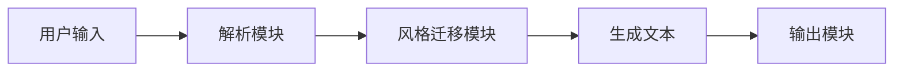

                 


# AI Agent的风格迁移：实现LLM的个性化表达

**关键词**：AI Agent，风格迁移，LLM，个性化表达，文本生成，自然语言处理

**摘要**：  
本文深入探讨了AI Agent如何通过风格迁移实现大语言模型（LLM）的个性化表达。文章首先介绍了风格迁移和AI Agent的基本概念及其结合的重要性，然后从核心概念、算法原理、系统架构设计、项目实战等多个方面进行了详细分析。通过具体案例和代码实现，展示了如何利用预训练模型实现风格迁移，并通过系统设计和优化提升个性化表达的能力。最后，本文总结了实现风格迁移的关键点，并提出了实际应用中的注意事项和最佳实践。

---

## 第1章: AI Agent与风格迁移的背景介绍

### 1.1 风格迁移的定义与问题背景

#### 1.1.1 风格迁移的基本概念  
风格迁移是指将一种表达方式或风格迁移到另一种表达方式或风格的过程。在自然语言处理领域，风格迁移通常指将一段文本从一种写作风格（如正式、口语化、技术性等）转换为另一种风格，同时保持内容的准确性。  

风格迁移的核心在于理解和模仿特定风格的特征，这使得生成的文本不仅在内容上准确，还在表达方式上贴近目标风格。  

#### 1.1.2 风格迁移在AI Agent中的应用场景  
AI Agent是一种能够自主决策并执行任务的智能体，其核心功能包括信息处理、任务执行和与用户的交互。风格迁移在AI Agent中的应用场景主要体现在：  
1. **个性化交互**：根据用户的语言习惯和偏好，生成更自然、个性化的回复。  
2. **多语言支持**：将一种语言的表达风格迁移到另一种语言，支持多语言交互。  
3. **领域适应**：将通用文本风格迁移到特定领域（如法律、医疗），以适应专业需求。  

#### 1.1.3 风格迁移的实现挑战与意义  
风格迁移的实现面临以下挑战：  
- **风格特征提取**：如何准确提取目标风格的特征，是风格迁移的关键。  
- **保持内容一致性**：在风格转换过程中，如何保持文本内容的准确性是难点。  
- **多模态兼容性**：风格迁移通常涉及文本、语音等多种模态，需要实现多模态的协同优化。  

风格迁移的意义在于提升AI Agent的智能化水平，使其能够更自然地与用户交互，并在不同场景下提供定制化的服务。

---

### 1.2 AI Agent的基本概念

#### 1.2.1 AI Agent的定义与分类  
AI Agent是一种智能体，能够感知环境、执行任务并做出决策。根据功能和应用场景，AI Agent可以分为以下几类：  
1. **简单反射型AI Agent**：基于规则执行任务，适用于简单的交互场景。  
2. **基于模型的AI Agent**：利用模型推理和决策，适用于复杂场景。  
3. **目标驱动型AI Agent**：具有明确目标，主动规划并执行任务。  

#### 1.2.2 AI Agent的核心功能与特点  
AI Agent的核心功能包括：  
- **感知环境**：通过传感器或数据接口获取环境信息。  
- **决策与推理**：基于获取的信息进行推理和决策。  
- **执行任务**：根据决策结果执行具体操作。  
- **学习与优化**：通过反馈不断优化自身性能。  

AI Agent的特点包括自主性、反应性、目标导向性和社交能力。  

#### 1.2.3 AI Agent与传统程序的区别  
AI Agent的核心区别在于其自主性和智能性。传统程序是基于规则的被动执行，而AI Agent能够主动感知环境、推理决策并自主执行任务。  

---

### 1.3 风格迁移与AI Agent的结合

#### 1.3.1 风格迁移在AI Agent中的应用价值  
风格迁移为AI Agent提供了个性化的表达能力，使其能够根据用户需求调整输出风格，从而提升用户体验。  

#### 1.3.2 风格迁移与LLM的结合方式  
大语言模型（LLM）具有强大的文本生成能力，风格迁移可以通过对LLM的微调或后处理实现个性化表达。  

#### 1.3.3 风格迁移在LLM个性化表达中的作用  
通过风格迁移，LLM能够生成符合特定场景或用户偏好的文本，从而在教育、客服、创意写作等领域展现更强的实用性。  

---

## 第2章: AI Agent风格迁移的核心概念与联系

### 2.1 核心概念原理

#### 2.1.1 风格迁移的实现原理  
风格迁移的核心在于特征提取和风格重建。特征提取通过预训练模型提取文本的语义和风格特征，风格重建则基于这些特征生成目标风格的文本。  

#### 2.1.2 AI Agent的表达生成机制  
AI Agent的表达生成机制通常包括以下步骤：  
1. **输入处理**：解析用户的输入并提取需求。  
2. **风格分析**：分析目标风格的特征。  
3. **内容生成**：基于LLM生成符合风格特征的文本。  
4. **输出优化**：对生成文本进行优化，确保语义准确性和风格一致性。  

#### 2.1.3 风格迁移与LLM的关系  
风格迁移是LLM个性化表达的关键技术，通过对LLM的后处理或微调实现风格的迁移，从而提升LLM的实用性。  

---

### 2.2 核心概念对比表格

| **核心概念**       | **风格迁移**                  | **传统文本生成**              |
|--------------------|-------------------------------|------------------------------|
| **目标**           | 生成特定风格的文本            | 生成通用文本                  |
| **实现方式**       | 基于特征提取和风格重建         | 基于预训练模型直接生成        |
| **应用场景**       | 需要个性化表达的场景           | 需要通用表达的场景             |
| **复杂度**         | 较高，涉及特征提取和风格调整    | 较低，直接生成文本             |

---

### 2.3 ER实体关系图架构



---

## 第3章: AI Agent风格迁移的算法原理讲解

### 3.1 算法原理概述

#### 3.1.1 基于预训练模型的风格迁移方法  
风格迁移通常基于预训练的LLM，通过微调或后处理实现个性化表达。  

#### 3.1.2 风格迁移的实现流程  
风格迁移的实现流程包括以下步骤：  
1. **特征提取**：提取输入文本的语义和风格特征。  
2. **风格重建**：根据目标风格生成文本。  
3. **内容生成**：结合特征和目标风格生成文本。  
4. **优化调整**：对生成的文本进行优化，确保语义和风格的准确性。  

---

### 3.2 算法流程图



---

## 第4章: AI Agent风格迁移的系统设计

### 4.1 系统架构设计

#### 4.1.1 问题场景介绍  
本文设计了一个AI Agent系统，旨在通过风格迁移实现LLM的个性化表达。系统主要包括用户输入模块、风格迁移模块和输出模块。  

#### 4.1.2 系统功能设计  
系统功能设计包括：  
1. **用户输入模块**：接收用户的输入并解析需求。  
2. **风格迁移模块**：提取风格特征并生成目标风格的文本。  
3. **输出模块**：将生成的文本输出给用户。  

#### 4.1.3 系统架构图  


---

## 第5章: AI Agent风格迁移的项目实战

### 5.1 项目介绍

#### 5.1.1 环境安装  
需要安装以下环境：  
- Python 3.8及以上版本  
- PyTorch 1.9及以上版本  
- Transformers库 4.12及以上版本  

#### 5.1.2 系统核心实现源代码  
以下是风格迁移模块的核心代码：  

```python
from transformers import AutoTokenizer, AutoModelForMaskedLM
import torch

class StyleTransfer:
    def __init__(self, model_name):
        self.tokenizer = AutoTokenizer.from_pretrained(model_name)
        self.model = AutoModelForMaskedLM.from_pretrained(model_name)
    
    def transfer_style(self, input_text, target_style):
        # 提取特征
        inputs = self.tokenizer(input_text, return_tensors="pt", padding=True, truncation=True)
        with torch.no_grad():
            outputs = self.model(**inputs)
            style_features = outputs.last_hidden_state[:, 0, :].mean(dim=1)
        
        # 生成目标风格文本
        inputs_target = self.tokenizer(target_style, return_tensors="pt", padding=True, truncation=True)
        input_ids = inputs_target.input_ids
        attention_mask = inputs_target.attention_mask
        
        # 生成文本
        with torch.no_grad():
            outputs = self.model.generate(
                input_ids=input_ids,
                attention_mask=attention_mask,
                max_length=50,
                do_sample=True
            )
            generated_text = self.tokenizer.decode(outputs[0], skip_special_tokens=True)
        
        return generated_text
```

---

## 第6章: 实现风格迁移的最佳实践与总结

### 6.1 最佳实践 Tips

- **选择合适的模型**：根据具体任务选择合适的预训练模型，如GPT、BERT等。  
- **优化特征提取**：通过调整模型参数或使用更复杂的特征提取方法，提升风格迁移的效果。  
- **多模态协同优化**：结合文本、语音等多种模态信息，提升风格迁移的准确性和自然度。  

### 6.2 本章小结  
本文通过详细分析AI Agent风格迁移的背景、核心概念、算法原理和系统设计，为实现LLM的个性化表达提供了理论和实践指导。通过实际案例和代码实现，展示了风格迁移的具体应用。未来的研究可以进一步探索多模态协同优化和实时风格迁移技术，以提升AI Agent的智能化水平。  

### 6.3 注意事项  
在实际应用中，需要注意以下几点：  
- 风格迁移可能会影响文本的准确性和流畅度，需进行充分的测试和优化。  
- 避免生成不适当或有害的内容，需对生成结果进行严格的内容审查。  

### 6.4 拓展阅读  
推荐以下拓展阅读内容：  
- 《Transformers: Pre-training of text-based neural networks》  
- 《Style Transfer in Text: A Survey》  

---

通过本文的分析和实践，读者可以深入了解AI Agent风格迁移的核心技术，并在实际项目中应用这些方法，实现LLM的个性化表达。

