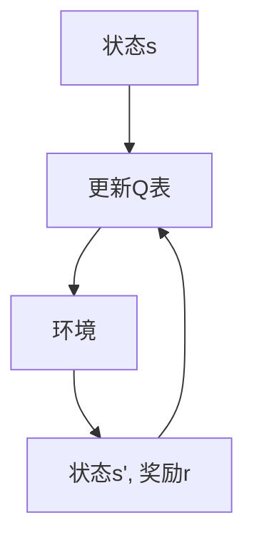
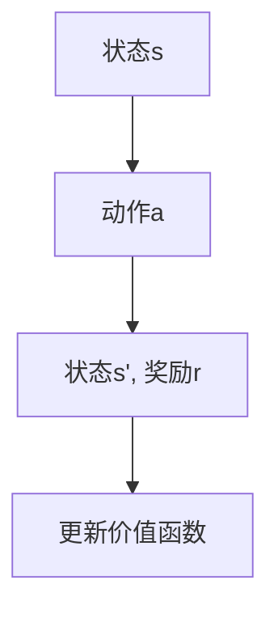
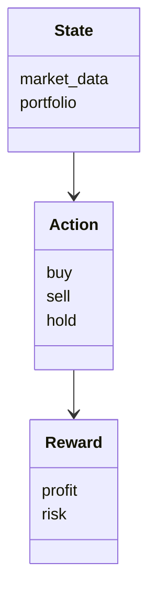
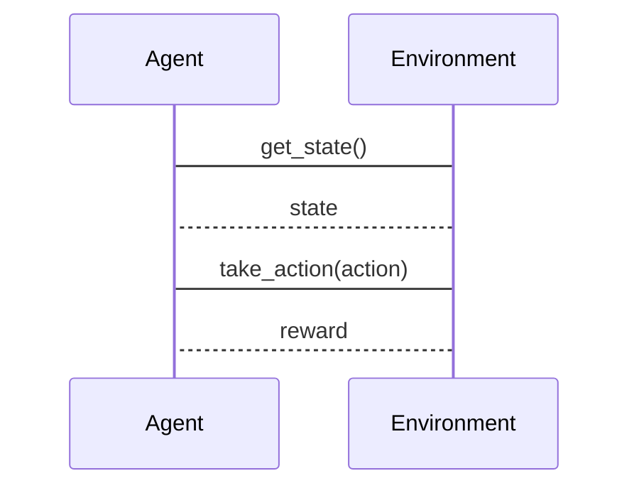

                 


# AI agents优化价值投资策略的动态调整

## 关键词：AI代理, 价值投资策略, 动态调整, 强化学习, 投资组合优化

## 摘要：本文探讨了如何利用AI代理优化价值投资策略的动态调整。通过分析AI代理的核心概念和价值投资策略的特点，提出了基于强化学习的动态调整方法。结合数学模型和实际案例，展示了AI代理在投资决策中的应用，为投资者提供了高效、智能的优化工具。

---

# 第1章: AI代理与价值投资策略的背景与概念

## 1.1 AI代理的核心概念

### 1.1.1 AI代理的定义
AI代理是一种能够感知环境、自主决策并采取行动的智能体，能够根据反馈不断优化其行为。

### 1.1.2 AI代理的特点
- **自主性**: 能够自主决策。
- **反应性**: 能够实时感知环境变化。
- **学习能力**: 能够通过经验优化决策。

### 1.1.3 AI代理与传统投资策略的区别
传统投资策略依赖于人工分析和固定规则，而AI代理能够实时学习和调整策略。

## 1.2 价值投资策略的定义与特点

### 1.2.1 价值投资的定义
价值投资是一种通过分析股票的内在价值，寻找被市场低估的投资标的进行投资的策略。

### 1.2.2 价值投资的核心原则
- **安全边际**: 购买价格低于内在价值。
- **长期视角**: 关注企业的长期盈利能力。

### 1.2.3 价值投资与趋势投资的对比
趋势投资依赖于价格走势，而价值投资依赖于内在价值的评估。

## 1.3 AI代理优化价值投资策略的意义

### 1.3.1 提高投资决策的效率
AI代理能够快速分析大量数据，提供实时决策支持。

### 1.3.2 实现动态调整的优势
AI代理能够根据市场变化实时调整投资组合，优化收益和风险。

### 1.3.3 降低人为情绪干扰的作用
AI代理能够避免投资者情绪波动对决策的影响。

## 1.4 本书的核心目标与内容

### 1.4.1 优化价值投资策略的动态调整
通过AI代理实现价值投资策略的动态优化。

### 1.4.2 AI代理在投资决策中的应用
探讨AI代理如何优化投资决策过程。

### 1.4.3 本书的结构与内容安排
从理论到实践，系统地讲解AI代理在价值投资中的应用。

---

# 第2章: AI代理的算法原理与数学模型

## 2.1 强化学习算法原理

### 2.1.1 强化学习的基本概念
- **状态**: 环境中的情况。
- **动作**: 智能体采取的行动。
- **奖励**: 行为的结果。

### 2.1.2 Q-learning算法原理
Q-learning是一种经典的强化学习算法，适用于离散动作空间。

#### 2.1.2.1 Q-learning的数学模型
$$ Q(s, a) = Q(s, a) + \alpha (r + \gamma \max Q(s', a') - Q(s, a)) $$
其中，$\alpha$是学习率，$\gamma$是折扣因子。

### 2.1.3 算法实现

#### 2.1.3.1 Q-learning流程图


#### 2.1.3.2 Python代码示例
```python
class QLearningAgent:
    def __init__(self, state_space_size, action_space_size):
        self.q_table = np.zeros((state_space_size, action_space_size))
    
    def choose_action(self, state, epsilon):
        if random.random() < epsilon:
            return random.randint(0, action_space_size-1)
        return np.argmax(self.q_table[state])
    
    def update_q_table(self, state, action, reward, next_state, learning_rate, gamma):
        self.q_table[state, action] += learning_rate * (reward + gamma * np.max(self.q_table[next_state]) - self.q_table[state, action])
```

---

## 2.2 动态规划算法原理

### 2.2.1 动态规划的基本概念
动态规划通过分阶段解决问题，记录子问题的解，避免重复计算。

### 2.2.2 动态规划的数学模型
$$ V(s) = \max_{a} [ r + \gamma V(s') ] $$

### 2.2.3 动态规划的实现

#### 2.2.3.1 动态规划流程图


#### 2.2.3.2 Python代码示例
```python
class DynamicProgrammingAgent:
    def __init__(self, state_space_size):
        self.value_function = np.zeros(state_space_size)
    
    def update_value_function(self, state, reward, next_state, gamma):
        self.value_function[state] = reward + gamma * self.value_function[next_state]
```

---

# 第3章: 价值投资策略的动态调整

## 3.1 投资决策过程的建模

### 3.1.1 投资决策过程的领域模型


### 3.1.2 动态调整模型的构建
动态调整模型需要考虑市场变化、投资组合的风险和收益。

## 3.2 基于强化学习的投资组合优化

### 3.2.1 投资组合优化的数学模型
$$ \text{目标函数}: \max \mu \cdot w - \lambda \cdot w^T \Sigma w $$
其中，$\mu$是期望收益，$\Sigma$是协方差矩阵，$\lambda$是风险厌恶系数。

### 3.2.2 投资组合优化的实现
使用强化学习算法优化投资组合，考虑市场的实时变化。

---

# 第4章: 项目实战

## 4.1 环境搭建

### 4.1.1 环境安装
安装必要的Python库，如numpy、pandas、matplotlib等。

### 4.1.2 数据获取
获取历史股票数据，用于训练和测试。

## 4.2 系统核心实现

### 4.2.1 AI代理的实现
实现一个基于强化学习的AI代理，能够根据市场数据做出投资决策。

#### 4.2.1.1 环境接口设计


### 4.2.2 投资组合优化的实现
根据AI代理的决策，优化投资组合，实现动态调整。

## 4.3 案例分析

### 4.3.1 案例背景
选择一个具体的股票市场数据，进行模拟投资。

### 4.3.2 实验结果
展示AI代理在动态调整中的表现，对比传统投资策略的收益和风险。

---

# 第5章: 优化与调整

## 5.1 模型评估与优化

### 5.1.1 模型评估指标
使用收益、风险、夏普比率等指标评估模型的性能。

### 5.1.2 超参数调整
调整学习率、折扣因子等参数，优化模型的性能。

## 5.2 风险管理策略

### 5.2.1 风险控制措施
设定止损点、分散投资、动态调整仓位等。

### 5.2.2 风险管理的实现
在AI代理中加入风险管理模块，确保投资组合的稳定性。

---

# 第6章: 总结与展望

## 6.1 本书总结
总结AI代理在优化价值投资策略中的应用，回顾主要内容和方法。

## 6.2 未来展望
探讨AI代理在投资领域的未来发展，提出新的研究方向和应用潜力。

---

# 参考文献
（此处列出相关文献和资料）

---

# 附录
（此处可以放置代码示例、数据表格等补充材料）

