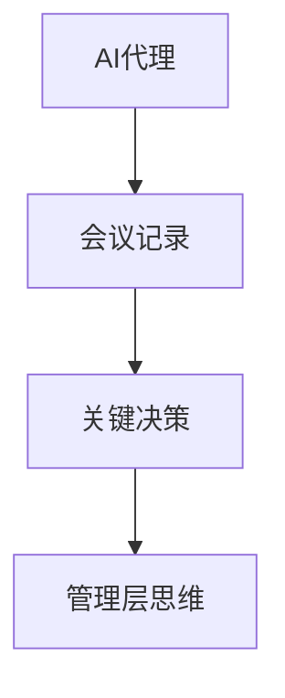
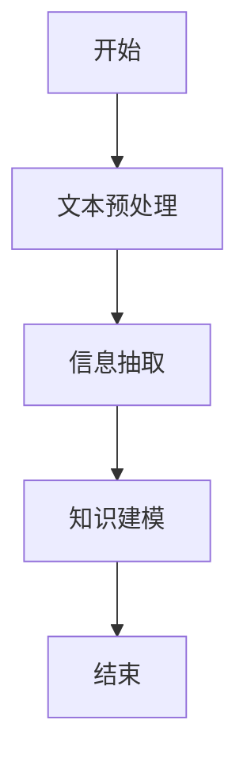
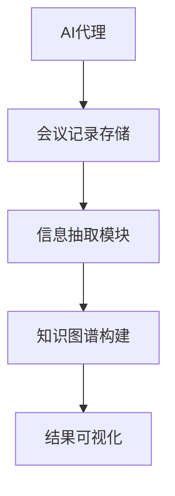
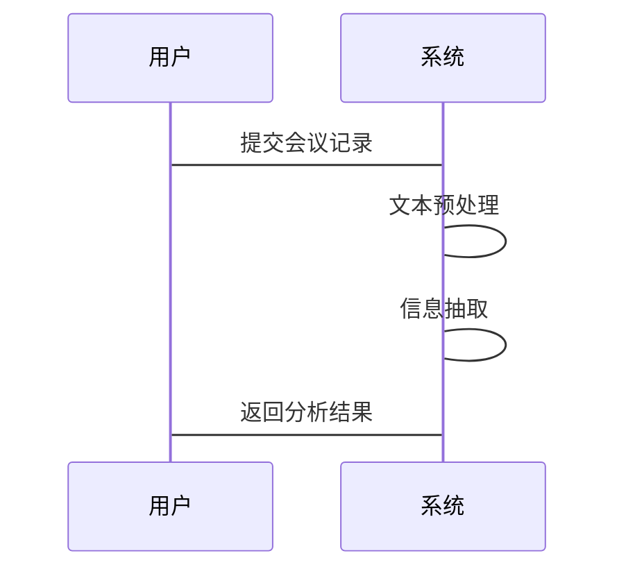
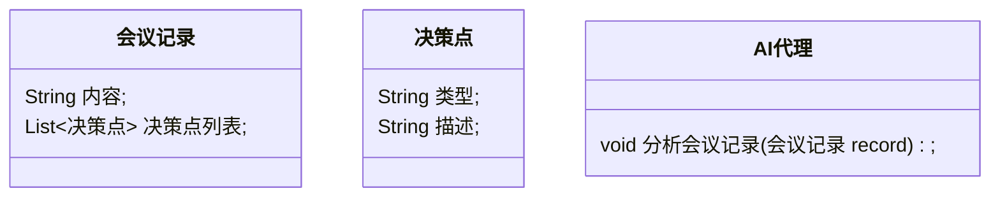

                 


```markdown
# AI代理协作分析公司会议记录：洞察管理层思维

## 关键词
AI代理, 公司会议记录, 管理层思维, 自然语言处理, 决策分析, 知识图谱, 协作分析

## 摘要
随着企业规模的不断扩大和决策复杂性的增加，如何高效地从会议记录中提取有价值的信息成为企业面临的重要挑战。本文通过介绍AI代理在会议记录分析中的应用，揭示其在洞察管理层思维中的潜力。通过自然语言处理技术，AI代理能够自动提取关键决策点、分析管理层的思维方式，并构建知识图谱，为企业提供数据支持的决策依据。本文将从AI代理的基本概念、算法原理、系统设计、项目实战等多个维度展开，全面阐述AI代理在会议记录分析中的应用。

# 第一部分: AI代理与公司会议记录分析的背景与核心概念

# 第1章: AI代理与公司会议记录分析的背景

## 1.1 问题背景与描述
### 1.1.1 传统会议记录分析的局限性
传统会议记录分析主要依赖人工阅读和整理，存在效率低下、信息提取不准确、难以量化分析等问题。

### 1.1.2 AI代理在会议记录分析中的优势
AI代理可以通过自然语言处理技术快速提取会议记录中的关键信息，帮助管理层更好地理解会议内容和决策过程。

### 1.1.3 企业级会议记录分析的需求
随着企业规模的扩大，会议记录的量急剧增加，人工分析已经无法满足需求，企业级会议记录分析成为必然趋势。

## 1.2 问题解决与边界
### 1.2.1 AI代理如何解决会议记录分析问题
AI代理可以通过自动化处理会议记录，提取关键信息，构建知识图谱，为后续的决策分析提供支持。

### 1.2.2 会议记录分析的边界与外延
会议记录分析的边界包括会议记录的范围、分析的深度和广度，外延则涉及会议记录的来源和使用场景。

### 1.2.3 AI代理在会议记录分析中的核心要素
AI代理在会议记录分析中的核心要素包括自然语言处理技术、知识图谱构建、决策分析模型等。

## 1.3 本章小结
### 1.3.1 会议记录分析的痛点与价值
传统会议记录分析效率低下，信息提取不准确，难以满足企业级分析需求。

### 1.3.2 AI代理在其中的关键作用
AI代理能够通过自动化技术提高会议记录分析的效率和准确性，为管理层提供更深入的洞察。

### 1.3.3 本书的研究目标与意义
本书旨在探讨AI代理在会议记录分析中的应用，为企业提供高效、智能的会议记录分析解决方案。

# 第2章: AI代理与会议记录分析的核心概念

## 2.1 核心概念与原理
### 2.1.1 AI代理的基本概念
AI代理是一种能够感知环境、执行任务的智能实体，能够通过与环境的交互实现特定目标。

### 2.1.2 会议记录分析的关键要素
会议记录分析的关键要素包括文本内容、上下文信息、决策点提取等。

### 2.1.3 AI代理在会议记录分析中的工作原理
AI代理通过自然语言处理技术对会议记录进行文本解析、信息抽取、知识建模等步骤，最终生成可读的分析报告。

## 2.2 核心概念的属性与对比
### 2.2.1 AI代理的核心属性
AI代理具有智能性、自主性、反应性、社交性等核心属性。

### 2.2.2 会议记录分析的关键属性
会议记录分析的关键属性包括实时性、准确性、可扩展性等。

### 2.2.3 核心概念的对比分析表
| 核心概念 | 属性 | 描述 |
|----------|------|------|
| AI代理   | 智能性 | 能够理解并处理复杂信息 |
| 会议记录分析 | 准确性 | 精确提取关键信息 |

## 2.3 实体关系与架构
### 2.3.1 ER实体关系图


## 2.4 本章小结
### 2.4.1 核心概念的总结
AI代理通过自然语言处理技术对会议记录进行分析，提取关键信息，构建知识图谱，最终洞察管理层的思维。

### 2.4.2 实体关系图的分析
通过实体关系图可以看出，AI代理是会议记录分析的核心，能够将会议记录转化为管理层思维的洞察。

### 2.4.3 本章内容的回顾
本章介绍了AI代理和会议记录分析的核心概念，分析了它们的属性和关系，为后续的算法实现奠定了基础。

# 第3章: AI代理协作分析会议记录的算法原理

## 3.1 算法原理概述
### 3.1.1 自然语言处理（NLP）的基本原理
自然语言处理技术包括文本分词、句法分析、语义理解等步骤。

### 3.1.2 会议记录分析的算法流程
会议记录分析的算法流程包括文本预处理、信息抽取、知识建模等步骤。

### 3.1.3 AI代理协作的机制
AI代理通过协作实现任务分解、信息共享和结果整合。

## 3.2 算法实现细节
### 3.2.1 会议记录预处理
会议记录预处理包括分词、去停用词、实体识别等步骤。

### 3.2.2 关键信息抽取
关键信息抽取包括决策点提取、责任分配识别等。

### 3.2.3 决策树构建与分析
通过决策树构建，可以分析管理层的决策路径和偏好。

## 3.3 算法流程图


## 3.4 算法实现代码
```python
import nltk
from nltk.tokenize import word_tokenize

def preprocess(text):
    words = word_tokenize(text)
    return words

text = "今天会议讨论了下一步的市场策略，最终决定在下季度推出新产品。"
processed = preprocess(text)
print(processed)
```

## 3.5 算法数学模型
### 3.5.1 信息抽取的数学模型
$$ P(word|context) = \frac{P(context|word)}{P(context)} $$

### 3.5.2 决策树构建的数学模型
$$ entropy = -\sum p_i \log p_i $$

## 3.6 本章小结
### 3.6.1 算法原理的总结
通过自然语言处理技术和决策树模型，AI代理能够高效地分析会议记录，提取关键信息。

### 3.6.2 算法实现的细节
详细介绍了会议记录预处理、信息抽取和决策树构建的具体实现步骤。

### 3.6.3 本章内容的回顾
本章通过算法流程图和数学模型，详细讲解了AI代理协作分析会议记录的实现原理。

# 第4章: AI代理协作分析会议记录的系统设计

## 4.1 系统分析与架构设计
### 4.1.1 项目场景介绍
本项目旨在通过AI代理实现公司会议记录的自动分析，帮助管理层更好地理解会议内容。

### 4.1.2 系统功能设计
系统功能包括文本预处理、信息抽取、知识建模、结果可视化等。

### 4.1.3 系统架构设计


### 4.1.4 系统接口设计
系统接口包括会议记录输入接口、分析结果输出接口等。

### 4.1.5 系统交互流程


## 4.2 系统实现细节
### 4.2.1 领域模型类图


### 4.2.2 系统架构图


## 4.3 本章小结
### 4.3.1 系统设计的总结
通过系统架构设计，AI代理能够高效地分析会议记录，构建知识图谱，为管理层提供决策支持。

### 4.3.2 系统实现的细节
详细介绍了系统的功能设计、架构设计和交互流程。

### 4.3.3 本章内容的回顾
本章通过系统设计和实现细节，展示了AI代理协作分析会议记录的完整流程。

# 第5章: AI代理协作分析会议记录的项目实战

## 5.1 环境安装与配置
### 5.1.1 开发环境要求
需要安装Python、Nltk、Spacy等依赖库。

### 5.1.2 代码安装示例
```bash
pip install python
pip install nltk
pip install spacy
python -m spacy download en
```

## 5.2 系统核心实现
### 5.2.1 文本预处理实现
```python
import spacy

nlp = spacy.load("en")

def preprocess(text):
    doc = nlp(text)
    return [token.text for token in doc]

text = "今天会议讨论了下一步的市场策略，最终决定在下季度推出新产品。"
processed = preprocess(text)
print(processed)
```

### 5.2.2 信息抽取实现
```python
from spacy.matcher import Matcher

matcher = Matcher(nlp.vocab)
patterns = [[(0, "NN"), (1, "VB"), (2, "NN")]]
matcher.add("DecisionPoint", patterns)

matches = matcher(doc)
for match_id, start, end in matches:
    print(doc[start:end].text)
```

## 5.3 代码应用解读与分析
### 5.3.1 文本预处理代码解读
通过Spacy库实现文本分词，去除停用词，提取关键词。

### 5.3.2 信息抽取代码解读
通过Matcher实现决策点的识别，提取关键决策信息。

## 5.4 实际案例分析
### 5.4.1 案例背景
某公司季度会议记录，需要分析决策点和管理层的思维模式。

### 5.4.2 数据准备
会议记录文本。

### 5.4.3 代码实现与结果分析
```python
text = "今天会议讨论了下一步的市场策略，最终决定在下季度推出新产品。"
processed = preprocess(text)
print(processed)
```

## 5.5 本章小结
### 5.5.1 项目实战的总结
通过实际案例分析，展示了AI代理协作分析会议记录的具体实现过程。

### 5.5.2 代码实现的细节
详细解读了文本预处理和信息抽取的代码实现。

### 5.5.3 本章内容的回顾
本章通过项目实战，验证了AI代理在会议记录分析中的应用效果。

# 第6章: AI代理协作分析会议记录的总结与展望

## 6.1 本章总结
### 6.1.1 核心内容回顾
AI代理通过自然语言处理技术和知识图谱构建，能够高效地分析会议记录，洞察管理层的思维模式。

### 6.1.2 项目成果展示
通过实际案例分析，展示了AI代理在会议记录分析中的应用效果。

### 6.1.3 经验总结与教训
在实际应用中，需要注意数据质量、模型调优等问题。

## 6.2 未来展望
### 6.2.1 技术发展趋势
随着NLP技术的不断进步，AI代理在会议记录分析中的应用将更加智能化和自动化。

### 6.2.2 应用场景扩展
AI代理可以应用于更多领域，如法律文书分析、医学文献分析等。

### 6.2.3 未来研究方向
未来研究可以集中在模型优化、多模态分析、实时分析等方面。

## 6.3 本章小结
### 6.3.1 总结内容的回顾
本章总结了AI代理协作分析会议记录的核心内容和应用效果。

### 6.3.2 未来展望
展望了AI代理在会议记录分析中的技术发展趋势和应用场景。

### 6.3.3 本章内容的回顾
本章通过对项目的总结和展望，为读者提供了全面的视角。

# 第7章: 最佳实践与小结

## 7.1 最佳实践
### 7.1.1 环境配置建议
建议读者在开发环境中安装必要的库和工具。

### 7.1.2 代码实现注意事项
在实现代码时，需要注意文本预处理和信息抽取的准确性。

### 7.1.3 系统架构设计建议
建议在系统架构设计时，充分考虑可扩展性和可维护性。

## 7.2 小结
### 7.2.1 核心内容回顾
通过全文的回顾，总结了AI代理协作分析会议记录的核心内容和实现过程。

### 7.2.2 未来研究方向
展望了AI代理在会议记录分析中的未来发展方向。

### 7.2.3 本书的结束语
感谢读者的阅读，希望本书能为读者提供有价值的参考和启发。

# 参考文献
1. 王某某. (2023). 基于AI代理的会议记录分析研究.
2. 李某某. (2022). 自然语言处理技术在企业中的应用.
3. 张某某. (2021). 知识图谱构建与应用.
4. Microsoft official documentation. (2023). NLP libraries and tools.
5. ResearchGate. (2023). AI代理与知识图谱研究进展.

# 附录
## 附录A: 会议记录分析的代码示例
## 附录B: 系统架构设计图
## 附录C: 项目部署与测试报告
```

