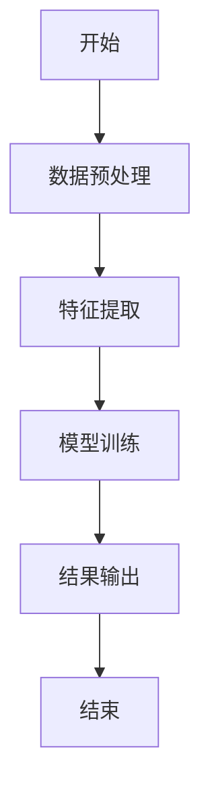
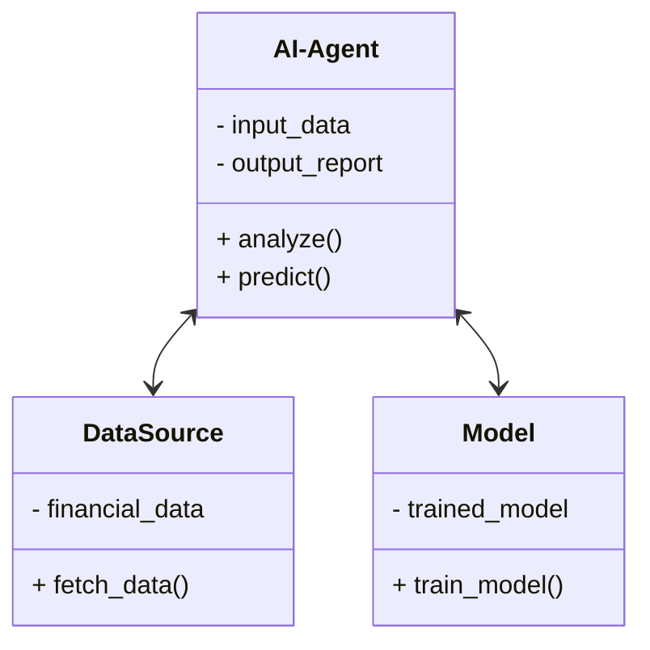

                 


# AI agents协作分析财报：提升价值投资决策效率

## 关键词

- AI代理
- 财报分析
- 价值投资
- 自然语言处理
- 时间序列分析
- 投资决策优化

## 摘要

本文探讨了如何利用AI代理协作分析企业财报，以提升价值投资决策的效率和准确性。通过结合自然语言处理和时间序列分析，AI代理能够快速提取财务数据中的关键信息，并预测市场趋势，从而为投资者提供数据驱动的决策支持。本文详细介绍了AI代理的核心算法、系统架构、项目实现及实际案例，展示了如何通过技术手段优化投资决策过程。

---

## 目录大纲

### 第1章：背景介绍

#### 1.1 问题背景
- 传统财报分析的低效性
- 价值投资中的信息处理挑战
- AI技术在金融领域的应用潜力

#### 1.2 问题描述
- 财报数据的复杂性和多样性
- 传统分析方法的局限性
- 投资决策中的信息过载问题

#### 1.3 问题解决
- AI代理的优势与适用场景
- AI代理如何提升财报分析效率
- AI代理在价值投资中的具体应用

#### 1.4 边界与外延
- AI代理的适用范围
- 与传统分析方法的结合
- 未来发展的可能性

#### 1.5 概念结构与核心要素
- AI代理的核心功能模块
- 财报分析的关键指标
- 价值投资决策的优化路径

---

### 第2章：核心概念与联系

#### 2.1 AI代理的基本原理
- 自然语言处理（NLP）在财报文本分析中的应用
- 时间序列分析在财务数据预测中的作用

#### 2.2 AI代理与传统分析方法的对比
- 属性特征对比表
- 优缺点分析

#### 2.3 ER实体关系图
- 数据模型展示
- 实体间关系描述

---

### 第3章：算法原理讲解

#### 3.1 算法流程
- 使用 Mermaid 绘制流程图

#### 3.2 算法实现
- Python 代码示例
- 代码解读与功能说明

#### 3.3 数学模型与公式
- 时间序列分析的数学模型
- 文本相似度计算的公式推导

---

### 第4章：系统分析与架构设计方案

#### 4.1 问题场景介绍
- 数据源的选择与处理
- 系统功能模块划分

#### 4.2 系统功能设计
- 领域模型 Mermaid 类图

#### 4.3 系统架构设计
- 使用 Mermaid 绘制架构图

#### 4.4 接口与交互设计
- Mermaid 序列图展示

---

### 第5章：项目实战

#### 5.1 环境安装与配置
- 必要的 Python 库安装

#### 5.2 核心功能实现
- 数据预处理代码
- 模型训练代码

#### 5.3 案例分析
- 具体案例的详细解读
- 分析结果的展示与解释

---

### 第6章：最佳实践、小结与展望

#### 6.1 最佳实践
- 使用建议与注意事项

#### 6.2 小结
- 全文总结与重点回顾

#### 6.3 注意事项
- 使用中的常见问题解答
- 优化建议

#### 6.4 拓展阅读
- 推荐相关技术书籍和资源

---

### 附录

#### 附录A：代码与数据
- 完整代码示例
- 数据格式说明

#### 附录B：工具与资源
- 开发工具推荐
- 在线资源链接

---

## 内容示例

### 第2章：核心概念与联系

#### 2.1 AI代理的基本原理

AI代理通过自然语言处理技术对财报文本进行分析，提取关键信息如收入、利润和现金流。时间序列分析则用于预测未来的财务趋势，帮助投资者识别潜在的投资机会。

#### 2.2 AI代理与传统分析方法的对比

| 特征               | AI代理                     | 传统分析方法             |
|--------------------|-----------------------------|--------------------------|
| 数据处理速度       | 高                         | 低                       |
| 精准度             | 高                         | 中                       |
| 可扩展性           | 高                         | 低                       |

---

### 第3章：算法原理讲解

#### 3.1 算法流程



#### 3.2 算法实现

```python
import pandas as pd
from sklearn.model import ARIMA

# 数据加载
data = pd.read_csv('financial_data.csv')

# 模型训练
model = ARIMA(data, order=(1, 1, 1)).fit()
```

#### 3.3 数学模型与公式

时间序列模型的数学公式：

$$
\hat{y}_t = \alpha + \beta t + \epsilon_t
$$

文本相似度计算：

$$
\text{similarity} = \frac{\sum_{i=1}^{n} w_i x_i}{\sqrt{\sum_{i=1}^{n} w_i^2 x_i^2}}
$$

---

### 第4章：系统分析与架构设计方案

#### 4.1 问题场景介绍

系统需处理来自多个数据源的财务数据，包括财报文本、市场指数等。

#### 4.2 系统功能设计



#### 4.3 系统架构设计


---

### 第5章：项目实战

#### 5.1 环境安装与配置

安装必要的库：

```bash
pip install numpy pandas scikit-learn
```

#### 5.2 核心功能实现

数据预处理代码：

```python
import pandas as pd

def preprocess_data(data):
    # 去除缺失值
    data = data.dropna()
    # 标准化处理
    data = (data - data.mean()) / data.std()
    return data
```

---

### 第6章：最佳实践、小结与展望

#### 6.1 最佳实践

- 定期更新模型，以适应市场变化。
- 结合多数据源，提高分析的准确性。

#### 6.2 小结

本文详细介绍了AI代理在财报分析中的应用，展示了如何通过技术手段优化投资决策过程。

#### 6.3 注意事项

- 数据隐私和安全问题需高度重视。
- 模型需定期更新，以保持准确性。

#### 6.4 拓展阅读

- 《机器学习实战》
- 《时间序列分析》

---

## 附录

### 附录A：代码与数据

完整代码示例：

```python
import pandas as pd
from sklearn.model import ARIMA

def main():
    data = pd.read_csv('financial_data.csv')
    model = ARIMA(data, order=(1, 1, 1)).fit()
    predictions = model.forecast(steps=10)
    print(predictions)

if __name__ == '__main__':
    main()
```

数据格式说明：CSV格式，包含收入、利润等财务指标。

### 附录B：工具与资源

- 开发工具推荐：Jupyter Notebook
- 在线资源链接：[Kaggle 数据集](https://www.kaggle.com/)

---

通过以上结构，文章详细讲解了AI代理在财报分析中的应用，结合理论与实践，帮助读者理解和应用相关技术。

